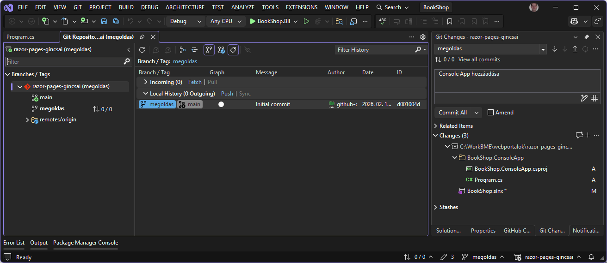
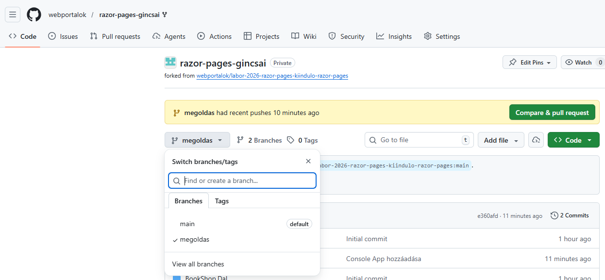
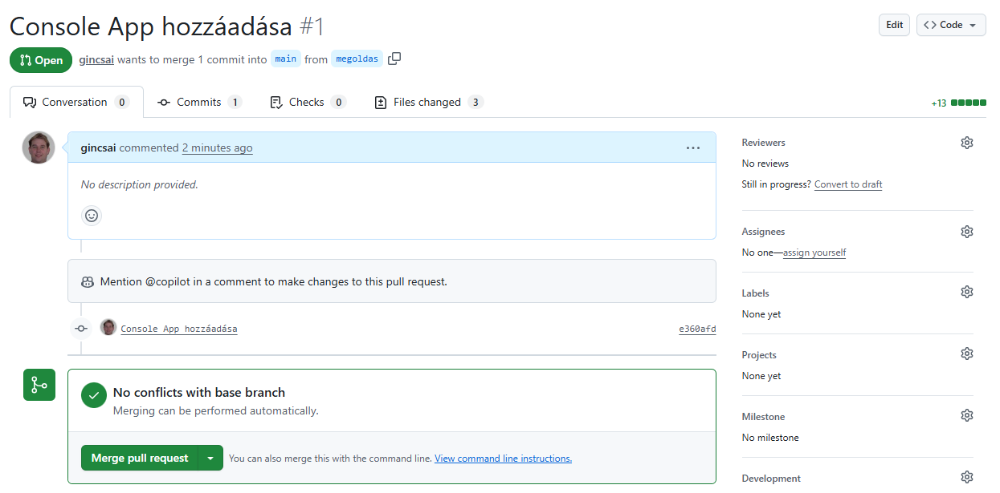

# Feladatok beadása (GitHub)

A feladatok beadásához a GitHub platformot használjuk. Az ASP.NET Core Razor Pages-es laborok, illetve a Balzor-ös laborok beadása egy-egy GitHub repository-ban történik, melyet a feladatleírásban található linken keresztül kapsz meg. A labor feladatainak megoldását ezen repository-ban kell elkészítened, és ide kell feltöltened. A kész megoldás beadása a repository-ba való feltöltés után egy un. _pull request_ formájában történik, amelyet a laborvezetődhöz rendelsz.

!!! important "FONTOS"
    Az itt leírt formai előírások betartása elvárás. A nem ilyen formában beadott megoldásokat nem értékeljük.

## Rövidített verzió

Alább részletesen bemutatjuk a beadás menetét. Itt egy rövid összefoglaló az áttekintéshez, illetve a helyes beadás ellenőrzéséhez.

1. A munkádat Moodle-ben található GitHub Classroom meghívó linken keresztül létrehozott GitHub repository-ban kell elkészítsd.

1. A megoldáshoz készíts egy külön ágat, ne a _main_-en dolgozz. Erre az ágra akárhány kommitot tehetsz. Mindenképpen pushold a megoldást.

1. A beadást egy pull request jelzi, amely pull request-et a laborvezetődhöz kell rendelned.

1. Ha az eredménnyel vagy értékeléssel kapcsolatban kérdésed van, pull request kommentben kérdezhetsz. A laborvezető értesítéséhez használd a `@név` címzést a komment szövegében.

## A munka elkezdése: git checkout

1. [Regisztrálj](https://github.com/join) egy GitHub accountot, ha még nincs.

1. Moodle-ben a kurzus oldalán keresd meg a laborhoz tartozó meghívó URL-t. Ez az ASP.NET Razor Pages-es és Blazor-ös laborok esetén más lesz. Mindkét témakörhöz egy-egy kiinudló repozitory van, ügyelj rá, hogy a megfelelő linket használd.

1. Ha kéri, adj engedélyt a _GitHub Classroom_ alkalmazásnak, hogy használja az account adataidat.

    
    /// caption
    Engedély kérése
    ///

1. Látni fogsz egy oldalt, ahol elfogadhatod a feladatot ("Accept the ... assignment"). Kattints a gombra.

    
    /// caption
    Feladat elfogadása
    ///

1. Várd meg, amíg elkészül a repository. A repository linkjét itt kapod meg.

    !!! note "Megjegyzés"
        A repository privát lesz, azaz az senki nem látja, csak te, és az oktatók.

    
    /// caption
    Repository létrehozása
    ///

1. Nyisd meg a repository-t a webes felületen a linkre kattintva. Ezt az URL-t írd fel, vagy mentsd el.

    
    /// caption
    Repozitory link kimásolsa
    ///

1. Klónozd le a repository-t. Ehhez szükséges lesz a repository címére, amit a repository webes felületén a _Clone or download_ alatt találsz.

    - A git repository kezeléséhez tetszőleges klienst használhatsz. Mi most a Visual Studio-t fogjuk használni.
    - A Visual Studio elindítása után válaszd a *Close a repository* linket jobb oldalon, majd adjuk meg a repository linkjét (amit kimásoltunk a vágólapra) és a könyvtárat, ahova klónozni szeretnénk.
    - Ha nem tudnánk a linket, akkor lent ki is tudjuk tallózni a repository-t.

    
    /// caption
    Repository klónozása Visual Studio-ban.
    ///

    - Ha konzolt használnál, az alábbi parancs klónozza a repository-t (ha a `git` parancs elérhető):

        ``` cmd title="Git clone"
        git clone <repository link>
        ```

    !!! note "Sikertelen klónozás"
        Amennyiben a bejelentkezés sikertelen felhasználónév/jelszó párossal a "Clone with HTTPS" esetén, (régebb óta használt felhasználónál) érdemes ellenőrizni a git-en található Personal Access token lejárati dátumát.

        `Jobb felső sarokban a profilkép melletti lefelé mutató nyil > Settings > bal oldalon (legalsó) Developer settings > ugyanitt Personal access tokens.`

        *Alternatív módszerként: HTTP klónozás helyett, SSH kulcs használatához, angol nyelvű instrukciók [itt](https://docs.github.com/en/get-started/getting-started-with-git/about-remote-repositories#cloning-with-https-urls) találhatóak.*

1. Ha sikerült a klónozás, **MÉG NE KEZDJ EL DOLGOZNI!** A megoldást _ne_ a repository `main` ágán készítsd el. Hozz létre egy új ágat (branch) `megoldas` néven.

    
    /// caption
    Új brench létrehozása Visual Studio-ban.
    ///

    - Ha konzolt használsz, az új ág elkészíthető ezzel a paranccsal:

        ``` cmd title="git checkout"
        git checkout -b megoldas
        ```

1. Ezen a `megoldas` ágon dolgozva készítsd el a beadandókat. Akárhányszor kommitolhatsz és pusholhatsz. A megoldás része a forráskód és a feladatokban elvárt képernyőképek. Ha a feladat képernyőképet vár el, akkor azt a repository gyökerébe commitold az elvárt néven.

1. Mindig ellenőrizd, hogy jó ágon vagy-e. Mielőtt commit-olod / push-olod a munkád.

    - Commit
    ??? success "Git Commit"
        
        /// caption
        Git Commit Visual Studio-ból
        ///

    - Push
    ??? success "Git push"
        
        /// caption
        Git Push Visual Studio-ból
        ///

    - Ha konzolt használsz, akkor az alábbi parancsokat használd (feltéve, hogy a jó ágon vagy):

        ``` cmd title="Git commit and push"
        # Ellenőrizd az ágat, és hogy milyen fájlok módosultak
        git status
        
        # Minden változtatást előkészít kommitolásra
        git add .
        
        # Kommit
        git commit -m "f1"
        
        # Push első alkalommal az új ág publikálásához
        git push --set-upstream origin megoldas
        
        # Push a továbbiakban, amikor az ág már nem új
        git push
        ```

## A megoldás beadása

1. Ha végeztél a megoldással, ellenőrizd a GitHub webes felületén, hogy mindent feltöltöttél-e. Ehhez a webes felületen váltanod kell az ágak között.

    
    /// caption
    Branch váltás GitHub weboldalán
    ///

    !!! warning "Feltöltés a webes felületen"
        Azt javasoljuk, hogy ne használd a GitHub fájl feltöltés funkcióját. Ha valami hiányzik, a helyi git repository-ban pótold, és kommitold majd pushold.

1. Ha tényleg kész vagy, akkor nyiss egy _pull request_-et.

    !!! important "Minek a pull request?"
        Ez a _pull request_ fogja össze a megoldásodat, és annak "végeredményét" mutatja. Így a laborvezetőnek nem az egyes kommitjaidat vagy fájljaidat kell néznie, hanem csak a releváns, változott részeket látja egyben. A _pull request_ jelenti a feladatod beadását is, így ez a lépés **nem hagyható ki**.

    A _pull request_ nyitásához a GitHub webes felületére kell menj. Itt, ha nem rég pusholtál, a GitHub fel is ajánlja a pull request létrehozását, amit az előző képen is láthatsz (sárga csík), vagy a fenső *Pull requests* menüből is létrehozhatsz.

    Fontos, hogy a megfelelő brancheket válaszd ki: `master`-be megy a `megoldas` ág.

    
    /// caption
    Pull request készítése
    ///

    Ha minden rendben sikerült, a menüben fent látod a kis "1" számot a _Pull request_ elem mellett, jelezve, hogy van egy nyitott pull request. **DE MÉG NEM VÉGEZTÉL!**

    
    /// caption
    Nyitott pull requestek
    ///

1. **VÉGEZETÜL**, ha kész vagy, a _pull request_-et rendeld a **laborvezetődhöz**. Ez a lépés feltétlenül fontos, ez jelzi a beadást.

    
    /// caption
    Laborvezetőhöz rendelés
    ///

    !!! error "Pull request nélkül"
        Ha nincs pull request-ed, vagy nincs a laborvezetőhöz rendelve, akkor úgy tekintjük, hogy még nem vagy készen, és nem adtad be a megoldást.

    !!! success "Végeztél"
        Miután a laborvezetőhöz rendelted a pull request-et, már **ne módosíts** semmin. A laborvezető értékelni fogja a munkádat, és a pull request lezárásával kommentben jelzi a végeredményt.

## Kapott eredménnyel kapcsolatban kérdés vagy reklamáció

Ha a feladatok értékelésével vagy az eredménnyel kapcsolatban kérdést tennél fel, vagy reklamálnál, használd a Pull Request kommentelési lehetőségét erre. Annak érdekében, hogy a laborvezető biztosan értesüljön a kérdésről használd a `@név` [mention](https://help.github.com/en/github/writing-on-github/basic-writing-and-formatting-syntax#mentioning-people-and-teams) funkciót a **laborvezetőd** megnevezéséhez. Erről automatikusan kapni fog egy email értesítést.


!!! warning "Reklamáció csak indoklással"
    Ha nem értesz egyet az értékeléssel, a bizonyítás téged terhel, azaz alá kell támasztanod a reklamációd (pl. annak leírásával, hogyan tesztelted a megoldásod, és mi bizonyítja a helyességét).
