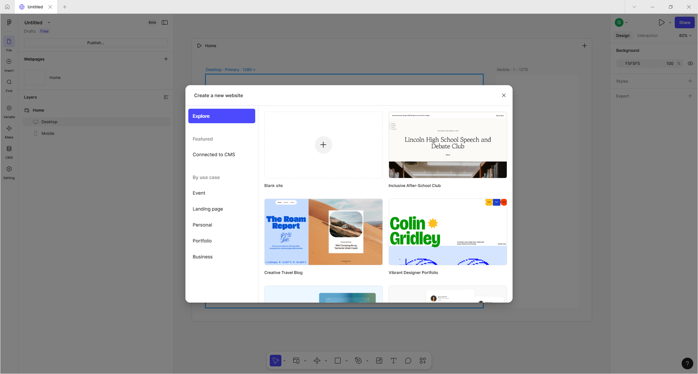
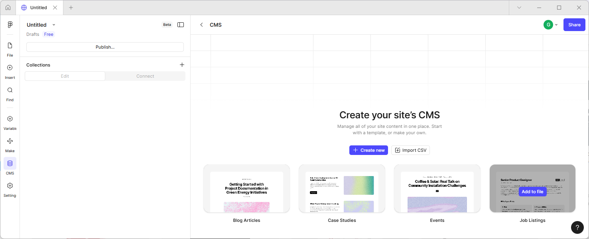

# 1. Tervezés

## Specifikáció

Az alábbiakban az alkalmazás lefontosabb funkcióit szedjük össze, hogy a későbbiekben ez alapján tudjuk a felhasználói felületet megtervezni. A félév során ezen funkciók egy részét fogjuk megvalósítani.

- **Könyvek böngészése**
A könyveket kategóriákba kell tudni szervezni (több szintű). Egy kategóriát kiválasztva megjelennek a kategóriában lévő könyvek a legfontosabb információkkal (cím, szerző, ár, borítókép) egy lapozható listában.
Az alkalmazás kezdő oldala is egy ilyen listát tartalmaz, azonban az a kategóriákban kiemelt / újdonságokat mutatja. Ha itt egy könyvre kattintunk, akkor bejön a könyv részletes oldala, amiben minden adat megtalálható a könyvről, illetve a hozzá tartozó ajánlók és kommentek is.

- **Könyvek keresése**
A felhasználók több esetben konkrét könyvet keresnek, aminek ismerik a címét vagy annak egy részét. Ehhez szükséges egy kereső megvalósítása, ami felajánlja gépelés közben a találatokat, és ha egy konkrét könyvre kattintunk, elvisz annak a részletes oldalára. Ha pedig több találat lenne, akkor egy részletes keresést indít, ahol a listázzuk a találatokat egy külön oldalon.

- **Kosár és megrendelés**
A felhasználók a megvenni kívánt könyveket egy kosárba gyűjthetnek, majd a későbbiekben ezt feladhatják, mint egy rendelést. A korábbi rendelések listáját később visszanézhetik és nyomon követhetik azok állapotát.

- **Felhasználó kezelés**
Szükséges, hogy a felhasználók tudjanak regisztrálni és belépni. A belépést akár külső autentikációs szolgáltatással is lehessen megvalósítani (pl: Google, Facebook accounttal)
Ezen felül szükséges megkülönböztetni az admin felhasználókat, akik szerkeszthetik a könyvek és a kategóriák adatait, illetve moderálhatják a közösség által készített tartalmakat.

- **Profil adatok kezelése**
Lehetőséget kell adni a jelszóváltoztatásra, illetve a felhasználónak a szállítási és számlázási adatait el kell tárolni.

- **Ajánlók létrehozása adott könyvhöz**
A felhasználók egy-egy könyvhöz ajánlókat hozhatnak létre, melyek a könyv részletes oldalán megjelennek egy listában. Az ajánlók rendelkeznek részletes oldallal is, és egy külön oldalon elérhetők a legújabb idézetek is.

- **Kommentek fűzése a könyvekhez**
A felhasználók egy-egy könyvhöz egyszerű kommentet is lehet fűzni, ami megjelenik a könyv részletes oldalon.

## UI terv készítése

A UI tervek, vagy Wireframe-ek tervezésének a lényege, hogy a specifikáció alapján a lehető legkorábban tudjunk készíteni egy, a megrendelő számára megmutatható grafikus tervet. A lényeg nem a design-on van, hanem a megjelenő adatokon és azok elrendezésén. Tehát a tervezett felületeken pontosan meg kell jeleníteni minden adatot, nem elég az, hogy ide jönnek a könyv adatai, hanem tételesen meg kell tervezni, hogy mi jelenik meg (Cím, szerző, rövid leírás, ár, kedvezményes ár...)

A tervezés legfontosabb része, hogy azt tervezzük meg, amit a megrendelő szeretne. Ehhez érdemes a fejlesztés legelején  megtervezni a legfontosabb wireframe-eket, és azt egyeztetni a megrendelővel, mert amikor már látja a megrendelő, hogyan fog kinézni az alkalmazás azonnal eszébe jut még számos nem specifikált, vagy alul specifikált funkció.

Ezen felül fejlesztői oldalról nézve is fontos a UI terv, hiszen azon minden adat megjelenik, tehát ez alapján el lehet kezdeni megtervezni az adatbázist. Beazonosítani az entitásokat és azok tulajdonságait.

A korai UI tervezéssel számos iterációt meg tudunk spórolni a fejlesztés során, hiszen már van egy egyeztetett terv, hogyan fog kinézni az alkalmazás és milyen adatokat jelenít meg. Így kevesebb új mezők kell felvenni az adatbázisba a megvalósítás során, amit egyébként végig is kell vezetni a DTO-n, üzleti logikán és a felületen is.

!!! success "Balsamiq-ban készített BookShop UI terv"
    [Balsamiq UI terv letöltése](images/Balsamiq - UI terv.pdf)

### Balsamiq

Egy kiváló eszköz UI tervek készítésére a [Balsamiq](http://www.balsamiq.com), melynek webes verziója regisztráció után 14 napig ingyenesen használható.

/// caption
Balsamiq felhasználói felülete
///

A használata egyszerű és gyors, a végeredmény pedig PDF-be exportálható.

### Figma

Egy másik kiváló eszköz  a UI tervek készítésére a [Figma](https://www.figma.com/). Létezik ingyenes verzió a személyes projektekhez, ráadásul itt nincs időkorlátozás az ingyenes verzióhoz, de ez is regisztrációhoz kötött. Az árazás részletei [itt](https://www.figma.com/pricing/) érhető el.
Ezen felül van kifejezetten hallgatók számára is egy ingyenes verzió, a [Figma for education](https://www.figma.com/education/)

#### Site template használata

1. Hozzunk létre egy új WebSite alapú template-t. Ehhez a kezdő oldal tetején lévő menüből válasszuk ki a Site opciót, vagy ha már van megnyitva projektünk akkor a + jelre kattintva a felugró ablakban válasszuk a Site opciót.

    ??? info "Segítség - Hol keressem a Site gombot" 
        
        /// caption
        Figma menük
        ///
        
        /// caption
        Új Site típusú Figma terv létrehozása
        ///

2. Már ekkor is választhatunk egy template-et, de ezt most hagyjuk ki csak zárjuk be a felugró ablakot.

    
    /// caption
    Site sablon választása
    ///

3. Ezt követően egy üres oldal fogad minket. Bal oldalon válasszuk a CMS opciót, majd a Job Listings példát.

    
    /// caption
    Job listings template
    ///

4. A megjelenő oldalon láthatjuk a teszt adatokat, amivel kitölti a template-et.
5. Válasszuk ki bal oldalon a File menüpontot, hogy lássuk az elkészített oldalakat.

    
    /// caption
    Létrehozott template
    ///

6. A fenti sablon jó minta lehet, hogy hogyan készíthetünk egy jó wireframe-et. Természetesen nem elvárás, hogy tökéletesen mint apró részletre kiterjedő wireframe-ek készüljenek, de a fő oldalakat érdemes megrajzolni.

#### Egyszerű design

Ha csak egyszerűbb rajzokat szeretnénk készíteni, ami sok esetben elegendő, akkor a Design opciót választva gyorsabban el lehet készíteni a wireframe-eket.
Az alábbi képernyőképen a TDK portálhoz készített design látható.

/// caption
TDK portál Figma design-ja
///

Fontos, hogy ha "csak" design-t készítünk a komponenseket akkor is használjuk, így az egyes oldalakat sokkal egyszerűbb nagyobb építőelemekből összerakni.

## Adatbázis tervezés

Ha elkészültek a UI tervek, minden adattal és egyeztettük a megrendelővel már adatbázist is lehet tervezni.

Az adatbázis tervezést először érdemes diagrammal akár papíron elkezdeni (ceruzával, hogy könnyű legyen javítani), és amikor már kezd körvonalazódni a terv, akkor nekilátni EF Code First megközelítéssel és adat modell diagrammal megvalósítani a tényleges adatbázist.

### BookShop DB tervezése

Az azonosított entitások a következők: Book, Category, Author, Publisher, Comment, Rating, Address, Order, OrderItem és a User.

#### A tervezés fontosabb szempontjai

- A User tábla ettől több adatot fog tartalmazni, de mivel az ASP.NET Identity-t szeretnénk használni a felhasználó kezeléshez így most azt nem részletezzük, illetve a jogosultság kezeléshez szükséges táblákat sem vesszük fel, mert azt majd az ASP.NET Identity fogja generálni.
- Egy könyv csak egy kategóriában lehet benne (egy-többes kapcsolat, így nem szükséges kapcsoló tábla), és a kategóriák hierarchikusan épülnek fel.
- Az egyes könyveknek több szerzője is lehet, ezért az Autor és Book tábla között megjelenik a BookAuthor kapcsoló tábla.
- A megrendeléseket az Order táblában tároljuk, ami összefogja az OrderItem-eket. Fontos, hogy egy-egy tételnél el kell tárolni a mennyiségen felül az árat is, hiszen a korábbi megrendeléseket is meg kell tudni jeleníteni és ott fontos, hogy az az ár jelenjen meg, ami a vásárláskor érvényes volt, akkor is ha akkor éppen kedvezményes volt.
- A felhasználóhoz több címet kell tudni eltárolni (számlázási és szállítási) és mindegyik típusból lehet akár több is, tehát jelölni kell tudni, hogy mi az alapértelmezett.
- A könyvekhez tartozik értékelés is. A Rating táblában tároljuk el, hogy egy-egy felhasználó az adott könyvet hogyan értékelte. Ezt azért kell eltárolni, hogy egy felhasználó ne tudjon többször értékelni. Viszont ahhoz, hogy a megjelenítésnél ne kelljen mindig kiszámolni az aktuális értékelést egy SumRating és RatingCount mezőt felveszünk a Book táblába is. Azért nem az átlagot, mert így egyszerűen tudjuk módosítani is egy új értékelés esetén.
- A kommenteket és ajánlókat a Comment táblában tároljuk el, és a Type mező határozza meg, hogy ez egy ajánló vagy komment.

!!! success "Elkészült kiinduló adatbázis terv"
    
    /// caption
    Kiinduló adatbázis terv
    ///

Fontos hangsúlyozni, hogy ez nem a végleges adatbázis terv, ez még módosulhat, de első körös kiindulásnak jó.

## Önálló feladat

!!! example "Önálló feladat: Házi feladat specifikálása"
    - Készítse el a házi feladat specifikációját (maximum 2 oldal)
    - Tervezze meg a legfontosabb oldalakat Balsamiq vagy Figma segítségével. (maximum 3 képernyő)
    - Az elkészített tervet a tárgy Moodle oldalán kell a "Házi feladat specifikáció" részhez feltölteni **PDF** formátumban a név és neptun kód feltüntetésével.
    - A határidő a Moodle-ben található, de a határidő előtt is fel lehet tölteni!
