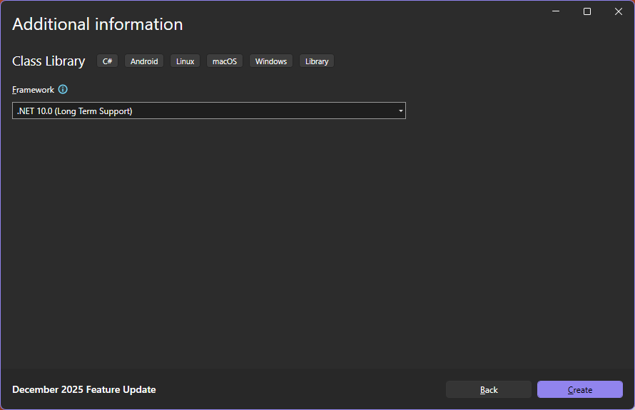
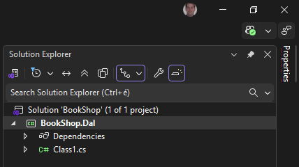
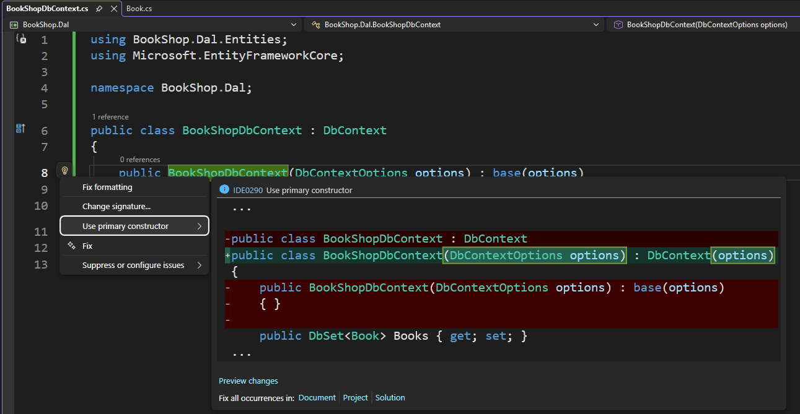
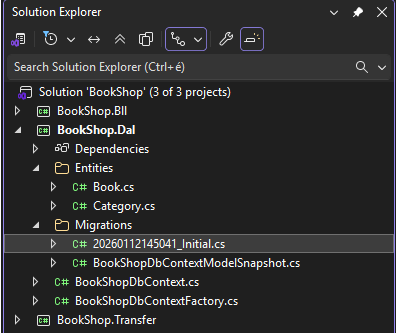
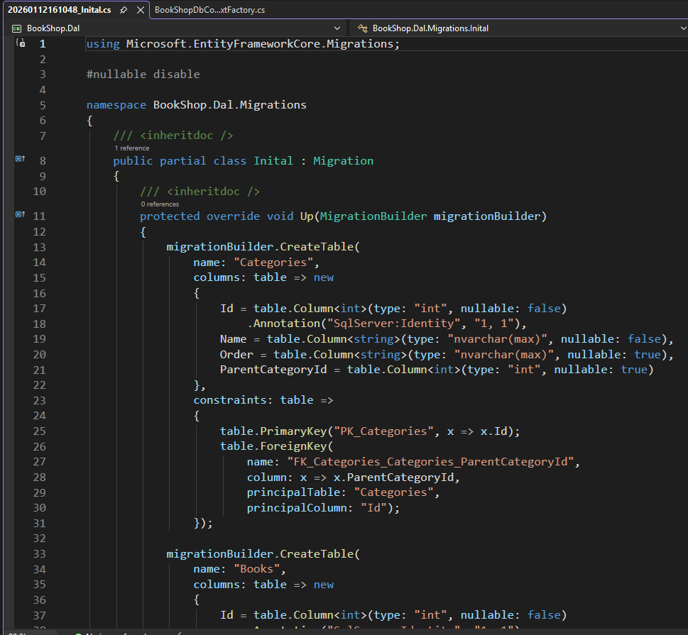
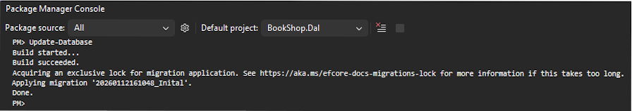
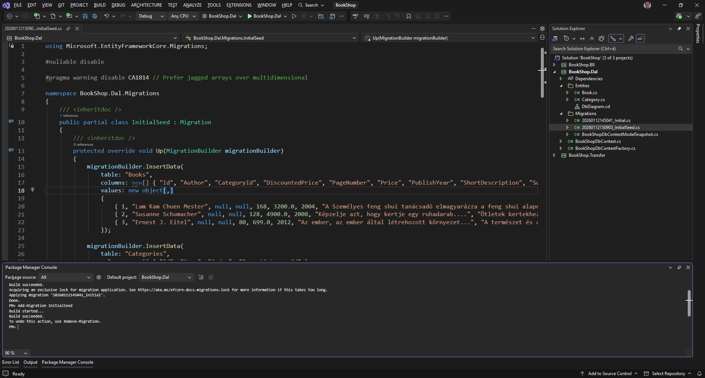
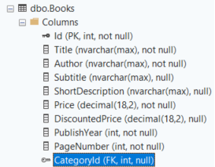
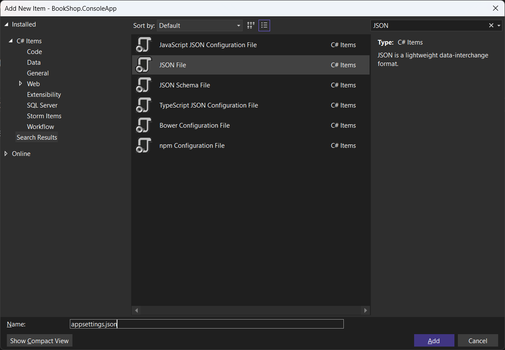
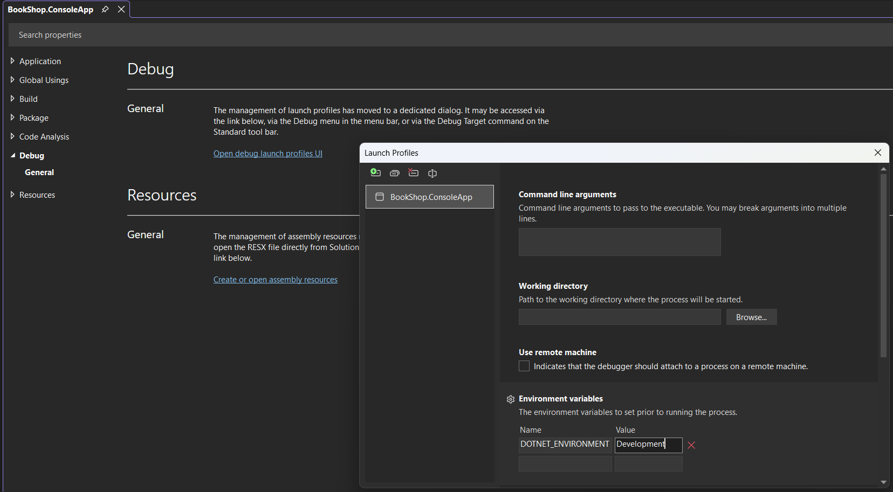

# 2. Project struktúra és adatmodell

## Architektúra

Az alkalmazást klasszikus többrétegű architektúrában valósítjuk meg.

- **UI**: A felhasználói felültet magába foglaló réteg. Attól függ, hogy milyen technológiát választunk.  
    - ASP.NET MVC és Razor page esetén (szerver oldali renderelés) a konkrét HTML oldalt jelenti.
    - Blazor esetén (kliens oldali renderelés) a kliens oldali kódot jelenti, de ilyen esetben megjelenik egy Web API réteg is, amit HTTP-n keresztül a kliens tud hívni.
- **Business Logic (BLL)**: Az alkalmazás üzleti logikai rétegbe. Ez a réteg kérdezi le EF segítségével az adatokat az  adatbázisból és adja vissza a hívó rétegnek az adatokat miután DTO-kra konvertálta.
- **Data Access (DAL)**: Az adatbázis Entity Framework rétegét tartalmazza. Itt találhatók az adatbázis entitások, a DbContext és migrációk.

### Server oldali renderelés

ASP.NET MVC vagy Razor Page esetén a szerver állítja elő a HTML tartalmat, amit a böngészőnek csak meg kell jeleníteni. Ilyen esetben kliens oldalon minimális JavaScript kód található.


/// caption
Szerver oldali renderelés architektúrája
///

Mint a fenti ábrán is látható, nincs érdemi Frontend kód, hiszen a kliens oldalra HTML kód kerül leküldésre, amit csak meg kell jeleníteni. A kliens oldali interaciókhoz nincs speciális támogatás, azt csak JavaScript segítségével tudjuk megvalósítani.
Esetleg [jQuery](https://jquery.com/) és [jQuery UI](https://jqueryui.com/)-t tudunk még erre használni.

### Kliens oldali renderelés

Blazor Web Assembly esetén, a kód egy része (UI réteg) a kliensen fut így backend oldalon szükség van egy Web API rétegre, amit a kliens meg tud hívni az adatok letöltéséhez.

- Első oldal betöltéskor letöltődik az alkalmazás kódja a kliensre
- Ezt követően a kliens aszinkron kérésekkel tölti le a szükséges adatokat, amit aztán megjelenít a felületen.


/// caption
Kliens oldali renderelés architektúrája
///

Figyeljük meg, hogy a kliens és szerver között JSON-ban utaznak a DTO (Data Transfer Object) osztályok. Blazor esetén a kliens és szerver oldali kód is C#-ban készül így a DTO-kat magába foglaló Transfer projektre a kliens és a szerver is tartalmaz referenciát, tehát nincs szükség a szerver oldali DTO-k generálására kliens oldalon. (React és Angular esetén ez szükséges lenne, hiszen ott a kliens oldali programozási nyelv a JS / TS, így a DTO-kat is azon a nyelven kell megvalósítani.)

## Közös backend rész kialakítása

Ahogy a fenti architektúra ábrákon is látszik mindkét megközelítés esetén a *Business Logic* és a *Data Access* réteg lehet közös, sőt a DTO-kat tartalmazó Transfer projekt is.

Ha az alkalmazásunk több projektből áll, akkor a projekteket egy ún. solution fogja össze, amely egy logikai egységet ad a projektek köré. Alapvetően a projekt egy egységnyi, egyértelmű kimenettel rendelkező kódhalmaz, például egy szerelvény (.exe, .dll saját függőségeivel) vagy website (.dll-ek, statikusan kiszolgálandó fájlok stb). Az egy solution-ben levő projektek tehát egy nagyobb probléma megoldásáért felelős nagyobb építőkockák.

1. Hozzunk létre a BookShop.Dal projektet. Ehhez válasszuk a `File → New → Projekt / Solution` opciót, majd a felugró ablakban adjuk meg a szükséges adatokat.
    - Project típusa: Class Library
    - Project neve: BookShop.Dal
    - Solution neve: BookShop
    - Framework: .NET 10

    ??? info "Segítség - Képernyőképek a projekt létrehozásról"
        
        /// caption
        Új projekt létrehozása 1.
        ///

        
        /// caption
        Új projekt létrehozása 2.
        ///

        
        /// caption
        Új projekt létrehozása 3.
        ///

2. Ezt követően létrejön a Solution és benne a projekt is, ahogy azt a Solution Explorer ablakban láthatjuk.

    ???+ success "A létrejött solution és project"
        
        /// caption
        A létrejött solution és projekt
        ///

3. Adjuk hozzá a solution-höz a `BoohShop.Bll` projektet is. Ehhez jobb gombbal kattintsunk a Solution-re, majd válasszuk az `Add → New Project` opciót, és adjuk meg a projekt adatait.

    ??? info "Segítség - Képernyőképek az új projekt hozzáadásáról"
        
        /// caption
        Új projekt hozzáadása
        ///

        
        /// caption
        Új projekt hozzáadása 2.
        ///

4. A fentihez hasonló módon vegyük fel a `BookShop.Transfer` projektet is.

5. Adjuk referenciát a `BookShop.Bll` projektből a `BookShop.Dal` és `BookShop.Transfer` projektekre.

    ??? info "Segítség - Képernyőképek a projekt referencia hozzadásáról"
        
        /// caption
        Projekt refererencia hozzáadása
        ///
        
        /// caption
        Projektek kiválasztása és hozzáadás
        ///

### Data Access Layer

A projekt struktúra elkészítése után nekifoghatunk a legalsó réteg megvalósításához.

01. A projekten vagy a projekt alatti Dependencies elemen jobb klikkelve a `Manage NuGet Packages...` telepíthetünk NuGet csomagokat.
02. A Browse tab-on adjuk meg a csomag nevét `Microsoft.EntityFrameworkCore.SqlServer`, válasszuk ki a listából, ellenőrizzük a verziószámot, majd installáljuk a projekthez!

    ??? info "Segítség - Képernyőképek a NuGet package hozzadásáról"
        
        /// caption
        NuGet package hozzáadása egy projekthez
        ///

03. A telepítés megkezdése előtt meg kell erősítenünk, hogy a szükséges módosításokat végrehajthatja és el kell fogadni a felhasználási feltételeket.
04. Törölhetjük a kiinduláskor létrejött `Class1.cs` fájlt.
05. Hozzunk létre egy `Entities` mappát, benne a `Book.cs` osztállyal! Ennek tartalma az alábbi:

    ``` csharp title="Book.cs" hl_lines="1 6 7"
    namespace BookShop.Dal.Entities;

    public class Book
    {
        public int Id { get; set; }
        public string Title { get; set; } = null!;
        public string Author { get; set; } = null!;
        public string? Subtitle { get; set; }
        public string? ShortDescription { get; set; }
        public decimal Price { get; set; }
        public decimal? DiscountedPrice { get; set; }
        public int PublishYear { get; set; }
        public int PageNumber { get; set; }
    }
    ```

06. Figyeljük meg a fenti kódban az alábbiakat
    - Nincs az osztályban külön using rész, mert csak olyan névtereket használunk amik globálisan using-olva vannak.
    - A namespace után nincs kapcsoszárójel, hanem `;` szerepel, így csökkentve a kódbehúzást.
    - A `Title` és `Author` mezők nem lehetnek üresek, így a property végén szerepel az `= null!`
   Ha nem szerepelne ott a `= null!` warning-ot kapnánk rá, mert a projekten alapértelmezés szerint engedélyezve van a referencia szerinti null-ok kezelése.
   A projekt fájlban a `<Nullable>enable</Nullable>` sor engedélyezi.
   A null-forgiving operator (!) segítségével beállítjuk null-ra úgy, hogy ne szóljon érte a fordító. Navigation property-k esetén ez a javasolt megoldás.
    - Vagy készítsünk hozzá egy konstruktort, ami várja a Title-t és beállítja. Egyszerű property-k esetén ez a javasolt megoldás. De bizonyos estekben ez nehézséget okoz, mert nem tudjuk a default konstruktort használni, így általában a `null!`-es megoldást szoktuk használni.
07. A fentihez hasonlóan hozzuk létre a `Category.cs` entitást is.

    ``` csharp title="Category.cs"
    namespace BookShop.Dal.Entities;

    public class Category
    {
        public int Id { get; set; }
        public string Name { get; set; } = null!;
        public string? Order { get; set; }
        public int? ParentCategoryId { get; set; }

        // Navigation properties
        public virtual Category? ParentCategory { get; set; }
        public virtual ICollection<Book> Books { get; set; } = [];
        public virtual ICollection<Category> ChildCategories { get; set; } = [];
    }
    ```

08. Vegyünk fel a projekt gyökerébe egy `BookShopDbContext.cs` fájlt a lentebbi tartalommal!

    ``` csharp title="BookShopDbContext.cs"
    using BookShop.Dal.Entities;
    using Microsoft.EntityFrameworkCore;

    namespace BookShop.Dal;

    public class BookShopDbContext : DbContext 
    { 
        public BookShopDbContext(DbContextOptions options) : base(options) 
        { } 

        public DbSet<Book> Books { get; set; } 
        public DbSet<Category> Categories { get; set; }
    }
    ```

09. Ha kézzel hozzuk létre az osztályt, a `using`-okat később szoktuk a kódba helyezni, amikor hivatkozás történik rájuk, ehhez a `Ctrl` + `.` billentyűket vagy a bal oldali sárga villanykörtét tudjuk használni.
10. A fenti kódot tudjuk még tömörebben írni a `primary constructor` használatával. Ehhez kattintsunk a sor elején található lámpa ikonra, vagy a konstruktor neve alatt lévő ... részre.

    ???+ tip "Quick actions - Primary constructor"
        A primary constructort érdemes használni egyszerűbb osztályoknál, a tömörebb kód érdekében.
        Részletesen info: [primary constructor](https://learn.microsoft.com/en-us/dotnet/csharp/whats-new/tutorials/primary-constructors)
        
        /// caption
        Quick actions
        ///

11. Így a fenti kódunk még tömörebb lett.

    ``` csharp title="BookShopDbContext.cs" hl_lines="1"
    public class BookShopDbContext(DbContextOptions options) : DbContext(options) 
    {
        public DbSet<Book> Books { get; set; } 
        public DbSet<Category> Categories { get; set; }
    }
    ```

12. Az osztály konstruktorában egy `DbContextOptions` példányt vár, ami az adatbázis-kapcsolat konfigurációs beállításait (timeout, connection string) tartalmazza. Ezt később konfiguráljuk fel.
Ez az osztály, és a benne található `DbSet<T>` példányok megvalósítják az ún. repository mintát. A minta gyakorlatilag távoli objektumok proxy-zását, esetleges cache-elését valósítja meg a CRUD műveletek elérhetővé tételével.
Az utóbbi időszakban egyre trendibb lett (sajnos) plusz egy repository réteg felépítése az EF réteg fölé, ezt a megközelítést erősen ellenjavalljuk (kódkarbantarthatósági, teljesítménybeli és architektúrális okokból). Egy `DbContext` példányt használva mi magunk valósítjuk meg a Unit of work mintát, a példány létrejötte és az egyes `SaveChanges` hívások között egy egységnyi munka történik.
A `DbContext` megvalósítja az `IDisposable` interfészt, tehát van saját `Dispose` metódusa, mely az adatbázis kapcsolat bontásáért felelős. Ha nem `DI` segítségével adjuk át a megfelelő példányt hanem kézzel hozzuk létre (ami nem javasolt), akkor mindig `using` vagy `try-(catch-)finally` blokkban használjuk a `DbContext` példányokat, mert így garantálható csak a drága adatbáziskapcsolatok megszüntetése, amikor már nincsen rájuk tovább szükség!

13. A séma megadásához Code First megközelítést használunk (tehát a DB modelljét .NET kódban adjuk meg), az adatbázis sémájának karbantartásához pedig a keretrendszer által támogatott ún. migrációkat használunk.
14. Ahhoz, hogy a migrációkat létre tudjuk hozni induló projekt nélkül szükséges egy `IDesignTimeDbContextFactory` implementálása.
15. Készítsük el a `BookShop.Dal` projektben a saját `IDesignTimeDbContextFactory` implementációnkat. Ez az ideiglenes megoldás arra jó, hogy ki tudjuk próbálni a migrációt, a nélkül hogy további rétegeket vennénk fel.
16. Hozzuk létre a `BookShopDbContextFactory` osztályt az alábbi implementációval.

    ``` csharp title="BookShopDbContextFactory.cs" hl_lines="6 11"
    using Microsoft.EntityFrameworkCore;
    using Microsoft.EntityFrameworkCore.Design;

    namespace BookShop.Dal;

    internal class BookShopDbContextFactory : IDesignTimeDbContextFactory<BookShopDbContext>
    {
        public BookShopDbContext CreateDbContext(string[] args)
        {
            var optionsBuilder = new DbContextOptionsBuilder<BookShopDbContext>();
            optionsBuilder.UseSqlServer("Data Source=.;Initial Catalog=BookShopDb;Integrated Security=True;TrustServerCertificate=True");

            return new BookShopDbContext(optionsBuilder.Options);
        }
    }
    ```

17. Figyeljük meg, hogy az osztály `internal` hiszen nem szeretnénk máshonnan elérni. Ezen felül ennek a megoldásnak a hátrányát is vegyük észre, hiszen itt az adatbázis kapcsolódási sztringet bele kellett írni a kódba, nem konfigurációból olvassuk fel!
Ezen felül az SQL kapcsolódási sztringben szerepel egy `TrustServerCertificate=True` ami azt jelzi, hogy a szerver SSL tanúsítványát fogadja el akkor is, ha az nem érvényes.
18. A migráció automatizált létrehozására két lehetőségünk van: `PowerShell` vagy a platform független `.NET Core CLI` (Command Line Interface), ami a `dotnet ef` parancs (ezt érdemes global package-ként telepíteni, ha ezt szeretnénk használni).
Számunkra egyszerűbb most az első megoldás, ezért nyissuk meg a `Package Manager Console`-t (View → Other Windows → Package Manager Console), és adjuk ki az alábbi parancsot (közben ügyeljünk, hogy a Default projekt a `BookShop.Dal` legyen!):

    ??? info "Hol találom a Package Manager Console ablakot?"
        
        /// caption
        Package Manager Console megnyitása
        ///

    Ahhoz, hogy ki tudjuk adni az Add-Migration parancsot, fel kell telepíteni a `Microsoft.EntityFrameworkCore.Tools` nuget packaget a DAL projekthez

19. A `Package Manager Console`-ból adjuk ki a parancsot, ami legenerálja a kezdeti migrációt. Figyeljünk arra, hogy a Default project a `BookShop.Dal` legyen. Az átadott `Initial` paraméter egy szabadszöveges sting, mely a migrációnk nevét adja. Ez tehát a kiinduló (initial) migrációnk.

    ``` powershell
    Add-Migration Initial
    ```

    ??? info "Segítség - Hol találom a Package Manager Console ablakot?"
        
        /// caption
        Package Manager Console - kezdeti migráció létrehozása
        ///

20. Nézzük meg a solution explorer ablakban, hogy létrejöttek a migrációk.

    ???+ success "Létrejöttek a migrációs fájlok"
        
        /// caption
        A létrejött migrációs fájlok
        ///

    A migrációs fájlokban (pl.: `Datum_Initial.cs`) jól értelmezhető, generált kódot találunk, amelyekben szükség esetén akár módosításokat is végezhetünk, és bár ez általánosságban nem jellemző, mindenképp tudni illik, mert előfordul, hogy kézi módosítást kell végeznünk ezekben a fájlokban. Ez építi fel a migrációhoz szükséges SQL parancsokat az alkalmazáshoz, tehát definiálja a sémát: táblákat, kulcsokat, megkötéseket stb.

    
    /// caption
    A kezdeti migráció tartalma
    ///

21. Futtassuk le a migrációt, hogy létrejöjjön az adatbázis is.

    ``` powershell
    Update-Database
    ```

    ??? info "Segítség - Képernyőkép az update-database futtatásáról"
        
        /// caption
        Adatbázis migráció futtatása
        ///

22. Ezután megvizsgálhatjuk SQL Server Object Explorerben a létrejött sémát is.

    ???+ success "Létrejött az adatbázis"
        
        /// caption
        A létrejött adatbázis MS SQL Management studióban.
        ///

    Érdemes észrevennünk, hogy az `Id` oszlophoz automatikusan DB-generált kulcs jön létre, pedig ezt nem fogalmaztuk meg sehol. Az EF konvenciókat használ nagyon sok sémával kapcsolatos művelethez, ilyen például az elsődleges kulcs kényszer is, amivel, ha egy entitásban egy `int` vagy `Guid` típusú, `ID`, `Id` vagy `<Típus>Id` nevű mezőt hozunk létre, az automatikus kulcsa lesz az adott táblának.
23. A migrációban láthatjuk, hogy egy `Up()` és egy `Down()` metódus kerül definiálásra. Az `Up()` metódusok lefuttatásával a keretrendszer olyan SQL kódot generál, amelyet egy korábbi (tehát üres) adatbázison lefuttatva a migráció állapotának megfelelő sémát hoz létre. A `Down()` futtatásával a korábbi állapotra tudunk visszaállni.
Figyeljük meg, hogy az adatbázisban is beállítja a `Book.cs`-ben megadott property-k típusa alapján, hogy az adott mező lehet-e null.

    - A PublishYear típusa int így az kötelező mező, nem lehet null az értéke
    - A DiscountedPrice típusa decimal? ami viszont lehet null, ezért az adatbázis táblában is nullable-ként jön létre.
    - A Title string típusú és az adatbázisban not null-ként jön létre. De miért? A string lehet null. Vagy mégsem? Attól függ, hogy a Nullable reference type-okat használjuk vagy sem. A generált projekt alapértelmezés szerint használja, tehát a string nem lehet null. Ha meg szeretnénk engedni, hogy a sztring lehessen null, akkor string? -et kell használni, ahogy használtuk is a `Book.cs`-ben

#### DB diagram készítése

1. A későbbiekben a fejlesztést nagy mértékben segíti, ha az adatmodellről van egy diagramunk. Ezt úgy tudjuk létrehozni, hogy a `BoohShop.Dal/Entites` könyvtárhoz hozzáadunk egy új `Class Diagram` típusú elemet.

    ??? info "Segítség - Class diagram hozzáadása a projekthez"
        
        /// caption
        Class diagram hozzáadása a projekthez.
        ///

2. Ezt követően húzzuk rá a diagramra a `Book` és `Category` entitásokat. Azonban ez még kevés, mert szeretnénk a "táblák" (valójában entitások) közötti kapcsolatokat is látni. Ehhez kattintunk jobb gombbal a `Category` entitás `ChildCategories` tulajdonságára, majd válasszuk a `Show as Collection Association`-t, hiszen egy egy lista. Ha nem lista lenne akkor a `Show as Assiciation` a megfelelő választás.

    ??? info "Segítség - Navigációs tulajdonságok mutatása kapcsolatként"
        
        /// caption
        Class diagram hozzáadása a projekthez.
        ///

3. Állítsuk be a `ParentCategory`-ra és a `Books`-ra is, hogy kapcsolatként mutassa.

    ???+ success "Elészült adat modell diagram"
        
        /// caption
        Az elkészített adat modell diagram.
        ///

4. Így már van egy folyamatosan frissülő diagramunk a kódban, ahol áttekinthetjük a EF modellünket.

#### Kezdeti adatfeltöltés

1. Az alkalmazás kezdeti, ún. ősadatokkal történő feltöltését (seed) a keretrendszer segítségével oldjuk meg.
Ős adatokat a `DbContext.OnModelCreating` metódusának felüldefiniálásával, és a `ModelBuilder` fluent API használatával tudunk az alkalmazáshoz felvenni. Ehhez override-olnunk kell a megfelelő metódust a `BookShopDbContext`-ben

    ``` csharp title="BookShopDbContext.cs" hl_lines="6 7"
    public class BookShopDbContext(DbContextOptions options) : DbContext(options) 
    {
        public DbSet<Book> Books { get; set; }
        public DbSet<Category> Categories { get; set; }

        protected override void OnModelCreating(ModelBuilder modelBuilder) {
            modelBuilder.Entity<Book>().HasData(new Book { Id = 1, Title = "Teszt könyv", ... });
        }
    }
    ```

2. Fontos megemlíteni, hogy a fenti példához hasonlóan a HasData API-n keresztül mindig kötelező kitölteni az entitások elsődleges kulcsait! Ez azért lehet szokatlan, mert mesterséges kulcsok esetén (mint a `Book` esetében is) alapvetően az adatbázis feladata megadni egy elem ID-ját, ezért más helyen az `Id`-t az alapértelmezett `0` értéken fogjuk hagyni az üzleti logikában létrehozáskor, azt az adatbázis fogja kitölteni szekvencia alapján. Most azért kell megadnunk az ID-kat, mert ezek a kódban definiált entitások valójában úgy kezelendők, mintha az adatbázisban lennének megtalálhatók, tehát minden tulajdonságukat előre számítottuk és fixnek, determinisztikusnak kell lenniük. Ha nem determinisztikusak ezek az értékek, minden migráció generálásakor újra és újra be fognak szúródni az adatbázisba az entitások vagy hibára fogunk futni. Röviden tehát itt beégetett ID-kat kell használnunk.
A fenti API használatával nem csak ős adatokat, hanem egyéb metaadat-szintű konfigurációt is megadhatunk, például adattáblák nevét, oszlopok egyediségét, indexeket stb. Ezt az API-t a későbbiekben, a végleges adatmodell készítésekor fogjuk alaposabban megvizsgálni.

3. Töltsünk fel egy pár kezdeti könyvet az alábbi kóddal

    ``` csharp title="BookShopDbContext.cs"
    public class BookShopDbContext(DbContextOptions options) : DbContext(options) 
    {
       public DbSet<Book> Books { get; set; }
 
       protected override void OnModelCreating(ModelBuilder modelBuilder) 
       {
         modelBuilder.Entity<Category>().HasData(
           new Category { Id = 1, Name = "Ezoterika", ParentCategoryId = null, Order = "00" },
           new Category { Id = 2, Name = "Feng shui", ParentCategoryId = 1, Order = "00.01" },
           new Category { Id = 3, Name = "Horoszkóp, asztrológia", ParentCategoryId = 1, Order = "00.02" },
           new Category { Id = 4, Name = "Parapszichológia", ParentCategoryId = 1, Order = "00.03" },
           new Category { Id = 5, Name = "Irodalom", ParentCategoryId = null, Order = "01" },
           new Category { Id = 6, Name = "Életrajz", ParentCategoryId = 5, Order = "01.01" },
           new Category { Id = 7, Name = "Dráma, színmű", ParentCategoryId = 5, Order = "01.02" },
           new Category { Id = 8, Name = "Vers, eposz", ParentCategoryId = 5, Order = "01.03" },
           new Category { Id = 9, Name = "Tankönyvek", ParentCategoryId = null, Order = "02" },
           new Category { Id = 10, Name = "Matematika", ParentCategoryId = null, Order = "02.01" },
           new Category { Id = 11, Name = "Kémia", ParentCategoryId = null, Order = "02.02" },
           new Category { Id = 12, Name = "Közgazdaságtudomány", ParentCategoryId = null, Order = "02.03" },
           new Category { Id = 13, Name = "Biológia", ParentCategoryId = null, Order = "02.04" },
           new Category { Id = 14, Name = "Regény", ParentCategoryId = null, Order = "03" },
           new Category { Id = 15, Name = "Családregény", ParentCategoryId = 14, Order = "03.01" },
           new Category { Id = 16, Name = "Fantasy", ParentCategoryId = 14, Order = "03.02" },
           new Category { Id = 17, Name = "Erotikus", ParentCategoryId = 14, Order = "03.03" },
           new Category { Id = 18, Name = "Krimi", ParentCategoryId = 14, Order = "03.04" },
           new Category { Id = 19, Name = "Sci - fi", ParentCategoryId = 14, Order = "03.05" },
           new Category { Id = 20, Name = "Thriller", ParentCategoryId = 14, Order = "03.06" },
           new Category { Id = 21, Name = "Történelmi", ParentCategoryId = 14, Order = "03.07" }
         );
       
         modelBuilder.Entity<Book>().HasData(
           new Book()
           {
             Id = 1,
             Title = "A személyes feng shui tanácsadó",
             Author = "Lam Kam Chuen Mester",
             Subtitle = "Hogyan éljünk egészségesen és harmonikusan",
             PageNumber = 168,
             Price = 3200,
             PublishYear = 2004,
             ShortDescription = "A Személyes feng shui tanácsadó elmagyarázza a feng shui alapelveit...",
           },
 
           new Book()
           {
             Id = 2,
             Title = "Az én feng shui-kertem",
             Author = "Susanne Schumacher",
             Subtitle = "Ötletek kertekhez, teraszokhoz, erkélyekhez",
             PageNumber = 128,
             Price = 4900,
             PublishYear = 2008,
             ShortDescription = "Képzelje azt, hogy kertje egy ruhadarab....",
           },
 
           new Book()
           {
             Id = 3,
             Title = "Feng Shui",
             Author = "Ernest J. Eitel",
             Subtitle = "A természet és az egyensúly kínai tudományával kapcsolatos alapvető tudnivalók",
             PageNumber = 80,
             Price = 699,
             PublishYear = 2012,
             ShortDescription = "Az ember, az ember által létrehozott környezet...",
           }
         );
       }
    }
    ```

4. Most, hogy elkészültünk az ősadatokkal, újabb migrációt kell készítenünk, ami az adatok betöltéséért lesz felelős. Szintén a `Package Manager Console`-ban adjuk ki a `Add-Migration` parancsot, ügyelve arra, hogy a `Bookshop.Dal` projekt legyen kiválasztva:

    ``` powershell
    Add-Migration InitialSeed
    ```

    ??? success "Ha mindent jól csináltunk így fog kinézni a migrációnk."
        
        /// caption
        Migrációs fájl az ősadat feltöltéshez.
        ///

5. Futtassuk is le a migrációt

    ``` powershell
    Update-Database
    ```

    ???+ success "Ősadatok bekerültek az"
        
        /// caption
        Az adatok bekerültek az adatbázisba is.
        ///

6. Figyeljük meg, hogy bár a `Book.cs`-ben nem vettük fel `CategoryId` tulajdonságot, mégis az adatbázisba létrejött egy ilyen oszlop. Ez azért van, mert a `Category.cs`-ben felvettünk egy navigációs tulajdonságot a `Books` listát, ami egy egy-többes kapcsolat a kategória és a könyv között így az EF automatikusan létrehozza az adatbázisban a szükséges mezőt.

    ???+ warning "CategoryId az adatbázisban???"
        
        /// caption
        Adatbázisban ott van a CategoryId a Book táblában
        ///

7. Azért, hogy az EF modellben is látható legyen ez a kapcsolat érdemes a modellt kibővíteni ezzel a tulajdonsággal és a navigációt tulajdonságot a másik irányba is felvenni. Mivel most nem szeretnénk mindenhol kitölteni ezt az értéket ezért nullable-nek vesszük fel.

    ``` csharp title="Book.cs" hl_lines="13 14"
    public class Book
    {
        public int Id { get; set; }
        public string Title { get; set; } = null!;
        public string Author { get; set; } = null!;
        public string? Subtitle { get; set; }
        public string? ShortDescription { get; set; }
        public decimal Price { get; set; }
        public decimal? DiscountedPrice { get; set; }
        public int PublishYear { get; set; }
        public int PageNumber { get; set; }

        public int? CategoryId { get; set; }
        public Category? Category { get; set; }
    }
    ```

8. Illetve a DbDiagram-ot is érdemes beállítani ezt a kapcsolatot. A tulajdonság már ott lesz, hiszen a modellbe bekerült. Általánosságban elmondható, hogy a navigációs tulajdonságoknál érdemes mind a két irányt felvenni.

    ???+ success "CategoryId felvéve az adat modell diagramra"
        
        /// caption
        CategoryId felvétele az adatmodell diagramra.
        ///

### DTO-k készítése

1. Az adatbázis entitások már megvannak, viszont nem szeretnénk, hogy a kliens oldalra, vagy a webes felületre entitások jussanak el, ezért a Transfer projektben hozzuk létre azokat a DTO osztályokat, amit majd a Webes projekt / kliens használni fog. A DTO-k elnevezésénél nem érdemes a DTO postfixet használni. Használjuk helyette inkább az alábbi konvenciót:
    - Header: Csak alap adatokat tartalmaz, nem hivatkozik más DTO-ra
    - Data: A fontosabb adatokat tartalmazza, hivatkozhat más DTO-ra is.
    - Details: Minden vagy a szerkesztéshez szükséges adatokat tartalmazza.

2. Hozzunk létre egy `BookData.cs` osztályt az alábbi tartalommal.

    ``` csharp title="BookData.cs"
    namespace BookShop.Transfer;

    public class BookData
    {
        public int Id { get; set; }
        public string Title { get; set; } = null!;
        public string Author { get; set; } = null!;
        public string? Subtitle { get; set; }
        public string? ShortDescription { get; set; }
        public decimal Price { get; set; }
        public decimal? DiscountPrice { get; set; }
        public int PublishYear { get; set; }
        public int PageNumber { get; set; }
        public int? CategoryId { get; set; }
    }
    ```

3. Hozzuk létre hasonlóan a `CategoryHeader` osztályt is.

    ``` csharp title="CategoryHeader.cs"
    namespace BookShop.Transfer;

    public class CategoryHeader
    {
        public int Id { get; set; }
        public string Name { get; set; } = null!;
        public int Level { get; set; }
    }
    ```

4. Ez után már csak annyi feladatunk van, hogy a BLL-ben elkészítjük az adatbázis lekérdezéseket, amik DTO-kat adnak vissza.

### BLL service-ek megvalósítása

A BLL-ben valósítjuk meg azokat a szolgáltatásokat és hozzá tartozó interfészeket, amivel adatokat tudunk lekérdezni az adatbázisból, illetve itt valósítjuk meg az entitás → DTO mappinget is.

1. Hozzunk létre a `BookShop.Bll` projektben egy `IServices` és egy `Services` mappát.
2. Vegyük fel az `IServices` mappában az `IBookService.cs` fájlt, amiben definiálunk egy `GetBooksAsny()` metódust, ami majd visszaadja az összes könyvet egy listában.

    ``` csharp title="IBookService.cs"
    using BookShop.Transfer;

    namespace BookShop.Bll.IServices;

    public interface IBookService
    {
        Task<List<BookData>> GetBooksAsync();
    }
    ```

3. Vegyük fel az `IServices` mappában az `ICatalogService.cs` fájlt, amiben definiálunk egy `GetCategoryTreeAsync()` metódust, ami majd visszaadja az összes kategóriát egy listában.

    ``` csharp title="ICategoryService.cs"
    using BookShop.Transfer;

    namespace BookShop.Bll.IServices;

    public interface ICategoryService
    {
        Task<IEnumerable<CategoryHeader>> GetCategoryTreeAsync();
    }
    ```

4. Készítsük is el az `IBookService` interfész implementációját is, amit a `Services` mappában tegyünk `BookService` névvel. A metódus cím szerint sorbarendezbe kell, hogy visszaadjon a `BookData` listát. Az alábbiakban látható hozzá az implementáció.

    ``` csharp title="BookService.cs"
    using BookShop.Bll.IServices;
    using BookShop.Dal;
    using BookShop.Transfer;
    using Microsoft.EntityFrameworkCore;

    namespace BookShop.Bll.Services;

    public class BookService(BookShopDbContext dbContext) : IBookService
    {
        private readonly BookShopDbContext dbContext = dbContext;

        public async Task<List<BookData>> GetBooksAsync()
        {
            var books = await dbContext.Books
                .OrderBy(x => x.Title)
                .Select(b => new BookData()
                {
                    Id = b.Id,
                    Title = b.Title,
                    Subtitle = b.Subtitle,
                    ShortDescription = b.ShortDescription,
                    Price = b.Price,
                    DiscountPrice = b.DiscountedPrice,
                    PublishYear = b.PublishYear,
                    PageNumber = b.PageNumber,
                    Author = b.Author,
                    CategoryId = b.CategoryId,
                })
                .ToListAsync();

            return books;
        }
    }
    ```

5. Készítsük is el az `ICategoryService` interfész implementációját is `CategoryService` névvel. Az összes kategóriát vissza kell adni `Order` szerint rendezve. A `Level`-t úgy tudjuk meghatározni, hogy az `Order`-ben hány darab pont szerepel. Az alábbiakban látható hozzá az implementáció.

    ``` csharp title="CategoryService.cs"
    using BookShop.Bll.IServices;
    using BookShop.Dal;
    using BookShop.Transfer;
    using Microsoft.EntityFrameworkCore;

    namespace BookShop.Bll.Services;

    public class CategoryService(BookShopDbContext dbContext) : ICategoryService
    {
        private readonly BookShopDbContext _dbContext = dbContext;

        public async Task<IEnumerable<CategoryHeader>> GetCategoryTreeAsync()
        {
            var allCategories = await _dbContext.Categories
                .OrderBy(c => c.Order)
                .Select(c => new CategoryHeader()
                {
                    Id = c.Id,
                    Name = c.Name,
                    Level = c.Order != null
                        ? c.Order.Split(".", StringSplitOptions.None).Length
                        : 0,
                })
                .ToListAsync();

            return allCategories;
        }
    }
    ```

#### AutoMapper

Ahogy a fenti kódban látható most egy egyes Service-ekben található az entitás -> DTO mappelés, ami működő megoldás, viszont nem lehet újrahasznosítani a mappeléseket.
A gyakorlatban az [AutoMapper](https://automapper.io/) csomag segítségével lehet ezeket a mappeléseket kiszervezni egy közös részbe. Regisztráció után lehet ingyenes licensz kulcsot igényelni, ami 1 évig érvényes. Lejárat után ingyenesen meghosszabbítható. Csak nagyvállalatoknak kell fizetni érte részeletek az [árazás](https://automapper.io/#pricing) oldalon. A licensz kulcs a [Profil](https://luckypennysoftware.com/account) oldalról tölthető le.

1. A `BookShop.Bll` projekthez vegyük fel az `AutoMapper` NuGet package-et.
2. Vegyünk fel egy `Mappings` könyvtárat, ahova az AutoMapper profile-ok kerülnek majd.
3. Készítsük el a `CategoryProfile` osztályt, ami a `AutoMapper.Profile` osztályból származik és a konstruktorában hozzunk létre egy mappinget. A mappinget az alábbi két módon hozhatjuk létre:
    - **`CreateMap<Entity, Dto>`**: Használható  `ProjectTo` metódussal és, a `Map`-pal is. A `Map` olyan mappelést tesz lehetővé, ahol a kód nem fordul SQL-re, tehát egy tetszőleges listát is át tudunk a memóriában mappelni. Csak akkor érdemes a `CreateMap<Entity, Dto>` használata, ha memóriában is szeretnénk mappelni.
    - **`CreateProjecton<Entity, Dto>`**: Csak a `ProjectTo` metódussal használható, a `Map`-pel nem, cserébe gyorsabb. Általában ezt szoktuk használni, hiszen a `ProjectTo` teszi lehetővé, hogy az adatbázisból csak azt kérdezzük le, amire szükségünk van.

    ``` csharp title="CategoryProfile.cs"
    using AutoMapper;
    using BookShop.Dal.Entities;
    using BookShop.Transfer;

    namespace BookShop.Bll.Mappings;

    public class CategoryProfile : Profile
    {
        public CategoryProfile()
        {
            CreateProjection<Category, CategoryHeader>()
                .ForMember(dest => dest.Id, opt => opt.MapFrom(src => src.Id))
                .ForMember(dest => dest.Name, opt => opt.MapFrom(src => src.Name))
                .ForMember(dest => dest.Level, opt => opt.MapFrom(src => src.Order != null ? src.Order.Split   (".", StringSplitOptions.None).Length : 0));
        }
    }   
    ```

4. Ahogy a fenti kódban is látszódik minden tulajdonságot mappelünk. Ezt nem kötelező, mert az AutoMapper az azonos nevű tulajdonságokat automatikusan mappeli.
Azonban ha a kódot refaktoráljuk, akkor a mappelés eltörhet. Gondoljuk végig, hogy a DTO-ban átnevezünk egy tulajdonságot és mindenhol ahol előfordul ott is átnevezésre kerül automatikusan. Viszont mivel a mappingben nem szerepel az adott tulajdonság, mert konvenció alapján mappeli az AutoMapper és az átnevezés után már nem is egyezik meg a DTO-ban és az entitáson a tulajdonság el fog törni a kód.

5. A fentihez hasonló módon készítsük el a `BookProfile` osztályt is.

    ``` csharp title="BookProfile.cs"
    using AutoMapper;
    using BookShop.Dal.Entities;
    using BookShop.Transfer;

    namespace BookShop.Bll.Mappings;

    public class BookProfile : Profile
    {
        public BookProfile()
        {
            CreateProjection<Book, BookData>()
                .ForMember(dest => dest.Id, opt => opt.MapFrom(src => src.Id))
                .ForMember(dest => dest.Title, opt => opt.MapFrom(src => src.Title))
                .ForMember(dest => dest.Subtitle, opt => opt.MapFrom(src => src.Subtitle))
                .ForMember(dest => dest.ShortDescription, opt => opt.MapFrom(src => src.ShortDescription))
                .ForMember(dest => dest.Price, opt => opt.MapFrom(src => src.Price))
                .ForMember(dest => dest.DiscountPrice, opt => opt.MapFrom(src => src.DiscountedPrice))
                .ForMember(dest => dest.PublishYear, opt => opt.MapFrom(src => src.PublishYear))
                .ForMember(dest => dest.PageNumber, opt => opt.MapFrom(src => src.PageNumber))
                .ForMember(dest => dest.Author, opt => opt.MapFrom(src => src.Author))
                .ForMember(dest => dest.CategoryId, opt => opt.MapFrom(src => src.CategoryId));
        }
    }
    ```

6. A fenti kód elkészítésében a **Code Completions** a Visual Studio-ban sokat tud segíteni, akár a teljes kódot helyesen fel tudja ajánlani. Ez az opció akkor érhető el ha van GitHub Copilot előfizetés.

    ???+ tip "AI kód kiegészítés"
        
        /// caption
        AI kód kiegészítés beállítása
        ///

7. Ha megvannak a mapper profilok, akkor már csak annyi dolgunk van, hogy a service-ekben lecseréljük a `Select`-et egy `ProjectTo`-ra. Mivel a `ProjectTo<DTO>()` vár egy `IConfigurationProvider` paramétert is, a szolgáltatás konstruktorának át kell adni egy `IMapper`-t, amit majd a DI konténerbe be kell regisztrálni. Ez a regisztrációt majd a Console Application-ben fogjuk megtenni.

8. Módosítjuk a `CategoryService`-t, hogy a `ProjectTo`-t használja.

    ``` csharp title="CategoryService.cs" hl_lines="9"
    public class CategoryService(BookShopDbContext dbContext, IMapper mapper) : ICategoryService
    {
        private readonly BookShopDbContext _dbContext = dbContext;

        public async Task<IEnumerable<CategoryHeader>> GetCategoryTreeAsync()
        {
            var allCategories = await _dbContext.Categories
                .OrderBy(c => c.Order)
                .ProjectTo<CategoryHeader>(mapper.ConfigurationProvider)
                .ToListAsync();

            return allCategories;
        }
    }
    ```

9. Módosítjuk a `BookService`-t is, hogy a `ProjectTo`-t használja.

    ``` csharp title="BookService.cs" hl_lines="9"
    public class BookService(BookShopDbContext dbContext, IMapper mapper) : IBookService
    {
        private readonly BookShopDbContext dbContext = dbContext;

        public async Task<List<BookData>> GetBooksAsync()
        {
            var books = await dbContext.Books
                .OrderBy(x => x.Title)
                .ProjectTo<BookData>(mapper.ConfigurationProvider)
                .ToListAsync();

            return books;
        }
    }
    ```

10. Ezt most nem tudjuk még kipróbálni, mert nincs futtatható projektünk. Ezért a következő lépésben egy egyszerű Console App-ot adunk a solution-höz, hogy el is tudjuk indítani az alkalmazást.

## Console App létrehozása

1. Adjunk a solution-hoz egy Console App-ot `BookShop.ConsoleApp` névvel.
2. Adjunk referenciát a `BookShop.Bll` projektre.
3. Ahhoz, hogy be tudjuk regisztrálni az AutoMappert és az adatbázis contextust a `Program.cs` fájlt ki kell egészíteni, mert alapértelmezés szerint nincs benne olyan kódrészlet ami appsettings.json-t fel tudná olvasni, illetve DI konténere sincs.
4. Adjuk hozzá a `BookShop.ConsoleApp` projekthez a `Microsoft.Extensions.Hosting` NuGet package-et. Ezzel tudunk majd létrehozni egy `HostApplicationBuilder`-t, amibe be tudjuk regisztrálni a szolgáltatásainkat és kezelni tudja az `appsetting.json` fájlt.
5. Adjunk a projekthez egy új JSON típusú fájlt `appsettings.json` névvel, majd állítsuk be a fájl tulajdonságai között (appsettings.json jobb klikk → Properties), hogy ha módosul másolja át az output könyvtárba
    - **Copy To Output Directory**: Copy if newer.

    ??? info "Segítség - appsettings.json hozzáadása"
        
        /// caption
        appsettings.json fájl hozzáadása
        ///
        
        /// caption
        appsettings.json kerüljön be az outputba.
        ///

6. Adjuk hozzá az alábbi tartalmat az `appsettings.json` fájlhoz. A LicenseKey-hez azt az AutoMapper-től kapott licensz kulcsot kell bemásolni.

    ``` json title="appsettings.json" hl_lines="7"
    {
        "ConnectionStrings": {
        "DefaultConnection": "Data Source=.;Initial Catalog=BookShopDb;Integrated Security=True;TrustServerCertificate=True"
        },

        "AutoMapper": {
        "LicenseKey": "Nem tesszük ide a licensz kulcsot, mert az titok"
        }
    }
    ```

7. A licensz kulcs egy védendő titok, így azt nem szerencsés beletenni az appsettings.json fájlba, mert akkor felkerül a verziókezelő rendszerbe és más is elérheti. Ilyen esetben a megoldás, hogy a lokális user secret-be tesszük ezt az értékel, és az alkalmazás majd onnan olvassa ki.
8. Adjuk hozzá a user secret-et a `BookShop.ConsoleApp` projekthez. Projekten jobb klikk -> Manage User Secrets.

    ??? info "Segítség - User secrets kezelése"
        
        /// caption
        Felhasználói titkok kezelése
        ///

9. Amikor az alkalmazás beolvassa az `appsettings.json` fájlt azt követően beolvassa a secret-ben tárolt adatokat is (csak Development módban), és azzal felülírja az `appsettings.json`. Tehát egyszerűen át kell másolni az `AutoMapper` szekciót a secret-be.

    ``` json title="secrets.json"
    {
        "AutoMapper": {
            "LicenseKey": "Ide jön a licenszkulcs"
        }
    }    
    ```

10. Ha meg szeretnénk találni a `usersecrets.json` akkor az `%APPDATA%\Microsoft\UserSecrets\<user_secrets_id>` könyvtárban kell keresni, nem a projekt vagy solution alatt. Fontos, hogy ez a fájl nincs titkosítva, viszont nem a kódbázis része, így nem kerül fel a verziókezelőbe se. A user secret egyedi azonosítóját, ami egy GUID a projekt fájlban találjuk meg a `UserSecretId` tagben.

    ???+ tip "Hol van a usersecrets.json fájl?"
        
        /// caption
        User secret fájl
        ///

11. Már csak annyi dolgunk van, hogy beállítsuk, hogy Development módban induljon el az alkalmazás. Ehhez a `DOTNET_ENVIRONMENT` környezeti változót kell `Development`-re állítani. Ennek a legegyszerűbb módja, hogy létrehozunk egy `launchSettings.json` fájlt és ott megadjuk. A projekt tulajdonsági között keressük meg a Debug részt és onnan nyissuk meg a debug launch profile UI-t és ott az Environment variables alá be is tudjuk másolni a Name-nek a `DOTNET_ENVIRONMENT` a Value-nak pedig a `Development` értéket.

    ???+ info "Launch settings profile"
        
        /// caption
        Launch settings profile megnyitása és környezeti változó beállíása
        ///

12. Ha mindent jól csináltunk a solution explorer ablakban a projekt Properties mappájában meg is jelenik a `lauchSettings.json` fájl, így a későbbiekben egyszerűen itt tudjuk szerkeszteni.

    ???+ success "A létrejött indítási profil"
        
        /// caption
        A létrejött launchSettings.json fájl.
        ///

13. Készítsük el a `Program.cs` kódját is.
    - Hozzuk létre a HostApplicationBuilder példányunkat a `Host.CreateApplicationBuilder` segítségével. Ez fel fogja olvasni az `appsettings.json` fájlunkban és a userSecrets.json-ban lévő adatokat.
    - Regisztráljuk be az alábbi szolgáltatásokat
        - DbContext-et.
        - AutoMapper profilokat és a licensz kulcsot is adjuk meg.
        - BLL szolgáltatásokat (BookService, CategoryService)
    - Majd indítsuk is el az alkalmazást, hogy addig fusson amíg nem nyomjuk le a ++ctrl+c++ -t.

    ``` csharp title="Program.cs" hl_lines="33-38"
    using BookShop.Bll.IServices;
    using BookShop.Bll.Mappings;
    using BookShop.Bll.Services;
    using Microsoft.EntityFrameworkCore;
    using Microsoft.Extensions.Configuration;
    using Microsoft.Extensions.DependencyInjection;
    using Microsoft.Extensions.Hosting;

    Console.WriteLine("Application starting...");

    var builder = Host.CreateApplicationBuilder(args);

    // DB Context regisztrálása a DI containerbe.
    builder.Services.AddDbContext<BookShop.Dal.BookShopDbContext>(options =>
    {
        options.UseSqlServer(builder.Configuration.GetConnectionString("DefaultConnection"));
    });

    // AutoMapper regisztrálása a DI containerbe.
    builder.Services.AddAutoMapper(
            cfg =>
            {
                cfg.LicenseKey = builder.Configuration.GetRequiredSection("AutoMapper").GetValue<string>("LicenseKey");
            }, typeof(BookProfile));

    // Szolgáltatások regisztrálása a DI containerbe.
    builder.Services.AddScoped<IBookService, BookService>();
    builder.Services.AddScoped<ICategoryService, CategoryService>();

    // Host fordítása. (Ez után lehet lekérdezni a beregisztált szolgáltatásokat)
    var app = builder.Build();

    // Létrehozunk egy új scope-ot és abból kérjük le a szükséges osztály példányokat
    using (var scope = app.Services.CreateScope())
    {
        scope.ServiceProvider.GetRequiredService<BookShop.Dal.BookShopDbContext>().Database.Migrate();
        
        // TODO: Ide tudjuk majd írni a tesztelendő kódot.
    }

    await app.RunAsync();
    ```

14. Figyeljük meg a fenti kódban, hogy a végén meghívjuk az adatbázis migrációt. Ha ez a sor benne marad a kódban, akkor nem kell sohasem futtatni az `Update-Database` parancsot, mert ez a kódsor le fogja futtatni azokat a migrációkat, amik még nem futottak. Érdemes azonban megjegyezni, hogy Production környezetben nem szeretjük ezt az automatikus megoldást, mert általában a migrációk lefuttatásához magasabb jogosultság szükséges mint az alkalmazás normál futtatásához.
15. Ahhoz, hogy a migráció le tudjon futni, létre kell hozni egy külön szkópot a szolgáltatásokhoz (AddScoped-ként adtuk hozzá), és abban a szkópban fogjuk megtalálni a `GetRequiredService` segítségével.
16. Ha elindítjuk az alkalmazást azt fogjuk látni, hogy valóban ellenőrizni, hogy minden EF migráció lefutott-e, ezt a konzolra naplózott SQL logokból láthatjuk.
17. Ahhoz, hogy a mi kódunkat is le tudjuk tesztelni egyszerűen, hozzunk létre egy `TestMyCode` osztályt, melynek konstruktora megkapja az `IBookService` és `ICategoryService` interfészeket és implementál két metódust `ListBooksAsync` és `ListCategoriesAsync` melyek meghívják az egyes szolgáltatások megfelelő metódusát és a konzolra kiírják a visszakapott listák elemet.

    ``` csharp title="TestMyCode.cs"
    using BookShop.Bll.IServices;

    namespace BookShop.ConsoleApp;

    public class TestMyCode(IBookService bookService, ICategoryService categoryService)
    {
        public async Task ListBooksAsync()
        {
            var books = await bookService.GetBooksAsync();

            foreach (var book in books)
            {
                Console.WriteLine($"{book.Id}: {book.Title} - {book.Author} ({book.PublishYear})");
            }
        }

        public async Task ListCategoriesAsync()
        {
            var categories = await categoryService.GetCategoryTreeAsync();

            foreach (var category in categories)
            {
                Console.WriteLine($"{new string(' ', (category.Level - 1) * 2)}- {category.Name}  (Level:   {category.Level})");
            }
        }
    }
    ```

18. Már csak annyi dolgunk van, hogy a `Program.cs`-ből meghívjuk a két metódust, viszont mivel manuálisan nem tudjuk ezt az osztály példányosítani, így ezt is hozzá kell adni a Services-hez és onnan kell a példányt elkérni.

    ``` csharp title="Program.cs" hl_lines="4 14-17"
    // Szolgáltatások regisztrálása a DI containerbe.
    builder.Services.AddScoped<IBookService, BookService>();
    builder.Services.AddScoped<ICategoryService, CategoryService>();
    builder.Services.AddScoped<TestMyCode>();

    // Host fordítása
    var app = builder.Build();

    // Létrehozunk egy új scope-ot és abból kérjük le a szükséges osztály példányokat
    using (var scope = app.Services.CreateScope())
    {
        scope.ServiceProvider.GetRequiredService<BookShop.Dal.BookShopDbContext>().Database.Migrate();

        var testMyCodeService = scope.ServiceProvider.GetRequiredService<TestMyCode>();

        await testMyCodeService.ListBooksAsync();
        await testMyCodeService.ListCategoriesAsync();
    }


    await app.RunAsync();
    ```

19. Ha így elindítjuk az alkalmazást, akkor látható lesz, hogy tényleg megkapjuk az adatokat az adatbázisból, sőt a futtatott SQL kódot is látjuk.

## Teljes DAL réteg

Ezek alapján már el tudnánk készíteni a teljes adatelérési réteget, de mivel az sok időt vesz igénybe ezért az a következő labor kiinduló anyagába már benne lesz.
