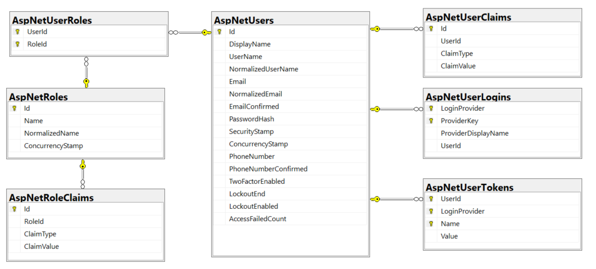
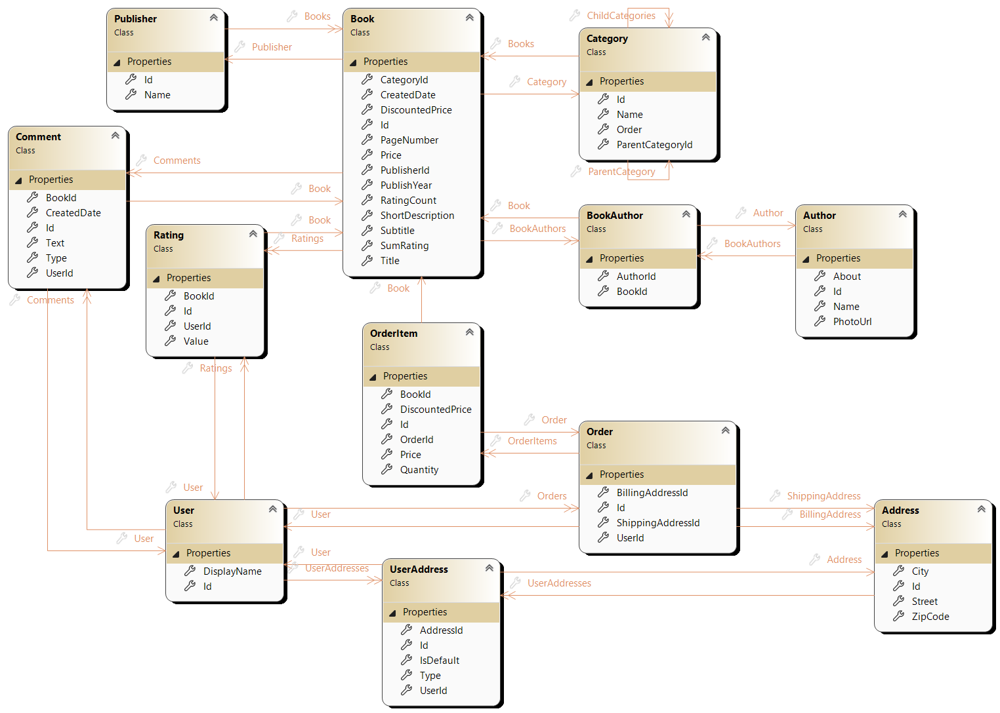
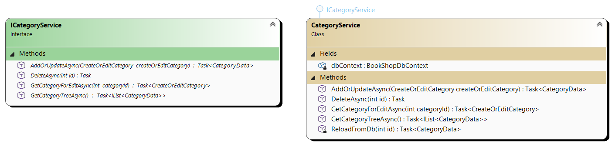
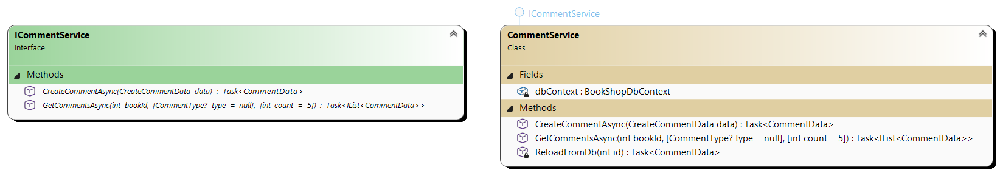
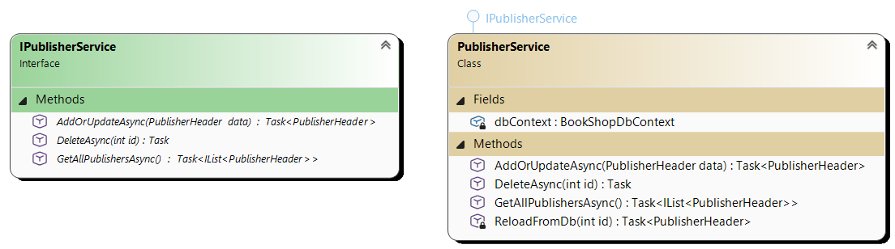
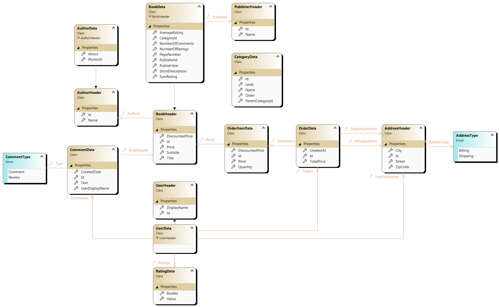
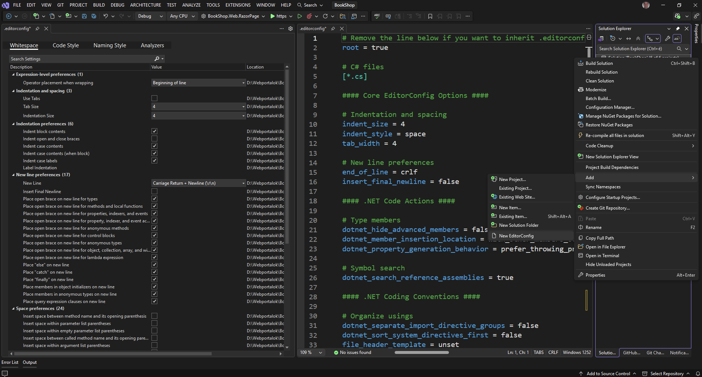
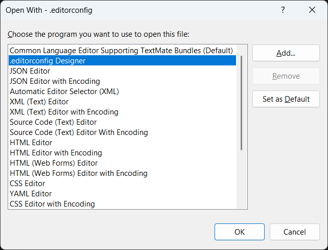
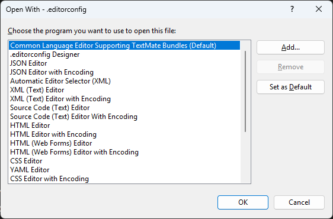

# 3. Kiinduló Backend

## Kiinduló alkalmazás letöltése

Az előző laboron áttekintettük, hogyan lehet a Backend oldalon a adatelérési réteget, üzleti logikai réteget és a DTO-kat létrehozni. A fölösleges munka csökkentése érdekében a teljes Backend kódot tartalmazza a kiinduló projekt.

1. A kiinduló BLL és DAL réteget tartalmazó kiinduló kódot a Moodle-ből [ASP.NET Razor Page invite link](https://edu.vik.bme.hu/mod/url/view.php?id=206516) vagy közvetlenül a [Github classroom](https://classroom.github.com/a/wgNmsHDJ)-ból is le lehet tölteni.
2. Részletes útmutató a kiinduló kód letöltéséről és a beadásról a [Feladatok beadása (GitHub)](../../information/github/index.md) oldalon találsz információt.
3. A repo letöltése után készítsd egy új ágat `megoldas` névvel és abba dolgozz!

## Kiinduló projekt áttekintése

A projekt több rétegű architektúrát használ így a projekt felépítése az alábbi

- **BookShop.Web**: Ez a réteg még nincs meg, ezt fogjuk a későbbiekben létrehozni (ASP.NET Razor Page, ASP.NET MVC, Blazor Web App)
- **BookShop.ConsoleApp**: Egy ideiglenes FrontEnd alkalmazás, hogy ki tudjuk próbálni az alkalmazást.
- **BookShop.Bll**: Üzleti szolgáltatások, azok interfészei és az AutoMapper profilok kerültek ebbe a projektbe. Az egyes szolgáltatásokban kérdezzük le az adatbázisból a szükséges adatokat és AutoMapperrel alakítjuk át DTO-ra, amit a hívó rétegnek visszaadnak az egyes szolgáltatások.
- **BookShop.Dal**: Az adatbázis entitások, entitás konfigurációk, adatbázis kontextus és a migrációk kerültek ebbe a projektbe.
- **BookShop.Transfer**: A DTO-kat itt hozzuk létre, és a későbbiekben a validációs szabályok is ide kerülnek. Azért kapott külön projektet, hogy a Blazor alkalmazás készítésekor a kliensre ne kelljen legenerálni a DTO-kat, hanem adhassunk erre a projektre referenciát.
- **BookShop.Server.Abstraction**: A request context kezelése miatt egy külön projekt. Jelenleg csak az `IRequestContext` interfészt tartalmazza. Az implementációt majd a Webes projektben valósítjuk meg, és DI segítségével rendeljük hozzá az interfészhez. Az interfészen keresztül a BLL és DAL réteg tudja használni, és így el tudjuk kerülni a körkörös referenciákat.

### BookShop.Dal

A kiinduló alkalmazás már tartalmazza a teljes Entity Framework modell-t beleérte a felhasználó kezeléshez szükséges táblákat is.

#### BookShopDbContext

Az adatbázis kontextus, melyben definiáljuk a táblákat, és lefuttatjuk az entitások konfigurációját és az ős adatok feltöltését.
Mivel felhasználó kezelést is szeretnénk tenni az alkalmazásban (ASP.NET Identity) ezért már a kiinduló kódban az adatbázis szint beállítások elkészültek.

- `ApplicationUser`  osztály a felhasználóhoz, amit az `IdentityUser<int>`-ből származik. A kulcs `int` lesz.
- A `BookShopDbContext` az `IdentityDbContext<ApplicationUser, IdentityRole<int>, int>`-ből származik.
- Az `OnModelCreating` először a base osztály `OnModelCreating`-jét hívja, hogy az Identity táblák létrejöjjenek.
- Meghívjuk az összes entitás konfigurációját, ami az assembly-n belül található.
- Feltöltjük az ős adatokat.

``` csharp title="BookShopDbContext.cs" hl_lines="3 12 15 18"
namespace BookShop.Dal;

public class BookShopDbContext(DbContextOptions options) : IdentityDbContext<ApplicationUser, IdentityRole<int>, int>(options)
{
    // Define DbSet properties for each entity in the model.
    public DbSet<Address> Addresses { get; set; }
    // ...

    protected override void OnModelCreating(ModelBuilder modelBuilder)
    {
        // Create Identity configurations for Identity tables
        base.OnModelCreating(modelBuilder);

        // Apply configurations from assembly
        modelBuilder.ApplyConfigurationsFromAssembly(typeof(BookShopDbContext).Assembly);

        // Seed initial data
        SeedData(modelBuilder);
    }

    private static void SeedData(ModelBuilder modelBuilder)
    {
        // ...
    }
}
```

Az entitások csak a táblákban lévő mezőket és típusait tartalmazzák. Nem attributáltuk fel, hanem a konfigurációkat külön `IEntityTypeConfiguration`-ben adtuk meg. Itt definiáljuk a tábla kulcsokat, maximális mező hosszt, és a idegen kulcsokat.
Itt hoztuk létre a `SeedData` metódust is, ami az ős adatokat fel tudja tölteni.

``` csharp title="CategoryEntityConfiguration.cs"
internal class CategoryEntityConfiguration : IEntityTypeConfiguration<Category>
{
    public void Configure(EntityTypeBuilder<Category> builder)
    {
        builder.HasKey(e => e.Id);

        builder.Property(e => e.Name).HasMaxLength(50);

        builder.HasOne(e => e.ParentCategory)
               .WithMany(e => e.ChildCategories)
               .HasForeignKey(e => e.ParentCategoryId)
               .OnDelete(DeleteBehavior.NoAction);
    }

    public static void SeedData(EntityTypeBuilder<Category> builder)
    { 
    }
}
```

Fontos, hogy az ős adat feltöltésnél fix ID-kat használjunk és csak determinisztikus adat legyen benne. A megoldás lényegi része a `HasData` ami beszúrja az adatbázisba az adatokat, ha még nem létezik.
Érdemes a `ApplicationUserEntityConfiguration` kódját megnézni, mert itt felhasználókat és szerepköröket seed-elünk, hogy lehessen létrehozni például kommentet is, ahol a létrehozó felhasználó ID-ja szükséges. Azért, hogy az adatok determinisztikusak legyenek például a felhasználó jelszavának hash kódja fixen beégetett (egyébként random-ot tartalmazna ha generálnánk) illetve a security / concurrency stamp-ek is fixek.

#### DbContextFactory

Azért hoztuk létre, hogy úgy is lehessen migrációt készíteni és futtatni, hogy nincs klasszikus startup projektünk, amibe regisztráltuk a DbContext-et. Tehát csak a DAL projekt elegendő a migrációk futtatásához.
Azonban ez a megoldás csak addig fontos, amíg nem hozunk létre startup projektet, így az adatbázis kapcsolódási sztringet beledrótoztuk a kódba.

``` csharp title="BookShopDbContextFactory.cs" hl_lines="10"
using Microsoft.EntityFrameworkCore;
using Microsoft.EntityFrameworkCore.Design;

namespace BookShop.Dal;
internal class BookShopDbContextFactory : IDesignTimeDbContextFactory<BookShopDbContext>
{
    public BookShopDbContext CreateDbContext(string[] args)
    {
        var optionsBuilder = new DbContextOptionsBuilder<BookShopDbContext>();
        optionsBuilder.UseSqlServer("Data Source=.;Initial Catalog=BookShopDb2;Integrated Security=True;TrustServerCertificate=True");

        return new BookShopDbContext(optionsBuilder.Options);
    }
}
```

#### ASP.NET Identity beállítások

A `BookShop.Dal` projekt már tartalmazza a `Microsoft.AspNetCore.Identity.EntityFrameworkCore` NuGet csomagot.

??? tip "Megfelelő verzió használata a teljes solutionben"
    Fontos, hogy a megfelelő verziót használjuk a solution minden projektjében. A verziók legördülőjében azt a verziót használjuk, ami a Web projekt (startup) függőségei között megtalálhatóval megegyezik, vagy frissítsük a solution-ben található összes Entity Framework csomagot.  
    A frissítést legegyszerűbben úgy tehetjük meg, hogy a Solution-ön jobb click Manage NuGet packages for solution és ott az Updates fület választva jelöljük ki a frissítendő csomagokat, majd kattintsunk az Update gombra. Ha rákattintunk egy csomagra a jobb oldalon látható, hogy melyik projekt melyik verziót használja éppen. Ha ezek között eltérés van akkor azt a *Consolidate* fülön is látnánk külön kiemelve.

- Az adatelérési rétegben már be van állítva minden, ami szükséges a felhasználókezeléshez

- Van saját `ApplicationUser` osztályunk, amit az `IdentityUser<int>`-ből származik. Az típusparaméter azt jelzi, hogy a felhasználó ID-ja `int` lesz, nem az alapértelmezett `string`.
- Mivel a `DisplayName` tulajdonság egy saját kiegészítés így rákerült a `[PersonalData]` attribútumot. Ezzel lehet jelezni az ASP.NET Identity-nek, hogy ez a tulajdonság személyes adatnak minősül (GDPR). A személyes adatok kezelésénél az ASP.NET több támogatást is nyújt. Pl: személyes adatok törlése (*DeletePersonalData.cshtml*), vagy a személyes adatok letöltése (*DownloadPersonalData.cshtml*), mely megoldások a `PersonalData` attribútumon alapulnak.
- Ezen felül a navigation property-ket is felvettük az `ApplicationUser`be.

    ``` csharp title="ApplicationUser.cs" hl_lines="5 7-8"
    using Microsoft.AspNetCore.Identity;

    namespace BookShop.Dal.Entities;

    public class ApplicationUser : IdentityUser<int>
    {
        [PersonalData]
        public string DisplayName { get; set; } = null!;

        public virtual ICollection<Comment> Comments { get; set; } = [];
        public virtual ICollection<Rating> Ratings { get; set; } = [];
        public virtual ICollection<UserAddress> UserAddresses { get; set; } = [];
        public virtual ICollection<Order> Orders { get; set; } = [];
    }
    ```

- A `BookShopDbContext` a megfelelő `IdentityDbContext<ApplicationUser, IdentityRole<int>, int>`-ből származik. Itt az első típusparaméter a saját user osztályunk, a második a szerepkör osztálya, amiből nincs saját így a beépítettet használjuk *int* típusú kulccsal. Az utolsó típus paraméter pedig ismét a (user és role) kulcs típusa. Hogy miért kell külön is megadni az jó kérdés.

    ``` csharp title="BookShopDbContext.cs" hl_lines="2"
    public class BookShopDbContext(DbContextOptions options) 
        : IdentityDbContext<ApplicationUser, IdentityRole<int>, int>(options)
    {
    }
    ```

- Fontos még kiemelni, hogy a `BookShopDbContext`-ben az `OnModelCreating` függvényben már **meg kell hívni az ősosztály `IdentityDbContext<>`  `OnModelCreating`-jét** ráadásul legelőször, ugyanis ez hozza létre és konfigurálja az ASP.NET Identity táblákat az adatbázisban, amit ezután tudunk felüldefiniálni (a konzekvens definíciók pl. a Users tábla megfeleltetés kapcsán egymás után megadva definiálhatók felül, az utolsó definíció jut érvényre). Ezért hívjuk először a base `OnModelCreating`-jét.

    ``` csharp title="BookShopDbContext.cs" hl_lines="3"
    protected override void OnModelCreating(ModelBuilder modelBuilder)
    {
        base.OnModelCreating(modelBuilder);

        // Apply configurations from assembly
        modelBuilder.ApplyConfigurationsFromAssembly(typeof(BookShopDbContext).Assembly);

        // Seed in the proper order.
        SeedData(modelBuilder);
    }
    ```

- Azt is megfigyelhetjük, hogy nem vettük fel külön a Users, Roles, UserRoles, ... táblákat a *DbContext*-be mégis elérjük őket, hiszen az ősosztály `IdentityDbContext` definiálja ezeket.

???+ success Identity táblák az adatbázisban
    
    /// caption
    Generált Identity táblák az adatbázisban
    ///

Az alábbiakat érdemes észrevennünk:

- A felhasználó kizárható, ha többször helytelen jelszóval próbálkozik.
- A PasswordHash egyetlen mezőben tárolódik. Ez valójában a mező felében a ténylegesen salt-tal és hash-sel titkosított jelszót tárolja, a mező második felében pedig a véletlengenerált salt értéket.
- Két faktoros authentikációt támogat a rendszer telefonnal és e-mail címmel (a második faktor a tudás mellett itt a birtoklás, a harmadik a létezés, jellemzően biometrikus azonosítás).
- Konkurenciakezelés miatt ConcurrencyStamp mezőt láthatunk a Role és User entitásokban, amik az optimista konkurenciakezelést tesznek lehetővé.
- Harmadik fél általi authentikációhoz egy felhasználónak több belépési lehetősége lehet és az így érkeztetett tokenek tárolódhatnak az adatbázisban.
- A szerepkörökhöz és felhasználókhoz tartoznak Claim-ek, amik állítások lehetnek a szerepkörről/felhasználóról. Ez gyakorlatilag egy metaadattábla, tehát kulcs-értékek formájában stringeket tárolhatunk, pl. funkciójogosultságokat.

#### Teljes EF modell

// TODO: Cserélni kell a végsőre.

/// caption
Teljes EF model diagram
///

### BookShop.Bll

Ide kerül minden logiga Service-ekbe szervezve. Egy-egy service feladata, hogy az adott funkciócsoporthoz tartozó adatbázis műveletekhez szükséges LINQ kódot előállítsa és lefuttassa.
Az BLL-ben az adatbázis lekérdező függvények az entity -> DTO mappinget is elvégzik (Automapper segítségével), a módosítás / beszúrás esetén pedig a DTO -> Entitás mappinget manuálisan elvégzi. így a BLL a Webes réteggel csak DTO-kal kommunikálni, nem ajánlj ki DB Entitásokat.

#### BookService

A könyvek kezelésével kapcsolatos adatbázis CRUD műveletek találhatóak benne, illetve különböző lekérdezések.

- Ahogy az implementációban is látható az akciós / legújabb könyvek lekérdezése külön metódust kapott. Használhattunk volna egy kicsivel bonyolultabb lekérdezést és akkor egy metódus és egy típus átadás elég lett volna, de mivel csak két külön listánk van így a legegyszerűbb megoldást választottuk.
- Van egy lekérdezés a könyv részletes / fejléc adataira.
- Külön lekérdezés tartozik a szerkesztéshez, hiszen ez saját DTO-t használ, hogy csak azokat az adatokat kérdezzük le és küldjük vissza, amit tényleg lehet szerkeszteni vagy szükséges az új könyv létrehozásánál.
- A kategória könyveit lekérdezhetjük egyszerű listában, vagy lapozott listában is.


/// caption
IBookService által kiajánlott metódusok és megvalósításuk.
///

#### CategoryService

A szolgáltatásban a klasszikus CRUD műveletek találhatók. Le tudjuk kérdezni a teljes kategória fát, vagy egy kategóriát a szerkesztéshez.


/// caption
ICategoryService által kiajánlott metódusok és megvalósításuk.
///

#### CommentService

A szolgáltatás lehetőséget ad egy hozzászólás / ajánló létrehozásához, illetve adott könyvhöz tartozó hozzászólások / ajánlók lekérdezéséhez.


/// caption
ICommentService által kiajánlott metódusok és megvalósításuk.
///

#### PublisherService

A szolgáltatásban a kiadóhoz tartozó CRUD műveletek kerültek megvalósításra.


/// caption
IPublisherService által kiajánlott metódusok és megvalósításuk.
///

#### RatingService

Itt található a metódus, amivel egy felhasználó egy új értékelést adhat egy könyvre.
Érdekessége a szolgáltatásnak, hogy lekérdezés nem tartozik hozzá. Ennek az az oka, hogy az értékeléseket pontszámát a könyvvel együtt kérdezzük le.


/// caption
IRatingService által kiajánlott metódusok és megvalósításuk.
///

### BookShop.Transfer

Ebbe a projektbe szervezünk minden olyan osztályt, amit szerver és kliens oldalon (Blazor WASM esetén) is el kell érni. Azzal, hogy ez egy külön projekt tudunk referenciát adni rá majd a kliens projektből is.

- *DTO*-k: A BLL által visszaadott adat osztályok. *AutoMapper*-rel végezzük a lekérdezéseknél az entitás -> DTO átalakítást. A másik irányt, módosításkor vagy beszúráskor manuálisan végezzük DTO -> entitás átalakítást. Az átláthatóság érdekében külön DTO-t a lekérdezésre és a módosítás-ra. Tehát a megjelenítésnél `CategoryData`-t használunk, így a létrehozásnál / szerkesztésnél a `CreateOrEditCategory`-t, így egyértelműen elkülönülnek az adatok, és az is látható, hogy kell validációs szabályokat definiálni.
- *Validációs szabályok*: Ha azt szeretnénk, hogy a kliens oldalon ugyanazok a validációs szabályok fussanak, mint szerver oldalon kénytelenek vagyunk itt definiálni, mert ezt a projektet éri el a kliens és a szerver is.
- *DB Enum*-ok: Az adatbázisban néhány mezőt `Enum`-ként hoztunk létre (pl.: `AddressType` vagy `CommentType`). Ez a kód olvashatósága szempontjából nagyon fontos, mert az `enum` többet mond mint egy `int`. Ahhoz, hogy kliens oldalon is fel tudjuk használni ezeket az `enum`-okat itt kell őket definiálni.

!!! tip "Gondoljuk végig mi lenne ha a BLL-ben lenne ez a kód"
    Ha nem hoznánk neki létre külön projektet hanem a BLL rétegben definiálnánk ezeket a típusokat, akkor a Blazor kliens oldali kódnak referenciát kellene adni a BLL projektre. Viszont ezzel a teljes BLL elérhető lenne, és meg tudnánk tenni, hogy kliens oldalról olyan szolgáltatást hívunk, amit kliens oldalról nem is érünk el, csak Web API-n keresztül.


/// caption
DTO-k Transfer projektben
///


/// caption
Létrehozáshoz / szerkesztéshez használt DTO-k
///

### BookShop.Server.Abstraction

Csak azért szükséges ez a projekt, hogy olyan interfészeket definiáljunk benne, amit a BLL vagy DAL réteg használ, viszont a konkrét implementációját csak olyan projektben tudjuk megtenni, amire nem tartalmazhat referenciát a BLL vagy DAL projekt.

Tökéletes példa az `IRequestContext` interfész, amit jelenleg tartalmaz. Az interfészen definiáljuk, hogy van egy `UserId` ami az aktuálisan belépett felhasználó ID-ját tartalmazza. Így amikor egy hozzászólást el kell menteni az adatbázisba, akkor nem a kliensről várjuk a létrehozó felhasználó azonosítóját, illetve nem a Webes rétegben kérdezzük azt le és adjuk át külön paraméterben, hanem elkészítjük a Webes projektben az interfész implementációját ami beállítja a `UserId` értékét.

Ezen felül található itt egy `CurrentUser` objektum is, amiben a felhasználó összes claim-jét elérjük.
A `RequestId` pedig a naplózásnál tud segíteni, hogy az egyes HTTP kéréseket össze tudjuk kötni. Tehát minden kéréshez egy új `RequestId`-t állítunk be, de a kérésen belül ez állandó.

``` csharp
using System.Security.Claims;

namespace BookShop.Server.Abstraction.Context;

/// <summary>
/// Gets the request's sender's request's identifier and user information.
/// </summary>
public interface IRequestContext
{
    string? RequestId { get; }

    ClaimsIdentity? CurrentUser { get; }

    public int? UserId { get; }
}
```

### editor.config

Ha a solution-ön belül testre szeretnénk szabni az egyedi beállításokat például elnevezési konvenciók, white space-ek, zárójelek kezelése, akkor azt úgy tehetjük meg, hogy létrehozunk egy `.editorconfig` fájlt, amiben elvégezhetjük ezeket a beállításokat. Sőt később azt további projektekben is felhasználhatjuk.

1. Adjunk is hozzá a solution-höz egy editor config-ot `Solution` → `jobb klikk` → `Add` → `New Editorconfig`
2. Beállítástól függően a grafikus szerkesztő felület, vagy simán szövegesen meg is nyitja a Visual Studio.

    
    /// caption
    Editor config hozzáadása és szerkesztése (grafikus / szöveges)
    ///

    ??? info "Editor kiválasztása"
        
        /// caption
        Editor config grafikus megnyitása
        ///
        
        /// caption
        Editor config szöveges megnyitása
        ///

3. Az editor config-ban egyszerűen átkattinthatjuk, hogy a kódot hogyan formázza, milyen ajánlásokat adjon a Studio. Most nem állítunk át semmit, de érdemes áttanulmányozni, hogy mennyire részletesen testre lehet szabni ezeket a beállításokat.
