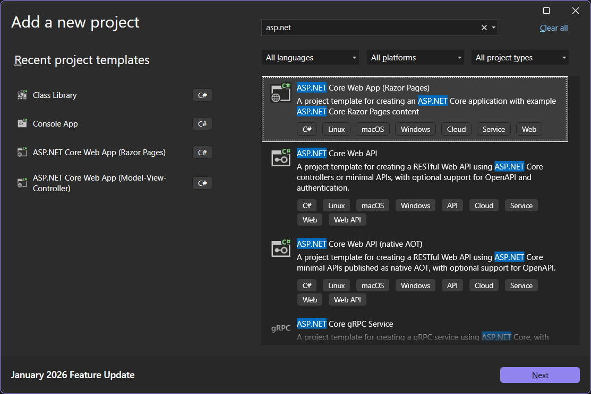
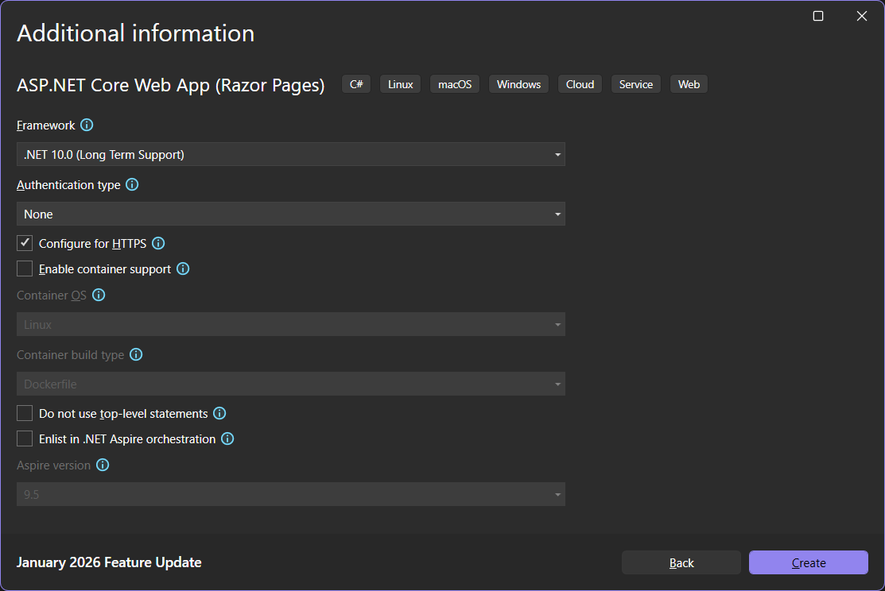
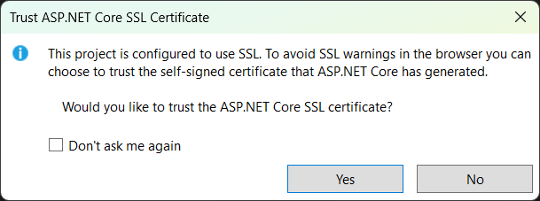
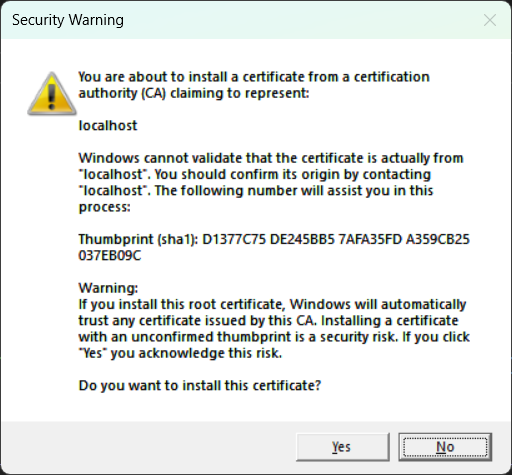
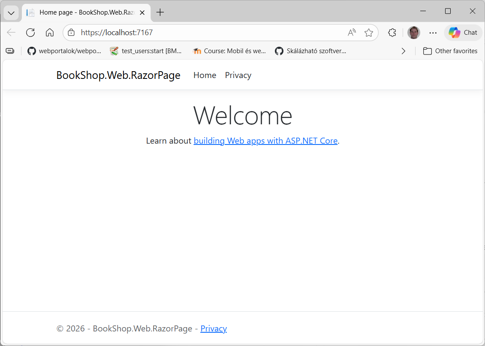
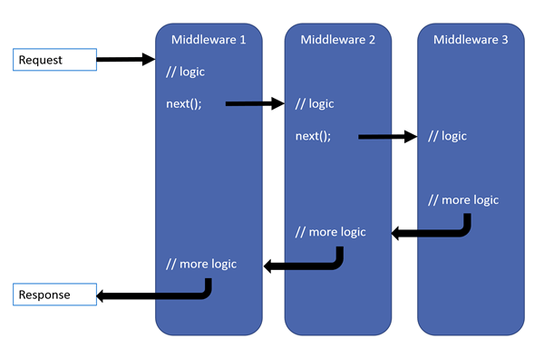
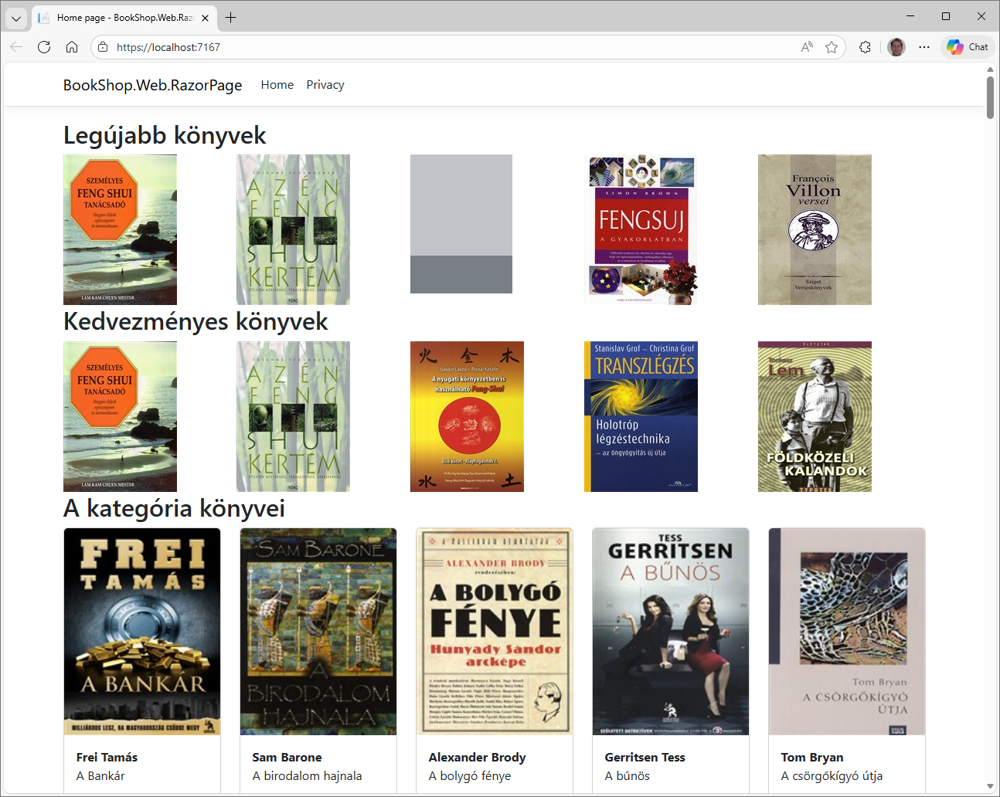

# 4.1. Projekt felépítése, alapok

Ezen a laboron egy ASP.NET Core Razor Pages projektet hozunk létre, melyben megnézzük, hogyan lehet szerver oldalon a Razor Page-eket felhasználva webes alkalmazást fejleszteni.

Eddig a UI réteg helyett csak egy egyszerű Console App-ot használtunk arra, hogy kipróbáljuk a backend alkalmazásunkat. Most ezt cseréljük le, az ASP.NET Core Razor Page projektre és tekintsük át a projekt felépítését

## Kiinduló alkalmazás letöltése

Az előző laboron elkezdett kódot folytatjuk tovább és az összes ASP.NET Razor Pages-es labort ide fogjuk elkészíteni.

## Projekt létrehozása

Hozzuk létre az ASP.NET Core Web App (Razor Page) projektünket `BookShop.Web.RazorPage` névvel.

- ASP.NET Core Web App (Razor Page) típust válasszuk.
- A harmadik oldalon, ahol az ASP.NET Core projekt tulajdonságainál az Authentication Type-nál válasszuk a None-t. Az alábbi listában láthatjuk, hogy ezen felül még milyen opciókat választhatnánk. ([További részletek](https://learn.microsoft.com/en-us/aspnet/core/security/authentication/individual?view=aspnetcore-10.0)).

    - **None**: Nincs felhasználókezelés az alkalmazásban.
    - **Individual Accounts**: ASP.NET Identity segítségével adatbázisban tárolt felhasználókezelést tesz lehetővé.
    - **Microsoft identity platform**: Azure AD belépést teszt lehetővé.
    - **Windows**: A számítógépen lévő windows felhasználókkal lehet belépni az alkalmazásba, így az alkalmazáson belül nincs szükség felhasználó kezelésre, hiszen azt az operációs rendszer végzi.

- Ezen felül a HTTPS maradhat bekapcsolva, bár érdemes tudni, hogy ahhoz, hogy a HTTPS működjön a gépen adminisztrátornak kell lennünk, hogy fel tudja telepíteni a szükséges fejlesztői tanúsítvány.
- Dockert pedig nem szeretnénk használni.

??? info "Segítség - ASP.NET Core Web App (Razor Page) létrehozása"
    
    /// caption
    ASP.NET Core Web App (Razor Page) létrehozása 1.
    ///
    
    /// caption
    ASP.NET Core Web App (Razor Page) létrehozása 2.
    ///
    
    /// caption
    ASP.NET Core Web App (Razor Page) létrehozása 3.
    ///

## Projekt felépítése

Az alábbi ábrán látható a létrehozott projekt struktúrája.


/// caption
ASP.NET Core Web App (Razor Page) projekt struktúra
///

- A `Properties` könyvtárban található a `launchSettings.json`, ami az alkalmazás indításával kapcsolatos beállításokat fogja össze. Itt található, hogy

    - milyen porton induljon az alkalmazás,
    - milyen környezeti változók legyenek beállítva. Pl.: ASPNETCORE_ENVIRONMENT legyen Development
    - vagy például a Windows authentication be legyen-e kapcsolva IIS alatt.
  
- A `wwwroot` alatt találhatók a statikusan kiszolgálandó fájlok. (CSS, JS, képek…)
- A `Pages` mappában az Razor Pages lapkomponensek találhatók. Ezek MVVM mintát követő oldalak, melyeknek szerveroldali logikai kódrészletei a hozzájuk tartozó mögöttes kód (code behind) fájlokban találhatók, a kirajzolandó HTML-t pedig Razor szintaxissal állítjuk össze, szerveroldali megjelenítési logikával ötvözve.
A konvenció szerint _ (alulvonás) karakterrel kezdődő nézetek vagy elrendezés (layout, master) nézetek, melyek keretet adnak egyes oldalaknak, vagy részleges (partial) nézetek, melyeket egyszerű kód-újrafelhasználás szempontjából szervezhetünk ki, hogy elkerüljük az ismétlődő részek kódmásolását. Utóbbi Razor Pages használata esetén kerülendő, ugyanis erre a célra a ViewComponent megoldások használatosak.
- `appsettings.json`: Egy JSON fájl amiben az alkalmazás beállításai találhatók. Azért érdemes használni, mert az itt lévő adatokat egyszerűen az alkalmazás újratelepítése nélkül is meg tudjuk változtatni és kódból is egyszerűen elérhetőek. Ezen felül az Azure-be telepítjük az alkalmazást, akkor a CI / CD pipeline-ban is le tudjuk ezeket cserélni automatikusan attól függően, hogy éppen milyen környezetbe telepítünk.

## Program.cs fájl

Az alkalmazás belépési pontja a `Program.cs` fájl. A korábbi .NET verziókkal ellentétben a generált fájlban már nem találunk `Main` metódust, hanem top level statement-ek formájában van megadva minden. A korábbi `Main` metódusos forma is használható, nem kötelező az "egybeömlesztett" kódírási formát választani.

Mivel a .NET Core 3.1-es megoldást (Top Level Statement nélkül) jobban meg lehet érteni ezért először azt nézzük meg.

### Top level statement nélkül

- .NET Core 3.1-ben az alábbiak szerint néz ki a `Program.cs` fájl. Az alkalmazás belépési pontja az itt található `Main` metódus.

    ``` csharp title="Program.cs"
    public class Program 
    { 
        public static void Main(string[] args) 
        { 
            CreateHostBuilder(args).Build().Run(); 
        } 
        
        public static IHostBuilder CreateHostBuilder(string[] args) 
            => Host.CreateDefaultBuilder(args)
                .ConfigureWebHostDefaults(webBuilder => { webBuilder.UseStartup<Startup>(); }); 
    }
    ```

- A belépési pont a `CreateHostBuilder` függvényt hívja meg a parancssorról (esetleg) érkező paraméterekkel, amit átad a `Host` statikus osztály `CreateDefaultBuilder` metódusának.

!!! tip "Builder minta"
    A builder minta megvalósítását több helyen is látni fogjuk az alkalmazásban, lényege, hogy egy belső konfigurációs objektumot .NET bővítő metódusokon keresztül konfigurálunk fel. A minta azt a problémát oldja meg, hogy tudjuk komponálni a bonyolult paraméterezéseket (pl. komplex objektum példányosítás vagy függvényhívás).

- A builder mintát használja a `UseStartup<T>()` metódus is, ami a `Startup` osztályt regisztrálja be, mint a webalkalmazás indításáért felelős osztály (típus). Miután ez megtörtént, további konfigurációkat végezhetünk az objektumon, vagy a `Main`-be visszatérve "megépítjük" a szerver példányt, amit a `Run()` meghívásával el is indítunk.

!!! tip "Vizsgáljuk meg a `CreateDefaultBuilder` eredeti implementációját"
    A `CreateDefaultBuilder` [eredeti implementációja](https://github.com/dotnet/aspnetcore/blob/v10.0.2/src/DefaultBuilder/src/WebHost.cs), ami néhány gyakori műveletet előre elvégez helyettünk, például a Kestrel és IIS integráció, vagy az `appsettings.json` konfigurációs fájl beregisztrálását és a naplózó komponens elérhetővé tételét.

- Nézzük meg a `Startup.cs` fájl kódját is!

    ``` csharp title="Startup.cs"
    public class Startup 
    { 
        public Startup(IConfiguration configuration) 
        { 
            Configuration = configuration; 
        } 
        
        public IConfiguration Configuration { get; } 
        
        // This method gets called by the runtime. Use this method to add services to the container. 
        public void ConfigureServices(IServiceCollection services) 
        { 
            services.AddRazorPages() 
        } 
        
        // This method gets called by the runtime. Use this method to configure the HTTP request pipeline. 
        public void Configure(IApplicationBuilder app, IHostEnvironment env) 
        { 
            if (env.IsDevelopment()) 
            { 
                app.UseDeveloperExceptionPage(); 
            } 
            else 
            { 
                app.UseExceptionHandler("/Error"); 
            } 
            
            app.UseStaticFiles(); 
            app.UseRouting(); 
            app.UseAuthorization(); 
            app.UseEndpoints(endpoints => { endpoints.MapRazorPages(); }); 
        }
    }
    ```

- Ez az osztály egy általános osztály, amely leírja az ASP.NET Core alkalmazásunkat. Az osztály formátuma részben kötött, ugyanis a két implementált metódus neve kötött, paraméterlistája viszont tetszőleges. Ennek oka, hogy az ASP.NET Core központi eleme a .NET Core által nyújtott inversion of control (IoC) dependency injection (DI) container, ami a függőségek feloldásáért felelős. Ez ebben a konkrét esetben azt jelenti, hogy például a `Configure()` által olyan paramétereket várhatunk, amelyeket a DI konténer ismer, az így várt típusokat a DI konténer fogja nekünk feloldani, szükség esetén példányosítani.

1. A `Startup` osztály példányosításakor kapunk egy `IConfiguration` objektumot, amely által elérhetjük az `appsettings.json` fájlokban megadott konfigurációkat, ezt eltároljuk a `Configuration` tulajdonságban.
2. Ezután meghívódik a `ConfigureServices()` metódus, amelyben a kapott `IServiceCollection` DI konténerbe regisztrálunk be saját objektumokat, szolgáltatásokat: jelenleg magát a RazorPage keretrendszert (pontosabban annak ilyen módon definiált függőségeit, szolgáltatásait). Itt is látjuk a builder minta egyik variánsát.
3. Végül a `Configure()` metódusban építjük fel az alkalmazás middleware-jeit.

### Top level statement-tel

Az előbbiekben áttekintett kód helyett már Top Level Statement-tel generálódik a Program.cs fájl az alábbi tartalommal.

``` csharp title="Program.cs" hl_lines="1 6 25"
    var builder = WebApplication.CreateBuilder(args);

    // Add services to the container.
    builder.Services.AddRazorPages();

    var app = builder.Build();

    // Configure the HTTP request pipeline.
    if (!app.Environment.IsDevelopment())
    {
        app.UseExceptionHandler("/Error");
        // The default HSTS value is 30 days. You may want to change this for production scenarios, see https://aka.ms/aspnetcore-hsts.
        app.UseHsts();
    }

    app.UseHttpsRedirection();

    app.UseRouting();

    app.UseAuthorization();

    app.MapStaticAssets();
    app.MapRazorPages().WithStaticAssets();

    app.Run();
```

A fenti kódban látható, hogy ugyanúgy a `CreateBuilder`-rel hozzuk létre a `WebApplication`-t, majd regisztráljuk a szolgáltatásainkat. Ezt követően hozzáadjuk a middleware-eket és elindítjuk az alkalmazást. Pont ugyanúgy mint top level statement nélkül, csak most a kód igazából egymás mögé van "dobálva".

## DbContext és Service-ek regisztrálása

1. Adjunk referenciát a `BookShop.Web.RazorPage` projektből az alábbiakra
    - BookShop.**Bll** projekt: Így tudjuk a DI-ba beregisztrálni a szolgáltatásainkat.
    - BookShop.**Transfer** projekt: Hogy a DTO-kat is elérjük.
    - BookShop.**Server.Abstraction**: Hogy az IRequestContext-et be tudjuk regisztrálni.

2. Ahhoz, hogy le tudjuk futtatni a migrációkat úgy, hogy a Startup projekt a `BookShop.Web.RazorPage` adjuk hozzá a projekthez a `Microsoft.EntityFrameworkCore.Design` nuGet package-et.

3. A `Program.cs`-ben regisztráljuk be a BLL szolgáltatásainkat. Ehhez már megvan a `Wireup.cs`-ben a `AddBllServices` metódus, amit csak meg kell hívunk.

    ``` csharp title="Program.cs" hl_lines="1 6"
    using BookShop.Bll;

    var builder = WebApplication.CreateBuilder(args);

    // Register BLL and DAL Services.
    builder.Services.AddBllServices(builder.Configuration);

    // TODO: Register addtional services

    // Add services to the container.
    builder.Services.AddRazorPages();

    var app = builder.Build();
    ```

4. Mivel a kiinduló kódban már használjuk az `IRequestContext`-et, ezért készítenünk kell hozzá egy implementációt és be kell regisztrálni mint szolgáltatás. Implementáljuk először az `IRequestContext` interfészt egy mock kóddal.

    ``` csharp title="RequestContext.cs"
    using BookShop.Server.Abstraction.Context;
    using System.Security.Claims;

    namespace BookShop.Web.RazorPage.Services;

    public class RequestContext : IRequestContext
    {
        public string? RequestId { get; }

        public ClaimsIdentity? CurrentUser { get; }

        public int? UserId => 1;//throw new NotImplementedException();
    }
    ```

5. Regisztráljuk be a `Program.cs`-ben

    ``` csharp title="Program.cs" hl_lines="2 3 10 11"
    using BookShop.Bll;
    using BookShop.Server.Abstraction.Context;
    using BookShop.Web.RazorPage.Services;

    var builder = WebApplication.CreateBuilder(args);

    // Register Bll and Dal Servces.
    builder.Services.AddBllServices(builder.Configuration);

    // Register additional non-BLL services.
    builder.Services.AddScoped<IRequestContext, RequestContext>();
    ```

6. Állítsuk be, hogy a `BookShop.Web.RazorPages` projekt legyen a startup project és indítsuk el. Első indításkor egy felugró ablakban rákérdez, hogy megbízunk-e az újonnan generált SSL tanúsítványban, és telepítjük-e.

    ??? info "Segítség - Tanúsítvány elfogadása képernyők"
        
        /// caption
        Figyelmeztetés, hogy a generált SSL tanúsítványban megbízunk-e
        ///
        
        /// caption
        Tanúsítvány telepítése
        ///

7. Ha mindent jól csináltunk el is indul az alkalmazás


/// caption
ASP.NET oldalunk futás közben.
///

## Middleware

Hivatalos dokumentáció: [middleware](https://learn.microsoft.com/en-us/aspnet/core/fundamentals/middleware/?view=aspnetcore-10.0).

A middleware-ek egymásra épülő rétegek, amelyek a HTTP kérés alapján:

- vagy a kontextusunk állapotát módosítják, például a HTTP kérésben található süti alapján a kontextushoz hozzárendelik az aktuális felhasználót reprezentáló objektumot
- vagy előállítják a HTTP választ.


/// caption
ASP.NET Middleware-ek
///

A middleware-ek sorrendje és regisztrációjának módja (pl. opcionális vagy futási idejű feltételhez kötött mondjuk az útvonalban szereplő paraméter, vagy azon vizsgált feltétel alapján) kritikus, ugyanis, ha egy middleware előállítja a választ, nem jut tovább a kérés a következő middleware-hez. Ezért, ha az Razor Page végpontokat regisztrálnánk előbb, akkor statikus fájlokat nem tudnánk kiszolgálni (az esetek túlnyomó részében, de a példa kedvéért elegendő most ennyi).


/// caption
ASP.NET Core Razor page middleware-ek
///

A kódban a middleware-eket regisztráló metódusok általában a `Use...` prefix-szel kezdődnek.

Esetünkben a middleware-ek közül az általános hibakezelő middleware-t és a HTST-t csak akkor regisztráljuk be, ha nem Development módban fut az alkalmazás. Ettől függetlenül a statikus fájlkiszolgálást engedélyezzük a `wwwroot` mappából, majd beállítjuk a Https átirányítást, a routing-ot, az authorizációt, majd a RazorPage-ek végpontjaira bízzuk a válasz előállítását.

A `wwwroot` mappában a statikusan kiszolgálandó fájljaink találhatók. Ezeket a böngésző letölti, amikor hivatkozunk rájuk pl. `<script>` vagy `<style>` tagben. A statikus fájlok kiszolgálásáért szintén middleware felelős, a Static Files middleware.

## appsettings.json beállítása

1. A kód azért tudott elindulni, mert nem akart adatbázishoz nyúlni. Ha megnézzük az appsettings.json fájlt akkor láthatjuk, hogy nem vettük fel a szükséges adatbázis kapcsolódási sztringet és az AutoMapper licensz kulcsot sem állítottuk be.
2. Vegyük fel a `DefaultConnectionString`-et és az `AutoMapper` kulcsot az alábbiak szerint az `appsettings.json`-ban

    ``` json title="appsettings.json" hl_lines="10-12 14-16"
    {
    "Logging": {
        "LogLevel": {
        "Default": "Information",
        "Microsoft.AspNetCore": "Warning"
        }
    },
    "AllowedHosts": "*",

    "ConnectionStrings": {
        "DefaultConnection": "Data Source=.;Initial Catalog=BookShopDb2;Integrated Security=True;TrustServerCertificate=True"
    },

    "AutoMapper": {
        "LicenseKey": "user secretből állítsuk be"
    }
    }
    ```

3. Mivel a licensz kulcs egy érzékeny, titkos adat ezért azt a user secrets.json-ba vegyük fel. (BookShop.Web.RazorPage -> Manage User Secrets)

    ``` json title="secrets.json"
    {
        "AutoMapper": {
            "LicenseKey": "ide jön a licensz kulcs"
        }
    }
    ```

## Kezdő oldal

Most, hogy már vannak adataink, és az alkalmazásvázzal is elkészültünk, meg tudjuk jeleníteni a felületen az adatbázisban levő könyvek adatait. Ehhez az `Index` page-et fogjuk átírni, így az oldal kezdeti betöltésekor a root URL-en meg fog jelenni az elérhető könyvek listája.

1. Ahhoz, hogy a képek megjelenjenek, a `Solution Items` mappában (ha fájl rendszer szinten keressük, akkor a solution gyökerében) lévő `Boritok.zip` fájlban található covers mappát másoljuk át, hogy a képek a `BookShop.Web.RazorPage\wwwroot\images\covers` könyvtárba kerüljenek!
2. Nyissuk meg a `Pages` mappában található `Index.cshtml` és `Index.cshtml.cs` fájlokat.

    - A `.cshtml`-ben az oldal megjelenése van leírva html és razor szintaxissal,
    - A `.cshtml.cs` fájl pedig a code behind C# nyelven

3. A mögöttes kódfájlban egy üres `OnGet` metódust látunk.

     ``` csharp title="Index.razor.cs"
     using Microsoft.AspNetCore.Mvc;
     using Microsoft.AspNetCore.Mvc.RazorPages;

     namespace BookShop.Web.RazorPage.Pages
     {
         public class IndexModel : PageModel
         {
             public void OnGet()
             {
             }
         }
     }
     ```

4. Az `OnGet` várhat tetszőleges paramétereket, melyeket a *model binder* fog feltölteni nekünk. A model binder-nek megadható, hogy adott paramétert ne a kérés alapján kössön, hanem oldjon fel a DI konténerből, így az `OnGet` metódusban elkérhetjük a BLL szolgáltatásokat is az interfész megadásával.

    !!! tip "Model binding hivatalos dokumentáció"
        Érdemes a Microsoft hivatalos dokumentációját is átfutni, a [model binder](https://learn.microsoft.com/en-us/aspnet/core/mvc/models/model-binding?view=aspnetcore-10.0)-ről.

    !!! failure "DbContext közvetlen elérése"
        Akár a `DbContext`-et is elérhetnénk, de a többrétegű architektúra miatt a Web csak a BLL-be hívhat be, a DAL réteget közvetlenül nem érheti el. E miatt fontos az is, hogy a Webes réteghez már csak DTO-k jussanak el.

    ``` csharp title="Index.razor.cs - OnGet DI"
    public async Task OnGet([FromServices] IBookService bookService)
    { }
    ```

5. A modellosztály konstruktorában is várhatja és eltárolja a függőségére a referenciát, ilyen esetben attribútummal sem szükséges ellátni. Ennek a megoldásnak a hátránya, hogy lehet, hogy feleslegesen kérünk el egy függőséget, mert nem feltétlenül az `OnGet` ágba fog befutni a kérés. Ez viszont igen ritkán okoz valódi teljesítményproblémákat és mikrooptimalizálásnak számít, ezért a leggyakrabban használt módszer.
Módosítsuk a kódot, hogy ne az `OnGet` kapja meg az `IBookService`-t, amit a DI-ból kell feloldani, hanem a primary constructor, így az egész osztályban elérhető lesz.

    ``` csharp title="Index.razor.cs - Primary ctor"
    public class IndexModel(IBookService bookService) : PageModel
    { }
    ```

6. Módosítsuk úgy a fenti kódot, hogy az `IBookService`-en keresztül kérjük le az akciós és a legújabb 5-5 könyvet, valamit alá az összes könyvet (később itt jelennek majd meg a kategória könyvei), amit eltárolunk egy-egy BookData listában. Ügyeljünk rá, hogy a `GetDiscountedBooksAsync`, `GetNewestBooksAsync` és a `GetBooksAsync` metódusok aszinkronok!

    ``` csharp title="Index.razor.cs" hl_lines="9-11 16-18"
    using BookShop.Bll.ServicesInterfaces;
    using BookShop.Transfer.Dtos;
    using Microsoft.AspNetCore.Mvc.RazorPages;

    namespace BookShop.Web.RazorPage.Pages;

    public class IndexModel(IBookService bookService) : PageModel
    {
        public IList<BookData> NewestBooks { get; set; } = [];
        public IList<BookData> DiscountedBooks { get; private set; } = [];
        public IList<BookData> Books { get; private set; } = [];

        public async Task OnGet()
        {
            // Query book data from the BLL service
            NewestBooks = await bookService.GetNewestBooksAsync(5);
            DiscountedBooks = await bookService.GetDiscountedBooksAsync(5);
            Books = await bookService.GetBooksAsync(null);
        }
    }
    ```

7. Alternatív megoldásokkal is elérhetjük a függőségeinket:
    - Lehetséges a nézetbe közvetlenül injektálni függőséget az `@inject` direktíva segítségével. Ez ellenjavallt, nagyon ritka esetekben szabad csak használni, mert a kód átláthatatlanságához és rejtett függőségekhez vezet (amiket nehéz vagy lehetetlen lehet tesztelni).
    - Bárhol elkérhetjük függőségként az `IServiceProvider` interfészt, ami az IoC konténerért felelős objektum. Tőle kérjük el a függőségeinket akkor is, amikor azt pl. konstruktorparaméterbe tesszük, de a keretrendszer ezt elfedi. Ha az `IServiceProvider`-en keresztül kérünk el függőséget, akkor az a függőség rejtett lesz, a statikus kódanalízis nem tudja felderíteni egyértelműen, hogy az osztályunk függ egy másiktól. A tiszta függőségekre mindig ügyeljünk!

8. Készítsük el az `Index.razor` fájlt is, ami megjeleníti a legújabb könyveket. A könyvlista fölött legyen egy cím, hogy *Legújabb könyvek*. A könyvlista megjelenítéséhez egy ciklussal iteráljunk végig a könyveket és jelenítsük meg a borító képüket, amire kattintva el tudunk navigálni a *Book* oldalra és paraméterként adjuk át a könyv Id-ját. Az `img-fluid` CSS osztállyal tudjuk megadni, hogy a kép az oldal átméretezésével összemenjen.

    ``` aspx-cs title="Index.razor" hl_lines="10 12 13"
    @page 
    @model IndexModel 

    @{ 
        ViewData["Title"] = "Könyvek"; 
    } 

    <h2>Legújabb könyvek</h2>
    <div class="row row-cols-5 g-2">
        @foreach (var book in Model.NewestBooks)
        {
            <a asp-page="Book" asp-route-id="@book.Id" class="col">
                
            </a>
        }
    </div>
    ```

9. Hasonlóan készítsük el, hogy a legújabb könyvek alatt az akciós könyvek is megjelenjenek. Itt figyeljünk arra is, hogy csak akkor jelenjen meg ez a blokk, ha a listában található könyv.

    ??? info "Segítség - Akciós könyvek megjelenítése"
        ``` aspx-cs title="Index.razor" hl_lines="1"
        @if (Model.DiscountedBooks?.Any() == true)
        {
            <h2>Legújabb könyvek</h2>
            <div class="row row-cols-5 g-2">
                @foreach (var book in Model.DiscountedBooks)
                {
                    <a asp-page="Book" asp-route-id="@book.Id" class="col">
                        
                    </a>
                }
            </div>
        }
        ```

10. Az oldal aljára készítsük el az összes könyv megjelenítését is. A megjelenítéshez használjuk a Bootstrap-es [Card Group](https://getbootstrap.com/docs/5.0/components/card/#grid-cards)-ot.

    ``` aspx-cs title="Index.razor" hl_lines="2 13"
    <h2>A kategória könyvei</h2>
    <div class="row row-cols-2 row-cols-md-3 row-cols-lg-4 row-cols-xl-5 g-4">
        @foreach (var book in Model.Books)
        {
            <div class="col">
                <div class="card h-100">
                    <a asp-page="Book" asp-route-id="@book.Id">
                        
                    </a>

                    <div class="card-body">
                        <div class="card-title fw-bold mb-0">
                            @string.Join(", ", book.Authors.Select(x => x.Name))
                        </div>
                        <p class="card-text">
                            @book.Title
                        </p>
                    </div>
                    <div class="card-footer text-end text-muted fw-bold small">
                        @(book.DiscountedPrice ?? book.Price)&nbsp;Ft
                    </div>
                </div>
            </div>
        }
    </div>
    ```

11. Itt azt vehetjük észre, hogy a Razor szintaxissal a C# és HTML kódot vegyítjük: a `@` karakterek után következő kódrészletek még a szerveren, .NET-ben futnak le. Bejárjuk a teljes könyv listát, és minden könyvet megjelenítünk a felületen. Érdekesség még a kiemelt `<a>` elem, ugyanis ez ún. tag helper-ek segítségével útvonalat generál az elemhez. A tag helper-ek új szintaxisa a Razor-nak, segítségükkel komplexebb szerveroldali kódot is futtathatunk, míg a HTML-ünk szép marad, megtartja valós markup jellegét és nem lesznek benne imperatív blokkok.

    !!! tip "Razor"
        Hivatalos dokumentáció a [Razor syntaxis](https://learn.microsoft.com/en-us/aspnet/core/mvc/views/razor?view=aspnetcore-10.0)-ról

12. Indítsuk is el az alkalmazást

    
    /// caption
    Könyv lista a kezdő oldalon
    ///
