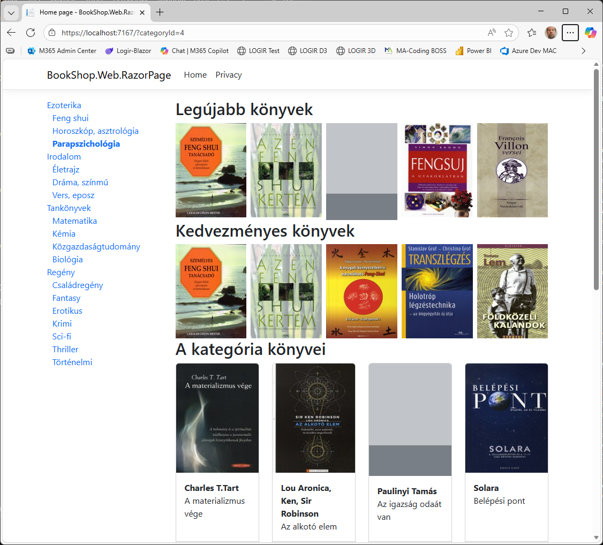
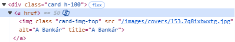
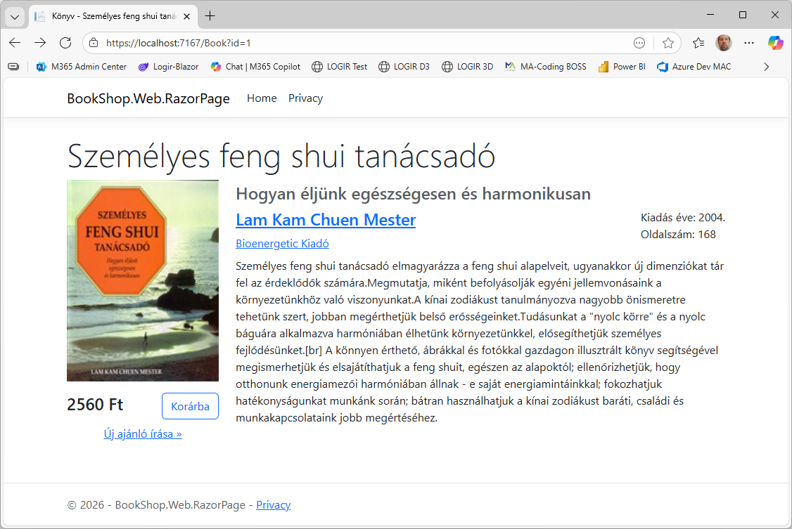
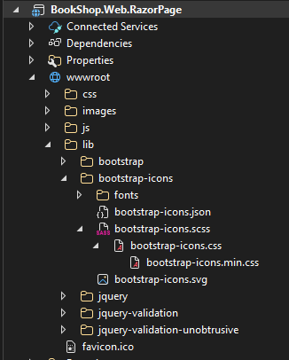

# 4.2. Főbb oldalak létrehozása

## Kategória fa

Készítsük el a kategóriafát! A fához szükségünk van az összes kategóriára, amelyeket megfelelően fogunk egymás alá rendezni. A kategóriafa az `Index` oldalra kerül, viszont úgy valósítjuk meg, hogy könnyen fel lehessen használni más oldalon is. Ehhez a kategóriafát `ViewComponent`-ként készítjük el, mert így összeköthetjük az adatlekérést és megjelenítését és egy újrafelhasználható komponenst tudunk készíteni.  
Hivatalos dokumentáció: [ViewComponent](https://learn.microsoft.com/en-us/aspnet/core/mvc/views/view-components?view=aspnetcore-10.0)

1. A kategória fa megjelenítéséhez szükséges backend oldali kód már készen van.
   - Az adatmodell a `CategoryData`, amit a `BookShop.Transfer.Dtos` mappában találunk.
   - A szolgáltatás interfésze az `ICategoryService` a `BookShop.Bll.ServicesInterfaces` mappában található
   - A BLL service is készen van `CategoryService`, amit a `BookShop.Bll.Services` mappában találunk.
   - A DI-ba is beregisztráltuk a BLL projektben található `Wireup.cs` fájlban.
2. A kategóriák sorrendezésénél azt a trükköt használjuk ki, hogy az `Order` egy sztring és a sorrendet egy ponttal elválaszott számsor határozza meg. Pl: 01.02 azt jelenti, hogy az 1-es kategória alatt a 2. a sorrendben. Tehát ha e szerint rendezzük akkor megfelelő sorrendben kapjuk meg a teljes listát, és a pontok száma meghatározza a szintet is. Így valójában a `ParentCategory` és `ChildCategories` navigációs tulajdonságokat nem is használjuk. (Csak azokkal is meg lehetne oldani, de az bonyolultabb kódot igényelne.)
3. A view component-eknek a kódját speciális helyre kell tenni. Ehhez létre kell hozni a `BookShop.Web.RazorPage` projekt alatt egy `ViewComponents` könyvtárat és abba lehet elhelyezni a `CategoryListViewComponent.cs` fájlt az alábbi tartalommal:

    ``` csharp title="CategoryListViewComponent.cs"
    using BookShop.Bll.ServicesInterfaces;
    using Microsoft.AspNetCore.Mvc;

    namespace BookShop.Web.RazorPage.ViewComponents;

    public class CategoryListViewComponent(ICategoryService categoryService) : ViewComponent
    {
        public async Task<IViewComponentResult> InvokeAsync() 
        { 
            return View(await categoryService.GetCategoryTreeAsync()); 
        }
    }
    ```

    ??? tip "Tömörebb metódus leírás az Expression-Bodied Methods használatával"
        ``` csharp
        public async Task<IViewComponentResult> InvokeAsync()
                => View(await categoryService.GetCategoryTreeAsync());
        ```

4. A hozzá tartozó nézet is speciális helyre kell tenni. Ehhez a `BookShop.Web.RazorPage\Pages` alatt hozzuk létre a `Components` könyvtárat, azon belül pedig egy `CategoryList` könyvtárat. Azért CategoryList a könyvtár neve, mert a `CategoryListViewComponent`-hez tartozik. A fájl neve legyen `Default.cshtml`, ami egy üres Razor view (Razor View–Empty).

    ``` aspx-cs title="Default.cshtml" hl_lines="2"
    @using BookShop.Transfer.Dtos
    @model IList<CategoryData>

    <div class="categories">
        @foreach (var category in Model)
        {
            <div class="category level-@category.Level">
                <a asp-route-categoryId="@category.Id">
                    @category.Name
                </a>
            </div>
        }
    </div>
    ```

5. A kódban figyeljük meg, hogy a linket úgy adjuk meg, hogy nincs benne `asp-page="Index"`. Ezt azért csináljuk így, hogy mindig arra az oldalra navigáljon a link, amin éppen vagyunk.
6. A kategóriafát jelenleg az Index oldalra szeretnénk kitenni, ezért nyissuk meg az `Index.cshtml`-t és valójában a jelenlegi kódot kell körbevenni div-ekkel úgy, hogy legyen egy bal oldali hasáb is, amiben a `CategoryList` *ViewComponent*-et meg tudjuk jeleníteni. Ehhez az alábbi módosítás szükséges:

    ``` aspx-cs title="" hl_lines="1-4 6 9-10"
    <div class="row">
        <div class="col-md-3">
            @await Component.InvokeAsync("CategoryList")
        </div>

        <div class="col-md-9">
            <h2>Legújabb könyvek</h2>
            ...
        </div>
    </div>
    ```

    A kódban megadtuk, hogy a modell, amit megkapt egy `IList<CategoryData>` mert ezt adja vissza a `GetCategoryTreeAsync()`.

7. A fenti példában a egyszerű függvényhívásként került be a view component. Azonban ez nem igazán illik a HTML világába így nézzük meg, hogyan tudnánk *TagHelper*-ként használni az elkészített komponensünket.
8. Először be kell regisztrálni a `_ViewImports.cshtml`-be, hogy a mi assembly-nkben található *TagHelper*-eket is használja. Ehhez vegyük fel az alábbi kódban az alsó sort:

    ``` aspx-cs title="_ViewImports.cshtml" hl_lnes="4"
    @using BookShop.Web.RazorPage
    @namespace BookShop.Web.RazorPage.Pages
    @addTagHelper *, Microsoft.AspNetCore.Mvc.TagHelpers
    @addTagHelper *, BookShop.Web.RazorPage
    ```

9. Ezt követően már az `Index.cshtml` oldalon tudjuk használni a TagHelper-ünket.

    ``` aspx-cs title="Index.cshtml" hl_lines="3"
    <div class="col-md-3">
        {-- @await Component.InvokeAsync("CategoryList") --}
        <vc:category-list />
    </div>
    ```

10. A kategóriákat úgy jelenítsük meg, hogy látszódjon a behúzás az alkategóriák szerint. Ehhez a kategóriát jelző `div` elemekre már tettünk egy category és egy `level-X` osztályt, ezeket definiáljuk megfelelően az alkalmazáshoz tartozó CSS fájlunkban. Illetve állítsuk be azt is, hogy a linkek ne legyenek aláhúzva. Az alkalmazás CSS fájljába `BookShop.Web.RazorPage\wwwroot\css\site.css` vegyük fel az alábbi szabályokat:

    ``` css title="site.css"
    .categories .category.level-1 {
        padding-left: 0;
    }

    .categories .category.level-2 {
        padding-left: 10px;
    }

    .categories .category.level-3 {
        padding-left: 20px;
    }

    .categories > .category > a {
        text-decoration: none;
    }
    ```

    CSS-t írhatunk pl. SASS transpilerrel (.scss) is, ami több lehetőséget biztosít fejlesztéshez, a fentit pl. ún. mixinekkel tudnánk generálni egy ciklusban. A stíluslapok statikus fájlok, amelyek alapértelmezetten cache-elődnek a böngészőben, ezért szükséges lehet a cache ürítése (++ctrl+f5++ vagy ++ctrl+r++ bizonyos böngészőkben, vagy az ++f12++ eszköztár Network fülén beállítható).

11. Így már megjelennek a kategóriák, de hiába kattintunk egy kategóriára, az csak az URL-be teszi bele a `categoryId`-t viszont nem szűri le a könyv listát. Ehhez a `CategoryId` tulajdonságot fel kell venni a Page modellbe és mivel HTTP GET kérések esetén is szükséges, hogy a query string-ből kiolvassa ezért elé kell tenni a `[BindProperty(SupportsGet = true)]` attribútumot. Ezt követően csak annyi dolgunk maradt, hogy a `GetBooksAsync`-nak is átadjuk a `CategoryId`-t

    ``` csharp title="Index.razor.cs" hl_lines="7-8 15"
    public class IndexModel(IBookService bookService) : PageModel
    {
        public IList<BookData> NewestBooks { get; set; } = [];
        public IList<BookData> DiscountedBooks { get; set; } = [];
        public IList<BookData> Books { get; private set; } = [];

        [BindProperty(SupportsGet = true)]
        public int? CategoryId { get; set; }

        public async Task OnGet()
        {
            // Query book data from the BLL service
            NewestBooks = await bookService.GetNewestBooksAsync(5);
            DiscountedBooks = await bookService.GetDiscountedBooksAsync(5);
            Books = await bookService.GetBooksAsync(CategoryId);
        }
    }
    ```

12. Ezt követően már csak annyi dolgunk van, hogy az aktuális kategóriát valahogy vizuálisan is emeljük ki a kategória fában. Ehhez először a `CategoryListViewComponent`-ben az `InvokeAsync` metódust egészítsük ki, hogy várja paraméterként a kiválasztott kategóriát, és a megkapott értéket tárolja ez a `ViewData`-ban

    ???+ tip "ViewData"
        A `ViewData` segítségével a `View`-nak tudunk átadni kulcs-érték párokat a modell mellett. Akkor hasznos a `ViewData` használata, ha nem szeretnénk a `Model`-t kiegészíteni, mert az átadni kívánt adat nem része a modellnek. Mint esetünkben a kiválasztott kategória.

    ``` csharp title="CategoryListViewComponent.cs"
    public async Task<IViewComponentResult> InvokeAsync(int? categoryId)
    { 
        ViewData["CategoryId"] = categoryId;
        return View(await categoryService.GetCategoryTreeAsync());
    }
    ```

13. Ezt követően a komponenst megjelenítését is módosítsuk. Ha az adott kategória Id-ja megegyezik a `ViewData`-ban megkapott `CategoryId`-val akkor tegyünk rá egy `active` CSS osztályt.

    ``` aspx-cs title="Default.cshtml" hl_lines="5 6"
    <div class="categories">
        @foreach (var category in Model)
        {
            <div class="category level-@category.Level">
                <a asp-route-categoryId="@category.Id" 
                    class="@((int?)ViewData["CategoryId"] == category.Id ? "active" : "")">
                    @category.Name
                </a>
            </div>
        }
    </div>
    ```

14. Ezt követően már a kezdő oldal kell módosítani, hogy a kategória fa komponens megkapja a kiválasztott kategória Id-ját. Mivel a query string-ben megkapott `categoryId`-t már eltároljuk a modell `CategoryId` tulajdonságában így egyszerű a dolgunk.

    ``` aspx-cs title="Index.cshtml" hl_lines="2"
    <div class="col-md-3">
        <vc:category-list category-id="@Model.CategoryId" />
    </div>
    ```

15. Végül a `site.css`-be vegyük le az `.active` selectorhoz tartozó formázást, ami jelen esetbe csak vastaggá teszi a szöveget. 

    ``` css title="site.css"
    .active {
        font-weight: bold;
    }
    ```

16. Nézzük meg az elkészült kategória fát
???+ success "Elkészült kategóriafa"
    
    /// caption
    Az elkészült kategóriafa
    ///

## Lapozott könyv lista

Lapozott listák megjelenítése nagyon gyakori feladat, amit a BookShop projektben is meg kell valósítanunk. A feladat nagyon jól általánosítható a generikus listák használatával. Mi is egy ilyen megoldást fogunk elkészíteni.  
Egy lapozott lista megjelenítéséhez két feladatot kell megvalósítani. Egyfelől az adatbázis lekérdezésnél a `Skip()` és `Take()` segítségével csak annyi adatot kell lekérdezni az adatbázisból, amennyit meg kell jeleníteni, másfelől szükséges egy lapozó komponensnek a megvalósítása, amivel az egyes oldalak között tudunk navigálni.

1. Nézzük meg a `BookShop.Transfer` projektben a `PagedList` osztályt. Ez az osztály fogja nyilvántartani egy adott oldalon megjelenő elemeket egy generikus listában és azt, hogy összesen hány elem van.

    ``` csharp title="PagedList.cs"
    namespace BookShop.Transfer.Common;

    public class PagedList<T>
    {
        public int TotalItems { get; set; }

        public IList<T> Items { get; set; } = [];
    }
    ```

2. Nézzük meg a `BookShop.Bll` projektben található `PagedListHelper` metódust. Ezt a bővítő metódust meg tudjuk hívni egy query-n és ha átadjuk neki, hogy hány elemet kérdezzen le és mennyit ugorjon át, akkor meg is kapjuk az aktuális oldalon lévő elemeket és az összes elemszámot.

    ``` csharp title="PagedListHelper.cs"
    using BookShop.Transfer.Common;
    using Microsoft.EntityFrameworkCore;

    namespace BookShop.Bll.Helpers;

    public static class PagedListHelper
    {
        public static async Task<PagedList<TQuery>> ToPagedListAsync<TQuery>(this IQueryable<TQuery> source, int? skip, int? top)
        {
            var totalItems = await source.CountAsync();

            if (top is not null)
                source = source.Skip(skip ?? 0).Take(top.Value);

            return new PagedList<TQuery>
            {
                Items = await source.ToListAsync(),
                TotalItems = totalItems
            };
        }
    }
    ```

3. A kódban szerepel még egy `LoadDataArgs` osztály is, amiben jelenleg egy `Skip` és egy `Top` tulajdonság szerepel.

    ``` csharp title="LoadDataArgs.cs"
    namespace BookShop.Transfer.Common;

    public class LoadDataArgs
    {
        /// <summary>
        /// Gets how many items to skip. Related to paging and the current page. Usually used with the <see cref="Enumerable.Skip{TSource}(IEnumerable{TSource}, int)"/> LINQ method.
        /// </summary>
        public int? Skip { get; set; }

        /// <summary>
        /// Gets how many items to take. Related to paging and the current page size. Usually used with the <see cref="Enumerable.Take{TSource}(IEnumerable{TSource}, int)"/> LINQ method.
        /// </summary>
        /// <value>The top.</value>
        public int? Top { get; set; }
    }
    ```

    Ezt arra használjuk, hogy amikor lapozott listát kell betölteni, ezzel definiáljuk, hogy a szerver hány elemet adjon vissza és melyik oldalon.

4. Így már megnézhetjük a `BookService`-ben a `GetBooksPagedAsync` metódust, ami a fenti kódoknak hála nagyon egyszerűen vissza tudja adni az adott oldalon lévő könyvek listáját.

    ``` csharp title="BookService.cs" hl_lines="1 7"
    public async Task<PagedList<BookData>> GetBooksPagedAsync(int? categoryId, LoadDataArgs? args)
    {
        var books = await dbContext.Books
            .Where(x => !categoryId.HasValue || x.CategoryId == categoryId.Value)
            .OrderBy(x => x.Title)
            .ProjectTo<BookData>(mapper.ConfigurationProvider)
            .ToPagedListAsync(args?.Skip, args?.Top);

        return books;
    }   
    ```

### Pager ViewComponent

Ahhoz, hogy tényleg lehessen lapozgatni a felületen készíteni kell egy újrafelhasználható komponenst, ami megjeleníti a linkeket az egyes oldalakhoz. Tehát készítenünk kell egy `PagerViewComponent`-et.

1. A `BookShop.Web.RazorPage/ViewComponents` mappában hozzuk létre a `PagerViewComponent.cs` fájlt az alábbi tartalommal

    ``` csharp title="PagerViewComponent.cs"
    using Microsoft.AspNetCore.Mvc;

    namespace BookShop.Web.RazorPage.ViewComponents;

    public class PagerViewComponent : ViewComponent
    {
        public class PagerArgs
        { 
            public int TotalItems { get; set; } 
            public int CurrentPage { get; set; } 
            public int PageSize { get; set; } = 10;
            public int TotalPages { get; set; } 
            public int PagesToShow { get; set; } = 3;
        }

        public IViewComponentResult Invoke(int pageSize, int currentPage, int totalItems, int pagesToShow) 
        { 
            return View(new PagerArgs 
            { 
                PageSize = pageSize, 
                CurrentPage = currentPage,
                TotalItems = totalItems, 
                TotalPages = (int)Math.Ceiling((double)totalItems / (double)pageSize), 
                PagesToShow = pagesToShow 
            }); 
        }
    }
    ```

    Mint látható a komponens megkapja az oldalméretet, az aktuális oldal számát, az összes találat számát és egy olyan paramétert, hogy az aktuális oldal körül mennyi linket kell megjeleníteni.
    A cél az alábbi kinézetű lapozó megvalósítása, tehát egyszerre maximum 7 számozott oldallink és az első / utolsó oldalra mutató linknek kell látszódnia. Természetesen az első oldalon nem látszódik a `<<` az utolsó oldalon pedig a `>>` link, sőt ha csak 1 oldal van, akkor az egész lapozó nem látszódik.
    Figyeljük meg azt is, hogy a `PaperArgs` osztályt a ViewComponent-en belül hoztuk létre, mert csak itt kell használni.

2. A ViewComponent kinézetéhez hozzuk létre a `BookShop.Web.RazorPage/Pages/Components` alatt a `Pager` könyvtárat és abban egy `Default.cshtml`-t (Razor View – Empty típussal) az alábbi tartalommal.

    ``` aspx-cs title="Default.cshtml"
    @model BookShop.Web.RazorPage.ViewComponents.PagerViewComponent.PagerSpecification

    @{
        // Read the query string parameters into a dictionary, and add the current page parameter (with empty string value) if not present.
        Dictionary<string, string> allRouteData = Context.Request.Query.ToDictionary(q => q.Key, q => q.Value.ToString());
        allRouteData[nameof(Model.CurrentPage)] = String.Empty;
    }

    @if (Model.TotalPages > 1)
    {
        <nav>
            <ul class="pagination justify-content-center">
                @* Link for the fist page. *@ 
                @if (Model.CurrentPage > 1)
                {
                    allRouteData[nameof(Model.CurrentPage)] = "1";
                    <li class="page-item">
                        <a asp-all-route-data="allRouteData" class="page-link"><span>&laquo;</span></a>
                    </li>
                }

                @* Links in the middle with page numbers. *@
                @for (var pageNumber = Math.Max(1, Model.CurrentPage - Model.PagesToShow); pageNumber <= Math.Min(Model.TotalPages, Model.CurrentPage + Model.PagesToShow); pageNumber++)
                {
                    @if (Model.CurrentPage == pageNumber)
                    {
                        <li class="page-item active"><a class="page-link">@pageNumber</a></li>
                    }
                    else
                    {
                        allRouteData[nameof(Model.CurrentPage)] = pageNumber.ToString();

                        <li class="page-item">
                            <a asp-all-route-data="allRouteData" class="page-link">@pageNumber</a>
                        </li>
                    }
                }

                @* Link for the last page *@ 
                @if (Model.CurrentPage < Model.TotalPages)
                {
                    allRouteData[nameof(Model.CurrentPage)] = Model.TotalPages.ToString();
                    <li class="page-item">
                        <a asp-all-route-data="allRouteData" class="page-link">
                            <span aria-hidden="true">&raquo;</span>
                        </a>
                    </li>
                }
            </ul>
        </nav>
    }
    ```

3. A fenti kódban feltűnhet, hogy nem a linkeknél nem a megszokott `asp-route-currentPage=""`-t használjuk, hanem a kód elején a *QueryString*-ből építünk egy allRouteData dictionary-t, amiben a `CurrentPage` értéket módosítjuk a megfelelőre és a linkekben az  `asp-all-route-data="allRouteData"`-t használjuk. Ennek az az oka, hogy csak az `all-route-data` használatával tudjuk elérni, hogy minden más *QueryString* paraméter megmaradjon, azok is, amit más állított be. Ilyen például, ha egy kategórián belül lapozunk, hiszen ez a komponens a `currentPage`-t állítja csak míg a `CategoryList` komponenst beállítja a categoryId-t, amit nem szabad lapozáskor elveszíteni.

4. Az `Index.cshtml.cs` fájlban
    - vegyünk fel egy `PagedBooks` tulajdonságot, amiben az lapozott lista elemek lesznek.
    - Az `OnGet` végén kérdezzük le az adott oldal elmeit a `GetBooksPagedAsync`. A `CategoryId`-t itt is adjuk át a lapozó beállításain felül.
    - A sima Book listát akár ki is kommentezhetjük, mert nem használjuk.

    ``` csharp title="Index.cshtml.cs" hl_lines="2 15 17 19-20 32"
    using BookShop.Bll.ServicesInterfaces;
    using BookShop.Transfer.Common;
    using BookShop.Transfer.Dtos;
    using Microsoft.AspNetCore.Mvc;
    using Microsoft.AspNetCore.Mvc.RazorPages;

    namespace BookShop.Web.RazorPage.Pages;

    public class IndexModel(IBookService bookService) : PageModel
    {
        public IList<BookData> NewestBooks { get; set; } = [];
        public IList<BookData> DiscountedBooks { get; set; } = [];
        // public IList<BookData> Books { get; private set; } = [];

        public PagedList<BookData> PagedBooks { get; private set; } = new();

        public int PageSize { get; set; } = 10;

        [BindProperty(SupportsGet = true)]
        public int CurrentPage { get; set; } = 1;

        [BindProperty(SupportsGet = true)]
        public int? CategoryId { get; set; }

        public async Task OnGet()
        {
            // Query book data from the BLL service
            NewestBooks = await bookService.GetNewestBooksAsync(5);
            DiscountedBooks = await bookService.GetDiscountedBooksAsync(5);
            // Books = await bookService.GetBooksAsync(CategoryId);

            PagedBooks = await bookService.GetBooksPagedAsync(CategoryId, new LoadDataArgs { Skip = (CurrentPage - 1) * PageSize, Top = PageSize });
        }
    }
    ```

5. Már csak annyi dolgunk van, hogy a kezdőoldalra rátegyük az elkészített `PagerViewComponent`-et, és a ciklusban a `Model.PagedBooks.Item`-en iteráljunk végig, illve, hogy a tesztelést könnyítsük írjuk ki a találatok számát is az oldalra. Ehhez módosítjuk az `Index.cshtml`-t az alábbiak szerint

    ``` aspx-cs title="Index.cshtml" hl_lines="5 11-16 18-21"
    <h2>A kategória könyvei</h2>

    <div class="row row-cols-2 row-cols-md-3 row-cols-lg-4 row-cols-xl-5 g-4">
        @* {-- @foreach (var book in Model.Books) --} *@
        @foreach (var book in Model.PagedBooks.Items)
        {
            ...
        }
    </div>

    <div class="card text-center border-0">
        <div class="card-body">
            <div class="mb-1">
                @Model.PagedBooks.TotalItems találat
            </div>
        </div>

        <vc:pager page-size="Model.PageSize"
                  current-page="Model.CurrentPage"
                  total-items="Model.PagedBooks.TotalItems"
                  pages-to-show="3" />
    </div>
    ```

6. Indítsuk el az alkalmazást és nézzük meg az eredményt.

    ???+ success "Elkészült kezdő oldal lapozott könyvlistával"
        
        /// caption
        Az elkészült lapozott lista
        ///

## Könyv részletes oldal

A könyvlistázó oldalon a képre kattintva kellene tudni eljutni a könyv részletes oldalára, azonban a link nem működik, pedig beállítottuk, hogy a Book oldalra vigyen, és megkapja a könyv ID-ját is. Ha megnézzük a HTML forrást, azt látjuk, hogy a line `href` attribútuma nincs beállítva, tehát nem generálódott le szerver oldalon a link, aminek az az oka, hogy még nem létezik a Book oldalunk.


/// caption
Nincs beállítva a `href` attribútum
///

1. A `Pages` mappához adjunk hozzá egy új `Razor Page`-et. A template-ek közül válasszuk a *Razor Page - Empty*-t és az oldal neve legyen `Book.cshtml`
2. A kódban constructor injection-nel kérjük el a `IBookService` példányt (használjuk a primary constructor-t) és egy `Id` változóhoz kössük hozzá a query string-ben lévő `id`-t.

    ``` csharp title="Book.cshtml.cs"
    using BookShop.Bll.ServicesInterfaces;
    using Microsoft.AspNetCore.Mvc;
    using Microsoft.AspNetCore.Mvc.RazorPages;

    namespace BookShop.Web.RazorPage.Pages;
    public class BookModel(IBookService bookService) : PageModel
    {
        [BindProperty(SupportsGet = true)]
        public int Id { get; set; }

        public void OnGet()
        {
            // TODO: Könyv adatainak lekérdezése
        }
    }
    ```

3. Ezt követően meg tudjuk írni a lekérdezést is, hogy az ID alapján kapjuk vissza a könyv adatait. Ehhez használjuk a `GetBookAsync` metódust. Ügyeljünk rá, hogy aszinkron kell meghívni ezt a függvényt, ezért az `OnGetAsync`-ban kell meghívni.

    ``` csharp title="Book.cshtml.cs" hl_lines="6 8 11"
    public class BookModel(IBookService bookService) : PageModel
    {
        [BindProperty(SupportsGet = true)]
        public int Id { get; set; }

        public BookData Book { get; set; } = null!;

        public async Task OnGetAsync()
        {
            // Query the book details
            Book = await bookService.GetBookAsync(Id);
        }
    }
    ```

4. Ezután már csak meg kell jeleníteni a könyv részletes adatait, amihez a `Book` tulajdonságot kell használnunk. Fontos, hogy az oldalnál állítsuk be, hogy vár egy `id`-t ami `int` típusú. Ezzel azt érjük el, hogy az `id` paraméter nem a query string-ben kerül átadásra, hanem `/id`-ként azaz `Book/1` lesz a `Book?id=1`

    ``` aspx-cs title="Book.cshtml" hl_lines="5 9 18-20 24 45-48"
    @page "{id:int}"
    @model BookShop.Web.RazorPage.Pages.BookModel

    @{
        ViewBag.Title = "Könyv - " + Model.Book.Title;
    }

    <h1 class="display-4 one-row">
        <small>@Model.Book.Title</small>
    </h1>

    <div class="row">
        <div class="col-md-3">
            
            <div class="d-flex justify-content-between align-items-center py-2">
                <h4>@(Model.Book.DiscountedPrice.HasValue ? Model.Book.DiscountedPrice : Model.Book.Price)&nbsp;Ft</h4>

                <form asp-page-handler="AddToCart">
                    <button class="btn btn-outline-primary">Korárba</button>
                </form>
            </div>

            <div class="text-center">
                <a asp-page="CreateComment" asp-route-bookId="@Model.Book.Id">Új ajánló írása &raquo;</a>
            </div>
        </div>

        <div class="col-md-9">
            @if (!String.IsNullOrWhiteSpace(Model.Book.Subtitle))
            {
                <h3 class="one-row text-muted">
                    <small>@Model.Book.Subtitle</small>
                </h3>
            }

            <div class="d-flex justify-content-between">
                <div>
                    <h4 class="one-row">
                        @if (Model.Book.Authors == null || !Model.Book.Authors.Any())
                        {
                            @:Nincs megadva
                        }
                        else
                        {
                            foreach (var author in Model.Book.Authors)
                            {
                                <a asp-page="/Index" asp-route-authorId="@author.Id">@author.Name</a>
                            }
                        }
                    </h4>

                    @if (Model.Book.Publisher != null)
                    {
                        <a asp-page="/Index" asp-route-publisherId="@Model.Book.Publisher.Id">@Model.Book.Publisher.Name</a>
                    }
                </div>

                <div class="product-meta text-right">
                    <span>Kiadás&nbsp;éve:&nbsp;@Model.Book.PublishYear.</span>
                    <br />
                    <span>Oldalszám:&nbsp;@Model.Book.PageNumber</span>
                </div>
            </div>

            <p class="py-2">@Model.Book.ShortDescription</p>
        </div>
    </div>
    ```

5. Figyeljük meg, a fenti kódban az alábbiakat
    - Az oldal címét a `ViewBag.Title` segítségével tudjuk beállítani.
    - A könyv adatai a `Model.Book`-en keresztül érhetők el.
    - Ha van kedvezményes ár, akkor azt jelenítjük meg, ha nincs akkor a normál árat
    - A korárhoz adás egy gomb, aminek létre kell hozni egy űrlapot. A `form` tagen meg kell adni az `asp-page-handler="AddToCart"` ez jelzi, hogyha a gombra kattintanak akkor melyik eseménykezelőt kell futtatni.
    - A szerző és kiadó egy-egy link, ami jelenleg a kezdő oldalra irányít át, az URL-be beletéve az `authorId` vagy `publisherId` paramétereket.
    - A szerzők megjelenítésénél kezeljük, azt az esetet is ha nincs szerző megadva, illetve egy listát várunk el, és minden szerzőhöz egy külön linket készítünk.

6. Ha mindent jól készítettünk el az alábbi oldalt kapjuk

    ???+ success "Elkészült kezdő részletes oldal"
        
        /// caption
        Az elkészített könyv részletes oldal
        ///

## Kosárkezelés

A könyv részletes oldalon már megtalálható a *Kosárba* gomb viszont ez még nem csinál semmit. Készítsük el a kosaram oldalt, illetve valósítsuk meg a kosárba tétel funkciót is.
A kosárban lévő elemeket tárolhatnánk adatbázisban, ami egy jó megoldás. Azonban most mégsem ezt a bevett megoldást választjuk, hogy megismerkedhessünk a Session használatával, ami a szerver memóriájában tárolja a kosárba tett elemeket.

???+ tip "Session"
    Amikor a felhasználó ellátogat egy weboldalra elindul egy munkamenet (session). Az ASP.NET lehetőséget ad arra, hogy a felhasználóhoz tartozó adatokat ne a cookie-ban hanem egy úgynevezett session-ben tároljuk el. Ilyenkor az adat a szerveren tárolódik (alapértelmezés szerint a memóriában, de lehet elosztott is akár egy Redis cache) és csak egy sessionID utazik a sütiben, (vagy akár az URL-ben) ami azonosítja a felhasználóhoz tartozó session példányt, így azt a szerveren bármikor elérhetjük. Fontos azonban, hogy ha a felhasználó nem használja az oldalt (kb 20 percig) akkor a session törlődik a szerver memóriájából.
    Hivatalos dokumentáció: [Session](https://learn.microsoft.com/en-us/aspnet/core/fundamentals/app-state?view=aspnetcore-10.0)

1. A `_Layout.cshtml` oldalon a menübe vegyük fel egy *Kosaram* linket.

    ``` aspx-cs title="_Layout.cshtml" hl_lines="16-18"
    <nav class="navbar navbar-expand-sm navbar-toggleable-sm navbar-light bg-white border-bottom box-shadow mb-3">
        <div class="container">
            <a class="navbar-brand" asp-area="" asp-page="/Index">BookShop.Web.RazorPage</a>
            <button class="navbar-toggler" type="button" data-bs-toggle="collapse" data-bs-target=".navbar-collapse" aria-controls="navbarSupportedContent"
                    aria-expanded="false" aria-label="Toggle navigation">
                <span class="navbar-toggler-icon"></span>
            </button>
            <div class="navbar-collapse collapse d-sm-inline-flex justify-content-between">
                <ul class="navbar-nav flex-grow-1">
                    <li class="nav-item">
                        <a class="nav-link text-dark" asp-area="" asp-page="/Index">Home</a>
                    </li>
                    <li class="nav-item">
                        <a class="nav-link text-dark" asp-area="" asp-page="/Privacy">Privacy</a>
                    </li>
                    <li class="nav-item">
                        <a class="nav-link text-dark" asp-area="" asp-page="/Cart">Kosaram</a>
                    </li>
                </ul>
            </div>
        </div>
    </nav>
    ```

2. Az könyv részletes oldalán *Pages/Book.cshtml* már van egy kosárba gombunk, ami meg is hívja az `OnPostAddToCart` handler-t, amit még nem készítettünk el. Most ezt fogjuk megtenni. A *Kosárba* gombra kattintva a `Session`-ben fogjuk gyűjteni a termékeket. Egészen pontosan a termék azonosítóját, árát és darabszámát. Készítsük is el hozzá a szükséges modell osztályt a `BookShop.Web.RazorPage/Models` könyvtárban `CartItem.cs` névvel.

    ``` csharp title="CartItem.cs"
    namespace BookShop.Web.RazorPage.Models;

    public class CartItem
    {
        public int BookId { get; set; }

        public int Price { get; set; }

        public int Count { get; set; }
    }
    ```

3. Ezt követően a feladatunk annyi lesz, hogyha rákattintanak a *Kosárba* gombra, akkor a `Session`-ben tároljuk el egy új `CartItem`-et. Ehhez először kapcsoljuk be először a Session-t a `Program.cs`-ben. Ehhez először az `AddDistributedMemoryCache`-t kell meghívni, hiszen memóriában fogjuk tárolni a session-t, majd pedig az `AddSession`-t amiben az options pattern segítségével beállíthatjuk hogyan viselkedjen a sessionId-t tartalmazó süti, vagy mennyi legyen a session lejárati ideje.

    ``` csharp title="Program.cs" hl_lines="6 8-13 23"
    // ...

    // Add services to the container.
    builder.Services.AddRazorPages();

    builder.Services.AddDistributedMemoryCache();

    builder.Services.AddSession(options =>
    {
        // options.IdleTimeout = TimeSpan.FromMinutes(20);
        options.Cookie.HttpOnly = true;
        options.Cookie.IsEssential = true;
    });

    var app = builder.Build();

    // ..

    app.UseRouting();

    app.UseAuthorization();

    app.UseSession();

    app.MapStaticAssets();
    app.MapRazorPages()
    .WithStaticAssets();

    app.Run();

    ```

4. Mivel komplex objektumot szeretnénk a session-ben tárolni ezért érdemes elkészíteni az alábbi két bővítőmetódust, ami a komplex objektumot JSON-ba sorosítva tárolja el a sessionben, illetve onnan típusosan olvassa vissza. Ehhez hozzuk létre a *BookShop.Web.RazorPage/Extensions/SessionExtension.cs* osztályt az alábbi tartalommal

    ``` csharp title="SessionExtensions.cs"
    using System.Text.Json;

    namespace BookShop.Web.RazorPage.Extensions;

    public static class SessionExtension
    {
        public static void Set<T>(this ISession session, string key, T value)
        {
            session.SetString(key, JsonSerializer.Serialize(value));
        }

        public static T? Get<T>(this ISession session, string key)
        {
            var value = session.GetString(key);
            return value == null ? default : JsonSerializer.Deserialize<T>(value);
        }
    }
    ```

5. Ezt követően már csak használni kell a fenti két metódust a `Book.cshtml.cs` fájl `OnPostAddToCart()` metódusában.

    ``` csharp title="Book.cshtml.cs"
    public async Task<IActionResult> OnPostAddToCartAsync(int bookId) 
    {
        var cart = HttpContext.Session.Get<List<CartItem>>("Cart") ?? [];

        var book = await bookService.GetBookAsync(bookId);

        var cartItem = cart.SingleOrDefault(c => c.BookId == book.Id);

        if (cartItem != null)
        {
            cartItem.Count++;
        }
        else
        {
            cartItem = new CartItem 
            { 
                BookId = book.Id, 
                Count = 1, 
                Price = book.DiscountedPrice ?? book.Price 
            };

            cart.Add(cartItem);
        }

        HttpContext.Session.Set("Cart", cart);

        return new RedirectToPageResult("/Book", new { id = book.Id });
    }
    ```

6. A fenti kódban szükségünk van a kosárba tett könyv azonosítójára, így módosítani kell a *cshtml*-t is, hogy egy rejtett mezőben adja át a könyv azonosítóját.

    ``` aspx-cs title="Book.cshtml" hl_lines="2"
    <form asp-page-handler="AddToCart">
        <input type="hidden" name="bookId" value="@Model.Book.Id" />
        <button class="btn btn-outline-primary">Korárba</button>
    </form>
    ```

7. Ahhoz, hogy lássuk be is került a kosárba az elem módosítsuk a Layout oldalt úgy, hogy a Kosaram mögött írja ki a benne lévő elemek számát - ha van benne elem - egy [badge](https://getbootstrap.com/docs/5.3/components/badge/#positioned)-ben.

    ``` aspx-cs title=""
    <li class="nav-item position-relative">
        <a class="nav-link text-dark" asp-area="" asp-page="/Cart">
            Kosaram
            @if (Context.Session.Get<List<CartItem>>("Cart")?.Any() == true)
            {
                <span class="position-absolute start-100 translate-middle badge rounded-pill bg-danger">
                    @(Context.Session.Get<List<CartItem>>("Cart")?.Sum(x => x.Count) ?? 0)
                    <span class="visually-hidden">elem a kosárban</span>
                </span>
            }
        </a>
    </li>
    ```

8. Ahogy a fenti kódban látjuk most a Session kulcsot több helyen beledrótoztuk az kódba, így nehéz lehet azt megváltoztatni. A szép megoldás ilyenkor, hogy felveszünk egy pl.: `BookShopConstants` osztályt és ott gyűjtjük össze az összes magic konstanst és azt használjuk.

    ``` csharp
    namespace BookShop.Web.RazorPage.Models;

    public class BookShopConstants
    {
        public const string CartSessionKey = "Cart";
    }
    ```

### Kosaram oldal

A következő lépés, hogy meg is tudjuk mutatni, hogy pontosan milyen könyvek vannak a kosárban.

1. Mivel az oldalon szeretnénk ikonokat is használni (+ és - gombok) ezért először adjuk hozzá a projekthez a [Bootstrap icons](https://icons.getbootstrap.com/)-t
    - Töltsük le a fenti oldal legalján lévő "Download latest ZIP" gombbal az ikonokat.
    - A letöltött fájlt tartalmát másoljuk be a `BookShop.Web.RazorPage` projekt `wwwroot/lib/bootstrap-icon` könyvtárában. A `svg` fájlokat nem szükséges odamásolni, mert azt nem fogjuk használni.

        ??? tip "Bootstrap ikonok a projektben"
            
            /// caption
            Bootstrap ikonok a projektben
            ///

    - Ezt követően a `_Layout.cshtml` oldalon linkeljük be a CSS fájlt.

        ``` aspx-cs title="_Layout.cshtml" hl_lines="7"
        <head>
            <meta charset="utf-8" />
            <meta name="viewport" content="width=device-width, initial-scale=1.0" />
            <title>@ViewData["Title"] - BookShop.Web.RazorPage</title>
            <script type="importmap"></script>
            <link rel="stylesheet" href="~/lib/bootstrap/dist/css/bootstrap.min.css" />
            <link rel="stylesheet" href="~/lib/bootstrap-icons/bootstrap-icons.min.css" />
            <link rel="stylesheet" href="~/css/site.css" asp-append-version="true" />
            <link rel="stylesheet" href="~/BookShop.Web.RazorPage.styles.css" asp-append-version="true" />
        </head>
        ```

2. Ezt követően hozzuk létre a `Pages` alatt `Cart` oldalt. Ez is *Razor Page Empty* típusú legyen.
3. Az oldal kódja meglehetősen egyszerű, hiszen az `OnGet`-ben ki kell olvasni a Session-ből az eltárolt kosár tartalmát, amihez már tudjuk használni a `SessionExtensions`-t illetve a `BookShopConstants`-t, majd le kell kérdezni az `IBookService`-en keresztül a könyvek adatait az adatbázisból, amihez a `GetBookHeadersAsync`-ot tudjuk használni.

    ``` csharp title="Cart.cshtml.cs"
    using BookShop.Bll.ServicesInterfaces;
    using BookShop.Transfer.Dtos;
    using BookShop.Web.RazorPage.Extensions;
    using BookShop.Web.RazorPage.Models;
    using Microsoft.AspNetCore.Mvc.RazorPages;

    namespace BookShop.Web.RazorPage.Pages;

    public class CartModel(IBookService bookService) : PageModel
    {
        public IList<CartItem> Cart { get; set; } = null!;
        public IList<BookHeader> Books { get; set; } = [];

        public async Task OnGet() 
        { 
            Cart = HttpContext.Session.Get<IList<CartItem>>(BookShopConstants.CartSessionKey) ?? [];

            var bookIds = Cart.Select(ci => ci.BookId).ToList();
            Books = await bookService.GetBookHeadersAsync(bookIds) ?? [];
        }
    }
    ```

4. Ezt követően a megjelenítést is készítsük el. A megjelenítés a [Bootstrap card](https://getbootstrap.com/docs/5.3/components/card/#horizontal)-ot használjuk, csak itt a kép a bal oldalon lesz nem felül.
    - Iteráljunk végig a kosár elemein amit a `Model.Cart`-ban érünk el.
    - Válasszuk ki az adott kosárelemhez tartozó könyvet a `Model.Books` tulajdonságból.
    - A *card-footer*-be tegyük az egységárat és a mennyiséget egy + és - gombbal. Ide egyedi formázás szükséges, hogy szépen jelenjen meg. Mivel a + és - gomboknak el kell küldeni a szerverre, hogy melyik könyvön nyomtuk meg, mindenképpen egy `form`-ba kell tenni és a route paraméterek között át kell adni a könyv azonosítóját.
    - Vegyük fel egy `Eltávolítás` gombot is.
    - Végül írjuk ki az teljes árat. Itt arra kell figyelni, hogy egy könyvből többet is rendelhetünk.

    ``` aspx-cs title="Cart.cshtml"
    @page
    @model BookShop.Web.RazorPage.Pages.CartModel

    @{
        ViewBag.Title = "Kosaram";
    }

    <h2>Kosaram</h2>

    @foreach (var item in Model.Cart)
    {
        // Query the book header (the Books property is populated in the PageModel, from the database)
        var book = Model.Books.Single(b => b.Id == item.BookId);

        <div class="card flex-row mb-2">
            

            <div class="card-body">
                <h5 class="card-title">
                    <a asp-page="Book" asp-route-id="@book.Id">@book.Title</a>
                    @if (!String.IsNullOrWhiteSpace(book.Subtitle))
                    {
                        <br />
                        <small>@book.Subtitle</small>
                    }
                </h5>

                <p class="card-text">
                    <small>
                        @foreach (var author in book.Authors)
                        {
                            <a asp-page="Book" asp-route-authorId="@author.Id">@author.Name</a>
                        }
                    </small>
                </p>

            </div>
            <div class="card-footer border-top-0 border-start">
                <div class="mb-3">Egységár: <b>@item.Price.ToString("N0") Ft</b></div>

                <div class="d-flex align-items-center justify-content-center mb-3">
                    <form asp-page-handler="Decrement" asp-route-bookId="@item.BookId">
                        <button class="btn btn-outline-info btn-sm me-2"><i class="bi bi-dash"></i></button>
                    </form>
                    
                    <b>@item.Count db</b>
                    <form asp-page-handler="Increment" asp-route-bookId="@item.BookId">
                        <button class="btn btn-outline-info btn-sm ms-2"><i class="bi bi-plus"></i></button>
                    </form>
                </div>

                <div class="d-flex justify-content-center">
                    <form asp-page-handler="RemoveFromCart" asp-route-bookId="@item.BookId">
                        <button class="btn btn-outline-danger btn-sm ms-2"><i class="bi bi-trash"></i> Eltávolítás</button>
                    </form>
                </div>
            </div>
        </div>
    }
    <div class="d-flex justify-content-end me-3">
        Összesen:&nbsp;<b>@Model.Cart.Sum(book => book.Price * book.Count).ToString("N0") Ft</b>
    </div>
    ```

5. Készítsük el a *+*, *-* és *Eltávolítás* gombok eseménykezelőjét is.

    ``` csharp
    public IActionResult OnPostDecrement(int bookId)
    {
        var cart = HttpContext.Session.Get<IList<CartItem>>(BookShopConstants.CartSessionKey) ?? [];

        var cartItem = cart.Single(c => c.BookId == bookId);

        if (cartItem.Count == 1)
            cart.Remove(cartItem);
        else
            cartItem.Count--;

        HttpContext.Session.Set(BookShopConstants.CartSessionKey, cart);

        return new RedirectToPageResult("Cart");
    }

    public IActionResult OnPostIncrement(int bookId)
    {
        var cart = HttpContext.Session.Get<IList<CartItem>>(BookShopConstants.CartSessionKey) ?? [];

        var cartItem = cart.Single(c => c.BookId == bookId);
        cartItem.Count++;

        HttpContext.Session.Set(BookShopConstants.CartSessionKey, cart);

        return new RedirectToPageResult("Cart");
    }

    public IActionResult OnPostRemoveFromCart(int bookId)
    {
        var cart = HttpContext.Session.Get<IList<CartItem>>(BookShopConstants.CartSessionKey) ?? [];

        var cartItem = cart.Single(c => c.BookId == bookId);
        cart.Remove(cartItem);

        HttpContext.Session.Set(BookShopConstants.CartSessionKey, cart);

        return new RedirectToPageResult("Cart");
    }
    ```

6. Próbáljuk is ki az oldalt. Ehhez először tegyünk a kosárba egy pár könyvet, majd próbáljuk ki a Kosár oldalon a gombokat.

    ??? success "Az elkészített kosár oldal"
        
        /// caption
        Kész kosár oldal
        ///

## Hozzászólások

A felhasználók a könyvekhez hozzászólásokat (és ajánlókat is írhatnak). Minden a két esetben az `ICommentService`-t használjuk, mert a két típusú komment között csak a `CommentType` értéke eltérő.

### Hozzászólások listázása

1. A könyv részletes oldalon injektáljuk az `ICommentService`-t és az `OnGetAsync`-ban kérdezzük le a könyvhöz tartozó kommenteket a `GetCommentsAsync` segítségével

    ``` csharp title="Book.cshtml.cs" hl_lines="1 8 15"
    public class BookModel(IBookService bookService, ICommentService commentService) : PageModel
    {
        [BindProperty(SupportsGet = true)]
        public int Id { get; set; }

        public BookData Book { get; set; } = null!;

        public IList<CommentData> Comments { get; set; } = [];

        public async Task OnGetAsync()
        {
            // Query the book details
            Book = await bookService.GetBookAsync(Id);

            Comments = await commentService.GetCommentsAsync(Id, CommentType.Comment);
        }

        // ...
    }
    ```

2. Ezt követően jelenítsük is meg a kommenteket, ehhez végig kell iterálni a `Model.Comments`-en és az egyes elemekhez bal oldalra kitenni egy `bi-person-square` bootstrap ikont, alá pedig a hozzászólás dátumát és idejét, jobb oldalra pedig magát a hozzászólás szövegét, ami egy sima szöveg HTML tartalom nélkül.

    ``` aspx-cs title="Book.cshtml"
    <h3>Kommentek</h3>

    <div class="comments my-2">
        @foreach (var comment in Model.Comments) 
        {
            <div class="comment d-flex p-3">
                <div class="d-flex flex-column align-items-center justify-content-center flex-shrink-0 me-3">
                    <i class="bi bi-person-square fs-1"></i>
                    div class="text-muted">@(comment.CreatedDate.DateTime.ToShortDateString())</div>
                    <div class="text-muted">@(comment.CreatedDate.DateTime.ToShortTimeString())</div>
                </div>
                <div class="w-100">
                    @comment.Text
                </div>
            </div>
        }
    </div>
    ```

3. Ha mindent jól csináltunk az 1-es ID-jú könyvnél megjelenik kettő komment.

### Hozzászólás létrehozása

1. Készítsük el az új hozzászólás részt is. Ehhez a `CreateCommentData` DTO-t használjuk, mert ebbe csak azokat az adatokat várjuk, amik szükségesek egy komment létrehozásához. Figyeljük meg, hogy a felhasználó azonosítója nincs benne mert csak az aktuálisan belépett felhasználó tud kommentet írni, azt pedig a szerver oldalon a `RequestContext`-ből elérjük.
2. Kezdjük az új hozzászólás gomb eseménykezelőjével a `Book.cshtml.cs` fájlban

    ``` csharp title="Book.cshtml.cs" hl_lines="5-6 14 17-32"
    public class BookModel(IBookService bookService, ICommentService commentService) : PageModel
    {
        // ...

        [BindProperty] 
        public CreateCommentData NewComment { get; set; } = null!;

        public async Task OnGetAsync()
        {
            // Query the book details
            Book = await bookService.GetBookAsync(Id);
            Comments = await commentService.GetCommentsAsync(Id, CommentType.Comment);

            NewComment = new CreateCommentData() { BookId = Id };
        }
        
        public async Task<IActionResult> OnPostCreateComment()
        {
            // Set the Type to comment, otherwise it remains 0 and stored in the DB as 0, not Comment.
            NewComment.Type = CommentType.Comment;

            if (!ModelState.IsValid)
            {
                Book = await bookService.GetBookAsync(NewComment!.BookId);

                return Page();
            }

            await commentService.CreateCommentAsync(NewComment!); 

            return RedirectToPage("/Book", new { Id = NewComment!.BookId }); 
        }
    }
    ```

    - Az `OnGetAsync`-ban beállítjuk, hogy az új komment az éppen megtekintett könyvhöz kell, hogy készüljön. Ez azért fontos, hogy majd a *cshtml*-ben a már beállított értéket hozzá tudjuk kötni egy rejtett mezőhöz, hogy azt a kliens visszaküldje, mert a Post nem fogja kiolvasni az értékel az URL-ből.
    - A komment típusát, csak az eseménykezelőben állítjuk be, mert ahhoz nem tartozik rejtett mező, hiszen az értéke fix.
    - Az eseménykezelőben itt már validáljuk is az adatokat, azaz ha bármelyik kötelező mező nincs megadva, akkor a `ModelState.IsValid` false értéket fog visszaadni. Ilyenkor az aktuális könyv adatait újra le kell kérdezni és visszatérni a `new Page()`-el
    - Ha minden adat megvan, akkor meghívjuk a `CreateCommentAsync`-ot ami lementi az adatbázisba a kommentet az aktuálisan belépett felhasználó nevében, amit a `RequestContext`-ből veszünk, ami jelenleg mockolva van az 1-es ID-jú felhasználóra.

3. Ezt követően a megjelenítést is készítsük el hozzá

    ``` aspx-cs title="Book.cshtml" hl_lines="5 7 16 20"
    <div class="row">
        <div class="col-lg-6">
            <h3>Kommentek</h3>

            <form asp-page-handler="CreateComment">
                @* Hidden field bound to NewComment.BookId so it will be set for the click handler. *@
                <input type="hidden" asp-for="NewComment.BookId" />

                <div class="d-flex">
                    <div class="d-flex flex-column align-items-center flex-shrink-0 me-3">
                        <i class="bi bi-person-square fs-1"></i>
                        <div class="text-muted">@(DateTime.Now.ToShortDateString())</div>
                        <div class="text-muted">@(DateTime.Now.ToShortTimeString())</div>
                    </div>

                    <textarea class="w-100" rows="3" asp-for="NewComment.Text"></textarea> 
                </div>

                <div class="d-flex justify-content-end my-2">
                    <button type="submit" class="btn btn-outline-primary">Hozzászólok</button>
                </div>
            </form>
        </div>
    </div>
    <div class="col-lg-6">
        @* TODO: Ajánlók *@
    </div>
    ```

4. Próbáljuk is ki és nézzük meg az adatbázisban is, hogy helyesen bekerültek-e az adatok, illetve, hogy a komment típusa tényleg string-ként kerül be.

    ??? success "Elkészült komment funkció"
        
        /// caption
        Sikeresen létrehozott komment
        ///

## Ajánlók listázása

A hozzászólásokhoz hasonlóan ajánlókat is lehet írni egy könyvhöz. Alakítsuk át a hozzászólások listázását úgy, hogy az ajánlókat is tudjuk listázni.

Figyeljük meg, hogy a `GetCommentsAsync` lekérdezésben a `CommentType` egy opcionális mező és ha nem adjuk meg, akkor nem szűr a típusra. Ezt kihasználva le tudjuk kérdezni egyben az összes kommentet és a megjelenítésnél a memóriában tudjuk szűrni, hogy mit kell megjeleníteni.

Viszont ha tovább gondoljuk és a későbbiekben lapozva szeretnénk megjeleníteni a hozzászólásokat illetve az ajánlókat, akkor kénytelenek leszünk külön-külön lekérdezni.

!!! example "Önálló feladat - Ajánlók listázása"
    - Egészítsd ki a `Book.cshtml.cs` fájlt, hogy kettő ajánlót is lekérdezze.
    - Egészítsd ki a `Book.cshtml` fájlt, hogy a `@* TODO: Ajánlók *@` alatt jelenjenek meg az ajánlók is, hasonlóan a kommentekhez, csak itt az ikon és dátum a jobb oldalon legyen.

??? tip "Segítség az ajánlók megjelenítéséhez"
    1. Kérdezzük le az ajánlókat is egy külön listában, de csak maximum 2db-ot.

        ``` csharp title="Book.cshtml.cs" hl_lines="2 13"
        public IList<CommentData> Comments { get; set; } = [];
        public IList<CommentData> Reviews{ get; set; } = [];

        [BindProperty]
        public CreateCommentData NewComment { get; set; } = null!;

        public async Task OnGetAsync()
        {
            // Query the book details
            Book = await bookService.GetBookAsync(Id);

            Comments = await commentService.GetCommentsAsync(Id, CommentType.Comment);
            Reviews = await commentService.GetCommentsAsync(Id, CommentType.Review, 2);

            NewComment = new CreateCommentData() { BookId = Id };
        }
        ```

    2. Jelenítsük meg az ajánlókat is hasonlóan a kommentekhez.

        ``` aspx.cs title="Book.cshtml" hl_lines="4"
        <div class="col-lg-6">
            @* TODO: Ajánlók *@
            <div class="comments my-2">
                @foreach (var comment in Model.Reviews)
                {
                    <div class="comment d-flex p-3">
                        <div class="w-100">
                            @comment.Text
                        </div>
                        <div class="d-flex flex-column align-items-center justify-content-center flex-shrink-0 me-3">
                            <i class="bi bi-person-square fs-1"></i>
                            <div class="text-muted">@(comment.CreatedDate.DateTime.ToShortDateString())</div>
                            <div class="text-muted">@(comment.CreatedDate.DateTime.ToShortTimeString())</div>
                        </div>
                    </div>
                }
            </div>
        </div>
        ```

<!-- ### Ajánló létrehozása -->
