# 4.3. Felhasználó kezelés

Felhasználókezeléshez a legkézenfekvőbb megoldás ha nem saját implementációt készítenünk, ugyanis ez nagyon sok hibalehetőséget hordoz magában. Például a felhasználó jelszavának ténylegesen titkosított, nem visszafejthető (hashelést és saltot alkalmazó) módon történő tárolását vagy a harmadik fél általi autentikációs mechanizmusok kezelését.

Használjuk tehát az ASP.NET Core elterjedt és szinte bármilyen esetben jól alkalmazható ASP.NET Core Identity megoldását, amivel a fenti problémákat meg tudjuk oldani.

Az [ASP.NET Identity hivatalos dokumentációját](https://learn.microsoft.com/en-us/aspnet/core/security/authentication/identity?view=aspnetcore-10.0&tabs=visual-studio) is érdemes lehet átnézni.

## Identity beállítása

Az ASP.NET Identity-t a `BookShop.Web.RazorPage` projektben is be kell állítani, hogy pontosan hogyan szeretnénk használni.

Az első lépés, az *Identity* hozzáadása amit sokféleképpen megtehetünk attól függően mit szeretnénk használni. Tekintsük is át a lehetőségeket.

### AddIdentityCore

A felhasználókezeléshez szükséges legfontosabb szolgáltatásokat regisztrálja be egy default implementációval a DI-ba.

- Szükséges validátorok.
- `IUserConfirmation<TUser>`, ami azt ellenőrzi, hogy a felhasználó e-mail címe meg lett-e erősítve.
- `IdentityErrorDescriber` a felhasználókezelés során keletkező hibák leírása.
- `ClaimsPrincipalFactory`, amivel a `ClaimsPrincipal`-t hozza létre az adott felhasználóhoz.
- `UserManager`, ami a felhasználó kezeléshez nélkülözhetetlen metódusokat tartalmazza.

??? tip "AddIdentityCore forráskódja mit állít be helyettünk"
    ``` csharp title="IdentityServiceCollectionExtensions"
    public static IdentityBuilder AddIdentityCore<TUser>(this IServiceCollection services, Action<IdentityOptions> setupAction)
        where TUser : class
    {
        // Services identity depends on
        services.AddOptions().AddLogging();
        services.AddMetrics();

        // Services used by identity
        services.TryAddScoped<IUserValidator<TUser>, UserValidator<TUser>>();
        services.TryAddScoped<IPasswordValidator<TUser>, PasswordValidator<TUser>>();
        services.TryAddScoped<IPasswordHasher<TUser>, PasswordHasher<TUser>>();
        services.TryAddScoped<ILookupNormalizer, UpperInvariantLookupNormalizer>();
        services.TryAddScoped<IUserConfirmation<TUser>, DefaultUserConfirmation<TUser>>();
        // No interface for the error describer so we can add errors without rev'ing the interface
        services.TryAddScoped<IdentityErrorDescriber>();
        services.TryAddScoped<IUserClaimsPrincipalFactory<TUser>, UserClaimsPrincipalFactory<TUser>>();
        services.TryAddScoped<UserManager<TUser>>();

        if (setupAction != null)
        {
            services.Configure(setupAction);
        }

        return new IdentityBuilder(typeof(TUser), services);
    }
    ```

### AddDefaultIdentity

Használatához szükséges a `Microsoft.AspNetCore.Identity.UI` NuGet package telepítése.  

Hozzáadja a leggyakoribb szolgáltatásokat, beleértve az alapértelmezett felhasználói felületet, a token szolgáltatókat, valamint konfigurálja a süti alapú hitelesítést, de a szerepkörök kezelését külön kell hozzáadni az `.AddRoles<IdentityRole<int>>()` meghívásával. Az alábbiakban látható, hogy pontosan mit állít be.

Nagyjából azt csinálja, mintha kézzel meghívnánk az `AddIdentityCore`, `AddDefaultUI`, `AddDefaultTokenProviders`-t.

Az `AddDefaultUI` teszi lehetővé, hogy az alapértelmezett Identity oldalakat használhassuk. Az egyes oldalak egy külön Razor Class Libraryben vannak, így a kódja nem érhető el, nem módosítható csak akkor ha legeneráljuk a megfelelő oldalat a mi kódunkba is, amit majd a későbbiekben bemutatott Scaffolding-gal tudunk megtenni.
A DefaultUI-hoz szükséges ehhez szükséges `SingInManager` és egy üres `IEmailSender` is regisztrációra kerül.

??? tip "AddDefaultIdentity forráskódja mit állít be helyettünk"
    ``` csharp title="IdentityServiceCollectionUIExtensions"
    public static IdentityBuilder AddDefaultIdentity<TUser>(this IServiceCollection services, Action<IdentityOptions> configureOptions) where TUser : class
    {
        services.AddAuthentication(o =>
        {
            o.DefaultScheme = IdentityConstants.ApplicationScheme;
            o.DefaultSignInScheme = IdentityConstants.ExternalScheme;
        }).AddIdentityCookies(o => { });

        return services.AddIdentityCore<TUser>(o =>
        {
            o.Stores.MaxLengthForKeys = 128;
            configureOptions?.Invoke(o);
        }).AddDefaultUI().AddDefaultTokenProviders();
    }
    ```

### AddIdentity

Úgy konfigurálja fel az Identity-t, hogy minden részét használhassuk, ami persze nem biztos, hogy mindig kell.

- HttpContextAccessor
- UserManager-en felül SingInManager és RoleManager.
- 3rd party login, 2FA autentikácó és a hozzá tartozó sütik.
- Belépés pass key használatával.
- Szerepkör kezelés beállítása.

??? tip "AddIdentity forráskódja mit állít be helyettünk"
    ``` csharp title="IdentityServiceCollectionExtensions"
    public static IdentityBuilder AddIdentity<TUser, [DynamicallyAccessedMembers(DynamicallyAccessedMemberTypes.PublicConstructors)] TRole>(
        this IServiceCollection services,
        Action<IdentityOptions> setupAction)
        where TUser : class
        where TRole : class
    {
        // Services used by identity
        services.AddAuthentication(options =>
        {
            options.DefaultAuthenticateScheme = IdentityConstants.ApplicationScheme;
            options.DefaultChallengeScheme = IdentityConstants.ApplicationScheme;
            options.DefaultSignInScheme = IdentityConstants.ExternalScheme;
        })
        .AddCookie(IdentityConstants.ApplicationScheme, o =>
        {
            o.LoginPath = new PathString("/Account/Login");
            o.Events = new CookieAuthenticationEvents
            {
                OnValidatePrincipal = SecurityStampValidator.ValidatePrincipalAsync
            };
        })
        .AddCookie(IdentityConstants.ExternalScheme, o =>
        {
            o.Cookie.Name = IdentityConstants.ExternalScheme;
            o.ExpireTimeSpan = TimeSpan.FromMinutes(5);
        })
        .AddCookie(IdentityConstants.TwoFactorRememberMeScheme, o =>
        {
            o.Cookie.Name = IdentityConstants.TwoFactorRememberMeScheme;
            o.Events = new CookieAuthenticationEvents
            {
                OnValidatePrincipal = SecurityStampValidator.ValidateAsync<ITwoFactorSecurityStampValidator>
            };
        })
        .AddCookie(IdentityConstants.TwoFactorUserIdScheme, o =>
        {
            o.Cookie.Name = IdentityConstants.TwoFactorUserIdScheme;
            o.Events = new CookieAuthenticationEvents
            {
                OnRedirectToReturnUrl = _ => Task.CompletedTask
            };
            o.ExpireTimeSpan = TimeSpan.FromMinutes(5);
        });

        // Hosting doesn't add IHttpContextAccessor by default
        services.AddHttpContextAccessor();
        services.AddMetrics();
        // Identity services
        services.TryAddScoped<IUserValidator<TUser>, UserValidator<TUser>>();
        services.TryAddScoped<IPasswordValidator<TUser>, PasswordValidator<TUser>>();
        services.TryAddScoped<IPasswordHasher<TUser>, PasswordHasher<TUser>>();
        services.TryAddScoped<ILookupNormalizer, UpperInvariantLookupNormalizer>();
        services.TryAddScoped<IRoleValidator<TRole>, RoleValidator<TRole>>();
        // No interface for the error describer so we can add errors without rev'ing the interface
        services.TryAddScoped<IdentityErrorDescriber>();
        services.TryAddScoped<ISecurityStampValidator, SecurityStampValidator<TUser>>();
        services.TryAddEnumerable(ServiceDescriptor.Singleton<IPostConfigureOptions<SecurityStampValidatorOptions>, PostConfigureSecurityStampValidatorOptions>());
        services.TryAddScoped<ITwoFactorSecurityStampValidator, TwoFactorSecurityStampValidator<TUser>>();
        services.TryAddScoped<IUserClaimsPrincipalFactory<TUser>, UserClaimsPrincipalFactory<TUser, TRole>>();
        services.TryAddScoped<IUserConfirmation<TUser>, DefaultUserConfirmation<TUser>>();
        services.TryAddScoped<IPasskeyHandler<TUser>, PasskeyHandler<TUser>>();
        services.TryAddScoped<UserManager<TUser>>();
        services.TryAddScoped<SignInManager<TUser>>();
        services.TryAddScoped<RoleManager<TRole>>();

        if (setupAction != null)
        {
            services.Configure(setupAction);
        }

        return new IdentityBuilder(typeof(TUser), typeof(TRole), services);
    }
    ```

### AddIdentityApiEndpoints

Beállítja, hogy az autentikáció működjön bearer tokennel és sütivel is.

- Mint látható ez is a `AddIdentityCore`-t hívja a szükséges beállításokhoz, e miatt ez a megoldás sem állítja be alapértelmezés szerint a szerepkörök kezelését, amit a `.AddRoles<IdentityRole<int>>()` meghívásával tehetünk meg.
- Az `AddApiEndpoints()` teszi lehetővé hogy a kódban használhassuk a `MapIdentityApi` ami egy minimal API a felhasználókezeléshez. Tipikusan akkor használjuk ha nem szerver oldalon renderelt alkalmazást készítünk (pl: Blazor WASM).

??? tip "AddIdentityApiEndpoints forráskódja mit állít be helyettünk"
    ``` csharp title="IdentityServiceCollectionExtensions"
    /// Adds a set of common identity services to the application to support <see cref="IdentityApiEndpointRouteBuilderExtensions.MapIdentityApi{TUser}(IEndpointRouteBuilder)"/>
    /// and configures authentication to support identity bearer tokens and cookies.
    public static IdentityBuilder AddIdentityApiEndpoints<TUser>(this IServiceCollection services, Action<IdentityOptions> configure)
        where TUser : class, new()
    {
        ArgumentNullException.ThrowIfNull(services);
        ArgumentNullException.ThrowIfNull(configure);

        services
            .AddAuthentication(IdentityConstants.BearerAndApplicationScheme)
            .AddScheme<AuthenticationSchemeOptions, CompositeIdentityHandler>(IdentityConstants.BearerAndApplicationScheme, null, compositeOptions =>
            {
                compositeOptions.ForwardDefault = IdentityConstants.BearerScheme;
                compositeOptions.ForwardAuthenticate = IdentityConstants.BearerAndApplicationScheme;
            })
            .AddBearerToken(IdentityConstants.BearerScheme)
            .AddIdentityCookies();

        return services.AddIdentityCore<TUser>(configure)
            .AddApiEndpoints();
    }
    ```

    - Illetve a minimal API végpontok használatához a `MapIdentityApi` meghívása is szükséges a megfelelő helyen.
    ``` csharp title="Program.cs" hl_lines="6"
    app.UseAuthentication();
    app.UseAuthorization();

    app.UseSession();

    app.MapIdentityApi<ApplicationUser>();

    app.MapStaticAssets();
    app.MapRazorPages()
    .WithStaticAssets();
    ```

## Identity DefaultUI-al

Felhasználói felületet még nem kaptunk a felhasználókezeléshez, viszont ezt sem kell kézzel megírni, mert Scaffolding segítségével létre tudunk hozni egy alapértelmezett implementációt.
Ahhoz, hogy tudjuk a Scaffoldingot használni a `BookShop.Web.RazorPage` projekthez adjuk hozzá a `Microsoft.VisualStudio.Web.CodeGeneration.Design` NuGet package-et.

1. Állítsuk be úgy az Identity-t a lehető legegyszerűbb módon.

    ``` csharp title="Program.cs" hl_lines="3 4"
    builder.Services.AddDbContext<BookShopDbContext>(options => options.UseSqlServer(connectionString));

    builder.Services.AddDefaultIdentity<ApplicationUser>()
        .AddEntityFrameworkStores<BookShopDbContext>();
    ```

2. Indítsuk el az alkalmazást és nyissuk meg a `/Identity/Account/Login` oldalt és azt fogjuk tapasztalni, hogy hiányzik a `_LoginPartial.cshtml` fájl.

    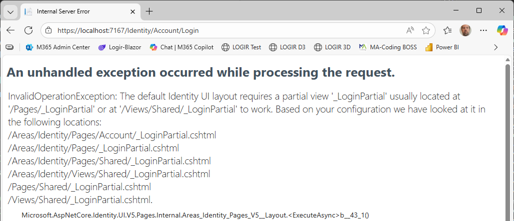
    /// caption
    Hiányzik a LoginPartial.cshtml
    ///

3. Hozzuk létre kézzel üres tartalommal a *Pages/Shared* könyvtárba. Fontos, hogy az **Add New Item..** -> **Razor View - Empty**-t válasszuk ne a page-et, mert egy nem oldal, hanem csak egy view és mindenképpen `_LoginPartial.cshtml` nevet adjuk neki. A létrehozott fájt tartalmát törölhetjük.

4. Indítsuk el az alkalmazást és ismért nyissuk meg a `/Identity/Account/Login` oldalt és lépjünk be az admin felhasználóval
    - admin@example.com
    - Password123!

5. Ha mindent jól csináltunk be is tudunk lépni. Hasonlóan a `/Identity/Account/Logout` vagy a `/Identity/Account/Register` oldal is működik, de a fejlécben nincs belépés / regisztráció gomb, amit pont a _LoginPartial.cshtml feladata lenne megjeleníteni. Így a következő feladatunk, hogy ezeket az oldalakat valahogy legeneráljuk.


## Identity Options

Tegyünk egy kis kitérőt, és nézzük meg, hogy az Identity nyújtotta lehetőségeket hogyan tudjuk konfigurálni az `IdentityOptions` beállításaival. Ezt megtehetjük úgy, hogy az `AddDefaultIdentity` / `AddIdentity` / `AddIdentityCore`-nek adjuk át a beállítást, úgy ahogy eddig, vagy a `Configure<IdentityOptions>` függvényt használjuk.

Állítsuk be a jelszóra, kitiltása, felhasználóra és belépésre  vonatkató szabályokat. Az alábbiban láthatunk egy javasolt beállítást ezekre az adatokra, a biztonságot szem előtt tartva.

``` csharp title="Program.cs" hl_lines="1"
builder.Services.AddDefaultIdentity(
// builder.Services.AddIdentityCore(
// builder.Services.AddIdentity<ApplicationUser, IdentityRole<int>>(
options =>
{
    // Password settings.
    options.Password.RequiredLength = 12;
    options.Password.RequireNonAlphanumeric = true;
    options.Password.RequireUppercase = true;
    options.Password.RequireLowercase = true;
    options.Password.RequireDigit = true;

    options.Password.RequiredUniqueChars = 6;

    // Lockout settings.
    options.Lockout.DefaultLockoutTimeSpan = TimeSpan.FromMinutes(10);
    options.Lockout.MaxFailedAccessAttempts = 5;
    options.Lockout.AllowedForNewUsers = true;

    // User settings.
    options.User.RequireUniqueEmail = true;
    options.User.AllowedUserNameCharacters =
    "abcdefghijklmnopqrstuvwxyzABCDEFGHIJKLMNOPQRSTUVWXYZ0123456789-._@+";

    // Sign‑in (only for production scenarios, for development you might want to disable these).
    options.SignIn.RequireConfirmedAccount = true;
    options.SignIn.RequireConfirmedEmail = true;
})
.AddEntityFrameworkStores<BookShopDbContext>()
.AddDefaultTokenProviders();
```

??? tip "A fenti beállítás a Configure<IdentityOptions>-t használva"
    Ha ezt a megoldást használjuk akkor az `AddIdentity`-nél ne állítsuk be ezt.
    ``` csharp title="Program.cs" hl_lines="1"
    builder.Services.Configure<IdentityOptions>(options =>
    {
        // Password settings.
        options.Password.RequiredLength = 12;
        options.Password.RequireNonAlphanumeric = true;
        options.Password.RequireUppercase = true;
        options.Password.RequireLowercase = true;
        options.Password.RequireDigit = true;

        options.Password.RequiredUniqueChars = 6;

        // Lockout settings.
        options.Lockout.DefaultLockoutTimeSpan = TimeSpan.FromMinutes(10);
        options.Lockout.MaxFailedAccessAttempts = 5;
        options.Lockout.AllowedForNewUsers = true;

        // User settings.
        options.User.RequireUniqueEmail = true;
        options.User.AllowedUserNameCharacters =
        "abcdefghijklmnopqrstuvwxyzABCDEFGHIJKLMNOPQRSTUVWXYZ0123456789-._@+";

        // Sign‑in (only for production scenarios, for development you might want to disable these).
        options.SignIn.RequireConfirmedAccount = true;
        options.SignIn.RequireConfirmedEmail = true;      
    });
    ```

## Identity oldalak létrehozása

A fenti példában láttuk, hogy ha a `_LoginPartial.cshtml` megvan (akár üresen) akkor már működik a DefaultUI. Most a feladat az lenne, hogy legeneráljunk pár fontos oldalt, hogy azt szükség esetén testre tudjuk szabni.
Erre két módszer van. Használhatjuk a Visual Studio grafikus felületét, ami nem fog jó kódot generálni és sok manuális módosítás szükséges, vagy .NET CLI-ből is generálhatjuk, ahol kevesebb módosítás szükséges.

### Grafikus felület

Visual Studioban az Idenetity-hez tartozó oldalakat le lehet generálni (scaffold), amit a Add -> New Scaffolded item... segítségével tehetünk meg. Itt először ki kell választani, hogy az Identity oldalakat szeretnénk generálni, majd kiválasztani, hogy mely oldalakat szeretnénk és megadni, hogy melyik DbContext-et használja.

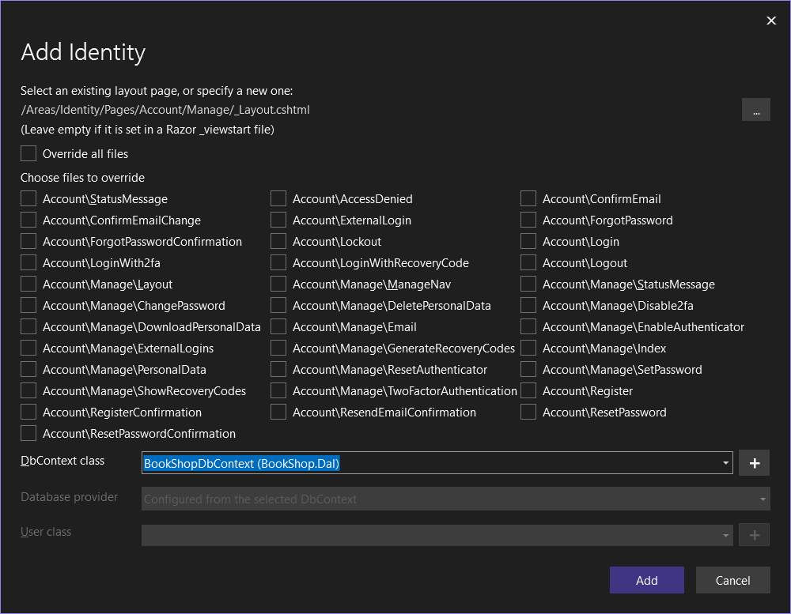
/// caption
Identity oldalak
///

Ki lehet próbálni, hogy milyen kódot generál, de sajnálatos módon a generátor nem fogja megtalálni helyesen a `BookShopDbContext`-et és a generált kódban a saját `ApplicationUser` osztály helyett mindenhol az `IdentityUser`-t fogja használni, amit kézzel kellene mindenhol javítani.

Fontos viszont hogy ha kipróbáljuk és nem akarjuk mindenhol átírni, akkor töröljük az összes generált kódot

- Areas könyvtár teljes tartalmát
- Ha létrehozza a `Pages/Shares/_LoginPartial.cshtml` akkor annak legalább a tartalmát.
- `Program.cs` fájlból a `using BookShop.Web.RazorPage.Areas.Identity.Data;` sort.

### .NET CLI

A másik megoldás, hogy a parancssorból a `aspnet-codegenerator` segítségével generáljuk ki az oldalakat.
Fontos, hogy a parancsot mindig a `BookShop.Web.RazorPage` projekt könyvtárából kell majd futtassuk!

1. Ehhez telepítsük fel a `dotnet-aspnet-codegenerator` csomagot.

    ``` powershell
    dotnet tool install -g dotnet-aspnet-codegenerator
    ```

2. A `BookShop.Web.RazorPage` projekt könyvtárából kell majd futtassuk a parancsot a `--help` kapcsolóval, hogy lássuk milyen opciókat adhatunk meg.

    ``` powershell
    dotnet aspnet-codegenerator identity --help 
    ```

3. Futtassuk úgy a parancsot, hogy az alapértelmezett oldalakat szeretnénk használni. Ez legenerálja a `_LoginPartial.cshtml`-t is, viszont mivel ilyen fájlunk már van (bár csak üres tartalommal) szóval töröljük. Sajnos a `--force` kapcsolót, hogy felülírja a már létező fájlokat itt nem működik :(.

    ``` powershell
    dotnet aspnet-codegenerator identity -dc BookShop.Dal.BookShopDbContext -u BookShop.Dal.Entities.ApplicationUser --useDefaultUI
    ```

4. A létrehozott kód persze nem tökéletes, az alábbi javítások szükségesek, hogy működjön az alkalmazás
    Az `Ares/Identity/Data` könyvtárat töröljük, mert ide létrehoz egy új DbContext-et, amire nincs szükség és az `ApplicationUser` osztályt is létrehozza. Hiába adjuk meg a DbContext-et és a User osztály típusát nem találja meg a generátor. Bár azzal, hogy a User osztály típusának `-u` megadtuk a `BookShop.Dal.Entities.ApplicationUser` legalább jó névvel hivatkozik rá, így ha töröljük a fájlt minden probléma megoldódik :)

    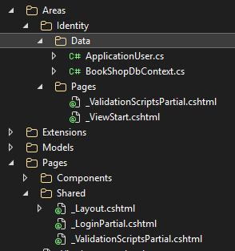
    /// caption
    Alapértelmezett UI-hoz generált oldalak
    ///

5. Ha ezzel elkészültünk, akkor már csak egy apróságot kell megtennünk, mégpedig a `_Layout` oldalra kitenni a Bejelentkezés és Regisztráció gombokat. Ehhez a Scaffolding elkészített nekünk egy `_LoginPartial` nézetet, és elegendő azt kitenni az oldalra, és az majd lekezelni, hogy éppen a Bejelentkezés vagy a Kijelentkezés gombot kell-e mutatni. A partial view-t a menüpontokat tartalmazó </ul> lezáró tag mögé tegyük, hogy jobbra legyen igazítva.

    ``` aspx-cs title="_Layout.cshtml" hl_lines="8"
    <div class="navbar-collapse collapse d-sm-inline-flex justify-content-between">
        <ul class="navbar-nav flex-grow-1">
            <li class="nav-item">
                <a class="nav-link text-dark" asp-area="" asp-page="/Index">Home</a>
            </li>
            @* ... *@
        </ul>
        <partial name="_LoginPartial" />
    </div>
    ```

6. Így már megjelenik a Register és Login vagy a Logoff gombok is. Ha testre szeretnénk szabni, akkor a `_LoginPartial.cshtml`-ben tudjuk ezt megtenni.

7. Ha több oldalt is testre szeretnénk szabni, akkor azt úgy tehetjük meg, hogy a `--files` kapcsoló mögött felsoroljuk azokat idézőjelek között, pontosvesszővel elválasztva az oldalakat, amit le szeretnénk generáltatni. A lehetséges fájlneveket megkapjuk ha a `--listFiles` kapcsolóval futtatva a parancsot.

    ``` powershell title="Leheséges fájlnevek listázása"
    dotnet aspnet-codegenerator identity --listFiles
    ```

    ``` powershell title="Register, Login... oldalak létrehozása"
    dotnet aspnet-codegenerator identity -dc BookShop.Dal.BookShopDbContext -u BookShop.Dal.Entities.ApplicationUser  --files "Account.Register;Account.Login;Account.Logout;Account.ConfirmEmail;Account._StatusMessage;Account.RegisterConfirmation"
    ```

## Egyedi UI

Ha a Default UI-t használjuk akkor minden oldal elérhető akkor is ha nem szerepel az oldal a kódunkban. Tehát ha csak bizonyos oldalakat szeretnénk használni, akkor el kell engedni a Default UI használatát és a szükséges oldalakhoz kell igazítani a konfigurációt. Az előző lépésben ezeket az oldalakat generáltuk le:

- *Account.Register*: Regisztrációs oldal, amit majd ki kell egészíteni a `DisplayName` tulajdonsággal.
- *Account.Login*: Bejelentkezés oldal
- *Account.Logout*: Kijelentkezés oldal
- *Account.RegisterConfirmation*: Ha a `options.SignIn.RequireConfirmedAccount = false`-ra van állítva, akkor nem használja ezt az oldalt, regisztráció után azonnal belépteti a felhasználót. Ha `true` az értéke akkor viszont erre az oldalra irányítja a felhasználót, ahol jelzi, hogy e-mailben megkapta a megerősítéshez szükséges adatokat.

    ??? info "Felületről is meg tudjuk erősíteni"
        
        /// caption
        A felületről is le tudjuk kattintani a megerősítést.
        ///

    ???+ warning "Production környezetbe ezt kapcsoljuk ki"
        Az `RegisterConfirmation.cshtml.cs`-ben az `OnGetAsync()` metódusban a `DisplayConfirmAccountLink = true;`-t kell módosítani, hogy ne jelenítse meg a jóváhagyás linket.

- *Account.ConfirmEmail*: Ezen az oldalon lehet megerősíteni az email címet, mert ennek az URL-jét küldi el emailben a felhasználónak regisztráció után.
- *Account._StatusMessage*: A ConfirmEmail használja.

1. Ha nincs szükség 2FA akkor elegendő az `AddIdentityCore` használata, de a `SingInManager`-t kézzel kell hozzáadni.

    ``` csharp title="Program.cs" hl_lines="1 3"
    builder.Services.AddIdentityCore<ApplicationUser>()
        .AddRoles<IdentityRole<int>>()
        .AddSignInManager()
        .AddEntityFrameworkStores<BookShopDbContext>();
    ```

2. Ha így elindítjuk az alkalmazást az betölt, de a Login és Register oldal is hibát dob

    - a **Login oldal** hiányolja a külső belépéses sütiket.
  
        ??? failure "No sign-out authentication handlers are registered"
            InvalidOperationException: No sign-out authentication handlers are registered. Did you forget to call AddAuthentication().AddCookie("Identity.External",...)?

    - a **Register oldal** pedig egy `IEmailSender` implementációt hiányol.  

        ??? failure "Unable to resolve service for IEmailSender"
            InvalidOperationException: Unable to resolve service for type 'Microsoft.AspNetCore.Identity.UI.Services.IEmailSender' while attempting to activate 'BookShop.Web.RazorPage.Areas.Identity.Pages.Account.RegisterModel'.

    - A hibaüzenet szerencsére részletesen leírja, hogy mit kell még beállítani, így az alábbi kódrészlettel könnyen orvosolhatjuk a problémát:

    ``` csharp title="Program.cs" hl_lines="6-7 13"
    builder.Services.AddIdentityCore<ApplicationUser>()
        .AddRoles<IdentityRole<int>>()
        .AddSignInManager()
        .AddEntityFrameworkStores<BookShopDbContext>();

    builder.Services.AddAuthentication()
        .AddCookie(IdentityConstants.ExternalScheme, o =>
        {
            o.Cookie.Name = IdentityConstants.ExternalScheme;
            o.ExpireTimeSpan = TimeSpan.FromMinutes(5);
        });

    builder.Services.TryAddTransient<IEmailSender, NoOpEmailSender>();
    ```

3. Ha nem szeretnénk a fentiek szerint küzdeni a beállításokkal akkor a legtutibb megoldás, ami mindent bekapcsol csak az `IEmailSender` implementációt kell beregisztrálni, hiszen ez az implementáció egyedi kell legyen. A későbbiekben készítünk is hozzá saját implementációt.

    ``` csharp title="Program.cs" hl_lines="1 6 8"
    builder.Services.AddIdentity<ApplicationUser, IdentityRole<int>>( options =>
        {
            options.SignIn.RequireConfirmedAccount = false;
        })
        .AddEntityFrameworkStores<BookShopDbContext>()
        .AddDefaultTokenProviders();

    builder.Services.TryAddTransient<IEmailSender, NoOpEmailSender>();
    ```

A fenti beállításokat használva már tényleg nem érjük el azokat az oldalakat, amiket nem generáltunk le.

### Validációs hibák

1. Ahhoz, hogy a validációs hibák illeszkedjenek a bootstrap stílushoz, meg kell adni, hogy a jquery validation a bootstrap-es CSS osztályokat (is-valid és is-invalid) használja. Ehhez készítsünk egy `validation.js` fájlt a `wwwroot/js` könyvtárban fájlt az alábbi tartalommal

    ``` js title="validation.js"
    var settings = {
        validClass: "is-valid",
        errorClass: "is-invalid"
    };

    $.validator.setDefaults(settings);
    $.validator.unobtrusive.options = settings;
    ```

2. Ezt követően már csak annyi dolgunk van, hogy a `_ValidationScriptsPartial.cshtml`-be hivatkozzuk be ezt a js fájlt is. Fontos, hogy a `Pages\Shares` alatt **és** az `Areas\Identity\Pages` könyvtárban is található 1-1 `_ValidationScriptsPartial.cshtml` fájl. Mind a kettőbe tegyük bele!

    ``` aspx-cs title="_ValidationScriptsPartial.cshtml" hl_lines="3"
    <script src="~/lib/jquery-validation/dist/jquery.validate.min.js"></script>
    <script src="~/lib/jquery-validation-unobtrusive/dist/jquery.validate.unobtrusive.min.js"></script>
    <script src="~/js/validation.js"></script>
    ```

3. Így már bootstrap alapú a validáció, viszont ha hiba van akkor az egész űrlap lentebb csúszik, hogy meg tudjon jelenni a hibaüzenet. Ezt kétféleképpen orvosolhatjuk.
    - A legegyszerűbb megoldás, hogyha csak a kötelezőséget ellenőrzünk, akkor nem jelenítünk meg hibaüzenetet. Ehhez annyit kell tenni, hogy az űrlapon az egyes inputokhoz rendelt `<span asp-validation-for` tageket kiszedjük. De sajnos ilyenkor az a hibaüzenet sem jelenik meg ami azt jelzi, ha érvénytelen az email cím.

    ``` aspx-cs title="Login.cshtml"
    <div class="form-floating mb-3">
        <input asp-for="Input.Email" class="form-control" autocomplete="username" aria-required="true" placeholder="name@example.com" />
        <label asp-for="Input.Email" class="form-label">Email</label>
        {-- <span asp-validation-for="Input.Email" class="text-danger"></span> --}
    </div>
    ```

    - A másik megoldás, hogy kicsit nagyobb helyet hagyunk az egyes inputok között (mb-4) és az `invalid-tooltip` CSS osztályt használjuk egy kis testreszabással. Ez a *password* mezőn állítsuk be, és akkor mindkét validáció látszódik.

    ``` aspx-cs title="Login.cshtml" hl_lines="1 4"
    <div class="form-floating mb-4">
        <input asp-for="Input.Password" class="form-control" autocomplete="current-password" aria-required="true" placeholder="password" />
        <label asp-for="Input.Password" class="form-label">Password</label>
        <span asp-validation-for="Input.Password" class="invalid-tooltip"></span>
    </div>
    ```

    ``` css title="site.css"
    .invalid-tooltip {
        width: 100%;
        margin-top: 0;
        padding-top: 0;
        padding-bottom: 0;
        font-size: .75rem;
    }
    ```

??? success "Elkészült validációs hibák"
    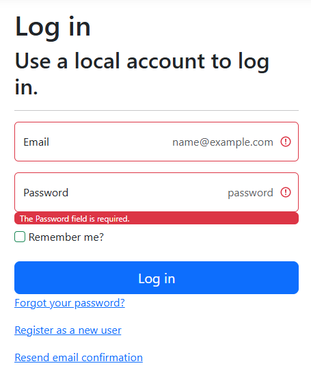
    /// caption
    A kétféle validációs hiba
    ///

### Saját email sender

Email küldéséhez szükségünk van egy SMTP szerverre, ami lehet a google szolgáltatása is, vagy a fejlesztési célokra kitalált ál email küldő az [Ethereal](https://ethereal.email/) is. A gyakorlaton mi ez utóbbit fogjuk használni, mert a regisztrációja nagyon egyszerű.

Nyissuk meg a böngészőben a https://ethereal.email/create oldalt és ott kattintsunk a *Create Ethereal Accont* gombra, ami azonnal létre is hozza a felhasználónkat, melynek adatai az alábbi ábrán látható. Figyelem, véletlen adatokkal hozza létre, így az adatok mindenkinél mások lehetnek!


/// caption
Etheral account adatai
///

Az ábrán látható adatokat kell megadni ahhoz, hogy email tudjunk küldeni ezzel az SMTP szolgáltatással. Ehhez először vegyünk fel egy osztályt EMailSettings névvel és az alábbi kóddal.

``` csharp title="Settings/EmailSetting.cs"
namespace BookShop.Web.RazorPage.Settings;

public class EmailSettings
{
    public string Mail { get; set; } = null!;
    public string DisplayName { get; set; } = null!;
    public string Password { get; set; } = null!;
    public string Host { get; set; } = null!;
    public int Port { get; set; }
}
```

A fenti osztály fogja tárolni az SMTP szervere beállításait, azonban a konkrét értékeket a config fájlba szeretnénk tárolni, így az `appsettings.Developement.json`-ba vegyük fel az alábbi részt. Az adatok az ethereal oldalról származnak. Fontos, hogy a saját adatainkkal töltsük fel a fájlt, mert egyébként nem fogjuk tudni az Ethereal oldalán megnézni az emaileket.

```json title="appsettings.Developement.json" hl_lines="9-15"
{
  "DetailedErrors": true,
  "Logging": {
    "LogLevel": {
      "Default": "Information",
      "Microsoft.AspNetCore": "Warning"
    }
  },
  "EMailSettings": {
    "Mail": "hilbert57@ethereal.email",
    "DisplayName": "Hilbert Blick",
    "Password": "5czSsn3CmAsKjgyykP",
    "Host": "smtp.ethereal.email",
    "Port": 587
  }
}
```

Ezt követően már csak az `IEmailSender` interfészt kell megvalósítani, hogy ténylegesen ki tudjuk küldeni a leveleket, amihez hozzuk létre az EmailSender osztályt az alábbi implementációval:

``` csharp title="Services/EmailSender.cs"
using BookShop.Web.RazorPage.Settings;
using Microsoft.AspNetCore.Identity.UI.Services;
using Microsoft.Extensions.Options;
using System.Net.Mail;

namespace BookShop.Web.RazorPage.Services;

public class EmailSender(IOptions<EmailSettings> emailSettingsOptions, ILogger<EmailSender> logger) : IEmailSender
{
    private readonly EmailSettings emailSettings = emailSettingsOptions.Value;

    public async Task SendEmailAsync(string email, string subject, string htmlMessage)
    {
        var client = new SmtpClient(emailSettings.Host, emailSettings.Port)
        {
            EnableSsl = true,
            Credentials = new System.Net.NetworkCredential(emailSettings.Mail, emailSettings.Password)
        };

        var from = new MailAddress(emailSettings.Mail, emailSettings.DisplayName, System.Text.Encoding.UTF8);
        var to = new MailAddress(email);

        var message = new MailMessage(from, to)
        {
            Body = htmlMessage,
            BodyEncoding = System.Text.Encoding.UTF8,
            IsBodyHtml = true,
            Subject = subject,
            SubjectEncoding = System.Text.Encoding.UTF8
        };

        await client.SendMailAsync(message);

        if (logger.IsEnabled(LogLevel.Information))
            logger.LogInformation("Email sent to: {to}", to.Address);
    }
}
```

A Program.cs-ben állítsuk be, hogy az appsettings alapján töltse fel a EMailSettings osztályt, és a saját e-mail sender implementációnkat regisztráljuk be a DI-ba a `NoOpEmailSender` helyett.

``` csharp title="Program.cs" hl_lines="2 5"
// builder.Services.TryAddTransient<IEmailSender, NoOpEmailSender>();
builder.Services.TryAddTransient<IEmailSender, EmailSender>();

// Reads the email settings from the configuration and registers it in the DI container.
builder.Services.Configure<EmailSettings>(builder.Configuration.GetSection("EMailSettings"));
```

## Regisztrációs oldal testreszabása

Ha kipróbáljuk a regisztrációs oldalt, az még nem működik, mert a `DisplayName`-et nem kérjük be a felületen.

1. Nyissuk meg az `Areas.Identity.Pages.Account/Registe.cshtml.cs` fájlt és az `InputModel`-be vegyük fel a DisplayName-et, illetve az `OnPostAsync`-ba állítsuk is be.

    ``` csharp title="Register.cshtml.cs - InputModel" hl_lines="8-10"
    public class InputModel
    {
        [Required]
        [EmailAddress]
        [Display(Name = "Email")]
        public string Email { get; set; }

        [Required]
        [Display(Name = "Display name")]
        public string DisplayName { get; set; }

        [Required]
        [StringLength(100, ErrorMessage = "The {0} must be at least {2} and at max {1} characters long.", MinimumLength = 6)]
        [DataType(DataType.Password)]
        [Display(Name = "Password")]
        public string Password { get; set; }

        [DataType(DataType.Password)]
        [Display(Name = "Confirm password")]
        [Compare("Password", ErrorMessage = "The password and confirmation password do not match.")]
        public string ConfirmPassword { get; set; }
    }
    ```

    - Figyeljük meg, hogy a modell osztályban az egyes tulajdonságok előtt lévő attibútumokkal állítjuk be, hogy melyik megző kütelező, vagy hogy a `ConfirmPassword` meg kell egyezzen a `Password`-del. Tehát attribútum alapú validációt használunk.

    ``` csharp title="Register.cshtml.cs - OnPostAsync" hl_lines="10"
    public async Task<IActionResult> OnPostAsync(string returnUrl = null)
    {
        returnUrl ??= Url.Content("~/");
        ExternalLogins = (await _signInManager.GetExternalAuthenticationSchemesAsync()).ToList();
        if (ModelState.IsValid)
        {
            var user = CreateUser();

            // Set the display name for the user.
            user.DisplayName = Input.DisplayName;

            await _userStore.SetUserNameAsync(user, Input.Email, CancellationToken.None);
            await _emailStore.SetEmailAsync(user, Input.Email, CancellationToken.None);
            var result = await _userManager.CreateAsync(user, Input.Password);

        // ...
        }

        // If we got this far, something failed, redisplay form
        return Page();
    }
    ```

    - Sikeres validáció után hozzuk létre a felhasználót a `CreateUser`-re, majd ezt követően állítjuk be a `DisplayName`-et. Külön függvények segítik az `UserName` és `Email` beállítását, ami után a `_userManager.CreateAsync()` hozza ténylegesen létre a felhasználót a megadott jelszóval.

2. Ezt követően a felülere is tegyük ki az email cím alá a szövegdobozt, amiben a felhasználó meg tudja adni a nevét.

    ``` aspx-cs title="Register.cshtml" hl_lines="10-14"
    <form id="registerForm" asp-route-returnUrl="@Model.ReturnUrl" method="post">
        <h2>Create a new account.</h2>
        <hr />
        <div asp-validation-summary="ModelOnly" class="text-danger" role="alert"></div>
        <div class="form-floating mb-3">
            <input asp-for="Input.Email" class="form-control" autocomplete="username" aria-required="true" placeholder="name@example.com" />
            <label asp-for="Input.Email">Email</label>
            <span asp-validation-for="Input.Email" class="text-danger"></span>
        </div>
        <div class="form-floating mb-3">
            <input asp-for="Input.DisplayName" class="form-control" aria-required="true" placeholder="" />
            <label asp-for="Input.DisplayName">Display name</label>
            <span asp-validation-for="Input.DisplayName" class="text-danger"></span>
        </div>
        <div class="form-floating mb-3">
            <input asp-for="Input.Password" class="form-control" autocomplete="new-password" aria-required="true" placeholder="password" />
            <label asp-for="Input.Password">Password</label>
            <span asp-validation-for="Input.Password" class="text-danger"></span>
        </div>
        <div class="form-floating mb-3">
            <input asp-for="Input.ConfirmPassword" class="form-control" autocomplete="new-password" aria-required="true" placeholder="password" />
            <label asp-for="Input.ConfirmPassword">Confirm Password</label>
            <span asp-validation-for="Input.ConfirmPassword" class="text-danger"></span>
        </div>
        <button id="registerSubmit" type="submit" class="w-100 btn btn-lg btn-primary">Register</button>
    </form>
    ```

3. Próbáljuk ki az oldalt. Mivel a korábbiakban létrehoztuk Scaffoldinggal a *ConfirmEmail* és *_StatusMessage* oldalakat miden működni fog.  
Viszont ha megnézzük a `Register.cshtml.cs` fájlban a kódot, akkor azt vehetjük érszre, hogy akkor is legenerálja a jóváhagyáshoz szükséges linket (ami null lesz ha nincs a *ConfirmEmail* legenerálva), ha nem kell kiküldeni a megerősítést a felhasználónak.

??? tip "Csak akkor generáljuk a jóváhagyó linket ha szükséges"
    - A link generálást elég lenne akkor futtatni, ha tényleg ki kell küldeni a linket. Az alapérelmezett implementációban `DefaultUserConfirmation` a logika az, hogy a megerősített email nézi `IsEmailConfirmedAsync`. Tehát az egész email generálásos részt bele kell tenni az `if (_userManager.Options.SignIn.RequireConfirmedAccount)` alá.

    ``` csharp title="Register.cshtml.cs" hl_lines="5-6 19-20"
    if (result.Succeeded)
    {
        _logger.LogInformation("User created a new account with password.");

        if (_userManager.Options.SignIn.RequireConfirmedAccount)
        {
            var userId = await _userManager.GetUserIdAsync(user);
            var code = await _userManager.GenerateEmailConfirmationTokenAsync(user);
            code = WebEncoders.Base64UrlEncode(Encoding.UTF8.GetBytes(code));
            var callbackUrl = Url.Page(
                "/Account/ConfirmEmail",
                pageHandler: null,
                values: new { area = "Identity", userId = userId, code = code, returnUrl = returnUrl },
                protocol: Request.Scheme);

            await _emailSender.SendEmailAsync(Input.Email, "Confirm your email",
                $"Please confirm your account by <a href='{HtmlEncoder.Default.Encode(callbackUrl)}'>clicking here</a>.");

        // if (_userManager.Options.SignIn.RequireConfirmedAccount)
        // {
            return RedirectToPage("RegisterConfirmation", new { email = Input.Email, returnUrl = returnUrl });
        }
        else
        {
            await _signInManager.SignInAsync(user, isPersistent: false);
            return LocalRedirect(returnUrl);
        }
    }
    ```

4. Regisztráljunk be egy új felhasználót az alábbi adatokkal

    - email: test@example.com
    - displayName: Teszt Elek
    - password: Password123!

??? success "Sikeres regisztráció"
    1. Felhasználó létrehozása
    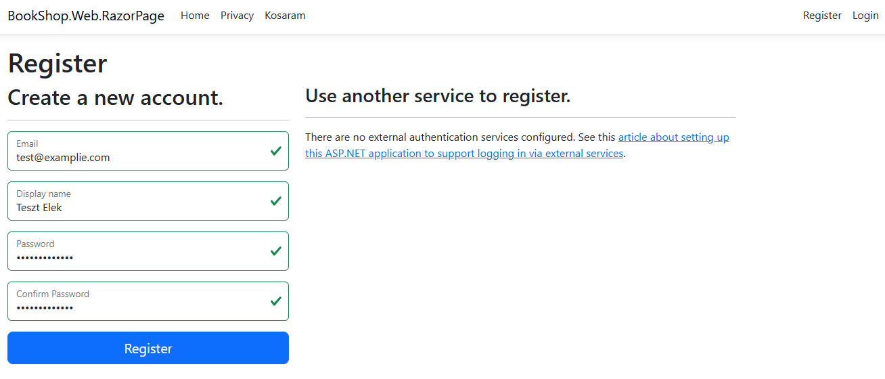

    2. Megerősítés szükséges. Csak ha be van kapcsolva a `options.SignIn.RequireConfirmedAccount = true` akkor ez az oldal fogad. Egyébként beléptet.
    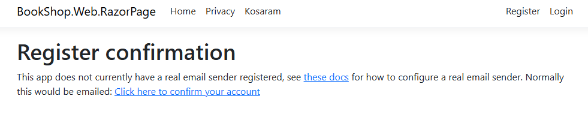

    3. Megérkezik a megerősítő email
    
    
    4. Megerősítő email tartalma, benne a linkkel.
    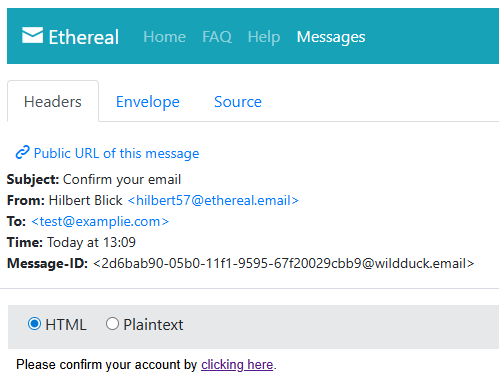

    5. Sikeres megerősítés
    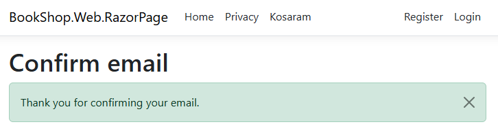

## Jogosultság ellenőrzés

Azzal, hogy van felhasználó és jogosultság kezelésünk, már be tudjuk állítani, hogy egyes funkciók csak belépett felhasználóknak, vagy adott szerepkörnek legyenek csak elérhetők.

1. Először a `Book.cshtml.cs` oldalon állítsuk be, hogy  a kosárba tételkor szerver oldalon ellenőrizzük, hogy be van-e lépve a felhasználó. Ha nincs akkor 401-el (UnAuthorized)-ot adjunk vissza.

    ``` csharp title="Book.cshtml.cs" hl_lines="3-4"
    public async Task<IActionResult> OnPostAddToCartAsync(int bookId) 
    {
        if(User.Identity?.IsAuthenticated != true)
            return Unauthorized();

        // ...
    }
    ```

2. Ugyanezt állítsuk be a komment létrehozásánál is.

    ``` csharp title="Book.cshtml.cs" hl_lines="3-4"
    public async Task<IActionResult> OnPostCreateCommentAsync()
    {
        if (User.Identity?.IsAuthenticated != true)
            return Unauthorized();
        
        // ..
    }
    ```

3. Próbáljuk ki, hogy tényleg hibaoldalt kapunk.
4. Rejtsük el a gombokat (új komment, kosárba és új ajánló), ha nincs belépve a felhasználó.

    ``` aspx-cs title="Book.cshml - Kosárba" hl_lines="1"
    @if (User.Identity?.IsAuthenticated == true)
    {
        <form asp-page-handler="AddToCart">
            <input type="hidden" name="bookId" value="@Model.Book.Id" />
            <button class="btn btn-outline-primary">Korárba</button>
        </form>
    }
    ```

    ``` aspx-cs title="Book.cshml - Új ajánló" hl_lines="1"
    @if (User.Identity?.IsAuthenticated == true)
    {
        <a asp-page="CreateComment" asp-route-bookId="@Model.Book.Id">Új ajánló írása &raquo;</a>
    }
    ```

    ``` aspx-cs title="Book.cshml - Új komment" hl_lines="1-2 21-25"
    @if (User.Identity?.IsAuthenticated == true)
    {
        <form asp-page-handler="CreateComment">
            @* Hidden field bound to NewComment.BookId so it will be set for the click handler. *@
            <input type="hidden" asp-for="NewComment.BookId" />

            <div class="d-flex">
                <div class="d-flex flex-column align-items-center flex-shrink-0 me-3">
                    <i class="bi bi-person-square fs-1"></i>
                    <div class="text-muted">@(DateTime.Now.ToShortDateString())</div>
                    <div class="text-muted">@(DateTime.Now.ToShortTimeString())</div>
                </div>

                <textarea class="w-100" rows="3" asp-for="NewComment.Text"></textarea>
            </div>

            <div class="d-flex justify-content-end my-2">
                <button type="submit" class="btn btn-outline-primary">Hozzászólok</button>
            </div>
        </form>
    }
    else
    {
        <div>Komment írásához be kell jelentkezned!</div>
    }
    ```

5. Ezt követően már a gombok sem látszódnak.

### Kosaram oldal láthatóság

Tüntessük el a kosaram oldal linkjét is ha nincs belépve a felhasználó.

1. A `_Layout.cshtml` oldalon rejtsük el a menüpontot ha nincs belépve a felhasználó.

    ``` aspx-cs title="_Layout.cshtml"
    @if( User.Identity?.IsAuthenticated == true )
    {
        <li class="nav-item position-relative">
                <a class="nav-link text-dark" asp-area="" asp-page="/Cart">
                Kosaram
                @if (Context.Session.Get<List<CartItem>>(BookShopConstants.CartSessionKey)?.Any() == true)
                {
                    <span class="position-absolute start-100 translate-middle badge rounded-pill bg-danger">
                        @(Context.Session.Get<List<CartItem>>(BookShopConstants.CartSessionKey)?.Sum(x => x.Count) ?? 0)
                        <span class="visually-hidden">elem a kosárban</span>
                    </span>
                }
            </a>
        </li>
    }
    ```

2. A code behind-ban is védjük le, hogy csak belépett felhasználó hívhassa. Itt már használhatjuk az `[Authorize]` attribútumot, mert az egész oldalt nem kell elérni.
    ``` csharp title="Cart.cshtml.cs"
    [Authorize]
    public class CartModel(IBookService bookService) : PageModel
    ```

### Admin oldalak láthatósága

Az alkalmazáshoz, különbőző feltöltő és szerkesztő oldalakat is kell készíteni a könyvekhez, kategóriákhoz, vagy akár a felhasználólókhoz. Annak érdekében, hogy ezeknem az "Admin" oldalaknak a jogosultság kezelését egyszerűen tudjuk beállítani egy új módszerrel ismerkedünk meg.

1. Először a layout oldalra a navigációs menübe vegyük fel a *Kategóriák szerkesztése*, *Könyvek szerkesztése*, *Felhasználók kezelése* linkeket. Azonban mivel ez sok helyet foglal tegyük az egészet az Adminisztráció legördülőbe. Ehhez az alábbiak szerint módosítsuk a layout oldalt.

    ``` aspx-cs title="_Layout.cshtml" hl_lines="4-25"
    <ul class="navbar-nav flex-grow-1">
        @* Other links *@

        @if (User.IsInRole("Admin"))
        {
            <li class="nav-item dropdown">
                <a class="nav-link dropdown-toggle" href="#" id="navbarAdmin" role="button" data-bs-toggle="dropdown" aria-expanded="false">
                    Adminisztráció
                </a>
                <ul class="dropdown-menu" aria-labelledby="navbarAdmin">
                    <li>
                        <a class="dropdown-item" asp-area="" asp-page="/Admin/ManageCategories">Kategóriák</a>
                    </li>
                    <li>
                        <a class="dropdown-item" asp-area="" asp-page="/Admin/ManageBooks">Könyvek</a>
                    </li>
                    <li>
                        <hr class="dropdown-divider">
                    </li>
                    <li>
                        <a class="dropdown-item" asp-area="" asp-page="/Admin/ManageUsers">Felhasználók</a>
                    </li>
                </ul>
            </li>
        }
    </ul>
    <partial name="_LoginPartial" />
    ```

2. Amint látható az adminisztrációs oldalakat egy `Admin` könyvtárba szervezzük, hogy egyszerűbb legyen majd az elérés korlátozása. Ezen felül figyeljük meg, hogy ezt a menüpontot csak akkor érheti el a felhasználó, ha ő is benne van az `Admin` szerepkörben. Hozzuk is létre a szükséges oldalakat a `Pages/Admin` könyvtárban.

    - Pages/Admin/ManageBooks.cshtml
    - Pages/Admin/ManageCategories.cshtml
    - Pages/Admin/ManageUsers.cshtml

    ??? success "Admin menüpontok"
        
        /// caption
        Adminisztrációs menüpontok
        ///

3. Ha így kipróbáljuk az alkalmazást egy nem adminisztrátor felhasználóval, akkor a menüpontot nem fogjuk látni, de ha ismerjük az URL-t akkor az oldal betölt. Ez egy komoly hiba, mert mindig védeni kell a backend oldali funkciót is, az nem ad biztonságot, hogy a felülten elrejtjük a linket.
4. Állítsuk be, hogy a `Pages/Amin` könyvtár tartalmát csak `Admin` szerepkörben lévő felhasználók érhessék el. Ehhez létrehozunk egy policy-t, ami megköveteli, hogy a felhasználó benne legyen az adott szerepkörben. Ehhez az alábbi kódrészletet kell beletenni a `Program.cs`-be a `RequestContext` DI-ba regisztrálása után.

    ``` csharp title="Program.cs"
    builder.Services.AddAuthorizationBuilder()
        .AddPolicy("RequireAdminRole", policy => policy.RequireRole("Admin"));

    builder.Services.AddRazorPages(options =>
    {
        options.Conventions.AuthorizeFolder("/Admin", "RequireAdministratorRole");
    });
    ```

5. Hasonló konvenció alapú jogosultság kezelést a [hivatalos dokumentációban](https://learn.microsoft.com/en-us/aspnet/core/security/authorization/razor-pages-authorization?view=aspnetcore-10.0) tekinthetjük meg.

6. Így már az oldalt nem lehet elérni, de a login oldalra sem tud átirányítani, mert azt nem a megfelelő helyen keresi, így 404-es hibaoldalt kapunk. A megoldáshoz a `Program.cs`-ben az `AddRazorPages` (amit az előbb módosítottunk) mögé illesszük be az alábbi kódot.

    ``` csharp title="Program.cs"
    builder.Services.ConfigureApplicationCookie(options =>
    {
        options.Cookie.Name = ".IdentityNet10.Auth";
        options.Cookie.HttpOnly = true;
        options.Cookie.SecurePolicy = CookieSecurePolicy.Always;
        options.Cookie.SameSite = SameSiteMode.Lax; // or Strict for pure server‑rendered sites

        options.LoginPath = "/Identity/Account/Login";
        options.LogoutPath = "/Identity/Account/Logout";
        options.AccessDeniedPath = "/Identity/Account/AccessDenied";

        options.SlidingExpiration = true;
        options.ExpireTimeSpan = TimeSpan.FromMinutes(5);
    });
    ```

## Önálló feladat: Profil oldalak (opcionális)

!!! example "Önálló feladat: Profil oldalak"
    - Generálja le a profil adatokat szerkesztő oldalakat is, ahol a felhasználó meg tudja változtatni a személyed adatait, email címét, jelszavát, vagy a 2FA adatokat.
    

### 3rd party login

#### App registration (GUI)

Nagy valószínűséggel ez a megoldás a BME tenantban nem használható, mert részlegesen letiltották.

1. Ahhoz, hogy Microsoft Accounttal is be lehessen lépni be kell regisztrálnunk az alkalmazást az [Azure portálon](https://portal.azure.com/#blade/Microsoft_AAD_RegisteredApps/ApplicationsListBlade), ahol a fent található *Új regisztráció*-ra kattintva tudunk új alkalmazást regisztrálni. Ez láthatjuk az alábbi ábrán.

    
    /// caption
    Azure App registrations
    ///

2. Adjuk meg az alkalmazás adatait (ha elérhető a webes felület). Érdemes megpróbálni a közvetlen linket, mert akkor lehet, hogy engedi: [Új alkalmazás regisztrálás](https://portal.azure.com/#view/Microsoft_AAD_RegisteredApps/CreateApplicationBlade/quickStartType~/null/isMSAApp~/false)

    - Alkalmazás neve
    - Kik érhetik el az alkalmazást
    - Milyen URL-re kell visszairányítani a bejelentkezés után. Ide az alkalmazás URL + a /signin-microsoft -ot kell megadni. http://localhost:5001/signin-microsoft és a https://localhost:44329/signin-microsoft fontos, hogy a HTTPS-es URL-t is megadjuk!
    - Végül kattintsunk a Regisztráció gombra.

    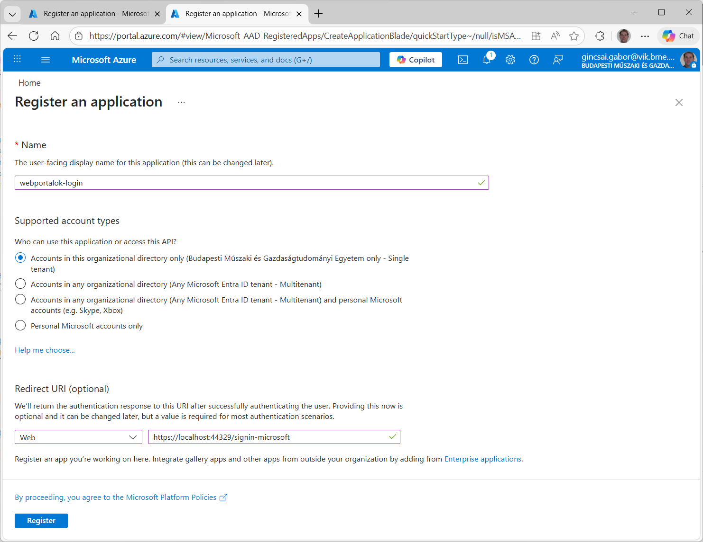
    /// caption
    Új alkalmazás regisztráció
    ///

3. Majd készítsünk hozzá privát kulcsot is

    
    /// caption
    App registration beállítása
    ///

#### App registration (powershell)

Sajnálatos módon a BME Azure-ban ezt a webes felületet már nem lehet elérni, kis trükközéssel még a létrehozás kijátszható, de már beállítani nem tudjuk.

1. Indítsunk el egy **VS Code**-ot
2. Telepítsük fel az **Azure Application Registration** extensiont, majd indítsuk újra a VS Code-ot.

    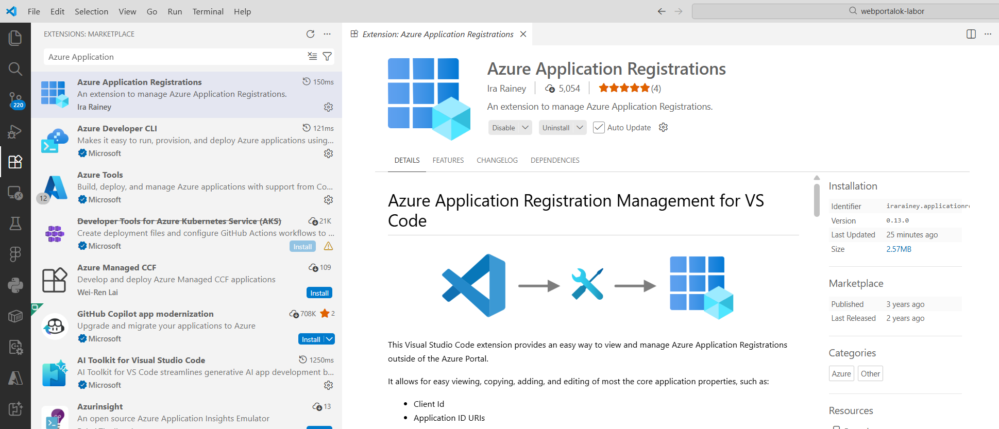
    /// caption
    Azure Application Registration extension
    ///

3. Ezt követően nyissuk meg bal oldalon a kiegészítőt, és lent az *Application Registration* rész kell nekünk.
4. Ha nincs feltelepítve, akkor telepísük fel az *Azure CLI*-t. Ehhez a terminal ablakban futtassuk az alábbi parancsot.

    ``` powerShell
    winget install --exact --id Microsoft.AzureCLI
    ```

5. Lépjünk be *Azure CLI*-vel, ehhez kérni fogja a TenantId-t ami **6a3548ab-7570-4271-91a8-58da00697029**. Illetve fel fog dobni egy böngésző ablakot a bejelentkezéshez, ahol meg kell adni a BME-s felhasználót.

6. Belépés után már az *Application Registration* mellett a **+** gombra kattinva létre is tudjuk hozni az új regisztrációt.
    - Először válasszuk ki, hogy kik léphetnek be. Válasszuk a *Multi Tenants* opciót.
        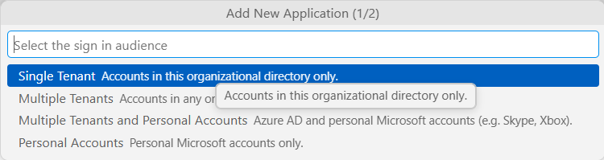
        /// caption
        Bejelentkezési mód megadása
        ///
    - Majd adjuk meg az alkalmazás nevét.
        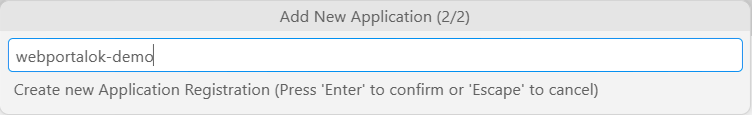
        /// caption
        Application név megadása
        ///
    - Végül frissítsük az *Application Registration* listát.

7. Ha mindent jól csináltuk a listában le tudjuk nyitni az új App registration-t, ahonnan a *ClientId*-ra lesz szükségünk, illetve be kell állítania *Redirect URIs*-t és a Credentials alatt található Client Secrets-ben kell egy új secretet létrehozni.

    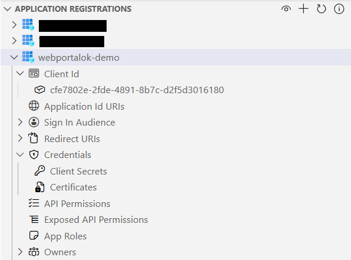
    /// caption
    Regisztrált alkalmazás Azure-ben.
    ///

8. A *Redirect URIs* alatt a *Web* jobb klikk -> Add és adjuk meg a *https://localhost:44329/signin-microsoft* URI-t.

9. Majd hozzuk létre az új secretet. (Client Secrets -> jobb klikk -> Add)
    - Első lépésként description-t kér, ahova írjuk be a 'Login-secret'-et vagy bármit ez csak egy leírás, hogy több titok esetén tudjuk melyiket mire használjuk.
    - Második lépésként pedig a lejárat dátumát kell megadni.

    !!! danger "Secret értéke csak a létrehozáskor érhető el"
        A secret értéke automatikusan a vágólapra került létrehozáskor és később az értékét már nem lehet kiolvasni! Így mensük el, hogy később ne kelljen újat létrehozni!

10. Törölni is tudjuk a titkokat, vagy akár az egész App registration-t, csak arra kell figyelni, hogy ha a jobb klikk -> delete-re kattintunk akkor utána a jobb alsó sarokban rákérdez, hogy valóban törölni szeretnénk-e. Ott kell megerősíteni a törlést.

### MS Auth hozzáadása a projekthez

Belépéshez szükségünk van egy harmadik fél által nyújtott authentikációs mechanizmusra. A legtöbb ilyen megoldás egyszerűen egy middleware beékelését jelenti a rendszerbe, ahol a külső providerrel kommunikál.

1. A Microsoft Account használatához a `Microsoft.AspNetCore.Authentication.MicrosoftAccount` NuGet packaget kell feltelepíteni a Webes projekthez. Ügyeljünk, hogy a megfelelő verziót válasszuk belőle, ami az ASP.NET Core verzióval megegyezik.
2. Majd módosítsuk a DI konfigurációt, hogy az authentikáció Microsoft Accountot (is) használjon. Ehhez másoljuk be az alábbi kódrészletet a `Program.cs`-be az `AddIdentity` után.

    ``` csharp title="Program.cs"
    builder.Services.AddAuthentication().AddMicrosoftAccount(options =>
    {
        options.ClientId = builder.Configuration["Authentication:Microsoft:ClientId"] ?? throw new InvalidOperationException("Microsoft ClientId not found in configuration.");
        options.ClientSecret = builder.Configuration["Authentication:Microsoft:ClientSecret"] ?? throw new InvalidOperationException("Microsoft ClientSecret not found in configuration.");
    });
    ```

3. A kódba nem égettük bele a `ClientId`-t és a `ClientSecret`-et (ezeket hoztuk létre az App registrationnél), hanem az `appsettings.Developement.json`-ből olvassuk ki. Ezért oda fel kell venni az alábbi kódrészletet.  
**Fontos**, hogy a `ClientId` és `ClientSecret` értéket a saját App registration-ből kell venni.

    ``` json title="appsettings.Developement.json"
    "Authentication": {
        "Microsoft": {
        "ClientId": "cfe7...",
        "ClientSecret": "9f..."
        }
    }
    ```

4. Ha elindítjuk az alkalmazást, akkor a Login oldalon megjelenik a külső hitelesítés szolgáltatóknál a Microsoft gomb. Ha rákattinva nem történik semmi, akkor létre kell hozni Scaffoldinggal ay `ExternalLogin` oldalt.

    ``` powershell
    dotnet aspnet-codegenerator identity -dc BookShop.Dal.BookShopDbContext -u BookShop.Dal.Entities.ApplicationUser  --files "Account.ExternalLogin"
    ```

    !!! failure "Hibásan generált fájlok törlése"
        Ügyeljünk rá, hogy ilyenkor a `Data` könyvtárat törüljük kell és a `Program.cs`-ben ha mégegszer regisztrálja a DbContext-et akkor azt is töröljük.

6. Ezt követően a Microsoft gombra kattinva már átirányít a Microsoft fiókos belépés oldalára, ahol a BME-s felhasználónkkal tudunk belépni.

    
    /// caption
    Szükséges engedélyek bekérése
    ///

6. Ha beleegyeztünk a jogosultságok megadásába, akkor visszairányít az alkalmazásunkba az `ExternalLogin`, ahol már elérjük a külső azonosításból rendelkezésre álló adatokat mint az email cím.

    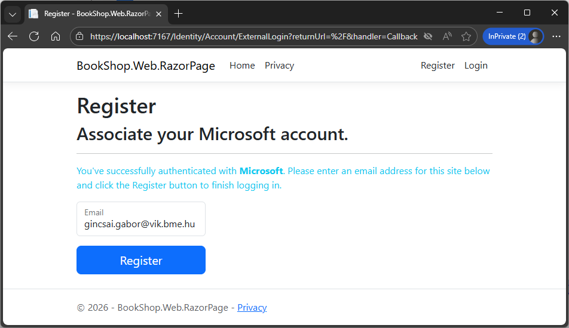
    /// caption
    ExternalLogin oldal betöltése
    ///

7. Ha rákattintunk a Register gombra, akkor viszont elszáll a kód, mert a `DisplayName` nincs megadva.

## Önálló feladat: ExternalLogin kiegészítése

!!! example "Önálló feladat: DisplayName felvétele az `ExternalLogin` oldalra"
    - A kód behindban az InputModel-be vegye fel a `DisplayName`-et
    - Az `OnPostConfirmationAsync` állítsa be a `user`-et a `DisplayName`-et.
    - Módosítsa az `ExternalLogin.cstml` oldal kódját úgy, hogy az kötelezően bekérje a `DisplayName` értékét is.


/// caption
A külső belépés után bekéri a felhasználó nevét is.
///

??? tip "Segítség"

    - Input modell kiegészítése
        ``` csharp title="ExternalLogin.cshtml.cs - Input model" hl_lines="7-8"
        public class InputModel
        {
            [Required]
            [EmailAddress]
            public string Email { get; set; }

            [Required]
            public string DisplayName { get; set; }
        }
        ```

    - DisplayName elmentése
        ``` csharp title="ExternalLogin.cshtml.cs - OnPostConfirmationAsync" hl_lines="15"
        public async Task<IActionResult> OnPostConfirmationAsync(string returnUrl = null)
        {
            returnUrl = returnUrl ?? Url.Content("~/");
            // Get the information about the user from the external login provider
            var info = await _signInManager.GetExternalLoginInfoAsync();
            if (info == null)
            {
                ErrorMessage = "Error loading external login information during confirmation.";
                return RedirectToPage("./Login", new { ReturnUrl = returnUrl });
            }

            if (ModelState.IsValid)
            {
                var user = CreateUser();
                user.DisplayName = Input.DisplayName;

                await _userStore.SetUserNameAsync(user, Input.Email, CancellationToken.None);
                await _emailStore.SetEmailAsync(user, Input.Email, CancellationToken.None);

                var result = await _userManager.CreateAsync(user);
        ```

    - Felület kiegészítése
        ``` aspx-cs title="ExternalLogin.cshtml"
        <div class="form-floating mb-3">
            <input asp-for="Input.DisplayName" class="form-control" placeholder="Please enter your name." />
            <label asp-for="Input.DisplayName" class="form-label"></label>
            <span asp-validation-for="Input.DisplayName" class="text-danger"></span>
        </div>
        ```

## GDPR

Az ASP.NET a GDPR szabályozás betartásához is nyújt segítséget. Az alábbi linken például látható, hogy milyen egyszerűen lehet a sütik használatát elfogadtattni.

[ASP.NET támogatás a GDPR-hoz](https://learn.microsoft.com/en-us/aspnet/core/security/gdpr?view=aspnetcore-10.0)

## Migrációk automatikus futtatása

??? tip "Middleware adatbázis migrációk futtatásához development módban"
    Fejlesztés közben gyakran módosul az Entity Framework modell és ilyenkor a migráció generálása után kézzel kell kiadni az `Update-Database` parancsot, ha migrációs hiba miatt nem indul az alkalmazást. Ebben tud segíteni a `UseMigrationsEndPoint`, melynek használatához a `Microsoft.AspNetCore.Diagnostics.EntityFrameworkCore` NuGet package-et kell hozzáadni a Webes projekthez.

    ``` csharp title="Program.cs"
    if (app.Environment.IsDevelopment())
    {
        // Processes requests to execute migrations operations
        app.UseMigrationsEndPoint();
    }
    ```
