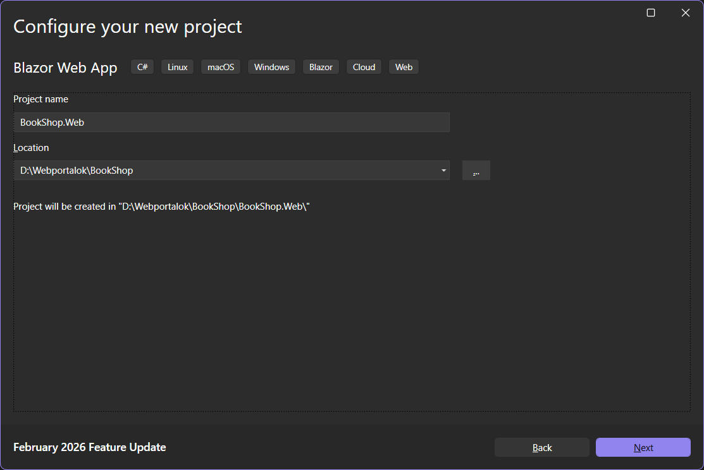
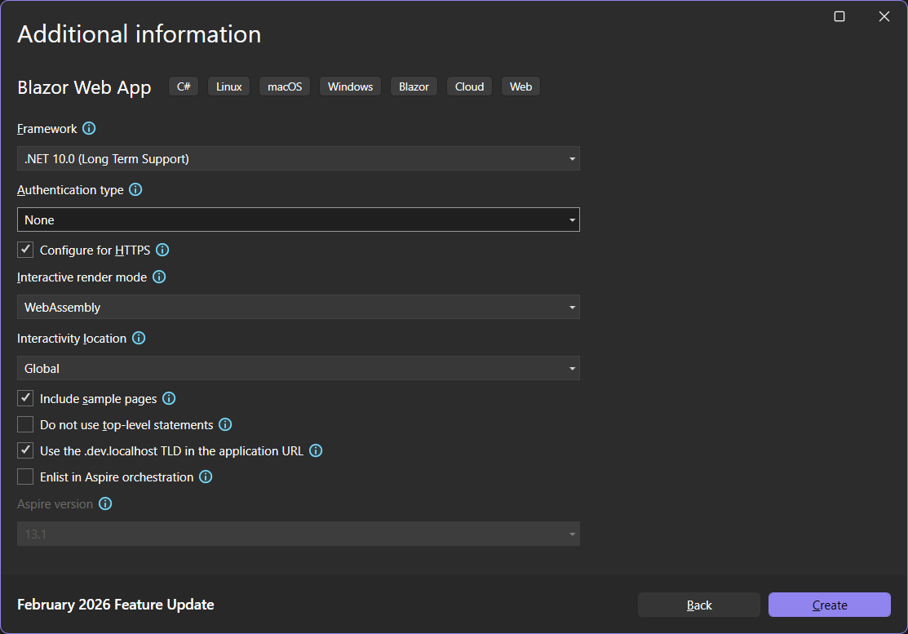
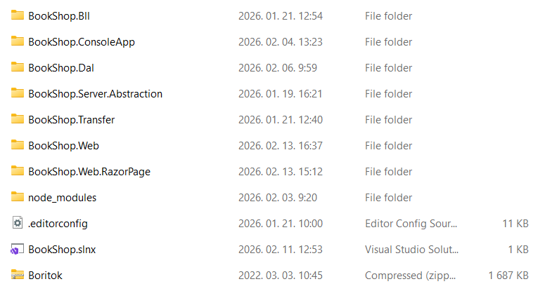
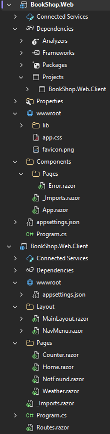

# 5.1. Projekt felépítése, alapok

**A labor anyag még fejlesztés alatt áll!**

Ezen a laboron egy Blazor WebApp projektet hozunk létre, melyben megnézzük, hogyan épül fel egy modern interaktív kliens fejlesztésére alkalmaz Blazor alkalmazás a hozzá tartozó szerver oldal API projekttel.

## Blazor Web App projekt létrehozása

1. Hozzuk létre az új Blazor Web App projektek `BookShop.Web` névvel. Valójában ez két projektet fog létrehozni. Egy ASP.NET Core projektet `BookShop.Web` névvel, ami a szerver oldali API-t (controller) tartalmazza és egy Blazor Web Assembly projektet `BookShop.Web.Client` névvel, ami a böngészőben futó kliens oldali kódot tartalmazza.

    ??? tip "Létrehozás képeryői"
        
        /// caption
        Projekt típus kiválasztása
        ///

        
        /// caption
        Projekt neve és könyvtára
        ///

        
        /// caption
        Projekt adatok
        ///

    - Figyeljük meg, hogy az utolsó lépésben beállítottuk, hogy
        - Az Interactive render mode: **WebAssembly**
        - Az interactivity location: **Global**
        - Bekapcsoltuk a *Use the .dev.localhost TLD in the application URL*: Azaz, hogy az alkalmazás URL-je használja a `.dev.localhost` top-level-domain-t. Ennek részletei a [hivatalos dokumentációban](https://learn.microsoft.com/en-us/aspnet/core/test/localhost-tld?view=aspnetcore-10.0) olvashatók.

2. Létre is jön a két projektünk úgyhogy beállíthatjuk, hogy a `BookShop.Web` azaz a szerver oldali projekt legyen a Startup projektünk. Indítsuk is el.

    ??? sussecc "Elindul az app"
        
        /// caption
        A létrehozott alkalmazás el is indul
        ///

    - Az alkalmazás URL-je valóban `https://bookshop-web.dev.localhost:7211/` lett.

3. Ha megnézzük fájlrendszerben is az solution-t akkor viszont azt vehetjük észre, hogy a `BookShop.Web` könyvtár megtalálható, de a `BookShop.Web.Client`-et nem látjuk. Ennek az az oka, hogy valójában a `BookShop.Web` amit látunk csak egy könyvtár és azon belül tatláható a két létrehozott projekt a megfelelő nevekkel.

    ??? tip "Projekt könyvtár struktúrája"
        
        /// caption
        Létrehozott projektek egy könyvtárral lentebb találhatók
        ///

## Projekt struktúra

A `BookShop.Web` a szerver oldali kódot tartalmazza, ide fogjuk majd a Controller-eket létrehozni, ami a kliens meg tud majd hívni HTTP kéréseken keresztül.

A `BookShop.Web.Client` tartalmazza a böngészőben futó kliens oldali kódot. Ennek a projektnek a kimenetét tölti le a kliens és futtatja a böngészőben, tehát minden olyan oldalt és kódot a `Client` projektbe kell tenni, amit kliens oldalon kell elérni.


/// caption
A létrehozott Blazor Web App felépítése.
///

### BookShop.Web

1. A szerver oldali projekt (ami valójában egy egyszerű ASP.NET Core projekt) tartalmaz egy referenciát a kliens oldali kódra is, ha az interaktív web assembly renderelés be van kapcsolva. Erre azért van szükség, hogy a `Program.cs`-ben be tudjuk húzni a kliens oldali kódot is, illetve e miatt indul el a szerverrel együtt a kliens is, és így tudjuk egyben telepíteni is.

    - A `wwwroot` alatt találhatók a statikusan kiszolgálandó fájlok. (CSS, JS, képek ...)
    - A `Pages` alatt csak egy hibaoldal található. Fontos, hogy az itt található oldalak szerver oldalon renderelődnek.
    - Az `App.razor` tartalmazza a kliens oldali alkalmazás vázat, ebbe töltődnek majd be a kliens oldalon definiált oldalak.
    - Az `appsettings.json` tartalmazza a konfiguráció függő szerver oldali beállításokat.
    - A `Program.cs` a szerver oldali alkalmazás belépési pontja.

#### App.razor

Az `App.razor` az alkalmazás gyökérkomponense.A gyökérkomponens az első komponens, amelyet az alkalmazás betölt.

Mint látható itt hivatkozzuk be a CSS és JS fájlokat, többek között a `_framework/blazor.web.js`-t is amit a Blazor keretrendszer kódja. Azt is figyeljük meg, hogy ezeket a statikus tartalmakat úgy linkejük meg, hogy az `@Assets[]` tömbből indexeljük ki. Ez azért előnyös, mert ezeket a statikus tartalmakat telepítéskör betömörítve is felkerülnek a szerverre, így amikor a kliens letölti, azonnak a tömörített verziót lehet leküldeni.

- `<ResourcePreloader />`: .NET 10-ben a Blazor webalkalmazások ezt a komponenst használják a keretrendszer statikus fájljainak előzetes betöltéséhez, a <link> fejlécek helyett.
- `<ImportMap />`: 
- `<HeadOutlet @rendermode="InteractiveWebAssembly" />`: Lehetőséget ad arra, hogy az egyes oldalakon definiáljunk elemeket, amit a `<head>` HTML tag végére kell fűzni, mint például a `title` vagy `meta` tag.
- `<Routes @rendermode="InteractiveWebAssembly" />`: A `.Client` projektben definiált `Routes.razor` komponenst jeleníti meg.

``` aspx-cs title="App.razor" hl_lines="7-8 12 14 18"
<!DOCTYPE html>
<html lang="en">

<head>
    <meta charset="utf-8" />
    <meta name="viewport" content="width=device-width, initial-scale=1.0" />
    <base href="/" />
    <ResourcePreloader />
    <link rel="stylesheet" href="@Assets["lib/bootstrap/dist/css/bootstrap.min.css"]" />
    <link rel="stylesheet" href="@Assets["app.css"]" />
    <link rel="stylesheet" href="@Assets["BookShop.Web.styles.css"]" />
    <ImportMap />
    <link rel="icon" type="image/png" href="favicon.png" />
    <HeadOutlet @rendermode="InteractiveWebAssembly" />
</head>

<body>
    <Routes @rendermode="InteractiveWebAssembly" />
    <script src="@Assets["_framework/blazor.web.js"]"></script>
</body>

</html>
```

A *PreRender* bonyolíthatja az alkalmazás működését, mivel az alkalmazás Razor komponenseinek kétszer kell renderelniük: egyszer a PreRender-hez, egyszer pedig az interaktivitás beállításához. Ha a komponensek WebAssembly-n való futtatásra vannak beállítva, akkor a komponenseket úgy kell megtervezni, hogy mind a szerverről, mind a kliensről futtathatók legyenek. E miatt célszerű a PreRender funkciót kikapcsolni.

A PreRender funkció letiltásához, írjuk át a a `<Routes>` komponensben a `@rendermode` értékét az alábbira.

``` aspx-cs title="App.razor"
<Routes @rendermode="new InteractiveWebAssemblyRenderMode(prerender: false)" />
```

#### Program.cs

Nagyon hasonló a felépítése mint a korábban használt ASP.NET Razor Page esetén, hiszen ez is egy ASP.NET Core projekt.
    - Beregisztráljuk az interaktív web assembly komponenseket.
    - Debug módban felcsatoljuk a web assembly debuggert.
    - UseStatusCodePagesWithReExecute: A HTTP státusz kódokhoz tudunk egyedi hibaoldalakat rendelni.
    - UseAntiforgery: XSRF / CSRF támadások elleni védele. Részletek a hivatalos dokumentációban találhatók: [Prevent Cross-Site Request Forgery (XSRF/CSRF) attacks in ASP.NET Core](https://learn.microsoft.com/en-us/aspnet/core/security/anti-request-forgery?view=aspnetcore-10.0)
    - Beállítjuk, hogy a render mode WebAssembly legyen és beregisztráljuk a kliens oldali oldalakat / komponenseket

``` csharp title="Program.cs" hl_lines="8 15 23 26 29-31"
using BookShop.Web.Client.Pages;
using BookShop.Web.Components;

var builder = WebApplication.CreateBuilder(args);

// Add services to the container.
builder.Services.AddRazorComponents()
    .AddInteractiveWebAssemblyComponents();

var app = builder.Build();

// Configure the HTTP request pipeline.
if (app.Environment.IsDevelopment())
{
    app.UseWebAssemblyDebugging();
}
else
{
    app.UseExceptionHandler("/Error", createScopeForErrors: true);
    // The default HSTS value is 30 days. You may want to change this for production scenarios, see https://aka.ms/aspnetcore-hsts.
    app.UseHsts();
}
app.UseStatusCodePagesWithReExecute("/not-found", createScopeForStatusCodePages: true);
app.UseHttpsRedirection();

app.UseAntiforgery();

app.MapStaticAssets();
app.MapRazorComponents<App>()
    .AddInteractiveWebAssemblyRenderMode()
    .AddAdditionalAssemblies(typeof(BookShop.Web.Client._Imports).Assembly);

app.Run();
```

### BookShop.Web.Client

