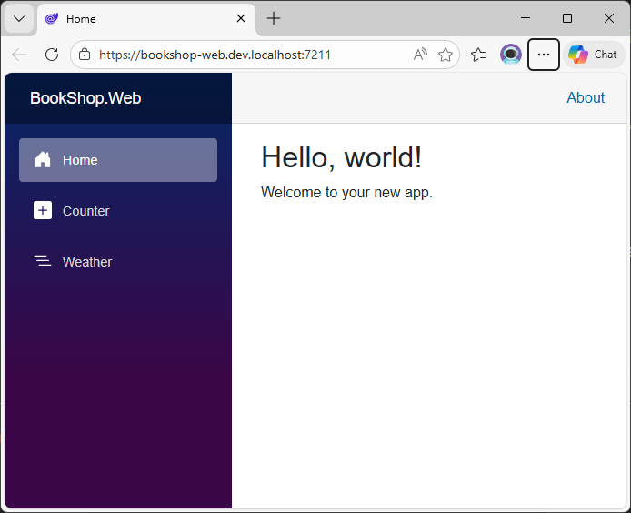
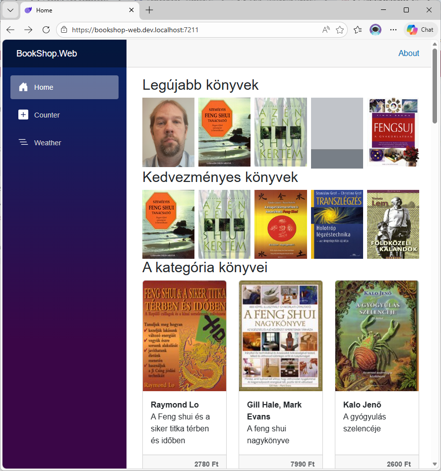

# 5.1. Projekt felépítése, alapok

Ezen a laboron egy [Blazor WebApp](https://dotnet.microsoft.com/en-us/apps/aspnet/web-apps/blazor) projektet hozunk létre, melyben megnézzük, hogyan épül fel egy modern interaktív kliens fejlesztésére alkalmas webalkalmazás fejlesztése, melynek kódját HTML, CSS és C# nyelven készítjük, illetve a hozzá tartozó szerver oldali Web API projektet is megismerjük.

## Blazor Web App projekt létrehozása

1. Hozzuk létre az új *Blazor Web App* típusú projektek `BookShop.Web` névvel. Valójában ez két projektet fog létrehozni. Egy *ASP.NET Core* projektet `BookShop.Web` névvel, ami a szerver oldali API-t (controller) tartalmazza és egy *Blazor Web Assembly* projektet `BookShop.Web.Client` névvel, ami a böngészőben futó kliens oldali kódot tartalmazza.

    ??? tip "Létrehozás képeryői"
        
        /// caption
        Projekt típus kiválasztása
        ///

        
        /// caption
        Projekt neve és könyvtára
        ///

        
        /// caption
        Projekt adatok
        ///

    - Figyeljük meg, hogy az utolsó lépésben beállítottuk, hogy
        - Az Interactive render mode: **WebAssembly**
        - Az interactivity location: **Global**
        - Bekapcsoltuk a *Use the .dev.localhost TLD in the application URL*: Azaz, hogy az alkalmazás URL-je használja a `.dev.localhost` top-level-domain-t. Ennek részletei a [hivatalos dokumentációban](https://learn.microsoft.com/en-us/aspnet/core/test/localhost-tld?view=aspnetcore-10.0) olvashatók.

2. Létre is jön a két projektünk úgyhogy beállíthatjuk, hogy a `BookShop.Web` azaz a szerver oldali projekt legyen a Startup projektünk. Indítsuk is el.

    ??? success "Elindul az app"
        
        /// caption
        A létrehozott alkalmazás el is indul
        ///

    - Az alkalmazás URL-je valóban `https://bookshop-web.dev.localhost:7211/` lett.

3. Ha megnézzük fájlrendszerben is az solution-t akkor viszont azt vehetjük észre, hogy a `BookShop.Web` könyvtár megtalálható, de a `BookShop.Web.Client`-et nem látjuk. Ennek az az oka, hogy valójában a `BookShop.Web` amit látunk csak egy könyvtár és azon belül tatláható a két létrehozott projekt a megfelelő nevekkel. Ha szeretnénk akkor ezt módosíthatjuk, de nem elég átmásolni egy könyvtárral fentebb a projekteket, a solution fájlban is át kell írni a projekt elérési útját. De ezt fölösleges megtenni.

    ??? tip "Projekt könyvtár struktúrája"
        
        /// caption
        Létrehozott projektek egy könyvtárral lentebb találhatók
        ///

## Projekt struktúra

- A `BookShop.Web` a szerver oldali kódot tartalmazza, ide fogjuk majd a Controller-eket létrehozni, amit a kliens meg tud majd hívni HTTP kéréseken keresztül.
- A `BookShop.Web.Client` tartalmazza a böngészőben futó kliens oldali kódot. Ennek a projektnek a lefordított kódját tölti le a kliens és futtatja a böngészőben, tehát minden olyan oldalt és kódot a `Client` projektbe kell tenni, amit kliens oldalon szeretnénk futtatni.


/// caption
A létrehozott Blazor Web App felépítése.
///

### BookShop.Web

1. A szerver oldali projekt (ami egy egyszerű *ASP.NET Core* projekt) tartalmaz egy referenciát a kliens oldali kódra is, ha az interaktív web assembly renderelés be van kapcsolva. Erre azért van szükség, hogy a `Program.cs`-ben be tudjuk húzni a kliens oldali kódot is, illetve e miatt indul el a szerverrel együtt a kliens is, és így tudjuk egyben telepíteni is. Tehát valójában a *.Client* projekt szerves része a server oldali projektnek, olyan mintha egy library-t hivatkoztunk volna be.

    - A `wwwroot` alatt találhatók a statikusan kiszolgálandó szerver oldali fájlok. (CSS, JS, képek ...)
    - A `Pages` alatt csak egy hibaoldal található. Fontos, hogy az itt található oldalak szerver oldalon renderelődnek.
    - Az `App.razor` tartalmazza a kliens oldali alkalmazás vázat, ebbe töltődnek majd be a kliens oldalon definiált oldalak.
    - Az `appsettings.json` tartalmazza a konfiguráció függő szerver oldali beállításokat.
    - A `Program.cs` a szerver oldali alkalmazás belépési pontja.

#### App.razor (szerver)

Az `App.razor` az alkalmazás gyökérkomponense.A gyökérkomponens az első komponens, amelyet az alkalmazás betölt.

Mint látható itt hivatkozzuk be a CSS és JS fájlokat, többek között a `_framework/blazor.web.js`-t is amit a Blazor keretrendszer kódja. Figyeljük meg, hogy ezeket a statikus tartalmakat úgy linkeljük be, hogy az `@Assets[]` tömbből indexeljük ki. Ez azért előnyös, mert ezek a statikus tartalmak telepítéskör betömörítve is felkerülnek a szerverre, így amikor a kliens letölti, azonnal a tömörített verziót lehet leküldeni, nem kell a szervernek állandóan betömörítenie. Ez az automatikus tömörítés csak a Production környezetben van bekapcsolva.

- `<ResourcePreloader />`: .NET 10-ben a Blazor webalkalmazások ezt a komponenst használják a keretrendszer statikus fájljainak előzetes betöltéséhez, a `<link>` tag helyett.
- `<ImportMap />`: Egy `<script type="importmap"></script>` elemet szúr be, ami definiálja az import mapet a modul scriptek számára.
- `<HeadOutlet @rendermode="InteractiveWebAssembly" />`: Lehetőséget ad arra, hogy az egyes oldalakon definiáljunk elemeket, amit a `<head>` HTML tag végére kell fűzni, mint például a `title` vagy `meta` tag.
- `<Routes @rendermode="InteractiveWebAssembly" />`: A `.Client` projektben definiált `Routes.razor` komponenst jeleníti meg.

``` aspx-cs title="App.razor" hl_lines="7-8 12 14 18"
<!DOCTYPE html>
<html lang="en">

<head>
    <meta charset="utf-8" />
    <meta name="viewport" content="width=device-width, initial-scale=1.0" />
    <base href="/" />
    <ResourcePreloader />
    <link rel="stylesheet" href="@Assets["lib/bootstrap/dist/css/bootstrap.min.css"]" />
    <link rel="stylesheet" href="@Assets["app.css"]" />
    <link rel="stylesheet" href="@Assets["BookShop.Web.styles.css"]" />
    <ImportMap />
    <link rel="icon" type="image/png" href="favicon.png" />
    <HeadOutlet @rendermode="InteractiveWebAssembly" />
</head>

<body>
    <Routes @rendermode="InteractiveWebAssembly" />
    <script src="@Assets["_framework/blazor.web.js"]"></script>
</body>

</html>
```

Az [PreRender](https://learn.microsoft.com/en-us/aspnet/core/blazor/components/prerender?view=aspnetcore-10.0) az a folyamat, amelynek során a szerver statikusan kirendereli az oldal tartalmát, hogy a HTML a lehető leggyorsabban eljuttassa a böngészőhöz. Miután az előrenderelt tartalom gyorsan megjelenik a felhasználónak, ezt követően az eseménykezelőkkel rendelkező interaktív tartalom jelenik meg, amely felülírja a korábban megjelenített tartalmat. Az PreRender a keresőoptimalizálást (SEO) is javíthatja azáltal, hogy megjeleníti a tartalmat a kezdeti HTTP-válaszhoz, amelyet a keresőmotorok az oldalrangsor kiszámításához használnak.

Alapértelmezés szerint a Blazor alkalmazásokban be van kapcsolva a *PreRender* funkció, ám ez nagy mértékben bonyolíthatja az alkalmazás működését, mivel a Razor komponenseinek kétszer kell renderelniük: egyszer a PreRender-hez szerver oldalon, egyszer pedig az interaktivitás beállításához kliens oldalon. Ha a komponensek WebAssembly-n való futtatásra vannak beállítva, akkor a komponenseket úgy kell megtervezni, hogy mind a szerverről, mind a kliensről futtathatók legyenek, ami igazán nagy kihívás tud lenni.

Ezért javasoljuk, hogy kapcsoljuk ki a PreRender funkciót. Ehhez írjuk át a a `<Routes>` komponensben a `@rendermode` értékét az alábbira.

``` aspx-cs title="App.razor"
<Routes @rendermode="new InteractiveWebAssemblyRenderMode(prerender: false)" />
```

#### Program.cs (szerver)

Nagyon hasonló a felépítése mint a korábban használt ASP.NET Razor Page esetén, hiszen ez is egy ASP.NET Core projekt.

- Beregisztráljuk az interaktív web assembly komponenseket.
- Debug módban felcsatoljuk a web assembly debuggert.
- `UseStatusCodePagesWithReExecute`: A HTTP státusz kódokhoz tudunk egyedi hibaoldalakat rendelni.
- `UseAntiforgery`: XSRF / CSRF támadások elleni védelem. Részletek a hivatalos dokumentációban találhatók: [Prevent Cross-Site Request Forgery (XSRF/CSRF) attacks in ASP.NET Core](https://learn.microsoft.com/en-us/aspnet/core/security/anti-request-forgery?view=aspnetcore-10.0)
- Beállítjuk, hogy a render mode WebAssembly legyen és beregisztráljuk a kliens oldali oldalakat / komponenseket.

``` csharp title="Program.cs" hl_lines="8 15 23 26 29-31"
using BookShop.Web.Client.Pages;
using BookShop.Web.Components;

var builder = WebApplication.CreateBuilder(args);

// Add services to the container.
builder.Services.AddRazorComponents()
    .AddInteractiveWebAssemblyComponents();

var app = builder.Build();

// Configure the HTTP request pipeline.
if (app.Environment.IsDevelopment())
{
    app.UseWebAssemblyDebugging();
}
else
{
    app.UseExceptionHandler("/Error", createScopeForErrors: true);
    // The default HSTS value is 30 days. You may want to change this for production scenarios, see https://aka.ms/aspnetcore-hsts.
    app.UseHsts();
}
app.UseStatusCodePagesWithReExecute("/not-found", createScopeForStatusCodePages: true);
app.UseHttpsRedirection();

app.UseAntiforgery();

app.MapStaticAssets();
app.MapRazorComponents<App>()
    .AddInteractiveWebAssemblyRenderMode()
    .AddAdditionalAssemblies(typeof(BookShop.Web.Client._Imports).Assembly);

app.Run();
```

### BookShop.Web.Client

Ez a böngészőben futó kliens oldali kód, melynek felépítése hasonlít egy *ASP.NET Core* projektre de pár ponton eltér.

- A `wwwroot` alatt találhatók a statikus fájlok, amik a kliens projekt részei. Ebben az esetben a kliens oldali projektre úgy érdemes gondolni mint egy library (CSS és egyéb statikus erőforrásokkal) ami beágyazva a szerver oldali projektbe. Így ha az adott CSS fájl megtalálható kliens `wwwroot` könyvtárában akkor azokat onnan szolgálja ki, nem kell a szerver oldali projektnek is tartalmaznia azt.

    - Ebben a könyvtárban található az `appsettings.json` ami a konfiguráció függő kliens oldali beállításokat tartalmazza.

- A `Pages` alatt találhatóak azok az oldalak, amik kliens oldalon futnak, jelen esetben minden saját fejlesztésű oldal ide fog kerülni.
- A `Layout` mappában található az alapértelmezett oldal elrendezés (`MainLayout.razor`), illetve a navigációs menü komponens (`NavMenu.razor`), amit az alapértelmezett layout jelenít meg.

    - A szerver oldalon lévő `App.razor` töltődik be először, ebben található a `Routes` tag, amit a kliens oldalon lévő `Routes.razor` fájlt jeleníti meg. Ebben definiáljuk, hogy alapértelmezés szerint a `MainLayout.razor` fájl használja layout-nak. A layout oldalon definiált `@Body` helyére pedig az egyes oldalak kódja kerül be.

#### Routes.razor (kliens)

A kliens oldali router komponens. Interaktív routing esetén a böngésző URL-je alapján dönti el, hogy milyen komponenst kell megjeleníteni. Az összes olyan komponens amiben szerepel a `@page` tag routolható.  

Itt kerül megadása, hogy

- ha megtalálja az adott oldalt, akkor azt milyen alapértelmezett layout-tal jelenítse meg.
- ha  nem találja meg a kért oldalt, akkor a `Pages/NotFound.razor` oldalt kell megjeleníteni.

``` aspx-cs title="Routes.razor" hl_lines="1 3-4"
<Router AppAssembly="typeof(Program).Assembly" NotFoundPage="typeof(Pages.NotFound)">
    <Found Context="routeData">
        <RouteView RouteData="routeData" DefaultLayout="typeof(Layout.MainLayout)" />
        <FocusOnNavigate RouteData="routeData" Selector="h1" />
    </Found>
</Router>
```

#### Program.cs (kliens)

A  kliens oldali alkalmazás belépési pontja. Itt kell majd a kliens oldali szolgáltatásokat beregisztrálni a DI konténerbe, jogosultság kezelést és egyéb fontos beállításokat megtenni.

A kiinduló kód csak a host-ot hozza létre a `WebAssemblyHostBuilder` segítségével és elindítja a kliens alkalmazást.

``` csharp title="Program.cs"
using Microsoft.AspNetCore.Components.WebAssembly.Hosting;

var builder = WebAssemblyHostBuilder.CreateDefault(args);

await builder.Build().RunAsync();
```

#### Counter.razor oldal

A kiinduló kód tartalmaz egy egyszerű Blazor oldalt, ami egy számlálót növel a gomb kattintáskor.

Ahogyan az alábbi kódban látható, az oldal HTML és C# kódja egy fájlban található, nem használja a code-behind-ot. A későbbiekben megnézzük majd, hogyan lehet külön `razor.cs` fájlba átvinni a `@code` blokk tartalmát.

- A `@page` direktíva jelzi, hogy ez egy oldal, át lehet rá navigálni a `/counter` megadva az URL-ben.
- A `currentCount` változóban tároljuk az aktuális kattintás számot, amit a felület megjelenik.
- A gombra kattintáskor (`@onclick`) pedig meghívódik az `IncrementCount` metódus (kliens oldalon), ami növeli a kattintások számát.
- Figyeljük meg, hogy a kattintás után azonnal frissül a megjelenített kattintásszám, oldal újratöltés nélkül. Ennek az az oka, hogy a gomb kattintás után a Blazor automatikusan frissíti a megjelenítést. (Manuálisan ezt a `StateHasChanged()` meghívásával lehetne elérni, de azt csak indokolt esetben kell kézzel hívni, esemény kezelők után automatikusan meghívódik.)

``` aspx-cs title="Counter.razor"
@page "/counter"

<PageTitle>Counter</PageTitle>

<h1>Counter</h1>

<p role="status">Current count: @currentCount</p>

<button class="btn btn-primary" @onclick="IncrementCount">Click me</button>

@code {
    private int currentCount = 0;

    private void IncrementCount()
    {
        currentCount++;
    }
}
```

## DbContext és Service-ek regisztrálása

Hasonlóan mint az ASP.NET Core Razor Page projekt esetén itt is be kell regisztrálni a DBContext-et, hogy elérje az adatbázist, illetve referenciát kell adni a backend oldali projektekre.

1. Adjunk referenciát a `BookShop.Web` projektből az alábbiakra
    - BookShop.**Bll** projekt: Így tudjuk a DI-ba beregisztrálni a szolgáltatásainkat.
    - BookShop.**Transfer** projekt: Hogy a DTO-kat is elérjük.
    - BookShop.**Server.Abstraction**: Hogy az IRequestContext-et be tudjuk regisztrálni.

2. Ahhoz, hogy le tudjuk futtatni a migrációkat úgy, hogy a Startup projekt a `BookShop.Web` adjuk hozzá a projekthez a `Microsoft.EntityFrameworkCore.Design` nuGet package-et.

3. Mivel a kiinduló kódban már használjuk az `IRequestContext`-et, ezért készítenünk kell hozzá egy implementációt és be kell regisztrálni mint szolgáltatás. Implementáljuk először az `IRequestContext` interfészt egy mock kóddal. Vagy akár át is hozhatjuk a Razor Page-es kódból, csak a névteret módosítjuk a megfelelőre.

    ``` csharp title="RequestContext.cs" hl_lines="4"
    using BookShop.Server.Abstraction.Context;
    using System.Security.Claims;

    namespace BookShop.Web.Services;

    public class RequestContext : IRequestContext
    {
        public string? RequestId { get; }

        public ClaimsIdentity? CurrentUser { get; }

        public int? UserId => 1;//throw new NotImplementedException();
    }
    ```

4. A `Program.cs`-ben regisztráljuk be a BLL szolgáltatásainkat. Ehhez már megvan a `Wireup.cs`-ben a `AddBllServices` metódus, amit csak meg kell hívunk és regisztráljuk be a `RequestContext` implementációnkat is.

    ``` csharp title="Program.cs" hl_lines="1 14 17"
    using BookShop.Bll;
    using BookShop.Server.Abstraction.Context;
    using BookShop.Web.Client.Pages;
    using BookShop.Web.Components;
    using BookShop.Web.Services;

    var builder = WebApplication.CreateBuilder(args);

    // Add services to the container.
    builder.Services.AddRazorComponents()
        .AddInteractiveWebAssemblyComponents();

    // Register Bll and Dal Servces.
    builder.Services.AddBllServices(builder.Configuration);

    // Register additional non-BLL services.
    builder.Services.AddScoped<IRequestContext, RequestContext>();

    var app = builder.Build();
    ```

5. Állítsuk be, hogy a `BookShop.Web` projekt legyen a startup project és indítsuk el. Ha mindent jól csináltunk el is indul az alkalmazás


/// caption
Blazor oldalunk futás közben.
///

### appsettings.json beállítása

1. A kód azért tudott elindulni, mert nem akart adatbázishoz nyúlni. Ha megnézzük az *appsettings.json* fájlt akkor láthatjuk, hogy nem vettük fel a szükséges adatbázis kapcsolódási sztringet és az AutoMapper licensz kulcsot sem állítottuk be.
2. Vegyük fel a `DefaultConnectionString`-et és az `AutoMapper` kulcsot az alábbiak szerint a szerver oldlali `appsettings.json`-ban

    ``` json title="appsettings.json" hl_lines="10-12 14-16"
    {
        "Logging": {
            "LogLevel": {
            "Default": "Information",
            "Microsoft.AspNetCore": "Warning"
            }
        },
        "AllowedHosts": "*",

        "ConnectionStrings": {
            "DefaultConnection": "Data Source=.;Initial Catalog=BookShopDb2;Integrated Security=True;TrustServerCertificate=True"
        },

        "AutoMapper": {
            "LicenseKey": "user secretből állítsuk be"
        }
    }
    ```

3. Mivel a licensz kulcs egy érzékeny, titkos adat ezért azt a user `secrets.json`-ba vegyük fel. (BookShop.Web -> Manage User Secrets). Szükséges erre a projektre is megadni, mert a user secret projektenként kerül beállításra. Ha már elfelejtettük, másoljuk át a BookShop.Web.RazorPage projekt user secret-jéből.

    ``` json title="secrets.json"
    {
        "AutoMapper": {
            "LicenseKey": "ide jön a licensz kulcs"
        }
    }
    ```

## Web API végpontok

Mivel az fontend réteg a böngészőben fut így az adatokat HTTP végpontokon keresztül kell lekérdeznie. Ehhez először a szerver oldali projektben létre kell hozni egy vékony Controller réteget, amiben a BLL szolgáltatásokat kiajánlja Web API végpontokon.

Adjunk a `BookShop.Web` projekthez egy `Controllers` könyvtárat amibe vegyük fel az alábbi kontrollereket. `Add new Item -> API Controller - Empty`

    - BaseController
    - BooksController
    - CategoriesController
    - CommentsController
    - PublishersController
    - RatingsController
### BaseController

A BaseController-t azért hozzuk létre, hogy az `[ApiContoller]` és `[Route]` attribútumokat csak egyszer kelljen megadni, illetve ha a későbbiekben szükség lenne közös kódrészletre, akkor csak ezt kelljen bővíteni.

``` csharp title="BaseController.cs"
using Microsoft.AspNetCore.Mvc;

namespace BookShop.Web.Controllers;

[ApiController]
[Route("api/[controller]")]
public class BaseController : ControllerBase
{
}
```

### BookController

- A `BooksController` származzon a `BaseController`-ből, így már nem kell megadni külön az attribútumokat az osztály előtt.
- A primary konstruktor kapja meg az `IBookService`-t, amit majd a DI-al felold.  
- Ezt követően az készítsük el az egyes *Action* metódusokat úgy, hogy azok hívjanak át a `BookService` megfelelő metódusába.
- Az Action metódusok előtt adjuk meg, hogy milyen URL-en lehet elérni az API végpontot. Mivel a `BaseController`-en már megadtuk hogy `[Route("api/[controller]")]` így csak az ez utáni részt kell megadni.
- Mivel tudjuk, hogy bizonyos action-öket csak *Admin* felhasználó érhet el ezért az `[Authorize]` attribútumokat is tegyük fel (bár egyelőre még nem fognak működni.)
- Az első két action metódushoz adjunk xml commentet is.

``` csharp title="BooksController.cs"
using BookShop.Bll.ServicesInterfaces;
using BookShop.Transfer.Common;
using BookShop.Transfer.Dtos;
using Microsoft.AspNetCore.Authorization;
using Microsoft.AspNetCore.Mvc;

namespace BookShop.Web.Controllers;

public class BooksController(IBookService bookService) : BaseController
{
    /// <summary>
    /// Returns the book with the specified id.
    /// </summary>
    /// <param name="bookId">The id of the book to retrieve.</param>
    /// <returns>The book data.</returns>
    [HttpGet("{bookId:int}")]
    public async Task<BookData> GetBook(int bookId)
        => await bookService.GetBookAsync(bookId);

    /// <summary>
    /// Retrieves the details of a book for editing based on the specified book identifier.
    /// </summary>
    /// <remarks>This method requires the caller to be authorized with the 'Admin' role. If the book with the
    /// specified ID does not exist, an appropriate exception will be thrown.</remarks>
    /// <param name="bookId">The unique identifier of the book to retrieve for editing.</param>
    /// <returns>A CreateOrEditBook object with the book details for editing.</returns>
    [HttpGet("{bookId:int}/edit")]
    [Authorize(Roles = "Admin")]
    public async Task<CreateOrEditBook> GetBookForEdit(int bookId)
        => await bookService.GetBookForEditAsync(bookId);
    
    [HttpGet("{bookId:int}/header")]
    public async Task<BookHeader> GetBookHeader(int bookId)
        => await bookService.GetBookHeaderAsync(bookId);

    [HttpGet("headers")]
    public async Task<IList<BookHeader>> GetBookHeaders(List<int> bookIds)
        => await bookService.GetBookHeadersAsync(bookIds);

    [HttpGet("newest/{count:int}")]
    public async Task<IList<BookData>> GetNewestBooks(int count)
    => await bookService.GetNewestBooksAsync(count);

    [HttpGet("discounted/{count:int}")]
    public async Task<IList<BookData>> GetDiscountedBooks(int count)
        => await bookService.GetDiscountedBooksAsync(count);

    [HttpGet("/categories/{categoryId}/books")]
    public async Task<IList<BookData>> GetBooks(int? categoryId)
        => await bookService.GetBooksAsync(categoryId);

    [HttpGet("/categories/{categoryId}/books/paged")]
    public async Task<PagedList<BookData>> GetBooksPaged(int? categoryId, LoadDataArgs? args)
        => await bookService.GetBooksPagedAsync(categoryId, args);

    [HttpPost]
    [Authorize(Roles = "Admin")]
    public async Task<BookData> AddOrUpdate(CreateOrEditBook createOrEditBook)
        => await bookService.AddOrUpdateAsync(createOrEditBook);

    [HttpDelete("{id}")]
    [Authorize(Roles = "Admin")]
    public async Task Delete(int id)
        => await bookService.DeleteAsync(id);
}
```

Figyeljük meg, hogy a Controller action metódusok nevébe nem használjuk az `Async` postfixet.

### CategoriesController

- A `BooksController`-hez hasonlóan készítsük el a `CategoriesController`-t is.
- A `CategoriesController` származzon a `BaseController`-ből és a primary konstruktor kapja meg az `ICategoryService`-t.

??? success "Elkészült CategoriesController kódja"
    ``` csharp title="CategoriesController.cs"
    using BookShop.Bll.ServicesInterfaces;
    using BookShop.Transfer.Dtos;
    using Microsoft.AspNetCore.Authorization;
    using Microsoft.AspNetCore.Mvc;

    namespace BookShop.Web.Controllers;

    public class CategoriesController(ICategoryService categoryService) : BaseController
    {
        [HttpGet]
        public async Task<IList<CategoryData>> GetCategoryTree()
            => await categoryService.GetCategoryTreeAsync();

        [HttpGet("{categoryId}/edit")]
        [Authorize(Roles = "Admin")]
        public async Task<CreateOrEditCategory> GetCategoryForEdit(int categoryId)
            => await categoryService.GetCategoryForEditAsync(categoryId);

        [HttpPost]
        [Authorize(Roles = "Admin")]
        public async Task<CategoryData> AddOrUpdate(CreateOrEditCategory createOrEditCategory)
            => await categoryService.AddOrUpdateAsync(createOrEditCategory);

        [HttpDelete("{id}")]
        [Authorize(Roles = "Admin")]
        public async Task Delete(int id)
            => await categoryService.DeleteAsync(id);
    }
    ```

### CommentsController

- A `BooksController`-hez hasonlóan készítsük el a `CommentsController`-t is.
- A `CommentsController` származzon a `BaseController`-ből és a primary konstruktor kapja meg az `ICommentService`-t.

??? success "Elkészült CommentsController kódja"
    ``` csharp title="CommentsController.cs"
    using BookShop.Bll.ServicesInterfaces;
    using BookShop.Transfer.Dtos;
    using BookShop.Transfer.Enums;
    using Microsoft.AspNetCore.Authorization;
    using Microsoft.AspNetCore.Mvc;

    namespace BookShop.Web.Controllers;

    public class CommentsController(ICommentService commentService) : BaseController
    {
        [HttpGet]
        public async Task<IList<CommentData>> GetComments(int bookId, CommentType? type = null, int count = 5)
            => await commentService.GetCommentsAsync(bookId, type, count);

        [HttpPost]
        [Authorize]
        public async Task<CommentData> CreateComment(CreateCommentData data)
            => await commentService.CreateCommentAsync(data);
    }
    ```

### PublishersController

- A `BooksController`-hez hasonlóan készítsük el a `PublishersController`-t is.
- A `PublishersController` származzon a `BaseController`-ből és a primary konstruktor kapja meg az `IPublisherService`-t.

??? success "Elkészült PublishersController kódja"
    ``` csharp title="PublishersController.cs"
    using BookShop.Bll.ServicesInterfaces;
    using BookShop.Transfer.Dtos;
    using Microsoft.AspNetCore.Authorization;
    using Microsoft.AspNetCore.Mvc;

    namespace BookShop.Web.Controllers;

    public class PublishersController(IPublisherService publisherService) : BaseController
    {
        [HttpGet]
        public async Task<IList<PublisherHeader>> GetAllPublishers()
            => await publisherService.GetAllPublishersAsync();

        [HttpPost]
        [Authorize(Roles = "Admin")]
        public async Task<PublisherHeader> AddOrUpdate(PublisherHeader data)
            => await publisherService.AddOrUpdateAsync(data);

        [HttpDelete("{id}")]
        [Authorize(Roles = "Admin")]
        public async Task Delete(int id)
            => await publisherService.DeleteAsync(id);
    }
    ```

### RatingsController

- A `BooksController`-hez hasonlóan készítsük el a `RatingsController`-t is.
- A `RatingsController` származzon a `BaseController`-ből és a primary konstruktor kapja meg az `IRatingService`-t.

??? success "Elkészült RatingsController kódja"
    ``` csharp title="RatingsController.cs"
    using BookShop.Bll.ServicesInterfaces;
    using BookShop.Transfer.Dtos;
    using Microsoft.AspNetCore.Authorization;
    using Microsoft.AspNetCore.Mvc;

    namespace BookShop.Web.Controllers;

    public class RatingsController(IRatingService ratingService) : BaseController
    {
        [HttpPost]
        [Authorize]
        public async Task AddRating(RatingData data)
            => await ratingService.AddRating(data);
    }
    ```

Ezt követően már csak be kell állítani, hogy az alkalmazás Controller-eket is definiál.

- Az `AddControllers` segítségével tudjuk regisztrálni a Controller-eket
- A `MapControllers` pedig beköti a Controller-t routing-ba.

Ehhez az alábbi kódrészletben kiemelt sorokat adjuk hozzá a `Program.cs`-hez.

``` csharp title="Program.cs" hl_lines="4-9 15"
// Register additional non-BLL services.
builder.Services.AddScoped<IRequestContext, RequestContext>();

builder.Services.AddControllers()
    .AddJsonOptions(options =>
    {
        options.JsonSerializerOptions.Converters.Add(new JsonStringEnumConverter());
        options.JsonSerializerOptions.DefaultIgnoreCondition = JsonIgnoreCondition.WhenWritingNull;
    });

// ...

app.UseAntiforgery();

app.MapControllers();

app.MapStaticAssets();
app.MapRazorComponents<App>()
    .AddInteractiveWebAssemblyRenderMode()
    .AddAdditionalAssemblies(typeof(BookShop.Web.Client._Imports).Assembly);
```

Figyeljük meg, egyúttal azt is beállítottuk, hogy a válaszokat hogyan sorosítsa.

- Hozzáadtunk egy `JsonStringEnumConverter`-t, hogy az `enum` értékek string-ként kerüljenek sorosításra a szerver és a kliens között.
- Ezen felül beállítottuk, hogy a `null` értékeket ne sorosítsa JSON-ba.

### OpenAPI és Scalar

A kontrollerekből egyszerűen tudunk OpenAPI dokumentumot készíteni, ami leírja a kódban lévő kontrollereket és action-öket, hogy abból kliens oldali kódot tudjunk generálni.  
A feladat tehát először az OpenAPI generálása, majd egy olyan felület készítése, amin meg tudjuk ezt nézni, vagy akár ki is tudjuk próbálni. Erre korábban a Swagger UI volt népszerű, de mostanában a Scalar tűnik jobbnak.

Részleteket a hivatalos dokumentációban olvashatunk: [Use openAPI documents](https://learn.microsoft.com/en-us/aspnet/core/fundamentals/openapi/using-openapi-documents?view=aspnetcore-10.0)

1. Ahhoz, hogy működjön az OpenAPI generálás adjuk hozzá a `BookShop.Web` projekthez a `Microsoft.AspNetCore.OpenApi` nuGet package-et.  
A Scalar-hoz, ami a megjelenítő felület a `Scalar.AspNetCore` nuGet package-re lesz szükség.

2. Ezt követően állítsuk be a `Program.cs`-ben, hogy legyen OpenAPI leírónk.

    ``` csharp title="Program.cs"
    var builder = WebApplication.CreateBuilder();

    builder.Services.AddOpenApi();
    ```

3. Majd a `Scalar` is konfiguráljuk fel, viszont ezt csak `Developement` módban szeretnénk elérhetővé tenni.

    ``` csharp title="Program.cs" hl_lines="6-7"
    var app = builder.Build();

    // Configure the HTTP request pipeline.
    if (app.Environment.IsDevelopment())
    {
        app.MapOpenApi();
        app.MapScalarApiReference();

        app.UseWebAssemblyDebugging();
    }
    ```

4. Indítsuk el az alkalmazást és nyissuk meg a `/scalar` oldalt. Ha mindent jól csináltuk az alábbit kell látnunk.

    ??? success "Scalar oldal"
        
        /// caption
        A scalar oldala, ahol látjuk az API végpontokat
        ///

5. Ha kiválasztunk egy végpontot, akkor azt le is tudjuk tesztelni. Válasszuk ki az akciós könyveket visszaadó végpontot `/api/Books/discounted/{count}`, aminek majd át kell adni, hogy hány könyvet listázzon.
6. Nyomjuk meg a `Test Request` gombot és adjuk meg a szükséges paramétereket és a fenti `Send` gombbal futtassuk is le a tesztet.

    ??? success "Tesztelés a scalar oldalon"
        
        /// caption
        A `/api/Books/discounted/{count}` oldal tesztelése
        ///

7. Érdekes módon a `BooksController`-en lévő XML kommentek nem jelentek meg.  
Hogy pontosan mit tud kezelni az OpenAPI a kommentekből azt a hivatalos dokumentációban érdemes áttanulmányozni. [OpenAPI XML documentation comment support in ASP.NET Core](https://learn.microsoft.com/en-us/aspnet/core/fundamentals/openapi/openapi-comments?view=aspnetcore-10.0)

8. Nyissuk meg a `BookShop.Web` projektfájlt és adjuk hozzá a kielemet sort a `PropertyGroup végére`.

    ``` xml title="BookShop.Web.csproj" hl_lines="9"
    <Project Sdk="Microsoft.NET.Sdk.Web">

    <PropertyGroup>
        <TargetFramework>net10.0</TargetFramework>
        <Nullable>enable</Nullable>
        <ImplicitUsings>enable</ImplicitUsings>
        <BlazorDisableThrowNavigationException>true</BlazorDisableThrowNavigationException>
        <UserSecretsId>c95a811e-e80f-49c4-a250-d389f623643b</UserSecretsId>
        <GenerateDocumentationFile>true</GenerateDocumentationFile>
    </PropertyGroup>

    </Project>
    ```

9. Ezt követően már meg fognak jelenni a kommentek is az OpenAPI leíróban.

### Kód generálás

Ahhoz, hogy a kliens meg is tudja ezeket a végpontokat hatékonyan, kevés kóddal hívni érdemes egy kliens oldali kódot generálni, ami függvényhívásokba csomagolja a HTTP kéréseket. Ehhez az NSwag-et fogjuk használni.

1. Először adjuk hozzá a `BookShop.Web` projekthez a `NSwag.AspNetCore` NuGet package-et.

2. Majd a kiemelt sorokat adjuk hozzá a `Program.cs`-hez

    ``` csharp title="Program.cs" hl_lines="3 6"
    var builder = WebApplication.CreateBuilder(args);

    builder.Services.AddEndpointsApiExplorer();

    // Need for NSwag generation.
    builder.Services.AddOpenApiDocument();

    builder.Services.AddOpenApi();
    ```

3. Ahhoz, hogy powerShell scriptből tudjuk futtatni az API generálást, fel kell telepíteni az [NSwag CommandLine](https://github.com/RicoSuter/NSwag/wiki/CommandLine) Nuget package-et.

    ``` powershell
    dotnet tool install --global NSwag.ConsoleCore
    ```

4. Egy elég régi hiányosság miatt a generátor nem támogatja a generikus típusokat, ami eléggé alap lenne. Részletesen itt lehet róla olvasni: [Generating C# DTOs with custom generic class](https://github.com/RicoSuter/NSwag/issues/1139)  
E miatt fel kell installálni a `MakeGenericAgain` NuGet package-et is.

    ``` powershell
    dotnet tool install --global MakeGenericAgain --version 1.0.6
    ```

5. Figyeljük meg, hogy a Solution Item-ek között található egy `dotnet-tools.json` fájl, amiben megadjuk, hogy a dotnet tool-ok melyik verzióját szeretnénk használni a projektben.

    ``` json title="dotnet-tools.json"
    {
        "version": 1,
        "isRoot": true,
        "tools": {
            "nswag.consolecore": {
                "version": "14.6.3",
                "commands": [
                    "nswag"
                ],
                "rollForward": false
            },
            "makegenericagain": {
                "version": "1.0.6",
                "commands": [
                    "makeGenericAgain"
                ],
                "rollForward": false
            }
        }
    }
    ```

6. Majd hozzunk létre egy új *Class Library* projektet `BookShop.Api` névvel.

    - Töröljük belőle a `Class1.cs`-t
    - Hozzunk benne létre egy `Generator` könyvtárat.
    - Adjunk referenciát a `BookShop.Transfer` projektre.

7. Adjunk hozzá egy `BaseClient` osztályt, melyben beállítjuk a JSON sorosítást. A legfontosabb, hogy CamelCase sorosítást használjon majd a generált kód is.

    ``` csharp title="BaseClient.cs"
    using System.Text.Json;

    namespace BookShop.Api;

    public class BaseClient
    {
        protected static void UpdateJsonSerializerSettings(JsonSerializerOptions options)
        {
            options ??= new() { WriteIndented = true };
            options.PropertyNamingPolicy = JsonNamingPolicy.CamelCase;
            options.ReadCommentHandling = JsonCommentHandling.Skip;
        }
    }
    ```

8. A `BookShop.Transfer` projektben hozzunk létre egy `ApiException` osztályt, ami a API hívások hibáját fogja jelenteni, majd a generáláskor ezt állítjuk be.

    ``` csharp title="ApiException.cs"
    namespace BookShop.Transfer.Exceptions;

    public partial class ApiException(string message, int statusCode, string? response, IReadOnlyDictionary<string, IEnumerable<string>> headers, Exception innerException)
        : Exception($"{message}\n\nStatus: {statusCode} \nResponse: n {(response == null ? "(null)" : response[..Math.Min(response.Length, 512)])}", innerException)
    {
        public int StatusCode { get; } = statusCode;

        public string? Response { get; } = response;

        public IReadOnlyDictionary<string, IEnumerable<string>> Headers { get; } = headers;

        public override string ToString()
            => $"HTTP Response: \n\n{Response}\n\n{base.ToString()}";
    }

    public partial class ApiException<TResult>(string message, int statusCode, string response, IReadOnlyDictionary<string, IEnumerable<string>> headers, TResult result, Exception innerException)
        : ApiException(message, statusCode, response, headers, innerException)
    {
        public TResult Result { get; } = result;
    }
    ```

9. Készítsük el a `generate.ps1` powerShell scriptet is, ami paraméterként várja, hogy *Debug* vagy *Release* módban szeretnénk futtatni. Telepíti a toolokat, majd lefuttatja az `nswag`-et és a `makeGenericAgain`-t

    ``` powershell title="generate.ps1"
    $configuration=$args[0]

    if( $configuration -eq $null ) {
        $configuration="Debug"
    }

    write-host $configuration

    dotnet tool restore
    dotnet nswag run blazorclient.json /variables:Configuration="$configuration"

    if ($LASTEXITCODE -ne 0) {
        Write-Error "NSwag generation failed!" -ErrorAction Stop
    }

    dotnet makeGenericAgain -f "../ApiClient.cs"
    ```

10. Már csak egy lépés van hátra, hogy készítsünk egy `blazorclient.json` fájl amiben megadjuk, a generálás paramétereit. Ez egy igen nagy fájl, de csak pár paraméterre kell figyelni benne.  
Részeletes leírás a hivatalos dokumentációban található: [ClientGeneratorBaseSettings](https://github.com/RicoSuter/NSwag/wiki/ClientGeneratorBaseSettings)

    - Milyen .NET runtime-ot használjon
    - A `BookShop.Web` projekt elérési útja relatívan
    - A konfigurációt (debug / release) milyen paraméterben várja
    - Ne fordítsa újra a projektet, hanem a legutolsó build alapján dolgozzon, így gyors lesz.
    - Egy külön environment-tel fut `SwaggerGenerator`, így a `Program.cs`-ben ha szükséges meg tudjuk különböztetni, hogy az nswag fut, vagy tényleg elindítottuk az alkalmazást az environment alapján.
    - Használja a korábban elkészített `BaseClient`-et.
    - A kivételeket az `ApiException`-be tegye.
    - Milyen osztályneveket generáljon `{controller}Client`
    - Milyen névtereket kell, hogy `using`-oljon. Itt most a `BookShop.Transfer` projekt névtereit adtuk meg.
    - Milyen névtérbe generálja az osztályt.
    - A `JsonStringEnumConverter` konvertert használja az `enum` sorosításnál, ezt használja a szerver is.
    - Melyik fájlba generálja az kimenetet.

    ``` json title="blazorclient.json" hl_lines="2 6 9 12 16 23 34 55 59-64 77 80-82 119"
    {
    "runtime": "Net100",
    "defaultVariables": "Configuration=Debug",
    "documentGenerator": {
        "aspNetCoreToOpenApi": {
        "project": "../../BookShop.Web/BookShop.Web/BookShop.Web.csproj",
        "documentName": "v1",
        "msBuildProjectExtensionsPath": null,
        "configuration": "$(Configuration)",
        "runtime": null,
        "targetFramework": null,
        "noBuild": true,
        "msBuildOutputPath": null,
        "verbose": true,
        "workingDirectory": null,
        "aspNetCoreEnvironment": "SwaggerGenerator",
        "output": "",
        "newLineBehavior": "Auto"
        }
    },
    "codeGenerators": {
        "openApiToCSharpClient": {
        "clientBaseClass": "BaseClient",
        "configurationClass": null,
        "generateClientClasses": true,
        "suppressClientClassesOutput": false,
        "generateClientInterfaces": true,
        "suppressClientInterfacesOutput": false,
        "clientBaseInterface": null,
        "injectHttpClient": true,
        "disposeHttpClient": true,
        "protectedMethods": [],
        "generateExceptionClasses": false,
        "exceptionClass": "ApiException",
        "wrapDtoExceptions": true,
        "useHttpClientCreationMethod": false,
        "httpClientType": "System.Net.Http.HttpClient",
        "useHttpRequestMessageCreationMethod": false,
        "useBaseUrl": false,
        "generateBaseUrlProperty": true,
        "generateSyncMethods": false,
        "generatePrepareRequestAndProcessResponseAsAsyncMethods": false,
        "exposeJsonSerializerSettings": false,
        "clientClassAccessModifier": "public",
        "typeAccessModifier": "public",
        "generateContractsOutput": false,
        "contractsNamespace": null,
        "contractsOutputFilePath": null,
        "parameterDateTimeFormat": "s",
        "parameterDateFormat": "yyyy-MM-dd",
        "generateUpdateJsonSerializerSettingsMethod": false,
        "useRequestAndResponseSerializationSettings": false,
        "serializeTypeInformation": false,
        "queryNullValue": "",
        "className": "{controller}Client",
        "operationGenerationMode": "MultipleClientsFromOperationId",
        "includedOperationIds": [],
        "excludedOperationIds": [],
        "additionalNamespaceUsages": [
            "BookShop.Transfer.Common",
            "BookShop.Transfer.Dtos",
            "BookShop.Transfer.Enums",
            "BookShop.Transfer.Exceptions",
        ],
        "additionalContractNamespaceUsages": [],
        "generateOptionalParameters": false,
        "generateJsonMethods": false,
        "enforceFlagEnums": false,
        "parameterArrayType": "System.Collections.Generic.IEnumerable",
        "parameterDictionaryType": "System.Collections.Generic.IDictionary",
        "responseArrayType": "System.Collections.Generic.IList",
        "responseDictionaryType": "System.Collections.Generic.IDictionary",
        "wrapResponses": false,
        "wrapResponseMethods": [],
        "generateResponseClasses": true,
        "responseClass": "SwaggerResponse",
        "namespace": "BookShop.Api",
        "requiredPropertiesMustBeDefined": true,
        "dateType": "System.DateTimeOffset",
        "jsonConverters": [
            "System.Text.Json.Serialization.JsonStringEnumConverter"
        ],
        "anyType": "object",
        "dateTimeType": "System.DateTime",
        "timeType": "System.TimeSpan",
        "timeSpanType": "System.TimeSpan",
        "arrayType": "System.Collections.Generic.IList",
        "arrayInstanceType": "System.Collections.Generic.List",
        "dictionaryType": "System.Collections.Generic.IDictionary",
        "dictionaryInstanceType": "System.Collections.Generic.Dictionary",
        "arrayBaseType": "System.Collections.Generic.List",
        "dictionaryBaseType": "System.Collections.Generic.Dictionary",
        "classStyle": "Poco",
        "jsonLibrary": "SystemTextJson",
        "jsonPolymorphicSerializationStyle": "SystemTextJson",
        "jsonLibraryVersion": 8.0,
        "generateDefaultValues": true,
        "generateDataAnnotations": true,
        "excludedTypeNames": [],
        "excludedParameterNames": [],
        "handleReferences": false,
        "generateImmutableArrayProperties": false,
        "generateImmutableDictionaryProperties": false,
        "jsonSerializerSettingsTransformationMethod": null,
        "inlineNamedArrays": false,
        "inlineNamedDictionaries": false,
        "inlineNamedTuples": true,
        "inlineNamedAny": false,
        "propertySetterAccessModifier": "",
        "generateNativeRecords": false,
        "useRequiredKeyword": false,
        "writeAccessor": "set",
        "generateDtoTypes": false,
        "generateOptionalPropertiesAsNullable": false,
        "generateNullableReferenceTypes": true,
        "templateDirectory": null,
        "serviceHost": null,
        "serviceSchemes": null,
        "output": "../ApiClient.cs",
        "newLineBehavior": "Auto"
        }
    }
    }
    ```

1.  Nyissunk egy terminál ablakot a `Generator` könyvtárból és futtassuk le a `apigenerator.ps1` scriptet. Sajnos az alábbi hibaüzenetet dobja, mert az assembly-n nincs helyesen beállítva a Public Key Token.

    
    /// caption
    Nincs beállítva a Public Key Token
    ///

2.  Egészítsük ki a `Program.cs`-t a kiemelt kódrészlettel és kezeljük azt az esetet, amikor az nswag fut, azaz az Environment `SwaggerGenerator`. A feladat annyi, hogy helyesen állítsuk be az ApplicationName-et ha nincs beállítva.

    ``` csharp title="Program.cs" hl_lines="8-14"
    if (app.Environment.IsDevelopment())
    {
        app.MapOpenApi();
        app.MapScalarApiReference();

        app.UseWebAssemblyDebugging();
    }
    else if (builder.Environment.IsEnvironment("SwaggerGenerator"))
    {
        // Note: Handle NSwag generation error: System.InvalidOperationException: The static resources manifest file
        var assemblyName = Assembly.GetExecutingAssembly().GetName().Name ?? "";

        builder.Environment.ApplicationName = assemblyName;
    }
    else
    {
        app.UseExceptionHandler("/Error", createScopeForErrors: true);
        // The default HSTS value is 30 days. You may want to change this for production scenarios, see https://aka.ms/aspnetcore-hsts.
        app.UseHsts();
    }
    ```

3.  Ezt követően fordítsuk le az alkalmazást és futtassuk újra a terminálból az `apigenerator.ps1` scriptet. Ha mindent jól csináltunk legenerálja az `ApiClient.cs` fájlt, és elkezdhetünk végre a kliens alkalmazással foglalkozni. A biztonság kedvéért azért fordítsuk is le a teljes solution-t, hogy tényleg helyes-e a generált kód.

    ??? tip "Nem fordul a projekt az `ApiClient` miatt"
        Ha először generáljuk és még nem épít rá kód, egyszerűen töröljük, fordítsuk újra a solution-t és generáljuk újra.

        Onnantól hogy már egy verziót generáltunk érdemes a Git-be commit-olni a forduló ApiClient-et és ha nem fordul akkor egyszerűen vissza tudunk állni egy forduló megoldásra.

        Vagy kézzel is javíthatjuk, hogy újra tudjuk generálni.

## Http client regisztrálás

1. A generált `Client`-eket DI-al szeretnénk használni ezért szükséges ezek beregisztrálása. Adjunk a `BookShop.Api` projekthez egy `Wireup.cs` fájlt, amiben készítünk egy bővítő metódust ami a paraméterként megkapja az `IServiceCollection`-t és beregisztrálja a szükséges szolgáltatásokat, hasonlóan mint a BLL projektbe. Azért előnyös ez a megoldás, mert ha egy új Controller-t készítünk, amiből egy új Client generálódik, akkor csak az API projektben kell beregisztrálni az új HttpClient-et.

    - Ahhoz, hogy elérjük a `IServiceCollection`-t, adjuk a projekthez a `Microsoft.Extensions.DependencyInjection.Abstractions` NuGet package-et.
    - Mivel a szervert Http Client-en keresztül kell elérni hozzá kell adni a projekthez a `Microsoft.Extensions.Http` NuGet package-et is.
    - Várni kell egy baseAddress paramétert is, hogy be tudjuk állítani azt a Http Client-en.

    ``` csharp title="Wireup.cs"
    using Microsoft.Extensions.DependencyInjection;

    namespace BookShop.Api;

    public static class Wireup
    {
        private const string ApiHttpClientName = "BookShop.Web.Server.Api";

        public static void AddApiClientServices(this IServiceCollection services, Uri baseAddress)
        {
            // Configure a named HttpClient with the base address of the API. This client will be used by all API clients to make requests to the API.
            services.AddHttpClient(ApiHttpClientName, client => client.BaseAddress = baseAddress);

            // Register API clients with the DI container, specifying the named HttpClient to use for each client.
            services.AddHttpClient<IBooksClient, BooksClient>(ApiHttpClientName);
            services.AddHttpClient<ICategoriesClient, CategoriesClient>(ApiHttpClientName);
            services.AddHttpClient<ICommentsClient, CommentsClient>(ApiHttpClientName);
            services.AddHttpClient<IPublishersClient, PublishersClient>(ApiHttpClientName);
            services.AddHttpClient<IRatingsClient, RatingsClient>(ApiHttpClientName);
        }
    }
    ```

2. Végezetül hívjuk is meg a `BookShop.Web.Client` projekt `Program.cs` fájljában a fenti metódust.

    ``` csharp title="Program.cs" hl_lines="1 6"
    using BookShop.Api;
    using Microsoft.AspNetCore.Components.WebAssembly.Hosting;

    var builder = WebAssemblyHostBuilder.CreateDefault(args);

    builder.Services.AddApiClientServices(new Uri(builder.HostEnvironment.BaseAddress));

    await builder.Build().RunAsync();
    ```

## Kezdő oldal

Most, hogy már kliens oldalról egyszerűen elkérjük a szerverünket a generált `ApiClient`-nek köszönhetően, meg tudjuk jeleníteni a felületen az adatbázisban levő könyvek adatait.  
Ehhez az `Home` page-et fogjuk átírni, így az oldal kezdeti betöltésekor a root URL-en meg fog jelenni az elérhető könyvek listája.

1. Ahhoz, hogy a képek megjelenjenek, a `Solution Items` mappában (ha fájl rendszer szinten keressük, akkor a solution gyökerében) lévő `Boritok.zip` fájlban található covers mappát másoljuk át, hogy a képek a `BookShop.Web\wwwroot\images\covers` könyvtárba kerüljenek!
2. Adjunk referenciát a `BookShop.Web.Client` projektből a `BookShop.Api` és a `BookShop.Transfer` projektekre.
3. Nyissuk meg a `BookShop.Web.Client` projekt `Pages` mappában található `Home.razor` fájlt.

    - A `.razor`-ben az oldal megjelenése van leírva html és razor szintaxissal.
    - A `.razor.cs` fájl pedig a code behind C# nyelven, amit külön kell beállítani, hogy ne a `.razor` fájl `@code` blokkjába tegyen.

4. Tegyünk egy üres kód blokkot a fájlba, majd ezt emeljük át a code-behind-ba. Ehhez kattintsunk a `@code`-ra majd a sor elején megjelenő ikonra kattintva válasszuk az *Extract block to code behind* opciót. Így már megjelenik a `Home.razor.cs` fájl és ide tudjuk tenni a C# kódunkat, leválasztva a megjelenítéstől.

    ``` aspx-cs title="Home.razor" hl_lines="9-10"
    @page "/"

    <PageTitle>Home</PageTitle>

    <h1>Hello, world!</h1>

    Welcome to your new app.

    @code{
    }
    ```

    ??? success "Code behind"
        ``` aspx-cs title="Home.razor"
        @page "/"

        <PageTitle>Home</PageTitle>
        ```

        ``` csharp title="Home.razor.cs"
        namespace BookShop.Web.Client.Pages;

        public partial class Home
        {
        }
        ```

5. Nyissuk is meg a `Home.razor.cs` fájlt és írjuk meg a kódot, ami lekérdezi az akciós és a legújabb 5-5 könyvet, valamit a kiválasztott kategória összes könyvének lapozott. Ehhez a primary constructor-ban várjuk a `IBooksClient`-et és az `OnInitializedAsync` metódust kell felüldefiniálni.
    - Érdekesség, hogy a `GetBooksAsync` egy `int` paramétert vár, holott a hozzá tartozó Controller `int?`-et. Most ezzel ne foglalkozzuk, fixen állítsuk be, hogy az 1-es kategória könyveit adja vissza.

    ``` csharp title="Home.razor.cs"
    using BookShop.Api;
    using BookShop.Transfer.Dtos;

    namespace BookShop.Web.Client.Pages;

    public partial class Home(IBooksClient booksClient)
    {
        public IList<BookData> NewestBooks { get; set; } = [];
        public IList<BookData> DiscountedBooks { get; private set; } = [];
        public IList<BookData> Books { get; private set; } = [];

        protected override async Task OnInitializedAsync()
        {
            // Query book data from the server
            NewestBooks = await booksClient.GetNewestBooksAsync(5);
            DiscountedBooks = await booksClient.GetDiscountedBooksAsync(5);
            Books = await booksClient.GetBooksAsync(1);
        }
    }
    ```

    ??? tip "Vessük össze a fenti kódot a Razor Page-es megoldással"
        A Razor Page-es (Index.razor.cs) megoldásban is nagyon hasonló a kód. Az egyszem különbség, hogy ott a BLL service-t hívtuk közvetlenül, itt pedig httpClient-en keresztül hívjuk a szerver Controller-ét, ami továbbhív a BLL service-be, amiben a generált kód sokat segít, mert elrejti a httpClient paraméterezését és meghívását.

6. Készítsük el az `Home.razor` fájlt is, ami megjeleníti a legújabb könyveket. A könyvlista fölött legyen egy cím, hogy *Legújabb könyvek*. A könyvlista megjelenítéséhez egy ciklussal iteráljunk végig a könyveket és jelenítsük meg a borító képüket, amire kattintva el tudunk navigálni a *Book* oldalra és paraméterként adjuk át a könyv Id-ját. Az `img-fluid` CSS osztállyal tudjuk megadni, hogy a kép az oldal átméretezésével összemenjen. A kód szinte teljesen megegyezik az ASP.NET Razor Page-ben készített kóddal az alábbi kivételektől eltekintve

    - A `@page` mögött szerepel, hogy milyen URL-en érjük el az oldalt.
    - Nincs `@model`
    - Az oldal címét a `<PageTitle>` taggel adjuk meg.
    - A legújabb könyvek listáját `NewestBooks` közvetlenül érjük el nem a Model-en keresztül (nincs is modellünk).
    - A linkben nem adunk meg `asp-page` és `asp-route-*` tageket, hanem egyszerűen beállítjuk a `href` attribútumot.

    ``` aspx-cs title="Index.razor" hl_lines="1 3 7 9"
    @page "/"

    <PageTitle>Home</PageTitle>

    <h2>Legújabb könyvek</h2>
    <div class="row row-cols-5 g-2">
        @foreach (var book in NewestBooks)
        {
            <a href="@($"Book/{book.Id}")" class="col">
                
            </a>
        }
    </div>
    ```

    Ha elindítjuk az alkalmazást, akkor azt figyelhetjük meg, hogy amikor a linkre kattintunk a *NotFound* oldal jelenik meg. (E miatt van hálózati forgalom is.)

7. Hozzuk létre a *Pages* mappa alatt üresen a *Book* oldalt ami egy *Razor Component* legyen, hogy lássuk a navigáció helyes működését.
    - Egészítjük ki az oldalt egy `@page` taggel és adjuk meg, hogy milyen URL-en és milyen paraméterekkel érhető el az oldal.  
    - Az URL-ben várt `Id` vegyük fel property-ként és adjuk hozzá a `[Parameter]` attribútumot.
    - Mozgassuk át a `@code` blokkot a code behind-ba.

    ``` aspx-cs title="Book.razor"
    @page "/book/{Id:int}"
    <h3>Book</h3>
    ```

    ``` csharp title="Book.razor.cs"
    using Microsoft.AspNetCore.Components;

    namespace BookShop.Web.Client.Pages;

    public partial class Book
    {
        [Parameter]
        public int Id { get; set; }
    }
    ```

8. Így kipróbálva az alkalmazást tényleg hálózati forgalom nélkül tudunk átnavigálni a Book oldalra.

9.  Hasonlóan készítsük el, hogy a legújabb könyvek alatt az akciós könyvek is megjelenjenek. Itt figyeljünk arra is, hogy csak akkor jelenjen meg ez a blokk, ha a listában található könyv.

    ??? info "Segítség - Akciós könyvek megjelenítése"
        ``` aspx-cs title="Home.razor" hl_lines="1"
        @if (DiscountedBooks?.Any() == true)
        {
            <h2>Kedvezményes könyvek</h2>
            <div class="row row-cols-5 g-2">
                @foreach (var book in DiscountedBooks)
                {
                    <a href="@($"Book/{book.Id}")" class="col">
                        
                    </a>
                }
            </div>
        }
        ```

10. Az oldal aljára készítsük el az összes könyv megjelenítését is. A megjelenítéshez használjuk a Bootstrap-es [Card Group](https://getbootstrap.com/docs/5.0/components/card/#grid-cards)-ot. A kód itt is szinte ugyanaz mint az ASP.NET Razor Page esetén volt csak a két kiemelt sor tér el.

    ``` aspx-cs title="Index.razor" hl_lines="3 7 8"
    <h2>A kategória könyvei</h2>
    <div class="row row-cols-2 row-cols-md-3 row-cols-lg-4 row-cols-xl-5 g-4">
        @foreach (var book in Books)
        {
            <div class="col">
                <div class="card h-100">
                    <a href="@($"Book/{book.Id}")">
                        
                    </a>

                    <div class="card-body">
                        <div class="card-title fw-bold mb-0">
                            @string.Join(", ", book.Authors.Select(x => x.Name))
                        </div>
                        <p class="card-text">
                            @book.Title
                        </p>
                    </div>
                    <div class="card-footer text-end text-muted fw-bold small">
                        @(book.DiscountedPrice ?? book.Price)&nbsp;Ft
                    </div>
                </div>
            </div>
        }
    </div>
    ```

11. Indítsuk is el az alkalmazást és gyönyörködjünk az elkészült kezdő oldalunkban.

    
    /// caption
    Könyv lista a kezdő oldalon
    ///
