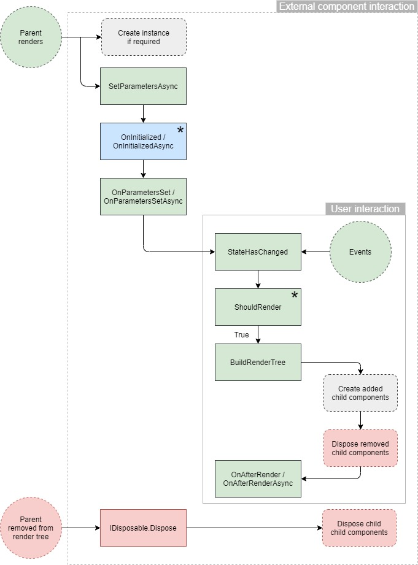
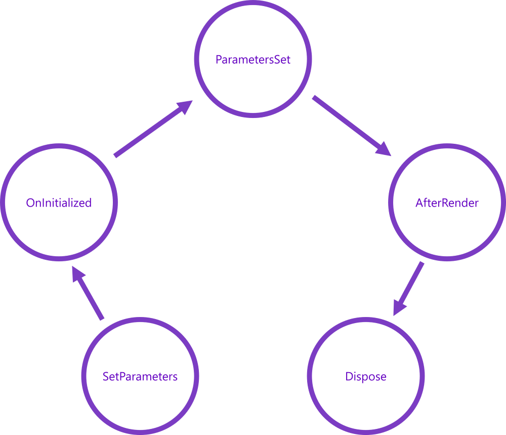
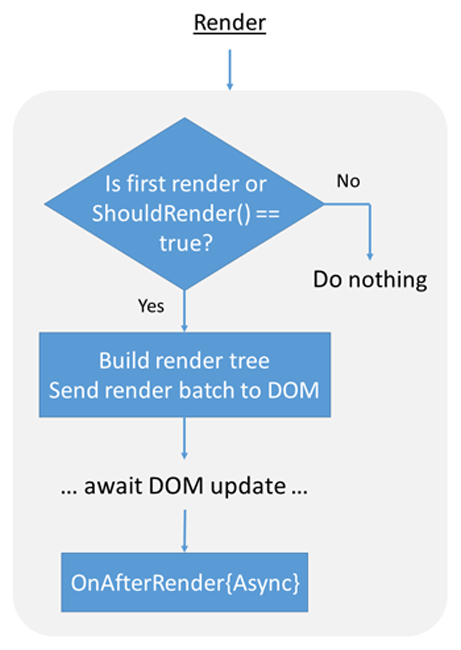
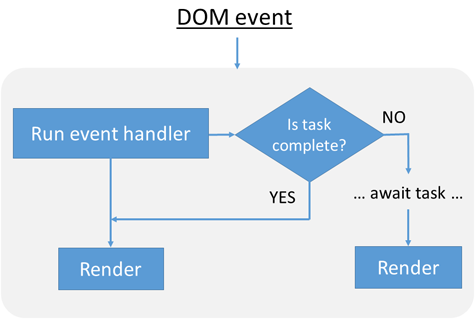
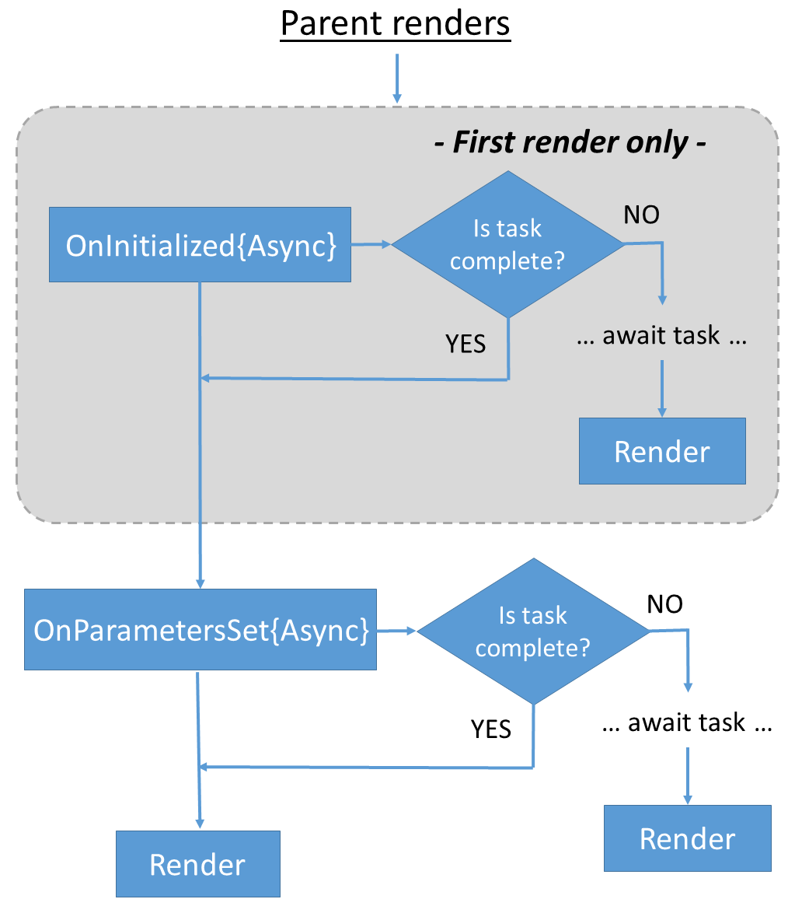
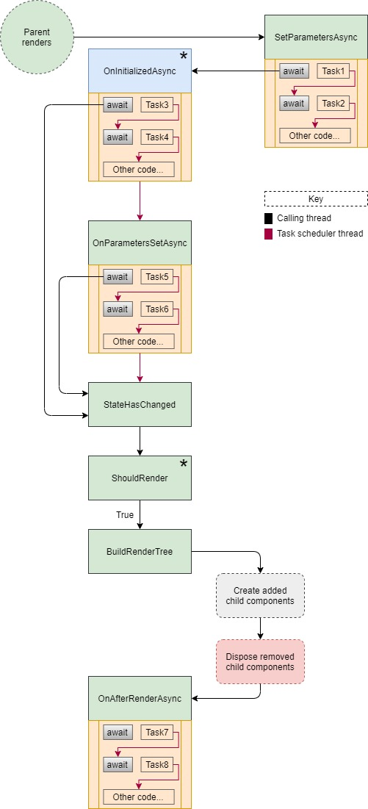
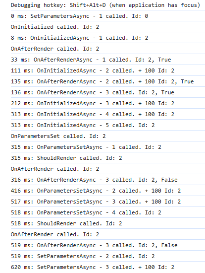

# 5.2. Komponens életciklus

A Blazor alapú fejlesztés alapvető feltétel, hogy értsük a Blazor életciklusát, ezért ezt most alaposan áttekintjük. Az életciklusa a [ComponentBase](https://github.com/dotnet/aspnetcore/blob/main/src/Components/Components/src/ComponentBase.cs) ősosztály határozza meg.

A Blazor komponensek számos virtuális metódussal rendelkeznek, amelyeket felüldefiniálva az alkalmazásunk viselkedését befolyásolhatjuk. Ezek a metódusok a komponens élettartama alatt különböző időpontokban futnak. Az előző laboron már használtunk egy ilyen eseményt az `InitializeAsync` a kezdőoldalon, hogy betöltsük a könyv listákat.

A következő ábra az életciklus-metódusok folyamatát vázolja fel. Itt csak az alapvető folyamatot nézzük, az aszinkronitás hatását még nem vizsgáljuk.


/// caption
Komponens életciklusa
///

Az ábrán láthatjuk, hogy

- milyen folyamat fut végig, ha egy szülő komponens renderel ki egy gyerek komponenst,
- az eseménykezelők után automatikusan fut a `StateHasChanged`,
- hogyan szűnik meg egy eltávolított komponens.

## Komponens életciklus metódusok

Tekintsük at a fontosabb virtuális metódusokat, amelyek meghívódnak egy komponens renderelése során. Ismerjük meg, hogy melyik mire való, mikor érdemes felüldefiniálni.

{ width="500" }
/// caption
Életciklus metódusok sorrendje (áttekintés)
///

### SetParametersAsync

A `SetParametersAsync` a szülőkomponenstől kapott vagy az URL-ben lévő paramétereket állítja be.

A `SetParametersAsync(ParameterView)` alapértelmezett implementációja beállítja az összes olyan `Parameter` vagy `CascadingParameter` attribútummal ellátott tulajdonság értékét, amelyhez tartozik megfelelő érték a `ParameterView`-ban. Azok a paraméterek, amelyekhez nem tartozik megfelelő érték, változatlanok maradnak.

Ha `await` szerel a metódusban, akkor az első `await`-nél folytatódik az életciklus a következő metódus meghívásával, ami egy új komponens esetén az `OnInitialized{Async}`, egyébként pedig az `OnParametersSet{Async}`

Fontos, hogy a `base.SetParametersAsync` metódust az `await` utasítások előtt kell meghívni, különben `InvalidOperationException`-t kapunk.

Általában ezt a metódust nem szoktuk felüldefiniálni.

### OnInitialized{Async}

A `OnInitialized{Async}` metódusokat arra használjuk, hogy egy komponenst inicializáljunk a teljes élettartamára. Azaz csak egyszer hívódik meg. Ebből következik, hogy a paraméterek változása nem befolyásolhatják az inicializálást. Tehát itt csak olyan adatokat szabad betölteni, melynek értéke nem függ a paraméterek változásától.

A `SetParametersAsync` után, vagy az `SetParametersAsync` első `await`-je után azonnal hívódik, miután már a paraméterek beállításra kerültek. Tehát az inicializáció során fel tudjuk használni a paraméterek aktuális értékét.

Szinkron inicializáció esetén a szülő inicializálása biztosan befejeződik a gyermekkomponens inicializálása előtt. Aszinkron esetben azonban ez nem garatálható. Gondoljunk bele, hogy a szülő komponenst több lassú aszinkron kérést is végrehajt, míg a gyerek komponens csak egy gyorsat.

Ha csak szinkron művelet szeretnénk végrehajtani, akkor az `OnInitialized` metódust definiáljuk felül, ami korábban hívódik mint az aszinkron. Ha szinkron és aszinkron műveletet is végre kell hajtani, akkor vagy válaszuk ketté és definiáljuk felül mindkét metódust, vagy az aszinkron elején végezzük el a szinkron műveteket.

Nem szükséges meghívni a `ComponentBase.OnInitializedAsync` metódust, kivéve ha egy egyedi ősosztályt használunk saját logikával.

A komponensnek biztosítania kell, hogy érvényes állapotban legyen a rendereléshez akkor is, amikor az `OnInitializedAsync` egy esetleg még be nem fejezett `Task`-ra vár.

Az első `await`-nél lefut egy render ciklus (a komponens kirenderelődik), felfüggesztve addig az `OnInitializedAsync` futását. A metódus teljes lefutása után folytatja a következő életciklus metódus `OnParametersSet{Async}` meghívásával, de nem hív `StateHasChanged`-et, mert azt majd az `OnParametersSet{Async}` biztosan ki fogja váltani.

Általában itt iratkozunk fel eseményekre is, azonban fontos, hogy ha feliratkoztunk valamilyen eseményre, akkor a `Dispose`-ban le kell róla iratkozni.

### OnParametersSet{Async}

Mikor hívódik meg?

- Az `OnParametersSet{Async}` a komponens inicializációja `OnInitialized{Async}` után fut.
- Vagy amikor a szülőkomponens újrarenderelődik és a következőket adja át:
    - Primitív vagy immutable (változhatatlan) típusok esetén, ha legalább egy paraméter megváltozott.
    - Komplex típusú paraméterek esetén a keretrendszer nem tudhatja, hogy a komplex típusú paraméter belső állapota megváltozott‑e, ezért a komplex típusú paramétert, a keretrendszer mindig úgy kezeli, mintha a megváltozott volna.

Az `OnParametersSet{Async}` akkor is meghívódhat, ha a paraméterértékek nem változtak. E miatt a fejlesztőnek ellenőriznie kell, hogy valóban megváltoztak-e a paraméterek, mielőtt újrainicializálná az ezekre az értékekre épülő adatokat vagy állapotot.

Itt is igaz, hogy az `OnParametersSet` az `OnParametersSetAsync` előtt fut.

Az első `await`-nél a metódus futása felfüggesztődik és lefut egy rendereli ciklus, amit egy `StateHasChanged` hívás vált ki. A metódus lefutása után végén hívódik egy `StateHasChanged`, tehát itt is lefut egy renderelés.

### OnAfterRender{Async}

Az `OnAfterRender{Async}` akkor kerül meghívásra, amikor a komponens már interaktívan kirenderelődött, és a felhasználói felület frissítése befejeződött, például miután az elemek bekerültek a böngésző DOM‑jába. Ezen a ponton az elem‑ és komponensreferenciák már rendelkezésre állnak.

Ezt a fázist arra érdemes használni, hogy további inicializálási lépéseket hajtsunk végre a renderelt tartalommal, például olyan JS‑interop hívásokat, amelyek a DOM‑elemekkel működnek együtt.

Az `OnAfterRenderAsync` esetében a komponens nem renderelődik újra automatikusan a visszaadott Task befejeződése után, hogy elkerülje a végtelen renderelési ciklust.

A szinkron metódus az aszinkron előtt fut le.

Az `OnAfterRender{Async}` kap egy `firstRender` paramétert, ezt tudjuk arra felhasználni, hogy az ittlévő inicializálások csak egyszer fussanak le.

{ width="350" }
/// caption
A renderelés folyamata
///

### Dispose

Ha egy komponens implementálja az `IDisposable` interfészt, akkor a Blazor meghívja a `Dispose` metódust, amikor a komponenst eltávolítják a szülő renderfájából, így lehetőségünk van leiratkozni a korábban feliratkozott eseményekről..

Ha nem használjuk a code behind-ot, akkor az `IDisposable` implementálásához hozzá kell adnunk az `@implements` kódsort a razor fájlhoz.

## Egyéb fontos függvények

A fenti metódusokon felül van egy pár kevésbé fontos, vagy kevésbé látványos is, amit szintén áttekintünk.

### StateHasChanged

A `StateHasChanged` értesíti a komponenst arról, hogy az állapota megváltozott. Meghívása egy újrarenderelést ütemez be, amely akkor fut le, amikor az alkalmazás fő szála felszabadul.

A `StateHasChanged` automatikusan meghívódik az `EventCallback` metódusok esetében.

#### Esemény kezelők

Az eseménykezelők lehetnek szinkronok vagy aszinkronok.

- Szinkron eseménykezelő esetén a `StateHasChanged` az eseménykezelő lefutása után hívódik meg.
- Aszinkron metódus esetén a `StateHasChanged` kétszer hívódik meg: egyszer, amikor a metódus szinkron része befejeződik, és másodszor akkor, amikor a feladat (Task) befejeződik.

{ width="400" }
/// caption
Eseménykezelő mikor vált ki renderelést
///

### ShouldRender

A `ShouldRender` minden egyes komponens rendereléskor meghívódik. Felüldefiniálásával szabályozható a felület frissítése. Ha a metódus visszatérési értéke `true`, a UI frissül.

Felüldefiniálásától függetlenül a komponens első renderelése mindig megtörténik. Az alapértelmezett implementáció mindig `true`-t ad vissza.

### BuildRenderTree

Vagy felüldefiniáljuk ezt a metódust, vagy Razor szintaxist használunk, hogy a fordító generálja ezt a metódust. Az osztályon belüli egyéb kódnak *nem szabad* közvetlenül meghívnia a `BuildRenderTree` metódust.

Ez a metódus a komponens tartalmát egy memóriában tárolt reprezentációba (RenderTree) rendereli, amely azt írja le, hogy mi jelenjen meg a felhasználó számára.

Más kliensoldali technológiák, mint például a React és az Angular, úgy kerülik el ezt a problémát, hogy Virtual DOM‑ot és Incremental DOM‑ot is alkalmaznak. A Virtual DOM a HTML‑oldalt felépítő elemek memóriabeli reprezentációja. Ez az adat egy HTML elemekből álló fát hoz létre, mintha az elemek egy HTML oldalon szerepelnének.

A Blazor komponensek ezt a Virtual DOM‑ot a Razor nézeteikben hozzák létre a `BuildRenderTree` metóduson keresztül.

A nézetet reprezentáló adatszerkezet felépítésének két jelentős előnye van:

- A virtuális HTML elemek attribútum értékei a kódban akár többször is módosíthatók egy összetett frissítési folyamat során anélkül, hogy a böngészőnek minden egyes módosítás után újra kellene renderelnie és újra kellene számolnia az elrendezést. A böngésző csak a folyamat végén frissít.
- A renderfák két fa összehasonlításával is létrehozhatók, majd egy olyan új fa építhető, amely a kettő közötti különbséget tartalmazza. Ez lehetővé teszi az Incremental DOM megközelítés alkalmazását.”

## Aszinkronitás hatása

A Blazor nem várja meg a hosszú ideig futó aszinkron metódusok befejeződését, mielőtt renderelné a komponenst, hanem a lehető leghamarabb elindítja a renderelést. Ez lehetővé teszi, hogy a komponens már akkor is megjelenítsen valamit, amikor a háttérben még olyan feladatokat végez, mint például az adatok lekérdezése a szerverről.

Az aszinkron metódus az első `await`-nél felfüggeszti a futását és egy renderelést indít a `StateHasChanged` meghívásával, hogy a felhasználónak ne kelljen várnia a frissítések megjelenésére.

{ width="400" }
/// caption
Aszinkronitás kezelése a komponens életciklusban.
///

Az `OnRenderAsync` kivételnek tűnhet, mivel egyik esetben sem végez további műveletet. Ha azonban figyelembe vesszük, hogy a renderelés az egész végrehajtási lánc lezárása, akkor inkább tekinthetjük a lánc befejezésének, mintsem "nem csinál semmit" állapotnak.  

Ami pedig az `await` utáni renderelést illeti: ha erre szükség van, azt a fejlesztőnek kell kifejezetten kezdeményeznie a `StateHasChanged` meghívásával, különben egy `await` az `OnAfterRenderAsync` metódusban végtelen ciklust okozna.


/// caption
Komponens életciklusa aszinkron eseményekkel
///

## Példa oldal

Hozzunk létre egy `Lifecycle` oldalt, ahol meg tudjuk nézni futás közben is, milyen sorrendben futnak az események.

- Használjunk itt is code behind-ot.
- Az oldal URL-je legyen `/lifecycle/{Id:int}`. Mivel int?-et nem lehet megadni a `@page "/lifecycle"` URL-t is felvettük az oldalhoz.

``` aspx-cs title="Lifecycle.razor"
@page "/lifecycle"
@page "/lifecycle/{Id:int}"
<h3>Component lifecycle</h3>
```

- Nem adtuk meg, hogy a ComponentBase-ből származik, mert ott van mellette a razor fájl és a code behind annak az osztálynak a másik fele `partial class`
- Várjuk az Id paramétert egy tulajdonságban, amit a razor fájlban adtunk meg `@page "/lifecycle/{Id:int}"`
- `Console.WriteLine` segítségével írunk a böngésző konzoljára (F12)
- Felüldefiniáltuk az életciklus metódusokat, és mindenhol kiírjuk, hogy lefutott
- Tettünk bele `await Task.Delay(100)` hívásokat, hogy lássuk mi történne ha ott egy aszinkron metódus futna.

``` csharp title="Lifecycle.razor.cs" hl_lines="6 8-9"
using Microsoft.AspNetCore.Components;
using System.Diagnostics;

namespace BookShop.Web.Client.Pages;

public partial class Lifecycle
{
    [Parameter]
    public int Id { get; set; }

    private Stopwatch stopwatch = new Stopwatch();

    public override async Task SetParametersAsync(ParameterView parameters)
    {
        stopwatch.Start();
        Console.WriteLine($"{stopwatch.ElapsedMilliseconds} ms: SetParametersAsync - 1 called. Id: {Id}");

        await base.SetParametersAsync(parameters);

        Console.WriteLine($"{stopwatch.ElapsedMilliseconds} ms: SetParametersAsync - 2 called. Id: {Id}");
        await Task.Delay(100); // Simulate async work

        Console.WriteLine($"{stopwatch.ElapsedMilliseconds} ms: SetParametersAsync - 3 called. + 100 Id: {Id}");
    }

    override protected void OnInitialized()
    {
        base.OnInitialized();
        Console.WriteLine($"OnInitialized called. Id: {Id}");
    }

    override protected async Task OnInitializedAsync()
    {
        Console.WriteLine($"{stopwatch.ElapsedMilliseconds} ms: OnInitializedAsync - 1 called. Id: {Id}");

        await Task.Delay(100); // Simulate async work
        Console.WriteLine($"{stopwatch.ElapsedMilliseconds} ms: OnInitializedAsync - 2 called. + 100 Id: {Id}");

        await Task.Delay(100); // Simulate async work
        Console.WriteLine($"{stopwatch.ElapsedMilliseconds} ms: OnInitializedAsync - 3 called. + 100 Id: {Id}");

        await Task.Delay(100); // Simulate async work
        Console.WriteLine($"{stopwatch.ElapsedMilliseconds} ms: OnInitializedAsync - 4 called. + 100 Id: {Id}");

        await base.OnInitializedAsync();
        Console.WriteLine($"{stopwatch.ElapsedMilliseconds} ms: OnInitializedAsync - 5 called. Id: {Id}");
    }

    protected override void OnParametersSet()
    {
        base.OnParametersSet();
        Console.WriteLine($"OnParametersSet called. Id: {Id}");
    }

    protected override async Task OnParametersSetAsync()
    {
        Console.WriteLine($"{stopwatch.ElapsedMilliseconds} ms: OnParametersSetAsync - 1 called. Id: {Id}");

        await Task.Delay(100); // Simulate async work
        Console.WriteLine($"{stopwatch.ElapsedMilliseconds} ms: OnParametersSetAsync - 2 called. + 100 Id: {Id}");

        await Task.Delay(100); // Simulate async work
        Console.WriteLine($"{stopwatch.ElapsedMilliseconds} ms: OnParametersSetAsync - 3 called. + 100 Id: {Id}");

        await base.OnParametersSetAsync();
        Console.WriteLine($"{stopwatch.ElapsedMilliseconds} ms: OnParametersSetAsync - 4 called. Id: {Id}");
    }

    protected override bool ShouldRender()
    {
        Console.WriteLine($"{stopwatch.ElapsedMilliseconds} ms: ShouldRender called. Id: {Id}");
        return base.ShouldRender();
    }

    protected override void OnAfterRender(bool firstRender)
    {
        base.OnAfterRender(firstRender);
        Console.WriteLine($"OnAfterRender called. Id: {Id}");
    }

    protected override async Task OnAfterRenderAsync(bool firstRender)
    {
        if( firstRender)
        {
            Console.WriteLine($"{stopwatch.ElapsedMilliseconds} ms: OnAfterRenderAsync - 1 called. Id: {Id}, {firstRender}");

            await Task.Delay(100); // Simulate async work
            Console.WriteLine($"{stopwatch.ElapsedMilliseconds} ms: OnAfterRenderAsync - 2 called. + 100 Id: {Id}, {firstRender}");
        }

        await base.OnAfterRenderAsync(firstRender);
        Console.WriteLine($"{stopwatch.ElapsedMilliseconds} ms: OnAfterRenderAsync - 3 called. Id: {Id}, {firstRender}");
    }
}
```

A fenti kódot futtatva a `/lifecycle/2` az alábbi sorrend jelenik meg a konzolon.

- Érdemes figyelni, hogy az ID érték mikor állítódik be, hiszen az egy `[Parameter]`.
- Érdemes a várakozási időt változtatni, hogy akkor hogyan változnak a hívások sorrendjei, hiszen a kód csak egy szálon tud futni.

{ width="350" }
/// caption
Komponens életciklus sorrendje futás közben.
///
