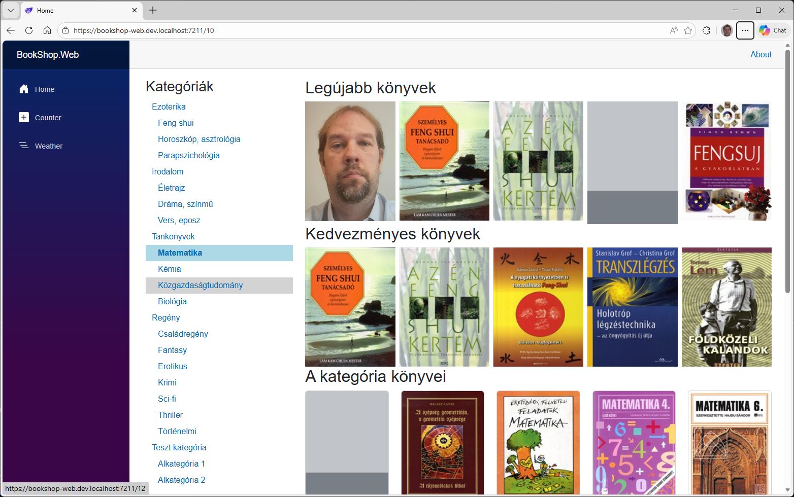
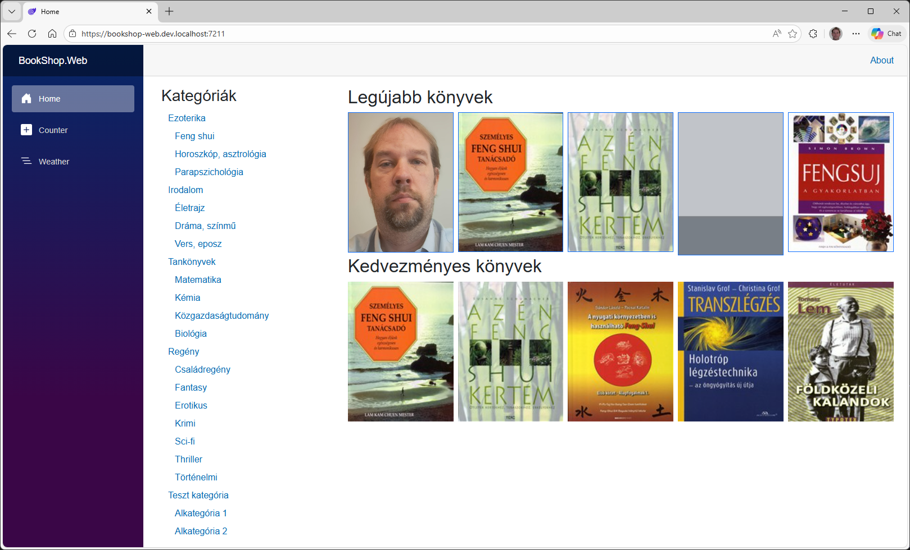
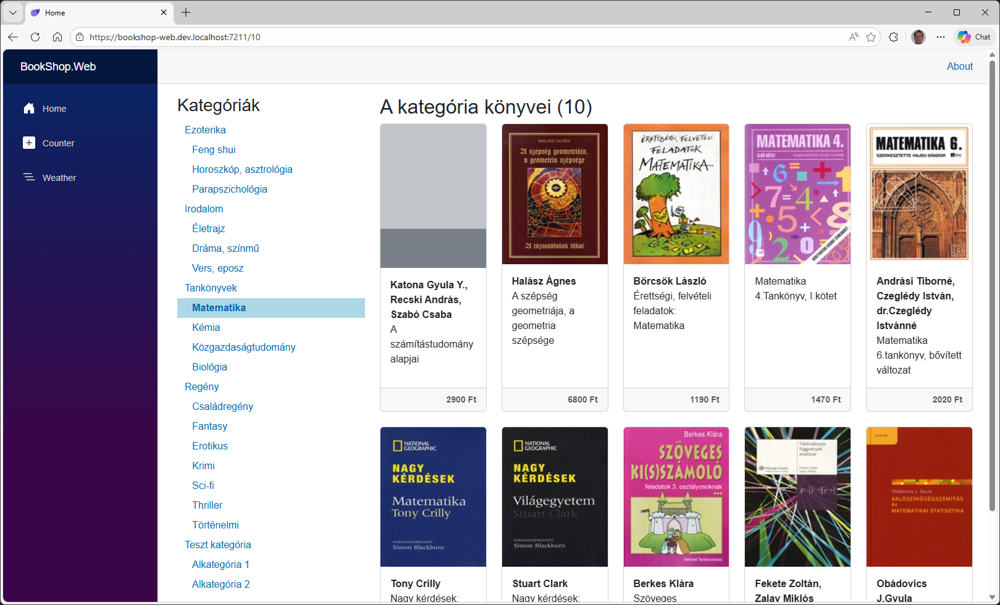
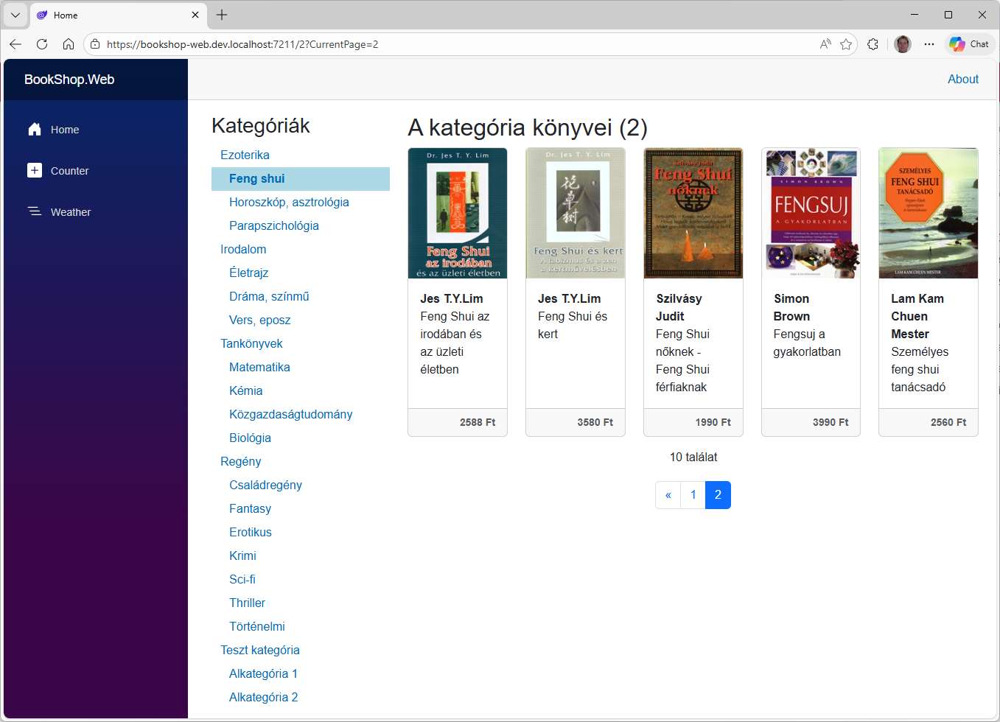
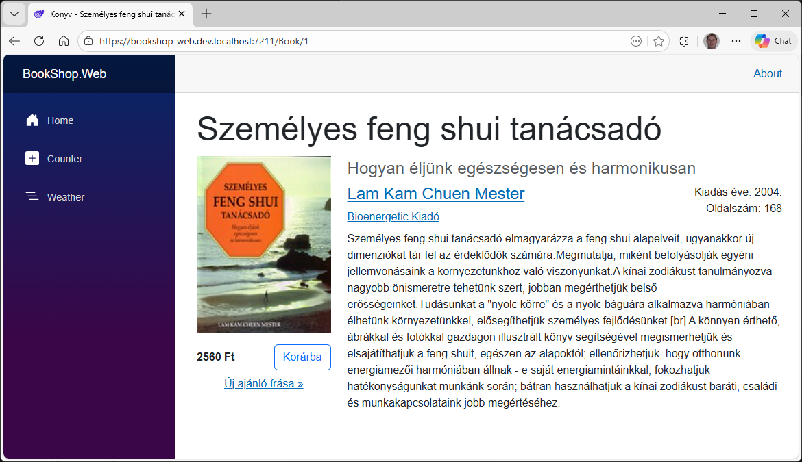

# 5.3. Kategóriák és könyvek

## Kategória fa

Készítsük el a kategóriafát! A fához szükségünk van az összes kategóriára, amelyeket megfelelően fogunk egymás alá rendezni. A kategóriafa az `Home` oldalra kerül, viszont úgy valósítjuk meg, hogy könnyen fel lehessen használni más oldalon is. Ehhez a kategóriafát `Component`-ként készítjük el, mert így összeköthetjük az adatlekérést és megjelenítését és egy újrafelhasználható komponenst tudunk készíteni.

1. A kategória fa megjelenítéséhez szükséges backend oldali kód már készen van.
    - Az adatmodell a `CategoryData`, amit a `BookShop.Transfer.Dtos` mappában találunk.
    - A szolgáltatás interfésze az `ICategoryService` a `BookShop.Bll.ServicesInterfaces` mappában található
    - A BLL service is készen van `CategoryService`, amit a `BookShop.Bll.Services` mappában találunk.
    - A DI-ba is beregisztráltuk a BLL projektben található `Wireup.cs` fájlban.
    - A Web-es projektben is elkészült a `CategoryController` és abból generálódik is az `BookShop.API` projektben a `CategoryClient`.

2. A kategóriák sorrendezésénél azt a trükköt használjuk ki, hogy az `Order` egy sztring és a sorrendet egy ponttal elválaszott számsor határozza meg. Pl: 01.02 azt jelenti, hogy az 1-es kategória alatt a 2. a sorrendben. Tehát ha e szerint rendezzük akkor megfelelő sorrendben kapjuk meg a teljes listát, és a pontok száma meghatározza a szintet is. Így valójában a `ParentCategory` és `ChildCategories` navigációs tulajdonságokat nem is használjuk. (Csak azokkal is meg lehetne oldani, de az bonyolultabb kódot igényelne.)

3. A `BookShop.Web.Client` projektben hozzunk létre egy `Components` könyvtárat és abba a `CategoryList`-et, ami egy Razor Component.
    - Állítsuk be, hogy az oldal code behind-ot használjon
    - A code behind-ban az `OnInitializedAsync`-ban kérdezzük le az összes kategóriát.
    - A razor oldalon pedig az egyes kategóriákhoz jelenítsünk meg egy NavLinket, amiben szerepel a kategória neve

    ``` csharp title="CategoryList.razor.cs"
    using BookShop.Api;
    using BookShop.Transfer.Dtos;

    namespace BookShop.Web.Client.Components;

    public partial class CategoryList(ICategoriesClient categoriesClient)
    {
        public IList<CategoryData> Categories { get; set; } = [];

        protected override async Task OnInitializedAsync()
        {
            Categories = await categoriesClient.GetCategoryTreeAsync();

            await base.OnInitializedAsync();
        }
    }
    ```

    ??? tip "Mi a különbség a component és page között"
        A page egy olyan component, ami route-olható a `@page` direktívában megadott URL-nek köszönhetően.

4. A hozzá tartozó nézet is készítsük el.

    ``` aspx-cs title="CategoryList.razor"
    <h3>Kategóriák</h3>

    <div class="categories">
        @foreach (var category in Categories)
        {
            <NavLink href="@($"/{category.Id}")" Match="NavLinkMatch.All" ActiveClass="active">
                <div class="category level-@category.Level">
                    @category.Name
                </div>
            </NavLink>
        }
    </div>
    ```

    Figyeljük meg, hogy a `NavLink`-en megadtunk, hogy ha a teljes URL megegyezik, akkor tegye rá az `active` CSS osztályt.

5. A kategóriafát jelenleg az *Home* oldalra szeretnénk kitenni, ezért nyissuk meg az `Home.razor`-t. Bal oldalra szeretnénk tenni a kategória listát, jobb oldalra a könyveket, tehát annyi a dolgunk, hogy kialakítjuk a két hasábot és a bal oldaliba betesszük a `CategoryList` komponenst. Illetve a `@page` mögé adjuk meg, hogy vár egy opcionális `categoryId` paramétert is.
Ehhez az alábbi módosítás szükséges:

    ``` aspx-cs title="Home.razor.cs" hl_lines="1 3 7-10 12 15-16"
    @page "/{categoryId:int?}"
    @using BookShop.Transfer.Enums
    @using BookShop.Web.Client.Components

    <PageTitle>Home</PageTitle>

    <div class="row">
        <div class="col-md-3">
            <CategoryList />
        </div>

        <div class="col-md-9">
            <h2>Legújabb könyvek</h2>
            ...
        </div>
    </div>
    ```

6. Ha nem szeretnénk minden oldalon külön using-olni egy névteret a razor fájlokban, akkor azt érdemes felvenni az `_Imports.razor` fájlba, mert az itt lévő elemeket nem kell külön using-olni az egyes oldalakon.  
Vegyük az az `_Imports.razor` fájlba a `BookShop.Web.Client.Components`-et.

    ``` aspx-cs title="_Imports.razor" hl_lines="11"
    @using System.Net.Http
    @using System.Net.Http.Json
    @using Microsoft.AspNetCore.Components.Forms
    @using Microsoft.AspNetCore.Components.Routing
    @using Microsoft.AspNetCore.Components.Web
    @using static Microsoft.AspNetCore.Components.Web.RenderMode
    @using Microsoft.AspNetCore.Components.Web.Virtualization
    @using Microsoft.JSInterop
    @using BookShop.Web.Client
    @using BookShop.Web.Client.Layout
    @using BookShop.Web.Client.Components
    ```

7. A kinézettel még van egy pár dolgunk, ami miatt CSS-t kell írnunk. Az alkalmazás CSS fájljába `BookShop.Web\wwwroot\css\site.css` vegyük fel az alábbi szabályokat.
    - A kategóriákat úgy jelenítsük meg, hogy látszódjon a behúzás az alkategóriák szerint. Ehhez a kategóriát jelző `div` elemekre már tettünk egy category és egy `level-X` osztályt, ezeket definiáljuk megfelelően az alkalmazáshoz tartozó CSS fájlunkban.
    - Állítsuk be azt is, hogy a kategória fában a linkek ne legyenek aláhúzva.
    - Az `active` CSS osztályt is definiáljuk, ami a kiválasztott kategória megjelenését határozza meg. Ezt az osztályt tettük rá a `<NavLink>`-ben.
    - Adjunk meg egy háttérszínt arra is, ha az egeret egy kategória elem fölé visszük.

    ``` css title="site.css"
    .categories .category.level-1 {
        padding-left: .75rem;
    }

    .categories .category.level-2 {
        padding-left: 1.5rem;
    }

    .categories .category.level-3 {
        padding-left: 2.25rem;
    }

    .categories > a {
        text-decoration: none;
        display: block;
        padding: 0.25rem 0;
    }

    .categories > a:hover {
        background-color: lightgray;
    }

    .categories > a.active {
        font-weight: bold;
        background-color: lightblue;
    }
    ```

    CSS-t írhatunk pl. SASS transpilerrel (.scss) is, ami több lehetőséget biztosít fejlesztéshez, a fentit pl. ún. mixinekkel tudnánk generálni egy ciklusban.  
    A stíluslapok statikus fájlok, amelyek alapértelmezetten cache-elődnek a böngészőben, ezért szükséges lehet a cache ürítése (++ctrl+f5++ vagy ++ctrl+r++ bizonyos böngészőkben, vagy az ++f12++ eszköztár Network fülén beállítható).

8. Megjelennek szépen a kategóriák, de hiába kattintunk egy elemre, az csak az URL-be kerül bele a `categoryId`-t, de a kategória könyvei lista nem változik.  
Ennek az oka, hogy a code-behind-ban nincs `categoryId` paraméterünk és nem azzal hívjuk meg a kategória könyveinek a lekérdezését.  
Módosítsuk a kódot az alábbiak szerint. A kiemelt sorok az újak vagy azok változtak.

    ``` csharp title="Home.razor.cs" hl_lines="1-2 13"
    [Parameter]
    public int? CategoryId { get; set; }

    public IList<BookData> NewestBooks { get; set; } = [];
    public IList<BookData> DiscountedBooks { get; private set; } = [];
    public IList<BookData> Books { get; private set; } = [];

    protected override async Task OnInitializedAsync()
    {
        // Query book data from the server
        NewestBooks = await booksClient.GetNewestBooksAsync(5);
        DiscountedBooks = await booksClient.GetDiscountedBooksAsync(5);
        Books = await booksClient.GetBooksAsync(CategoryId ?? 1);
    }
    ```

9. Továbbra sem módosulnak a kategória könyvei, pedig már a `categoryId`-t helyesen kezeljük. A probléma, hogy rossz életciklus metódust használunk.
    - A legújabb és kedvezményes könyveket helyesen az `OnInitializedAsync`-ban töltjük be egyszer, hiszen az a lista nem változik paraméterektől.
    - Viszont a kategória könyvei az URL-ben lévő `categoryId`-tól függenek így azt az `OnParametersSetAsync`-ban kell tölteni, hiszen az meghívódik ha valamelyik paraméter változik.

    ``` csharp title="Home.razor.cs" hl_lines="14 21 24-29"
    using BookShop.Api;
    using BookShop.Transfer.Dtos;
    using Microsoft.AspNetCore.Components;

    namespace BookShop.Web.Client.Pages;

    public partial class Home(IBooksClient booksClient)
    {
        [Parameter]
        public int? CategoryId { get; set; }

        public IList<BookData> NewestBooks { get; set; } = [];
        public IList<BookData> DiscountedBooks { get; private set; } = [];
        public IList<BookData> Books { get; private set; } = [];

        protected override async Task OnInitializedAsync()
        {
            // Query book data from the server
            NewestBooks = await booksClient.GetNewestBooksAsync(5);
            DiscountedBooks = await booksClient.GetDiscountedBooksAsync(5);
            // Books = await booksClient.GetBooksAsync(CategoryId ?? 1);
        }

        protected override async Task OnParametersSetAsync()
        {
            Books = await booksClient.GetBooksAsync(CategoryId ?? 1);

            await base.OnParametersSetAsync();
        }
    }
    ```

    - A könyv listát az `OnInitializedAsync`-ban nem töltjük fel, mert az `OnParametersSetAsync` lefut az inicializáció után, így nem kérjük le fölöslegesen.
    - Alapértelmezés szerint üres listára állítjuk be a `Books`ot, hogy a köztes renderelésnél ne legyen gond.
    - Az `OnParametersSetAsync` bármely paraméter változásakor lefut, így érdemes lehet logikát építeni arra, hogy csak akkor töltsük be a kategória könyveit ha a `CategoryId` változik.

10. Nézzük meg az elkészült kategória fát
??? success "Elkészült kategóriafa működés közben"
    
    /// caption
    Az elkészült kategóriafa.
    ///

## Könyvlista komponens

A kezdő oldalon három különböző könyvlistát is megjelenítünk, így érdemes lehet egy újrafelhasználható komponenst készíteni erre is.

A cél az lenne, hogy a komponens megkapja a szükséges paramétereket, amiből le tudja tölteni és meg is tudja jeleníteni a könyvlistát, csökkentve a kód duplikációt és növelve az átláthatóságot.

1. A `BookShop.Transfer` projektbe az `Enums` mappába vegyünk fel egy `BookListType` osztályt, az alábbi tartalommal. Ez lenne az a paraméter, hogy mit és milyen formában kell megjeleníteni.

    ``` csharp title="BookListType.cs"
    namespace BookShop.Transfer.Enums;

    public enum BookListType
    {
        Category = 0,

        Newest = 1,

        Discounted = 2
    }
    ```

2. A megjelenítés módjára is vegyünk fel egy *enum*-ot, de mivel ez csak a megjelenítésnél kell ezért a `BookShop.Web.Client` projektben hozzunk létre egy `Models` könyvtárat és ott  hozzuk létre a `BookDisplayMode` enum típust.

    ``` csharp title="BookDisplayMode.cs"
    namespace BookShop.Web.Client.Models;

    public enum BookDisplayMode
    {
        ImageOnly = 0,
        Card = 1,
    }
    ```

3. A `BookShop.Transfer.Enums`-ot és `BookShop.Web.Client.Models`-t is vegyük fel az `_Imports.razor` végére.

    ``` csharp title="_Imports.razor"
    @using BookShop.Web.Client.Models
    @using BookShop.Transfer.Enums
    ```

4. A `BookShop.Web.Client` projektben a `Components` mappába hozzuk létre a `BookList` komponenst és állítsuk be, hogy code behind-ot használjon. Ahhoz, hogy tényleg rugalmas legyen az alábbi paramétereket kell megkapnia.
    - Ha van kiválasztott kategória, akkor annak az ID-ja
    - Milyen listát kell megjelenítenie `BookListType`.
    - Hány elemet kell megjelenítenie, alapértelmezés szerint 5 db-ot.
    - Cím, amit meg kell jeleníteni a lista felett.

5. Mivel a fentiek a szülő komponenstől jönnek (`Home.razor`), ezért az adatokat az `OnParametersSetAsync`-ban kell feltölteni.

    ``` csharp title="BookList.razor.cs" hl_lines="8 25 27-38"
    using BookShop.Api;
    using BookShop.Transfer.Dtos;
    using BookShop.Transfer.Enums;
    using Microsoft.AspNetCore.Components;

    namespace BookShop.Web.Client.Components;

    public partial class BookList(IBooksClient booksClient)
    {
        [Parameter]
        public int? CategoryId { get; set; }

        [Parameter]
        public BookListType Type { get; set; }

        [Parameter]
        public BookDisplayMode DisplayMode { get; set; }

        [Parameter]
        public string Title { get; set; } = string.Empty;

        [Parameter]
        public int Count { get; set; } = 5;

        public IList<BookData> Books { get; private set; } = [];

        protected override async Task OnParametersSetAsync()
        {
            Books = Type switch
            {
                BookListType.Category => CategoryId.HasValue ? await booksClient.GetBooksAsync(CategoryId.Value) : [],
                BookListType.Newest => await booksClient.GetNewestBooksAsync(Count) : [],
                BookListType.Discounted => await booksClient.GetDiscountedBooksAsync(Count) : [],
                _ => [],
            };

            await base.OnParametersSetAsync();
        }
    }
    ```

6. Készítsük el a megjelenítés vázát is.
    - Ha üres a könyv lista akkor az egész komponens ne jelenjen meg.
    - Illetve ketté kell választani a megjelenítést az DisplayMode értéke alapján.

    ``` aspx-cs title="BookList.razor"
    @if (Books.Any())
    {
        <h2>@Title</h2>

        @if (DisplayMode == BookDisplayMode.ImageOnly)
        {
            
        }
        else if (DisplayMode == BookDisplayMode.Card)
        {
            
        }
    }
    ```

7. Ezt követően a `Home` oldalról hozzuk át kétféle megjelenítést a megfelelő ágakba. A listát tartalmazó `div`-nél használjuk bátran a Count tulajdonságot.

    ``` aspx-cs title="BookList.razor"
    @if (DisplayMode == BookDisplayMode.ImageOnly)
    {
        <div class="@($"row row-cols-{Count} g-2")">
            @foreach (var book in Books)
            {
                <a href="@($"Book/{book.Id}")" class="col">
                    
                </a>
            }
        </div>
    }
    else if (DisplayMode == BookDisplayMode.Card)
    {
        <div class="row row-cols-2 row-cols-md-3 row-cols-lg-4 row-cols-xl-5 g-4">
            @foreach (var book in Books)
            {
                <div class="col">
                    <div class="card h-100">
                        <a href="@($"Book/{book.Id}")">
                            
                        </a>

                        <div class="card-body">
                            <div class="card-title fw-bold mb-0">
                                @string.Join(", ", book.Authors.Select(x => x.Name))
                            </div>
                            <p class="card-text">
                                @book.Title
                            </p>
                        </div>
                        <div class="card-footer text-end text-muted fw-bold small">
                            @(book.DiscountedPrice ?? book.Price)&nbsp;Ft
                        </div>
                    </div>
                </div>
            }
        </div>
    }
    ```

8. Adjuk hozzá a `BookList` komponenst a *Home* oldalhoz. A teljes jobb oldali részt le kell cseréni a lenti kódra.

    ``` aspx-cs title="Home.razor"
    <div class="col-md-9">
        @if (CategoryId is null)
        {
            <BookList Type="BookListType.Newest" DisplayMode="BookDisplayMode.ImageOnly" Title="Legújabb könyvek" />

            <BookList Type="BookListType.Discounted" DisplayMode="BookDisplayMode.ImageOnly" Title="Kedvezményes könyvek" />
        }
        else
        {
            <BookList Type="BookListType.Category" DisplayMode="BookDisplayMode.Card" CategoryId="@CategoryId" Title="@($"A kategória könyvei ({CategoryId})")" />
        }
    </div>
    ```

    - Figyeljük meg, hogy az oldalon döntjük el, hogy mikor melyik listát jelenítjük meg, és így csak a kategória könyveit megjelenítő listának adjuk át a kategória azonosítót.

9. Módosítsuk a `Home.razor.cs` fájlt is, hiszen már nem kell feltölteni a listákat, mert mindent a `BookList` komponenst old meg, egyedül a CategoryId paraméterre van szükségünk.

``` csharp title="Home.razor.cs"
using Microsoft.AspNetCore.Components;

namespace BookShop.Web.Client.Pages;

public partial class Home()
{
    [Parameter]
    public int? CategoryId { get; set; }
}
```

### Komponens egyedi template

1. Előfordulhat az az eset, hogy egy oldalon a könyvlistát másképpen szeretnénk megjeleníteni. Ekkor vagy bővítjük a `BookDisplayMode` *enum*-ot vagy lehetőséget adunk egyedi Template megadására. Most ez utóbbi megoldást nézzük meg.

2. Adunk egy `RenderFragment<BookData>` típusú opcionális paramétert a komponenshez. Ez ad arra lehetőséget, hogy egyedi template-et adhassunk majd meg a felhasználáskor.

    ``` csharp title="BookList.razor.cs"
    [Parameter]
    public RenderFragment<BookData>? ItemTemplate { get; set; }
    ```

3. Módosítsuk a megjelenítést úgy, hogyha megadták az `ItemTemplate`-et akkor azt használjuk, egyébként az eddigi megjelenítést.

    ``` aspx-cs title="BookList.razor" hl_lines="5 10"
    @if (Books.Any())
    {
        <h2>@Title</h2>

        @if (ItemTemplate is not null)
        {
            <div class="@($"row row-cols-{Count} g-2")">
                @foreach (var book in Books)
                {
                    @ItemTemplate(book)
                }
            </div>
        }
        else
        {

        }
    }
    ```

    Az `@ItemTemplate(book)` sor segítségével adjuk meg, hogy a megapott `RenderFragment`-et renderelje ki. Mivel a RenderFragment várt egy típus paramétert is a `BookData`-t, ezért át kell adjuk a `book`-ot, hogy annak az adatait jelenítse meg.

4. Használjuk ezt a *Home* oldalon. Ehhez a legújabb könyveket megjelenítő listánál adjunk meg egy `ItemTemplate`-et (így hívját a RenderFragment típusú paramétert a `BookList`-ben) melyben definiáljuk, hogyan kell egy könyvet megjeleníteni. A `context` típusa megegyezik az ItemTemplate-nek megadott típussal azaz `BookData`. Használhatjuk a template-ben ugyanazt a kódot, mint a korábbi megjelenítésénél csak adjuk hozzá a `border-primary` CSS osztályt a képhez, hogy lássuk tényleg ez a kód fut le.

    ``` aspx-cs title="Home.razor" hl_lines="2-7"
    <BookList Type="BookListType.Newest" DisplayMode="BookDisplayMode.ImageOnly" Title="Legújabb könyvek">
        <ItemTemplate>
            <a href="@($"Book/{context.Id}")" class="col">
                
            </a>
        </ItemTemplate>
    </BookList>
    ```

??? success "Elkészített kezdőoldal"
    
    /// caption
    Kezdő oldal a könyv listázó komponenssel
    ///

    
    /// caption
    Kezdő oldal a könyv listázó komponenssel, kiválasztott kategória
    ///

## Lapozott könyv lista

Lapozott listák megjelenítése nagyon gyakori feladat, amit a *BookShop* projektben is meg kell valósítanunk. A feladat nagyon jól általánosítható a generikus listák használatával. Mi is egy ilyen megoldást fogunk elkészíteni.  
Egy lapozott lista megjelenítéséhez két feladatot kell megvalósítani. Egyfelől az adatbázis lekérdezésnél a `Skip()` és `Take()` segítségével csak annyi adatot kell lekérdezni az adatbázisból, amennyit meg kell jeleníteni, másfelől szükséges egy lapozó komponensnek a megvalósítása, amivel az egyes oldalak között tudunk navigálni.

1. Nézzük meg a `BookShop.Transfer` projektben a `PagedList` osztályt. Ez az osztály fogja nyilvántartani egy adott oldalon megjelenő elemeket egy generikus listában és azt, hogy összesen hány elem van.

    ``` csharp title="PagedList.cs"
    namespace BookShop.Transfer.Common;

    public class PagedList<T>
    {
        public int TotalItems { get; set; }

        public IList<T> Items { get; set; } = [];
    }
    ```

2. Nézzük meg a `BookShop.Bll` projektben található `PagedListHelper` metódust. Ezt a bővítő metódust meg tudjuk hívni egy query-n és ha átadjuk neki, hogy hány elemet kérdezzen le és mennyit ugorjon át, akkor meg is kapjuk az aktuális oldalon lévő elemeket és az összes elemszámot.

    ``` csharp title="PagedListHelper.cs"
    using BookShop.Transfer.Common;
    using Microsoft.EntityFrameworkCore;

    namespace BookShop.Bll.Helpers;

    public static class PagedListHelper
    {
        public static async Task<PagedList<TQuery>> ToPagedListAsync<TQuery>(this IQueryable<TQuery> source, int? skip, int? top)
        {
            var totalItems = await source.CountAsync();

            if (top is not null)
                source = source.Skip(skip ?? 0).Take(top.Value);

            return new PagedList<TQuery>
            {
                Items = await source.ToListAsync(),
                TotalItems = totalItems
            };
        }
    }
    ```

3. A kódban szerepel még egy `LoadDataArgs` osztály is, amiben jelenleg egy `Skip` és egy `Top` tulajdonság szerepel.

    ``` csharp title="LoadDataArgs.cs"
    namespace BookShop.Transfer.Common;

    public class LoadDataArgs
    {
        /// <summary>
        /// Gets how many items to skip. Related to paging and the current page. Usually used with the <see cref="Enumerable.Skip{TSource}(IEnumerable{TSource}, int)"/> LINQ method.
        /// </summary>
        public int? Skip { get; set; }

        /// <summary>
        /// Gets how many items to take. Related to paging and the current page size. Usually used with the <see cref="Enumerable.Take{TSource}(IEnumerable{TSource}, int)"/> LINQ method.
        /// </summary>
        /// <value>The top.</value>
        public int? Top { get; set; }
    }
    ```

    Ezt arra használjuk, hogy amikor lapozott listát kell betölteni, ezzel definiáljuk, hogy a szerver hány elemet adjon vissza és melyik oldalon.

4. Így már megnézhetjük a `BookService`-ben a `GetBooksPagedAsync` metódust, ami a fenti kódoknak hála nagyon egyszerűen vissza tudja adni az adott oldalon lévő könyvek listáját.

    ``` csharp title="BookService.cs" hl_lines="1 7"
    public async Task<PagedList<BookData>> GetBooksPagedAsync(int? categoryId, LoadDataArgs? args)
    {
        var books = await dbContext.Books
            .Where(x => !categoryId.HasValue || x.CategoryId == categoryId.Value)
            .OrderBy(x => x.Title)
            .ProjectTo<BookData>(mapper.ConfigurationProvider)
            .ToPagedListAsync(args?.Skip, args?.Top);

        return books;
    }   
    ```

### Pager Component

Ahhoz, hogy tényleg lehessen lapozgatni a felületen készíteni kell egy újrafelhasználható komponenst, ami megjeleníti a linkeket az egyes oldalakhoz. Tehát készítenünk kell egy `Pager` komponenst.

1. A `BookShop.Web.Client/Components` mappában hozzuk létre a `Pager` Razor Component-et, code behind használatával.
    - Injektáljuk a `NavigationManager`-t
    - Definiáljuk a lapozáshoz szükséges tulajdonságokat
    - Az `OnParametersSet`-ben olvassuk ki egy dictionary-be a query string paramétereket és a `CurrentPage`-et állítsuk üresre.
    - Készítsünk egy `ToPage(int pageNumber)` metódust, ami a `CurrentPage` értékékét beállítja a paraméterül megkapottra, majd generál egy linket, ami az adott oldalra mutat a query string paraméterekkel.

    ``` csharp title="Pager.razor.cs"
    using BookShop.Web.Client.Extensions;
    using Microsoft.AspNetCore.Components;

    namespace BookShop.Web.Client.Components;

    public partial class Pager(NavigationManager navigationManager)
    {
        [Parameter]
        public int TotalItems { get; set; }

        [Parameter]
        public int CurrentPage { get; set; } = 1;

        [Parameter]
        public int PageSize { get; set; } = 10;

        [Parameter]
        public int PagesToShow { get; set; } = 3;

        public int TotalPages => (int)Math.Ceiling((double)TotalItems / PageSize);

        private Dictionary<string, object?> allRouteData = [];

        protected override void OnParametersSet()
        {
            // Read the query string parameters into a dictionary, to be able to construct navigation links with all query string data.
            allRouteData = navigationManager.QueryString().ToDictionary();
        }

        public string ToPage(int pageNumber)
        {
            allRouteData[nameof(CurrentPage)] = pageNumber.ToString();
            return navigationManager.GetUriWithQueryParameters(allRouteData);
        }
    }
    ```

    Mint látható a komponens megkapja az oldalméretet, az aktuális oldal számát, az összes találat számát és egy olyan paramétert, hogy az aktuális oldal körül mennyi linket kell megjeleníteni.
    A cél az alábbi kinézetű lapozó megvalósítása, tehát egyszerre maximum 7 számozott oldallink és az első / utolsó oldalra mutató linknek kell látszódnia. Természetesen az első oldalon nem látszódik a `<<` az utolsó oldalon pedig a `>>` link, sőt ha csak 1 oldal van, akkor az egész lapozó nem látszódik.

2. Készítsük el az oldal megjelenítését is.

    ``` aspx-cs title="Pages.razor"
    @using BookShop.Web.Client.Extensions

    @if (TotalPages > 1)
    {
        <nav>
            <ul class="pagination justify-content-center">
                @* Link for the fist page. *@ 
                @if (CurrentPage > 1)
                {
                    <li class="page-item">
                        <a href="@ToPage(1)" class="page-link"><span>&laquo;</span></a>
                    </li>
                }

                @* Links in the middle with page numbers. *@
                @for (var pageNumber = Math.Max(1, CurrentPage - PagesToShow); pageNumber <= Math.Min(TotalPages, CurrentPage + PagesToShow); pageNumber++)
                {
                    @if (CurrentPage == pageNumber)
                    {
                        <li class="page-item active"><a class="page-link">@pageNumber</a></li>
                    }
                    else
                    {
                        <li class="page-item">
                            <a href="@ToPage(pageNumber)" class="page-link">@pageNumber</a>
                        </li>
                    }
                }

                @* Link for the last page *@ 
                @if (CurrentPage < TotalPages)
                {
                    <li class="page-item">
                        <a href="@ToPage(TotalPages)" class="page-link">
                            <span aria-hidden="true">&raquo;</span>
                        </a>
                    </li>
                }
            </ul>
        </nav>
    }
    ```

3. A fenti kódban feltűnhet, hogy nem a linkeknél egy saját metódust hívunk meg, ami a `NavigationManager.GetUriWithQueryParameters` metódust használja a linkek generálására. Az szeretnénk elérni, hogy minden más *QueryString* paraméter megmaradjon, azok is, amit más állított be. Ilyen például, ha egy kategórián belül lapozunk, hiszen ez a komponens a `CurrentPage`-t állítja csak míg a `CategoryList` komponenst beállítja a categoryId-t, amit nem szabad lapozáskor elveszíteni.

4. Ahhoz, hogy használni is tudjuk ki kell egészíteni a `BookList` komponenst, hogy lapozott listát is meg tudjon jeleníteni.
    - vegyünk fel egy `PagedBooks` tulajdonságot, amiben az lapozott lista elemek lesznek és egy `UsePager` paramétert, ami meghatározza, hogy szükséges-e lapozáshoz.
    - Vegyük fel a `CurrentPage` és `PageSize` opcionális paramétereket is, amit queryString-ből jönnek (`SupplyParameterFromQuery`)
    - Két konstansa vegyük fel az alapértelmezett oldalszámot 1-re és az alapértelmezett odal méretet 5-re.
    - Az `OnParametersSetAsync`-ben ha érvénytelen a `CurrentPage` vagy a `PageSize`, állítsuk a default-ra.
    - A `PagedBooks` listát töltsük fel ha szükséges a lapozás.

    ``` csharp title="BookList.razor.cs" hl_lines="12-13 35-36 38-40 42-44 46 50-51 53-54 56-63 71"
    using BookShop.Api;
    using BookShop.Transfer.Common;
    using BookShop.Transfer.Dtos;
    using BookShop.Transfer.Enums;
    using BookShop.Web.Client.Models;
    using Microsoft.AspNetCore.Components;

    namespace BookShop.Web.Client.Components;

    public partial class BookList(IBooksClient booksClient)
    {
        private const int DefaultPageSize = 5;
        private const int DefaultCurrentPage = 1;

        [Parameter]
        public RenderFragment<BookData>? ItemTemplate { get; set; }

        [Parameter]
        public int? CategoryId { get; set; }

        [Parameter]
        public BookListType Type { get; set; }

        [Parameter]
        public BookDisplayMode DisplayMode { get; set; }

        [Parameter]
        public string Title { get; set; } = string.Empty;

        [Parameter]
        public int Count { get; set; } = 5;

        public IList<BookData> Books { get; private set; } = [];

        [Parameter]
        public bool UsePager { get; set; }

        [Parameter]
        [SupplyParameterFromQuery]
        public int? PageSize { get; set; }

        [Parameter]
        [SupplyParameterFromQuery]
        public int? CurrentPage { get; set; }

        public PagedList<BookData> PagedBooks { get; private set; } = new();

        protected override async Task OnParametersSetAsync()
        {
            if(CurrentPage is null or < 1)
                CurrentPage = DefaultCurrentPage;

            if( PageSize is null or < 1)
                PageSize = DefaultPageSize;

            if (UsePager)
            {
                PagedBooks = CategoryId.HasValue ?
                    await booksClient.GetBooksPagedAsync(CategoryId.Value, (CurrentPage - 1) * PageSize, PageSize)
                    : new();
            }
            else
            {
                Books = Type switch
                {
                    BookListType.Category => CategoryId.HasValue ? await booksClient.GetBooksAsync(CategoryId.Value) : [],
                    BookListType.Newest => await booksClient.GetNewestBooksAsync(Count),
                    BookListType.Discounted => await booksClient.GetDiscountedBooksAsync(Count),
                    _ => [],
                };
            }

            await base.OnParametersSetAsync();
        }
    }
    ```

5. Módosítsuk a megjelenítést is. Az alábbi kódban csak a lényegi rész látható.

    ``` aspx-cs title="BookList.razor" hl_lines="1 10-21"
    @if ( (!UsePager && Books.Any()) || (UsePager && PagedBooks?.Items.Any() == true))
    {
        <h2>@Title</h2>

        @if (ItemTemplate is not null)
        { }
        else
        { }

        @if (UsePager)
        {
            <div class="card text-center border-0">
                <div class="card-body">
                    <div class="mb-1">
                        @PagedBooks.TotalItems találat
                    </div>
                </div>

                <Pager PageSize="@PageSize!.Value" CurrentPage="@CurrentPage!.Value" TotalItems="@PagedBooks.TotalItems" PagesToShow="3" />
            </div>
        }
    }
    ```

6. Indítsuk el az alkalmazást és nézzük meg az eredményt.

    ???+ success "Elkészült kezdő oldal lapozott könyvlistával"
        
        /// caption
        Az elkészült lapozott lista
        ///

## Könyv részletes oldal

A könyv részletes oldalt `Book` már az első Blazor laboron létrehoztuk, így ha egy könyv képére kattintunk az átirányít a Book oldalra, és átadja paraméterként a könyv azonosítóját is. Így már csak annyi feladatunk van, hogy a megkapott azonosító alapján kérdezzük le a könyv adatait, illetve készítsük el az oldal megjelenítését is.

1. A kódban constructor injection-nel kérjük el egy `IBooksClient` példányt (használjuk a primary constructor-t) és vegyük fel az`Id` tulajdonságot, amit egy URL-ből érkező paraméter. Itt nincs szükség a `SupplyParameterFromQuery` attribútumra, mert a `@page "/Book/{Id:int}"` sorban megadtuk, hogy a *Path* része az Id, nem a *QueryString*-é.

    ``` csharp title="Book.cshtml.cs" hl_lines="7 9-10 12"
    using BookShop.Api;
    using BookShop.Transfer.Dtos;
    using Microsoft.AspNetCore.Components;

    namespace BookShop.Web.Client.Pages;

    public partial class Book(IBooksClient booksClient)
    {
        [Parameter]
        public int Id { get; set; }

        public BookData BookData { get; set; } = new();

        protected override async Task OnInitializedAsync()
        {
            BookData = await booksClient.GetBookAsync(Id);

            await base.OnInitializedAsync();
        }
    }
    ```

2. Ezután már csak meg kell jeleníteni a könyv részletes adatait, amihez a `Book` tulajdonságot kell használnunk. Fontos, hogy az oldalnál állítsuk be, hogy vár egy `id`-t ami `int` típusú. Ezzel azt érjük el, hogy az `id` paraméter nem a query string-ben kerül átadásra, hanem `/id`-ként azaz `Book/1` lesz a `Book?id=1`

    ``` aspx-cs title="Book.cshtml" hl_lines="1 3 13 15 19 40-43 49"
    @page "/Book/{id:int}"

    <PageTitle>Könyv - @BookData.Title</PageTitle>

    <h1 class="display-4 one-row">
        <small>@BookData.Title</small>
    </h1>

    <div class="row">
        <div class="col-lg-3 col-xl-2">
            
            <div class="d-flex justify-content-between align-items-center py-2">
                <p class="fw-bold mb-0">@(BookData.DiscountedPrice.HasValue? BookData.DiscountedPrice: BookData.Price)&nbsp;Ft</p>

                <button class="btn btn-outline-primary" @onclick="@AddToCart">Korárba</button>
            </div>

            <div class="text-center">
                <a href="@($"/CreateComment/{BookData.Id}")">Új ajánló írása &raquo;</a>
            </div>
        </div>

        <div class="col-lg-9 col-xl-10">
            @if (!String.IsNullOrWhiteSpace(BookData.Subtitle))
            {
                <h3 class="one-row text-muted">
                    <small>@BookData.Subtitle</small>
                </h3>
            }

            <div class="d-flex justify-content-between">
                <div>
                    <h4 class="one-row">
                        @if (BookData.Authors == null || !BookData.Authors.Any())
                        {
                            @:Nincs megadva
                        }
                        else
                        {
                            foreach (var author in BookData.Authors)
                            {
                                <a href="@($"/Home/?authorId={author.Id}")">@author.Name</a>
                            }
                        }
                    </h4>

                    @if (BookData.Publisher != null)
                    {
                        <a href="@($"/Home/?publisherId={BookData.Publisher.Id}")">@BookData.Publisher.Name</a>
                    }
                </div>

                <div class="text-end">
                    <div>Kiadás&nbsp;éve:&nbsp;@BookData.PublishYear.</div>
                    <div>Oldalszám:&nbsp;@BookData.PageNumber</div>
                </div>
            </div>

            <p class="py-2">@BookData.ShortDescription</p>
        </div>
    </div>
    ```

3. Figyeljük meg, a fenti kódban az alábbiakat

    - Az oldal címét a `PageTitle` tagben adjuk meg.
    - A könyv adatai a `BookData`-en keresztül érhetők el, amit a route-ban megkapott `Id` alapján töltünk fel az `OnInitializedAsync`-ban.
    - Ha van kedvezményes ár, akkor azt jelenítjük meg, ha nincs akkor a normál árat.
    - A korárhoz adás egy egyszerű gomb, amihez csak az `AddToCart` eseménykezelő van beregisztrálva a kattintásra.
    - A szerző és kiadó egy-egy link, ami jelenleg a kezdő oldalra irányít át, a *QueryString*-be beletéve az `authorId` vagy `publisherId` paramétereket.
    - A szerzők megjelenítésénél kezeljük, azt az esetet is ha nincs szerző megadva, illetve egy listát várunk, és minden szerzőhöz egy külön linket készítünk.

4. Ha mindent jól készítettünk el az alábbi oldalt kapjuk

    ???+ success "Elkészült kezdő részletes oldal"
        
        /// caption
        Az elkészített könyv részletes oldal
        ///
