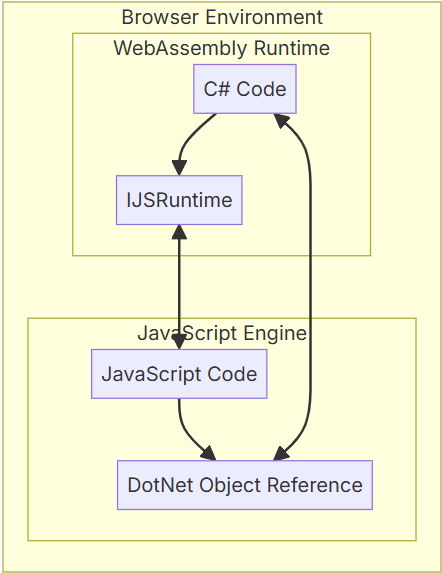
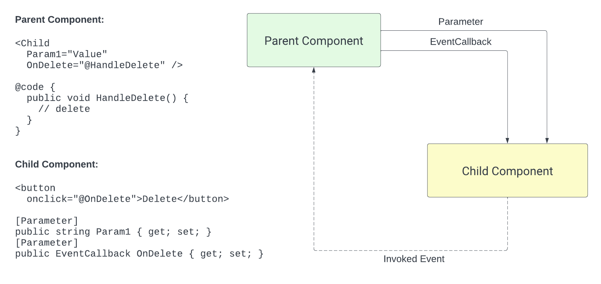
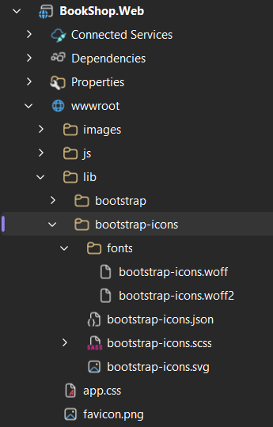
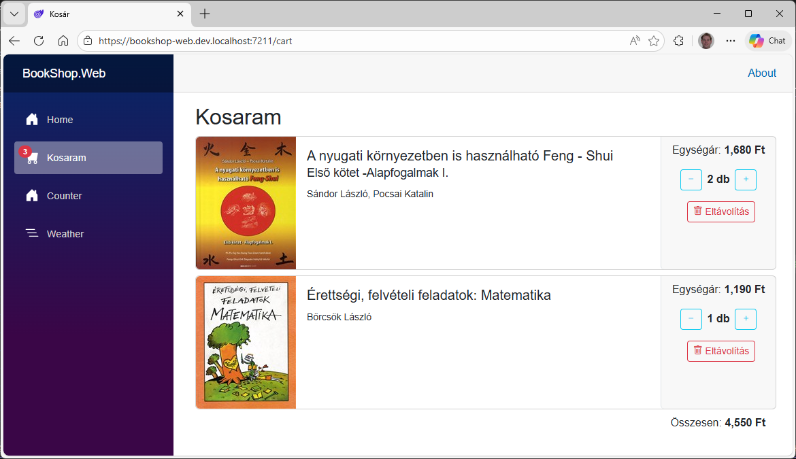
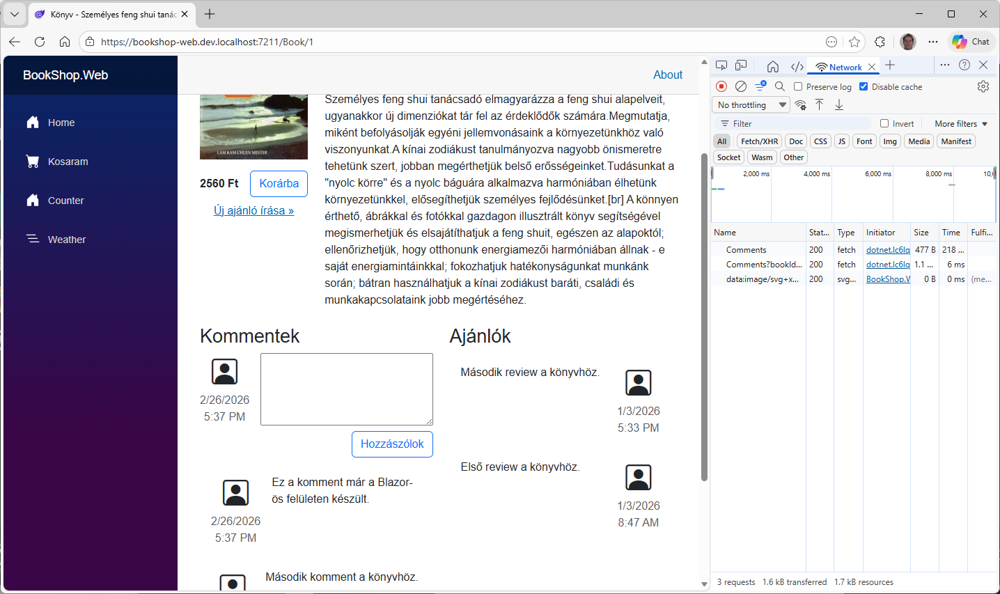
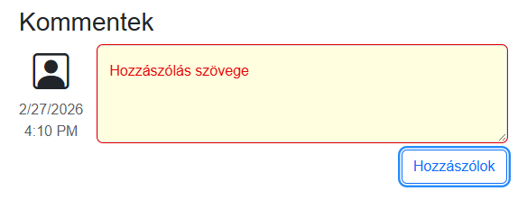

# 5.4. Kosár és hozzászólások

## .NET - JS InterOp

Bizonyos esetekben szükségünk van, hogy .NET kódból tudjunk JavaScript kódot hívni, vagy éppen fordítva. Erre egy jó példa, a Session- és LocalStorage. A Storage-ok JavaScriptből érhető el, viszont mi C# kódból szeretnénk ezt hívni. Tehát kell valami megoldás, hogy .NET kódból tudjunk JS kódot hívni.

A `IJSRuntime` a kulcs elem. Itt az alábbi két metódust találjuk

- `InvokeAsync<TValue>`: Olyan JS függvény meghívására szolgál, melyeknek van visszatérési értéke. A generikus paraméter arra szolgál, hogy a visszaadott értéket JSON szerializáción és deszerializáción keresztül egy C# típusra képezze le.
- `InvokeAsync`: Olyan JS függvények hívására szolgál, ami nem ad vissza adatot (void)


/// caption
JavaScript InterOp
///

A Web Storage API olyan mechanizmusokat biztosít, amelyek segítségével a böngészők kulcs–érték párokat tudnak tárolni kliens oldalon. A Web Storage két mechanizmusa a következő:

- A sessionStorage böngészőfülek és URL szerint van elkülönítve. A böngészőfül bezárásakor az adott fülhöz tartozó összes sessionStorage-adat törlődik.
- A localStorage kizárólag URL szerint van elkülönítve. Minden azonos URL-ű oldal ugyanahhoz a localStorage területhez fér hozzá, és az adatok akkor is megmaradnak, ha a böngészőt bezárják és újra megnyitják.

Az alábbi kód mutatja, hogy JavaScriptből hogyan tudjuk ezt használni. Amit majd .NET-ből szeretnénk hívni.

``` JavaScript title="Session storage használata JS-ben"
// Save data to sessionStorage
sessionStorage.setItem("key", "value");

// Get saved data from sessionStorage
let data = sessionStorage.getItem("key");

// Remove saved data from sessionStorage
sessionStorage.removeItem("key");

// Remove all saved data from sessionStorage
sessionStorage.clear();
```

1. Először vegyünk fel egy `SessionStorageAccessor.js` fájlt a `BookShop.Web/wwwroot/js` mappába. Ez a fájl JS függvényeket exportál ki, amiket majd meg fogunk hívni .NET-ből. Ügyeljünk rá,  hogy az érték, amit átadunk a JS kódnak egy `Object`, azonban a SessionStorage-be csak `string`-et lehet eltárolni, ezért a `JSON.parse` és `JSON.stringify` függvényeket kell használnunk.

    ``` JavaScript title="SessionStorageAccessor.js"
    export function get(key) {
        var value = window.sessionStorage.getItem(key);
        return JSON.parse(value);
    }

    export function set(key, value) {
        window.sessionStorage.setItem(key, JSON.stringify(value));
    }

    export function clear() {
        window.sessionStorage.clear();
    }

    export function remove(key) {
        window.sessionStorage.removeItem(key);
    }
    ```

2. Ez követően készítsük el a `ISessionStorageAccessor` C#-os interfészt. Ezeket fogjuk tudni majd hívni. (Get / Set / Remove / Clear).

    ``` csharp title="IStorageAccessor.cs"
    namespace BookShop.Web.Client.StorageAccessor; 

    public interface ISessionStorageAccessor
    {
        public Task<T?> GetValueAsync<T>(string key);

        public Task SetValueAsync<T>(string key, T value);

        public Task Clear();

        public Task RemoveAsync(string key);
    }
    ```

3. Így már el is készíthetjük a lényegi kódot, ami szükség esetén betölti a JS fájlt, majd áthív a .NET-ből a JS kódba, ez lesz a `SessionStorageAccessor.cs`
    - A konstruktorban injektáljuk az `IJSRuntime`-ot.
    - Készítünk egy `WaitForReference` metódust, ami ha még nincs beimportálva a szüksége JS kód akkor megteszi ezt és eltárolja a JS objektumra a referenciát, amin keresztül majd tudjuk hívni a kódunkat. Közvetlenül a `JSRuntime`-on keresztül azért nem tudjuk hívni a kódunkat, mert az nem beépített JS kódot hív, ezért kell a referencia.
    - Minden függvény előtt meg kell győződni, hogy be van importálva a JS kód és csak utána lehet a referencián keresztül az `InvokeAsync` vagy `InvokeVoidAsync` segítségével meghívni a JS kódot.
    - Fontos, hogy a JS objektum referenciát a `DisposeAsync`-ban felszabadítsuk.

    ``` csharp title="SessionStorageAccessor.cs" hl_lines="5 7 33-37 39-43"
    using Microsoft.JSInterop;

    namespace BookShop.Web.Client.StorageAccessor; 

    public class SessionStorageAccessor(IJSRuntime jsRuntime) : ISessionStorageAccessor, IAsyncDisposable
    {
        private Lazy<IJSObjectReference> accessorJsRef = new();

        public async Task<T?> GetValueAsync<T>(string key)
        {
            await WaitForReference();
            return await accessorJsRef.Value.InvokeAsync<T>("get", key);
        }

        public async Task SetValueAsync<T>(string key, T value)
        {
            await WaitForReference();
            await accessorJsRef.Value.InvokeVoidAsync("set", key, value);
        }

        public async Task Clear()
        {
            await WaitForReference();
            await accessorJsRef.Value.InvokeVoidAsync("clear");
        }

        public async Task RemoveAsync(string key)
        {
            await WaitForReference();
            await accessorJsRef.Value.InvokeVoidAsync("remove", key);
        }

        private async Task WaitForReference()
        {
            if (accessorJsRef.IsValueCreated is false)
                accessorJsRef = new(await jsRuntime.InvokeAsync<IJSObjectReference>("import", "/js/SessionStorageAccessor.js"));
        }

        public async ValueTask DisposeAsync()
        {
            if (accessorJsRef.IsValueCreated)
                await accessorJsRef.Value.DisposeAsync();
        }
    }
    ```

4. Regisztráljuk be a `SessionStorageAccessor`-t a kliens projekt `Program.cs`ben.

    ``` csharp title="Program.cs" hl_lines="8"
    using BookShop.Api;
    using BookShop.Web.Client.StorageAccessor;
    using Microsoft.AspNetCore.Components.WebAssembly.Hosting;

    var builder = WebAssemblyHostBuilder.CreateDefault(args);

    builder.Services.AddApiClientServices(new Uri(builder.HostEnvironment.BaseAddress));
    builder.Services.AddSingleton<ISessionStorageAccessor, SessionStorageAccessor>();

    await builder.Build().RunAsync();
    ```

    ??? tip "Singleton vs Scoped szolgáltatások"
        Mivel a WebAssembly a felhasználó böngészőjében fut, és minden böngészőfül teljesen különálló folyamatként működik, a szolgáltatások életciklusa másképpen működik, mint ahogy azt szerver oldalon megszoktuk.  
        Kliens oldalon a *Singleton*-ként és *Scoped*-ként regisztrált szolgáltatások életciklusa azonos, mindkettő a teljes alkalmazás élete során él, azaz browser session-ben (tabfülentként) csak egy példány van belőle.  
        A *Transient*-ként regisztrált szolgáltatások minden alkalommal, amikor elkérjük új példányt kapunk.

5. Ezzel el is készült a SessionStorage kezeléshez szükséges kód, amit a következő lépésben a kosárkezelésnél fogunk használni.

## Kosárkezelés

A könyv részletes oldalon már megtalálható a *Kosárba* gomb viszont ez még nem csinál semmit. Készítsük el a kosaram oldalt, illetve valósítsuk meg a kosárba tétel funkciót is.
A kosárban lévő elemeket tárolhatnánk adatbázisban, ami egy jó megoldás, azonban most mégsem ezt választjuk, hogy ki tudjuk próbálni a JS InterOp-ot.

A [Blazored SessionStorage](https://www.nuget.org/packages/Blazored.SessionStorage) NuGet package adott egy megoldást, hogy ne nekünk kelljen körbekódolni a SessionStorage-et, viszont már nem tartják karban, ettől függetlenül használható még egy darabig.  

1. A `Layout/NavMenu.razor` oldalon a menübe vegyük fel egy *Kosaram* linket.

    ``` aspx-cs title="NavMenu.razor" hl_lines="17-21"
    <div class="top-row ps-3 navbar navbar-dark">
        <div class="container-fluid">
            <a class="navbar-brand" href="">BookShop.Web</a>
        </div>
    </div>

    <input type="checkbox" title="Navigation menu" class="navbar-toggler" />

    <div class="nav-scrollable" onclick="document.querySelector('.navbar-toggler').click()">
        <nav class="nav flex-column">
            <div class="nav-item px-3">
                <NavLink class="nav-link" href="" Match="NavLinkMatch.All">
                    <span class="bi bi-house-door-fill-nav-menu" aria-hidden="true"></span> Home
                </NavLink>
            </div>

            <div class="nav-item px-3">
                <NavLink class="nav-link" href="cart" Match="NavLinkMatch.All">
                    <span class="bi bi-cart-fill-nav-menu" aria-hidden="true"></span> Kosaram
                </NavLink>
            </div>

            <div class="nav-item px-3">
                <NavLink class="nav-link" href="counter">
                    <span class="bi bi-house-door-fill-nav-menu" aria-hidden="true"></span> Counter
                </NavLink>
            </div>

            <div class="nav-item px-3">
                <NavLink class="nav-link" href="weather">
                    <span class="bi bi-list-nested-nav-menu" aria-hidden="true"></span> Weather
                </NavLink>
            </div>
        </nav>
    </div>
    ```

2. A navigációs linkek előtti ikonok a NavMenu.razor.css fájlban kerültek megadásara. Ez a fájl olyan CSS-t tartalmaz ami csak a NavMenu komponensre vonatkozik. Maguk az ikonkészlet amit használ a [Bootstrap icons](https://icons.getbootstrap.com/) ebből mi a [cart-fill](https://icons.getbootstrap.com/icons/cart-fill/)-t szeretnénk használni. Az ehhez tartozó SVG az alábbi kódrészlet.

    ``` svg title="bi-cart-fill"
    <svg xmlns="http://www.w3.org/2000/svg" width="16" height="16" fill="currentColor" class="bi bi-cart-fill" viewBox="0 0 16 16">
    <path d="M0 1.5A.5.5 0 0 1 .5 1H2a.5.5 0 0 1 .485.379L2.89 3H14.5a.5.5 0 0 1 .491.592l-1.5 8A.5.5 0 0 1 13 12H4a.5.5 0 0 1-.491-.408L2.01 3.607 1.61 2H.5a.5.5 0 0 1-.5-.5M5 12a2 2 0 1 0 0 4 2 2 0 0 0 0-4m7 0a2 2 0 1 0 0 4 2 2 0 0 0 0-4m-7 1a1 1 0 1 1 0 2 1 1 0 0 1 0-2m7 0a1 1 0 1 1 0 2 1 1 0 0 1 0-2"/>
    </svg>

    Ha megnyitjuk a `NavMenu.razor.css` fájlt láthatjuk, hogy az egyes ikonok úgy kerüte megadása, hogy háttérnek beállítja az svg fájlt. Tehát a kosár ikonhoz a fenti SVG forrást kell bemásolni, ügyelve az escape-elésre és hogy nem idézőjelet, hanem aposztrófot kell használni.

    ``` css title="NavMenu.razor.css"
    .bi-cart-fill-nav-menu {
        background-image: url("data:image/svg+xml,%3Csvg xmlns='http://www.w3.org/2000/svg' width='16' height='16' fill='white' class='bi bi-cart-fill' viewBox='0 0 16 16'%3E%3Cpath d='M0 1.5A.5.5 0 0 1 .5 1H2a.5.5 0 0 1 .485.379L2.89 3H14.5a.5.5 0 0 1 .491.592l-1.5 8A.5.5 0 0 1 13 12H4a.5.5 0 0 1-.491-.408L2.01 3.607 1.61 2H.5a.5.5 0 0 1-.5-.5M5 12a2 2 0 1 0 0 4 2 2 0 0 0 0-4m7 0a2 2 0 1 0 0 4 2 2 0 0 0 0-4m-7 1a1 1 0 1 1 0 2 1 1 0 0 1 0-2m7 0a1 1 0 1 1 0 2 1 1 0 0 1 0-2'/%3E%3C/svg%3E");
    }
    ```

    Ez macerás, ettől sokkal egyszerűbb lenne, ha behivatkoznánk a CSS-t és letöltenénk a font fájlt hozzá. Ezen megoldások a Bootstrap icons odalának legalján találhatók meg.

3. Az könyv részletes oldalán *Book.razor* már van egy kosárba gombunk, ami meg is hívja az `AddToCart` eseménykezelőt, amit még nem készítettünk el. Most ezt fogjuk megtenni. A *Kosárba* gombra kattintva a `SessionStorage`-ban fogjuk gyűjteni a termékeket. Egészen pontosan a termék azonosítóját, árát és darabszámát. Készítsük is el hozzá a szükséges modell osztályt a `BookShop.Web.Client/Models` könyvtárban `CartItem.cs` névvel. Azért elég a kliens oldali kódban, mert ez a szerverre nem fog eljutni.

    ``` csharp title="CartItem.cs"
    namespace BookShop.Web.Client.Models;

    public class CartItem
    {
        public int BookId { get; set; }

        public int Price { get; set; }

        public int Count { get; set; }
    }
    ```

4. Ezt követően a feladatunk annyi lesz, hogyha rákattintanak a *Kosárba* gombra, akkor a `SessionStorage`-ben tároljuk el egy új `CartItem`-et a *Book* oldal `AddToCart()` metódusában.
    - Elöször kérdezzük le a SessionStorage-ben lévő `CartItem` listát.
    - Ha a listában már szerepel a könyv, akkor a csak a darabszámot kell növelni, ha nem szerepel benne, akkor egy új elemet kell hozzáadni a listához.
    - Majd mentsük el a SessionStora-be az új listát.

    ``` csharp title="Book.cshtml.cs" hl_lines="3 23"
    public async Task AddToCart()
    {
        var cart = await sessionStorage.GetValueAsync<List<CartItem>>("Cart") ?? [];

        var cartItem = cart.SingleOrDefault(c => c.BookId == BookData.Id);

        if (cartItem != null)
        {
            cartItem.Count++;
        }
        else
        {
            cartItem = new CartItem
            {
                BookId = BookData.Id,
                Count = 1,
                Price = BookData.DiscountedPrice ?? BookData.Price
            };

            cart.Add(cartItem);
        }

        await sessionStorage.SetValueAsync("cart", cart);
    }
    ```

5. Ahhoz, hogy lássuk be is került a kosárba az elem módosítsuk a Layout oldalt úgy, hogy a Kosaram mögött írja ki a benne lévő elemek számát - ha van benne elem - egy [badge](https://getbootstrap.com/docs/5.3/components/badge/#positioned)-ben.

    - A `position-relative` CSS osztályt tegyük rá a `NavLink`-re, hogy ahhoz képest legyen abszolút pozícionálva a badge.
    - Itt nincs code behindunk, így készítsünk egy `@code` blokkot a fájl végén és ott kérdezzük le kosárban lévő elemek számát.

    ``` aspx-cs title="NavMenu.razor" hl_lines="2 5 8 15-23"
    <div class="nav-item px-3">
        <NavLink class="nav-link position-relative" href="cart" Match="NavLinkMatch.All">
            <span class="bi bi-cart-fill-nav-menu" aria-hidden="true"></span> 
            Kosaram
            @if (cart.Any())
            {
                <span class="position-absolute translate-middle badge rounded-pill bg-danger">
                    @(cart.Sum(x => x.Count))
                    <span class="visually-hidden">elem a kosárban</span>
                </span>
            }
        </NavLink>
    </div>

    @code
    {
        private List<CartItem> cart = [];

        protected override async Task OnInitializedAsync()
        {
            cart = await sessionStorageAccessor.GetValueAsync<List<CartItem>>("Cart") ?? [];
        }
    }
    ```

6. Ahogy a fenti kódban látjuk most a SessionStorage kulcsot több helyen beledrótoztuk az kódba, így nehéz lehet azt megváltoztatni. A szép megoldás ilyenkor, hogy felveszünk egy pl.: `BookShopConstants` osztályt és ott gyűjtjük össze az összes magic konstanst és azt használjuk. Vezessük is át a kódon, hogy ezt használjuk a beégetett `Cart` helyett.

    ``` csharp
    namespace BookShop.Web.RazorPage.Models;

    public class BookShopConstants
    {
        public const string CartSessionKey = "Cart";
    }
    ```

7. Ha kipróbáljuk a kosárba tétel funkciót, azt tapasztaljuk, hogy bár bekerül a kosárba a könyv, a bage a kosaram mellett nem  frissül.

### Kosár változás esemény

Azért nem frissül a kosaram mellett a darabszám amikor a könyv részletes oldalon megnyomjuk a kosárba tétel gombot, mert nem értesül a navigációs rész a módosítáról. Ezért kellene készíteni egy `CartService`-t a kliens oldalon, ami megvalósítja a kosár műveleteket, a `SessionStorageAccessor` felhasználásával és minden módosításkor elsüt egy eseményt, amire a `NavMenu` fel tud iratkozni, hogy meghívja a `StateHasChanged`-et.

1. Először hozzuk létre a szolgáltaás intefészét `ICartService` a kliens projekt `Services` mappájában az alábbi kóddal.
    - Definiáljuk az `OnCartChange` eseményt. Erre lehet majd feliratkozni és ezt fogjuk elsütni, ha változik a kosár tartalma.
    - Definiáljunk egy `Cart` property-t amiben a kosár aktuális tartalma található.

    ``` csharp title="ICartService.cs"
    using BookShop.Web.Client.Models;

    namespace BookShop.Web.Client.Services;

    public interface ICartService
    {
        public event EventHandler OnCartChange;

        public Task<List<CartItem>> GetCartItemsAsync();

        public Task AddAsync(CartItem cartItem);

        public Task RemoveAsync(int bookId);

        public Task IncrementAsync(int bookId);

        public Task DecrementAsync(int bookId);
    }
    ```

2. Majd készítsük el az implementációját is.
    - A konstruktorban kérjünk el egy `ISessionStorageAccessor` példány, ezen keresztül fogjuk a session storage-et kezelni.
    - Az `AddAsync`-ban először töltsük fel a session storage-ből a kosár tartalmát, ha még üres lenne.
    - Ha már szerepel a kosárban a hozzáadni kívánt könyv, akkor csak növeljük meg a darabszámot, egyébként adjuk hozzá a listához.
    - Mentsük le az új `Cart` listát a session storage-ba
    - Süssük el az `OnCartChange` eventet.
    - Hasonlóan készítsük el a többi metódust is. Fontos, hogy mindig ellenőrizzük, hogy be kell-e tölteni az aktuális listát.

    ``` csharp title="CartService.cs" hl_lines="6 8 10 12-17 21 32"
    using BookShop.Web.Client.Models;
    using BookShop.Web.Client.StorageAccessor;

    namespace BookShop.Web.Client.Services;

    public class CartService(ISessionStorageAccessor sessionStorage) : ICartService
    {
        public event EventHandler? OnCartChange;

        private List<CartItem>? cart;

        public async Task<List<CartItem>> GetCartItemsAsync()
        {
            cart ??= await sessionStorage.GetValueAsync<List<CartItem>>(BookShopConstants.CartSessionKey) ?? [];

            return cart;
        }

        public async Task AddAsync(CartItem cartItem)
        {
            cart ??= await sessionStorage.GetValueAsync<List<CartItem>>(BookShopConstants.CartSessionKey) ?? [];

            var itemInCart = cart.SingleOrDefault(c => c.BookId == cartItem.BookId);

            if (itemInCart != null)
                itemInCart.Count++;
            else
                cart.Add(cartItem);

            await sessionStorage.SetValueAsync(BookShopConstants.CartSessionKey, cart);

            OnCartChange?.Invoke(this, EventArgs.Empty);
        }

        public async Task RemoveAsync(int bookId)
        {
            cart ??= await sessionStorage.GetValueAsync<List<CartItem>>(BookShopConstants.CartSessionKey) ?? [];

            var itemInCart = cart.SingleOrDefault(c => c.BookId == bookId);

            if (itemInCart is null)
                return;

            if (itemInCart.Count == 1)
                cart.Remove(itemInCart);
            else
                itemInCart.Count--;

            await sessionStorage.SetValueAsync(BookShopConstants.CartSessionKey, cart);
            OnCartChange?.Invoke(this, EventArgs.Empty);
        }

        public async Task IncrementAsync(int bookId)
        {
            cart ??= await sessionStorage.GetValueAsync<List<CartItem>>(BookShopConstants.CartSessionKey) ?? [];

            var itemInCart = cart.SingleOrDefault(c => c.BookId == bookId);

            if (itemInCart is null)
                return;

            itemInCart.Count++;

            await sessionStorage.SetValueAsync(BookShopConstants.CartSessionKey, cart);
            OnCartChange?.Invoke(this, EventArgs.Empty);
        }

        public async Task DecrementAsync(int bookId)
        {
            cart ??= await sessionStorage.GetValueAsync<List<CartItem>>(BookShopConstants.CartSessionKey) ?? [];

            var itemInCart = cart.SingleOrDefault(c => c.BookId == bookId);

            if (itemInCart is null)
                return;

            if (itemInCart.Count == 1)
                cart.Remove(itemInCart);
            else
                itemInCart.Count--;

            await sessionStorage.SetValueAsync(BookShopConstants.CartSessionKey, cart);
            OnCartChange?.Invoke(this, EventArgs.Empty);
        }
    }
    ```

3. Módosítsuk a `Book.razor.cs`-ben az `AddToCart` metódust, hogy az `CartService`-en keresztül módosítsa a kosarat és a konstruktorban is az `ICartService` példányt várjuk, ne közvetlenül a `ISessionStorageAccessor`-t. Az alábbi kód csak a változott részeket tartalmazza.

    ``` csharp title="Book.razor.cs" hl_lines="1 5-10"
    public partial class Book(IBooksClient booksClient, ICartService cartService/*, ISessionStorageAccessor sessionStorage*/)
    {
        public async Task AddToCart()
        {
            await cartService.AddAsync(new CartItem
            {
                BookId = BookData.Id,
                Count = 1,
                Price = BookData.DiscountedPrice ?? BookData.Price
            });
        }
    }
    ```

4. És végül módosítuk a `NavMenu.razor` fájlt is,

    ``` aspx-cs title="NavMenu.razor" hl_lines="1-2 12-20"
    @using BookShop.Web.Client.Services
    @inject ICartService cartService

    @* ... *@

    @code
    {
        private List<CartItem> cart = [];

        protected override async Task OnInitializedAsync()
        {
            // Get initial cart items.
            cart = await cartService.GetCartItemsAsync();

            cartService.OnCartChange += async (sender, args) => 
            {
                // Update list and UI when cart changes.
                cart = await cartService.GetCartItemsAsync();
                await InvokeAsync(StateHasChanged);
            };
        }
    }
    ```

5. Így kirpóbálva az alkalmazást már működni fog a kosárban lévő elemek számának frissítése.

// TODO: Ez hova kerüljön?


### Kosaram oldal

A következő lépés, hogy meg is tudjuk mutatni, hogy pontosan milyen könyvek vannak a kosárban.

1. Mivel az oldalon szeretnénk ikonokat is használni (+ és - gombok) ezért először adjuk hozzá a projekthez a [Bootstrap icons](https://icons.getbootstrap.com/)-t
    - Töltsük le a fenti oldal legalján lévő "Download latest ZIP" gombbal az ikonokat.
    - A letöltött fájlt tartalmát másoljuk be a `BookShop.Web` projekt `wwwroot/lib/bootstrap-icon` könyvtárában. A `svg` fájlokat nem szükséges odamásolni, mert azt nem fogjuk használni.

        ??? tip "Bootstrap ikonok a projektben"
            
            /// caption
            Bootstrap ikonok a projektben
            ///

    - Ezt követően a `App.razor` fájlban linkeljük be a CSS fájlt.

        ``` aspx-cs title="App.razor" hl_lines="1"
        <!DOCTYPE html>
        <html lang="en">

        <head>
            <meta charset="utf-8" />
            <meta name="viewport" content="width=device-width, initial-scale=1.0" />
            <base href="/" />
            <ResourcePreloader />
            <link rel="stylesheet" href="@Assets["lib/bootstrap/dist/css/bootstrap.min.css"]" />
            <link rel="stylesheet" href="@Assets["lib/bootstrap-icons/bootstrap-icons.min.css"]" />
            <link rel="stylesheet" href="@Assets["app.css"]" />
            <link rel="stylesheet" href="@Assets["BookShop.Web.styles.css"]" />
            <ImportMap />
            <link rel="icon" type="image/png" href="favicon.png" />
            <HeadOutlet @rendermode="InteractiveWebAssembly" />
        </head>

        <body>
            <Routes @rendermode="new InteractiveWebAssemblyRenderMode(prerender: false)" />
            <script src="@Assets["_framework/blazor.web.js"]"></script>
        </body>

        </html>
        ```

2. Ezt követően a `BookShop.Web.Client` projektben hozzuk létre a `Pages` alatt `Cart` oldalt.
3. Az oldal kódja meglehetősen egyszerű, hiszen az `OnInitializedAsync`-ben ki kell olvasni a SessionStorage-ből az eltárolt kosár tartalmát, amihez már tudjuk használni a `ICartService`-t, majd le kell kérdezni az `IBooksClient`-en keresztül a könyvek adatait a szervertől, amihez a `GetBookHeadersAsync`-ot tudjuk használni.

    ``` csharp title="Cart.cshtml.cs"
    using BookShop.Api;
    using BookShop.Transfer.Dtos;
    using BookShop.Web.Client.Models;
    using BookShop.Web.Client.Services;

    namespace BookShop.Web.Client.Pages;

    public partial class Cart(ICartService cartService, IBooksClient booksClient)
    {
        public List<CartItem> CartItems { get; set; } = [];

        public IList<BookHeader> Books { get; set; } = [];

        protected override async Task OnInitializedAsync()
        {
            CartItems = await cartService.GetCartItemsAsync();

            var bookIds = CartItems.Select(ci => ci.BookId).ToList();
            Books = await booksClient.GetBookHeadersAsync(bookIds) ?? [];

            await base.OnInitializedAsync();
        }
    }
    ```

4. Ezt követően a megjelenítést is készítsük el. A megjelenítés a [Bootstrap card](https://getbootstrap.com/docs/5.3/components/card/#horizontal)-ot használjuk, csak itt a kép a bal oldalon lesz nem felül.
    - Iteráljunk végig a kosár elemein amit a `CartItems`-ban érünk el.
    - Válasszuk ki az adott kosárelemhez tartozó könyvet a `Books` tulajdonságból.
    - A *card-footer*-be tegyük az egységárat és a mennyiséget egy + és - gombbal. Ami a `CartService`-ben már elkészített `IncrementAsync` és `DecrementAsync` metódusait kell, hogy hívja.
    - Vegyük fel egy `Eltávolítás` gombot is, ami pedig a `RemoveAsync`-ot kell meghívja.
    - Végül írjuk ki az teljes árat. Itt arra kell figyelni, hogy egy könyvből többet is rendelhetünk.

    ``` aspx-cs title="Cart.razor"
    @page "/Cart"

    <PageTitle>Kosár</PageTitle>

    <h2>Kosaram</h2>

    @foreach (var item in CartItems)
    {
        // Query the book header (the Books property is populated in the PageModel, from the database)
        var book = Books.Single(b => b.Id == item.BookId);

        <div class="card flex-row mb-2">
            

            <div class="card-body">
                <h5 class="card-title">
                    <a asp-page="Book" asp-route-id="@book.Id">@book.Title</a>
                    @if (!String.IsNullOrWhiteSpace(book.Subtitle))
                    {
                        <br />
                        <small>@book.Subtitle</small>
                    }
                </h5>

                <p class="card-text">
                    <small>
                        @foreach (var author in book.Authors)
                        {
                            <a asp-page="Book" asp-route-authorId="@author.Id">@author.Name</a>
                        }
                    </small>
                </p>

            </div>
            <div class="card-footer border-top-0 border-start">
                <div class="mb-3">Egységár: <b>@item.Price.ToString("N0") Ft</b></div>

                <div class="d-flex align-items-center justify-content-center mb-3">
                    <button class="btn btn-outline-info btn-sm me-2" @onclick="@(async () => await cartService.DecrementAsync(book.Id))"><i class="bi bi-dash"></i></button>

                    <b>@item.Count db</b>
                    <button class="btn btn-outline-info btn-sm ms-2" @onclick="@(async () => await cartService.IncrementAsync(book.Id))"><i class="bi bi-plus"></i></button>
                </div>

                <div class="d-flex justify-content-center">
                    <button class="btn btn-outline-danger btn-sm ms-2" @onclick="@(async () => await cartService.RemoveAsync(book.Id))"><i class="bi bi-trash"></i> Eltávolítás</button>
                </div>
            </div>
        </div>
    }
    <div class="d-flex justify-content-end me-3">
        Összesen:&nbsp;<b>@CartItems.Sum(book => book.Price * book.Count).ToString("N0") Ft</b>
    </div>
    ```

5. Ha elindítjuk az alkalmazást és beteszünk pár könyvet a kosrába és újratöltjük az oldalt, akkor egy kivételt kapunk, ami azt jelzi, hogy a kosárban lévő könyvhöz tartozó `BookHeader` nem található. Ha megnézzük a kódot, akkor azt találjuk, hogy az `OnInitializedAsync`-ban először aszinkron módon lekérdezzük a kosár tartalmát, majd ezt követően töltjük be a `Books` listát. Azonban a megjelenítésnél amikor a korás elemeken végigiterálunk, még nincs betöltse a `Books` lista, mert az `OnInitializedAsync` első `await`-nél felfüggeszti a végrehajtást és renderel egyet, amikor még üres a `Books` lista. Tehát nem biztosítottuk azt, hogy az első `await`-nél is renderelhető állapotban legyen a kód.

6. A javítás csak annyi, hogy amikor a kosár elemeket végigiterálunk és keressük a hozzá tartozó könyv-et, akkor ha nem találunk, akkor nem próbáljuk meg kirenderelni.

    ``` aspx-cs title="Cart.razor" hl_lines="4 6-7"
    @foreach (var item in CartItems)
    {
        // Query the book header (the Books property is populated in the PageModel, from the database)
        var book = Books.SingleOrDefault(b => b.Id == item.BookId);

        if (book is null)
            continue;

        <div class="card flex-row mb-2">
    ```

7. Próbáljuk is ki az oldalt. Ehhez először tegyünk a kosárba egy pár könyvet, majd próbáljuk ki a Kosár oldalon a gombokat.

    ??? success "Az elkészített kosár oldal"
        
        /// caption
        Kész kosár oldal
        ///

## Hozzászólások

A felhasználók a könyvekhez hozzászólásokat (és ajánlókat is írhatnak). Minden a két esetben az `ICommentClient`-t használjuk, mert a két típusú komment között csak a `CommentType` értéke eltérő.

### Hozzászólások listázása

1. A könyv részletes oldalon injektáljuk az `ICommentsClient`-et és az `OnInitializedAsync`-ban kérdezzük le a könyvhöz tartozó kommenteket a `GetCommentsAsync` segítségével

    ``` csharp title="Book.cshtml.cs" hl_lines="1 8 12-18"
    public partial class Book(IBooksClient booksClient, ICommentsClient commentsClient, ICartService cartService)
    {
        [Parameter]
        public int Id { get; set; }

        public BookData BookData { get; set; } = new();

        public IList<CommentData> Comments { get; set; } = [];

        protected override async Task OnInitializedAsync()
        {
            var tasks = new Task[]
            {
                Task.Run(async () => BookData = await booksClient.GetBookAsync(Id)),
                Task.Run(async () => Comments = await commentsClient.GetCommentsAsync(Id, Transfer.Enums.CommentType.Comment, 5)),
            };

            await Task.WhenAll(tasks);

            // BookData = await booksClient.GetBookAsync(Id);
            // Comments = await commentsClient.GetCommentsAsync(Id, Transfer.Enums.CommentType.Comment, 5);

            await base.OnInitializedAsync();
        }

        // ...
    }
    ```

    Az `OnInitializedAsync`-ban nem egymás után hívtuk meg a két aszinkron betöltő metódusunkat, hanem egy `Task` tömbbe összegyűjtüttök őket és egyszerre hívjuk meg és várjuk be mindet. Így a két hálózati kérés parhuzamosan fut, amiről a böngésző DevToolbar hálózat fülén meg is tudunk győződni.

2. Ezt követően jelenítsük is meg a kommenteket, ehhez végig kell iterálni a `Comments`-en és az egyes elemekhez bal oldalra kitenni egy `bi-person-square` bootstrap ikont, alá pedig a hozzászólás dátumát és idejét, jobb oldalra pedig magát a hozzászólás szövegét, ami egy sima szöveg HTML tartalom nélkül.

    ``` aspx-cs title="Book.cshtml"
    <div class="row">
        <div class="col-lg-6">
            <h3>Kommentek</h3>

            @foreach (var comment in Comments)
            {
                <div class="comment d-flex p-3">
                    <div class="d-flex flex-column align-items-center justify-content-center flex-shrink-0 me-3">
                        <i class="bi bi-person-square fs-1"></i>
                        <div class="text-muted">@(comment.CreatedDate.DateTime.ToShortDateString())</div>
                        <div class="text-muted">@(comment.CreatedDate.DateTime.ToShortTimeString())</div>
                    </div>
                    <div class="w-100">
                        @comment.Text
                    </div>
                </div>
            }
        </div>

        <div class="col-lg-6">
            <h3>Ajánlók</h3>
        </div>
    </div>
    ```

3. Ha mindent jól csináltunk az 1-es ID-jú könyvnél megjelenik kettő komment.

### Hozzászólás létrehozása

1. Készítsük el az új hozzászólás részt is. Ehhez a `CreateCommentData` DTO-t használjuk, mert ebbe csak azokat az adatokat várjuk, amik szükségesek egy komment létrehozásához. Figyeljük meg, hogy a felhasználó azonosítója nincs benne mert csak az aktuálisan belépett felhasználó tud kommentet írni, azt pedig a szerver oldalon a `RequestContext`-ből elérjük.
2. Kezdjük az új hozzászólás gomb eseménykezelőjével a `Book.razor.cs` fájlban, a lenti kód csak az újonnan bekerült részeket tartalmazza.

    ``` csharp title="Book.razor.cs" 
    using BookShop.Transfer.Enums;
    
    public partial class Book(IBooksClient booksClient, ICommentsClient commentsClient, ICartService cartService)
    {
        public CreateCommentData NewCommentData { get; set; } = null!;

        protected override void OnInitialized()
        {
            NewCommentData = new CreateCommentData() { BookId = Id, Type = CommentType.Comment };
            base.OnInitialized();
        }

        public async Task CreateComment()
        {
            await commentsClient.CreateCommentAsync(NewCommentData);
        }
    }
    ```

    - Az `OnInitialized`-ban beállítjuk, hogy az új komment az éppen megtekintett könyvhöz kell, hogy készüljön és Comment típusú legyen.
    - Ha minden adat megvan, akkor meghívjuk a `CreateCommentAsync`-ot ami lementi az adatbázisba a kommentet az aktuálisan belépett felhasználó nevében, amit a `RequestContext`-ből veszünk, ami jelenleg mockolva van az 1-es ID-jú felhasználóra.

3. Ezt követően a megjelenítést is készítsük el hozzá

    ``` aspx-cs title="Book.cshtml" hl_lines="11 15"
    <h3>Kommentek</h3>

    <div>
        <div class="d-flex">
            <div class="d-flex flex-column align-items-center flex-shrink-0 me-3">
                <i class="bi bi-person-square fs-1"></i>
                <div class="text-muted">@(DateTime.Now.ToShortDateString())</div>
                <div class="text-muted">@(DateTime.Now.ToShortTimeString())</div>
            </div>

            <textarea class="w-100" rows="3" @bind="@NewCommentData.Text"></textarea>
        </div>

        <div class="d-flex justify-content-end my-2">
            <button class="btn btn-outline-primary" @onclick="@CreateComment">Hozzászólok</button>
        </div>
    </div>
    ```

    A fenti kódban már van egy adatkötésünk a komment szövegézhez. Itt a `@bind`-ot használtuk, ahol megadtuk, hogy a textbox tartalma a `NewCommentData.Text` értéke legyen, ezzel létrehozva egy kétirányú adatkötést. Tehát ha a model változik akkor az a szövegdobozban megjelenik, ha pedig a szövegdobozban változik az értéke, akkor az a model-ben is változik. Így a mentéskor csak annyit kell megtenni, hogy a `NewCommentData`-t felküldjük a szerverre, mert abban minden adat benne lesz.

4. Jelenleg úgy készült el a `CommentsController`-ben a `CreateComment`, hogy előtte van egy `Authorize` attribútum. Ezt kommentezzük ki, mert még nincs felhasználókezelés és hibát dobna.

    ``` csharp title="CommentsController.cs" hl_lines="2"
    [HttpPost]
    // [Authorize]
    public async Task<CommentData> CreateComment(CreateCommentData data)
        => await commentService.CreateCommentAsync(data);
    ```

5. Így már tudnánk felvenni új kommentet és be is kerülne az adatbázisba, de nem frissül a UI. Ha megnézzük a `CreateCommentAsync` visszaadja az új kommentet az adatbázisból, tehát meg tudjuk tenni, hogy a `Comments` listából kivesszük a legutolsó kommentet és az elejére beszúrjuk az újat, visznt ez törékeny megoldás (és ha más kommentel azt meg sem kapjuk). Inkább kérdezzük le az új listát és a szövegdobozt se felejtsük el üríteni. Ehhez csak a `CreateComment`-et kell módosítani az alábbiak szerint.

    ``` csharp title="Book.razor.cs" hl_lines="5-6"
    public async Task CreateComment()
    {
        await commentsClient.CreateCommentAsync(NewCommentData);

        NewCommentData.Text = string.Empty;
        Comments = await commentsClient.GetCommentsAsync(Id, CommentType.Comment, 5);
    }
    ```

6. Próbáljuk is ki és nézzük meg az adatbázisban is, hogy helyesen bekerültek-e az adatok, illetve, hogy a komment típusa tényleg string-ként kerül be. Viszont még nem kezeljük azt, hogy üres értéket ne lehessen beszúrni.

    ??? success "Elkészült komment funkció"
        
        /// caption
        Sikeresen létrehozott komment újratöltéssel.
        ///

## Szerver és kliens oldali validáció

Minden projektben szükség van az adatok validációjára, mint kliens mind szerver oldalon. A legjobb megoldás az, ha kliens és szerver oldalon is ugyanazok a szabályok futnak le, tehát csak egyszer definiáljuk szabályokat és azt tudjuk futtatni.

Ehhez az első lépés az, hogy a validációs szabályokat a `BookShop.Transfer` projektben definiáljuk, hiszen ezt a projektet a kliens és szerver is hivatkozza.

A validációhoz a [Fluent validator](https://docs.fluentvalidation.net/en/latest/)-t fogjuk használni, mert ebből kliens oldali validáció is készíthető.

1. Adjuk hozzá a `FluentValidation` és `FluentValidation.DependencyInjectionExtensions` NuGet package-et a `BookShop.Transfer` projekthez.

2. Ezt követően készítsük el egy konkrét validátort is a hozzászolás létrehozásához. Adjunk egy új osztályt a `BookShop.Transfer` projektben a `Dto` mappához `CreateCommentDataValidator` névvel.
    - A validátorokat érdemes úgy elnevezni, hogy a DTO nevéhez tesszük a `Validator` postfixet, így a validátor közvetlenül a DTO után jelenik meg (az esetek nagyrészében).
    - Az `AbstractValidator<T>`-ből kell származni, ahogy a `T` a DTO típusa.

    ``` csharp title="CreateCommentDataValidator.cs"
    using BookShop.Transfer.Enums;
    using FluentValidation;

    namespace BookShop.Transfer.Dtos;

    internal class CreateCommentDataValidator : AbstractValidator<CreateCommentData>
    {
        public CreateCommentDataValidator()
        {
            RuleFor(x => x.BookId).GreaterThan(0);

            RuleFor(x => x.Text).NotEmpty()
                .MaximumLength(500).When(x => x.Type == CommentType.Comment, ApplyConditionTo.CurrentValidator)
                .MaximumLength(2000).When(x => x.Type == CommentType.Review, ApplyConditionTo.CurrentValidator);

        }
    }
    ```

    A fenti kódban a `Text` mezőn található egy `NotEmpty` validátor, ami miatt nem lehet null vagy üres string a megadott érték. Ez mindig érvényre jut. A `MaximumLength` pedig attól függ, hogy *Comment* vagy *Review* készül. A `When`-ben adjuk meg a feltételt és a második paraméter határozza meg `ApplyConditionTo.CurrentValidator`, hogy csak az utolsó validátorra vonatkozzon. Ha nem adunk meg második paramétert akkor az egész láncra vonatkozna.

    ??? tip "Több feltétel függő validáció"
        Bizonyos esetekben több validator is változik egy feltételtől, ezt úgy adhatjuk meg, hogy a `When`-nel kezdjük és alatta adjuk meg a szabályokat, ahogy a lenti kódban is látható.

        ``` csharp title="CreateCommentDataValidator.cs" hl_lines="12-15 17-20"
        using BookShop.Transfer.Enums;
        using FluentValidation;

        namespace BookShop.Transfer.Dtos;

        internal class CreateCommentDataValidator : AbstractValidator<CreateCommentData>
        {
            public CreateCommentDataValidator()
            {
                RuleFor(x => x.BookId).GreaterThan(0);

                When(x => x.Type == CommentType.Comment, () =>
                {
                    RuleFor(x => x.Text).NotEmpty().MaximumLength(500);
                });

                When(x => x.Type == CommentType.Review, () =>
                {
                    RuleFor(x => x.Text).NotEmpty().MaximumLength(2000);
                });
            }
        }
        ```

3. A validatorokat be kell regisztrálni a DI konténerbe, ehhez készítsünk a `BookShop.Transfer` projektben egy `Wireup.cs` fájlt, amiben egy bővítő metódussal beregisztráljuk a validátorokat. Mivel a fenti validátort `internal`-ként hoztuk létre (elvileg máshonnan nem kell látni), meg kell adni, hogy azokat is regisztrájla be. Ezt az `includeInternalTypes` megadásával tudjuk megtenni.

    ``` csharp title="Wireup.cs" hl_lines="1-2 9 12"
    using Microsoft.Extensions.DependencyInjection;
    using FluentValidation;
    using BookShop.Transfer.Dtos;

    namespace BookShop.Transfer;

    public static class Wireup
    {
        public static IServiceCollection RegisterValidators(this IServiceCollection services)
        {
            // Register all fluent validator as singleton from the current project (also internal classes).
            services.AddValidatorsFromAssemblyContaining<CreateCommentDataValidator>(ServiceLifetime.Singleton, includeInternalTypes: true);

            return services;
        }
    }
    ```

4. A követkető lépés, hogy a `BookShop.Web.Client` projekt `Program.cs` fájljában meghívjuk, és kliens oldalon is beregisztráljuk a validátorokat.

    ``` csharp title="Program.cs" hl_lines="2 9"
    using BookShop.Api;
    using BookShop.Transfer;
    using BookShop.Web.Client.Services;
    using BookShop.Web.Client.StorageAccessor;
    using Microsoft.AspNetCore.Components.WebAssembly.Hosting;

    var builder = WebAssemblyHostBuilder.CreateDefault(args);

    builder.Services.RegisterValidators();

    builder.Services.AddApiClientServices(new Uri(builder.HostEnvironment.BaseAddress));
    builder.Services.AddSingleton<ISessionStorageAccessor, SessionStorageAccessor>();
    builder.Services.AddSingleton<ICartService, CartService>();

    await builder.Build().RunAsync();
    ```

5. A kliens oldali validáció jó dolog, de nem ad biztonságot, hiszen az API végpontok akár Postman-ből is hívhatók, tehát csak a szerver oldali validáció ad tényleges, megbízható védelmet. Ezért a `BookShop.Bll` projektben lévő `Wireup`-ban is regisztráljuk meg a validátorokat. Az alábbi kóban csak a kód egy részét látjuk, és csak a kiemlet soroket kell hozzáadni.

    ``` csharp title="Wireup.cs" hl_lines="2 12"
    using Microsoft.Extensions.DependencyInjection;
    using BookShop.Transfer;

    namespace BookShop.Api;

    public static class Wireup
    {
        private const string ApiHttpClientName = "BookShop.Web.Server.Api";

        public static void AddApiClientServices(this IServiceCollection services, Uri baseAddress, Func<DelegatingHandler>? delegatingHandler = null)
        {
            services.RegisterValidators();

            // ...
        }
    }
    ```

6. Ahhoz, hogy ténylegesen lefussanak a megfelelő validációk automatikusan készíteni kell egy filtert. Ehhez a `BookShop.Web.Client` projektben hozzunk létre egy `ValidationFilter` mappát. Adjunk hozzá egy `FluentValidationExtensions` osztályt, amiben egy olyan extension method-ot készítünk, ami a Fluent validátor által visszaadott hibákat hozzáadja a ModelState-hez, hogy a megfelelő formátumban jusson el a klienshez.

    ``` csharp title="FluentValidationExtensions.cs"
    using FluentValidation.Results;
    using Microsoft.AspNetCore.Mvc.ModelBinding;

    namespace BookShop.Web.ValidationFilter;

    public static class FluentValidationExtensions
    {
        public static void AddToModelState(this ValidationResult result, ModelStateDictionary modelState)
        {
            foreach (var error in result.Errors)
            {
                modelState.AddModelError(error.PropertyName, error.ErrorMessage);
            }
        }
    }
    ```

7. Ezt követően készítsük el a filtert is a `ModelValidationAsyncActionFilter.cs` fájlban. Az osztály implementája az `IAsyncActionFilter`-t, és készítsük el az `OnActionExecutionAsync` metódust.
    - "DELETE" és "GET" HTTP verb-eket nem szereténk validálni.
    - Mivel ez egy *Middleware* ezért ha `await next()`-et meg kell hívni a return előtt.
    - Iteráljunk végig a paraméreket (megkapott adatok), amit a `ActionArguments`-ből tudunk lekérdezni és hívjuk meg rá a validációt.
    - Típus alapján keressük ki a DI-ból a megfelelő validátort (típus alapján) és hívjuk meg rajta a `ValidateAsync`-ot
    - Ha validációs hiba van, akkor használjuk az `AddToModelState`-et.
    - Hiba esetén a kimenet-et az `InvalidModelStateResponseFactory`-val tudjuk előállítani.

    ``` csharp title="ModelValidationAsyncActionFilter.cs"
    using FluentValidation;
    using Microsoft.AspNetCore.Mvc;
    using Microsoft.AspNetCore.Mvc.Filters;
    using Microsoft.Extensions.Options;

    namespace BookShop.Web.ValidationFilter;

    public class ModelValidationAsyncActionFilter(IServiceProvider serviceProvider, IOptions<ApiBehaviorOptions> apiBehaviorOptions)
        : IAsyncActionFilter
    {
        public async Task OnActionExecutionAsync(ActionExecutingContext context, ActionExecutionDelegate next)
        {
            // Do not validate on HTTP GET and DELETE requests.
            if (context.HttpContext.Request.Method == "DELETE" || context.HttpContext.Request.Method == "GET")
            {
                await next();
                return;
            }

            foreach (var (_, value) in context.ActionArguments)
            {
                if (value is null)
                    continue;

                await ValidateAsync(value, context);
            }

            if (!context.ModelState.IsValid)
            {
                context.Result = apiBehaviorOptions.Value.InvalidModelStateResponseFactory(context);
                return;
            }

            await next();
        }

        private async Task ValidateAsync(object value, ActionExecutingContext context)
        {
            var validator = (IValidator?)serviceProvider.GetService(typeof(IValidator<>).MakeGenericType(value.GetType()));

            if (validator == null)
                return;

            var result = await validator.ValidateAsync(new ValidationContext<object>(value));
            result.AddToModelState(context.ModelState);
        }
    }
    ```

    Természetesen a fenti kód nem teljeskörű. Nem tudja a listákat, tömböket validálni, vagy a FluentValidator által kezelt `RuleSet`-eket sem támogatja, de nekünk ez most megfelel.

8. Ezzel már a szerver oldali validáció működik, ki is tudjuk próbálni, mert a kérés hibára fut, és a network fülön látjuk is, a validációs hibát. Persze ezt még jó lenne valahogy szépen megjeleníteni.

9. A következő lépés, hogy a kliens oldalon is le tudjuk futtatni a validátorainkat.
Régebben a [Blazored FluentValidation](https://github.com/Blazored/FluentValidation)-t használtuk, de ez már nem támogatott, így helyette a [Blazilla](https://github.com/loresoft/Blazilla) a javasolt. Ezt fogjuk mi is használni.

10. Adjuk hozzá a `BookShop.Web.Client` projekthez a `Blazilla` NuGet packaget.
11. Módosítsuk a hozzászólás kódját a könyv részletes oldalon.
    - A validáció miatt szükséges egy űrlapot létrehozni az `EditForm` taggel, melynek meg kell adni a modell-t és az eseménykezelőt amit meg kell hívni az adatok elküldéséhez, ha nincs validációs hiba.
    - `<FluentValidator />` segítségével tudjuk az űrlaphoz regisztrálni a validációt.
    - Az űrlap alján lévő gombnak `submit` típusúnak kell lennie és így nem kell megadni eseménykezelőt hozzá.
    - Használjuk a Blazoros `InputTextArea` taget a sima `textarea` helyett, amihez kössük hozzá a `NewCommentData.Text` értékét.

    ``` aspx-cs title="Book.razor"
    <h3>Kommentek</h3>

    <EditForm Model="@NewCommentData" OnValidSubmit="@CreateComment">
        <FluentValidator />
        @* <ValidationSummary /> *@

        <div class="d-flex">
            <div class="d-flex flex-column align-items-center flex-shrink-0 me-3">
                <i class="bi bi-person-square fs-1"></i>
                <div class="text-muted">@(DateTime.Now.ToShortDateString())</div>
                <div class="text-muted">@(DateTime.Now.ToShortTimeString())</div>
            </div>

            <div class="form-floating w-100">
                <InputTextArea class="form-control h-100" rows="3" @bind-Value="@NewCommentData.Text" placeholder="" />
                <label>Hozzászólás szövege</label>
            </div>
        </div>

        <div class="d-flex justify-content-end my-2">
            <button type="submit" class="btn btn-outline-primary">Hozzászólok</button>
        </div>
    </EditForm>
    ```

    Figyeljük meg, hogy az `InputTextArea`-nál megadtunk egy üres `placeholder` attribútumot, ez szükséges ahhoz, hogy a Bootstrap-es floating label helyesen működjön.

    A `<ValidationSummary />` kikommentezve szerepel, lehet használni, de sokszor azért nem használjuk, mert ha megjelenik, akkor elcsúszik a form és amikor javítunk egy hibát, akkor visszaugrik és e miatt az ugrálás miatt könnyű félrekattintani.

12. Módosítsuk a CSS-t is, hogy az érvénytelen inputok háttere legyen halvány sárga, és a szöveg is legyen piros. A CSS-ben szerencsére már megvan az `.invalid` CSS osztály, csak ki kell egészíteni a kiemelt sorokkal.
    ``` css title="app.css" hl_lines="7 10-12"
    .valid.modified:not([type=checkbox]) {
        outline: 1px solid #26b050;
    }

    .invalid {
        outline: 1px solid #e50000;
        background-color: lightyellow;
    }

        .invalid ~ label {
            color: #e50000;
        }

    .validation-message {
        color: #e50000;
    }
    ```

13. Próbáljuk ki a kliens oldali validációt.

    ??? success "Ha mindent jól csináltunk ezt kell látnunk."
        
        /// caption
        Kliens oldali validációs hiba
        ///

## Ajánlók listázása

A hozzászólásokhoz hasonlóan ajánlókat is lehet írni egy könyvhöz. Alakítsuk át a hozzászólások listázását úgy, hogy az ajánlókat is tudjuk listázni.

Figyeljük meg, hogy a `GetCommentsAsync` lekérdezésben a `CommentType` egy opcionális mező és ha nem adjuk meg, akkor nem szűr a típusra. Ezt kihasználva le tudjuk kérdezni egyben az összes kommentet és a megjelenítésnél a memóriában tudjuk szűrni, hogy mit kell megjeleníteni.

Viszont ha tovább gondoljuk és a későbbiekben lapozva szeretnénk megjeleníteni a hozzászólásokat illetve az ajánlókat, akkor kénytelenek leszünk külön-külön lekérdezni.

!!! example "Önálló feladat - Ajánlók listázása"
    - Egészítsd ki a `Book.razor.cs` fájlt, hogy két könyvajánlót is kérdezzen le.
    - Egészítsd ki a `Book.razor` fájlt, hogy a `@* TODO: Ajánlók *@` alatt jelenjenek meg az ajánlók is, hasonlóan a kommentekhez, csak itt az ikon és dátum a jobb oldalon legyen.

??? tip "Segítség az ajánlók megjelenítéséhez"
    1. Kérdezzük le az ajánlókat is egy külön listában, de csak maximum 2db-ot.

        ``` csharp title="Book.cshtml.cs" hl_lines="2 12"
        public IList<CommentData> Comments { get; set; } = [];
        public IList<CommentData> Reviews { get; set; } = [];

        public CreateCommentData NewCommentData { get; set; } = null!;

        protected override async Task OnInitializedAsync()
        {
            var tasks = new Task[]
            {
                Task.Run(async () => BookData = await booksClient.GetBookAsync(Id)),
                Task.Run(async () => Comments = await commentsClient.GetCommentsAsync(Id, CommentType.Comment, 5)),
                Task.Run(async () => Reviews = await commentsClient.GetCommentsAsync(Id, CommentType.Review, 2)),
            };

            await Task.WhenAll(tasks);

            await base.OnInitializedAsync();
        }
        ```

    2. Jelenítsük meg az ajánlókat is hasonlóan a kommentekhez.

        ``` aspx.cs title="Book.cshtml" hl_lines="5"
        <div class="col-lg-6">
            <h3>Ajánlók</h3>

            <div>
                @foreach (var comment in Reviews)
                {
                    <div class="d-flex p-3">
                        <div class="w-100">
                            @comment.Text
                        </div>
                        <div class="d-flex flex-column align-items-center justify-content-center flex-shrink-0 me-3">
                            <i class="bi bi-person-square fs-1"></i>
                            <div class="text-muted">@(comment.CreatedDate.DateTime.ToShortDateString())</div>
                            <div class="text-muted">@(comment.CreatedDate.DateTime.ToShortTimeString())</div>
                        </div>
                    </div>
                }
            </div>
        </div>
        ```
