# 5.5. Felhasználó kezelés

Felhasználókezeléshez a legkézenfekvőbb megoldás ha nem saját implementációt készítenünk, ugyanis ez nagyon sok hibalehetőséget hordoz magában. Például a felhasználó jelszavának ténylegesen titkosított, nem visszafejthető (hash-elést és salt-ot alkalmazó) módon történő tárolását vagy a harmadik fél általi autentikációs mechanizmusok kezelését.

Használjuk tehát az ASP.NET Core elterjedt és szinte bármilyen esetben jól alkalmazható ASP.NET Core Identity megoldását, amivel a fenti problémákat meg tudjuk oldani.

Az [ASP.NET Identity hivatalos dokumentációját](https://learn.microsoft.com/en-us/aspnet/core/security/authentication/identity?view=aspnetcore-10.0&tabs=visual-studio) is érdemes lehet átnézni.

## ASP.NET Identity beállítása

1. A `BookShop.Web` projekthez adjuk hozzá az *ASP.NET Identity*-t az alábbi módon. A backend oldalon már be van állítva hozzá mindent. A felhasználó osztályunk az `ApplicationUser`.  
Figyeljünk rá, hogy mivel szükségünk lesz a felhasználó kezeléshez Web API végpontokra is, ezért nem az `AddIdentity<ApplicationUser, IdentityRole<int>>()` használjuk, hanem az `AddIdentityApiEndpoints<ApplicationUser>()`-t.

    ``` csharp title="Program.cs" hl_lines="1"
    builder.Services.AddIdentityApiEndpoints<ApplicationUser>()
        .AddRoles<IdentityRole<int>>()
        .AddEntityFrameworkStores<BookShopDbContext>()
        .AddDefaultTokenProviders();
    ```

    ??? tip "Részletes beállítás"
        Ha csak süti alapú bejelentkezést szeretnénk, akkor az alábbi beállítással tehetjük ezt meg. Itt nem az `AddIdentityApiEndpoints`-használjuk

        ``` csharp title="Program.cs" hl_lines="1 3 6"
        builder.Services.AddAuthentication(IdentityConstants.ApplicationScheme).AddIdentityCookies();

        builder.Services.AddIdentityCore<ApplicationUser>()
            .AddRoles<IdentityRole<int>>()
            .AddEntityFrameworkStores<BookShopDbContext>()
            .AddApiEndpoints();
        ```

2. Ezt követően kapcsoljuk be az authentikációt és authorizációt szerver oldalon, illetve mappeljük fel a felhasználó kezeléshez szükséges végpontokat.

    ``` csharp title="Program.cs" hl_lines="4 6-7"
    app.UseStatusCodePagesWithReExecute("/not-found", createScopeForStatusCodePages: true);
    app.UseHttpsRedirection();

    app.MapIdentityApi<ApplicationUser>();

    app.UseAuthentication();
    app.UseAuthorization();

    app.UseAntiforgery();
    ```

3. A szerver projekt `Program.cs` fájljában hívjuk meg az `AddAuthenticationStateSerialization` metódust, amely a szerver oldali `AuthenticationStateProvider` által visszaadott `AuthenticationState` objektumot sorosítja a `PersistentComponentState` segítségével.

    ``` csharp title="Program.cs" hl_lines="3"
    builder.Services.AddRazorComponents()
        .AddInteractiveWebAssemblyComponents()
        .AddAuthenticationStateSerialization(options => options.SerializeAllClaims = true);
    ```

4. Adjuk a kliens oldali projekthez az alábbi két NuGet package-et.
    - `Microsoft.AspNetCore.Components.Authorization`
    - `Microsoft.AspNetCore.Components.WebAssembly.Authentication`

5. A kliens projekt (.Client) `Program.cs` fájljában hívjuk meg az `AddAuthenticationStateDeserialization` metódust. Ez a szerveren sorosított `AuthenticationState`-et fogja deszerializálni. Ennek a szerver oldali projektben egy megfelelő `AddAuthenticationStateSerialization` hívással kell párosulnia.

    ``` csharp title="Program.cs - kliens"
    builder.Services.AddAuthorizationCore();
    builder.Services.AddCascadingAuthenticationState();
    builder.Services.AddAuthenticationStateDeserialization();
    ```

6. Ahhoz, hogy a böngésző felküldje a sütiket készíteni kell egy `DelegatingHandler`-t. Ehhez hozzunk létre a kliens projektben egy *Handler* mappát és abba az `IncludeRequestCredentialsHttpMessageHandler` osztályt

    ``` csharp title="IncludeRequestCredentialsHttpMessageHandler.cs"
    using Microsoft.AspNetCore.Components.WebAssembly.Http;

    namespace BookShop.Web.Client.Handler;

    public class IncludeRequestCredentialsHttpMessageHandler : DelegatingHandler
    {
        protected override Task<HttpResponseMessage> SendAsync(
            HttpRequestMessage request, CancellationToken cancellationToken)
        {
            request.SetBrowserRequestCredentials(BrowserRequestCredentials.Include);
            return base.SendAsync(request, cancellationToken);
        }
    }
    ```

7. Majd a kliens projekt `Program.cs` fájljában az `AddApiClientServices`-nek adjuk is át paraméterként.

    ``` csharp title="Program.cs"
    builder.Services.AddApiClientServices(new Uri(builder.HostEnvironment.BaseAddress), () => new IncludeRequestCredentialsHttpMessageHandler());
    ```

8. Ezzel be is állítottuk az alapokat, de ha elindítjuk az alkalmazást azt a hibát kapjuk, hogy nem tudja feloldani az `IEmailSender<ApplicationUser>`, mert nem regisztráltuk be. Figyeljük meg, hogy ez az `IEmailSender<T>` vár egy típus paramétert is, ami a felhasználó objektum típusa, és más névtérben van, tehát nem azonos azzal amit a *Razor Page* esetén kell használni.

    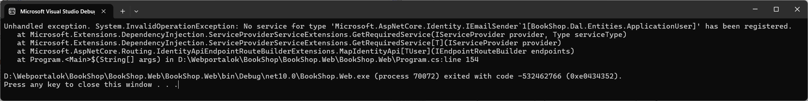
    /// caption
    Nincs email sender regisztrálva a DI konténerbe.
    ///

## Saját email sender

Email küldéséhez szükségünk van egy SMTP szerverre, ami lehet a google szolgáltatása is, vagy a fejlesztési célokra kitalált ál email küldő az [Ethereal](https://ethereal.email/) is. A gyakorlaton mi ez utóbbit fogjuk használni, mert a regisztrációja nagyon egyszerű.

Nyissuk meg a böngészőben a [https://ethereal.email/create](https://ethereal.email/create) oldalt és ott kattintsunk a *Create Ethereal Accont* gombra, ami azonnal létre is hozza a felhasználónkat, melynek adatai az alábbi ábrán látható. Figyelem, véletlen adatokkal hozza létre, így az adatok mindenkinél mások lehetnek!

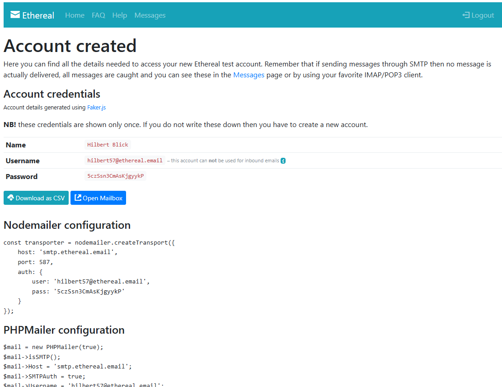
/// caption
Etheral account adatai
///

1. Az ábrán látható adatokat kell megadni ahhoz, hogy email tudjunk küldeni ezzel az SMTP szolgáltatással. Ehhez először vegyünk fel egy osztályt EmailSettings névvel és az alábbi kóddal.

    ``` csharp title="Settings/EmailSetting.cs"
    namespace BookShop.Web.RazorPage.Settings;

    public class EmailSettings
    {
        public string Mail { get; set; } = null!;
        public string DisplayName { get; set; } = null!;
        public string Password { get; set; } = null!;
        public string Host { get; set; } = null!;
        public int Port { get; set; }
    }
    ```

2. A fenti osztály fogja tárolni az SMTP szervere beállításait, azonban a konkrét értékeket a config fájlba szeretnénk tárolni, így az `appsettings.Developement.json`-ba vegyük fel az alábbi részt. Az adatok az ethereal oldalról származnak. Fontos, hogy a saját adatainkkal töltsük fel a fájlt, mert egyébként nem fogjuk tudni az Ethereal oldalán megnézni az emaileket.

    ```json title="appsettings.Developement.json" hl_lines="8-14"
    {
        "Logging": {
            "LogLevel": {
            "Default": "Information",
            "Microsoft.AspNetCore": "Warning"
            }
        },
        "EmailSettings": {
            "Mail": "hilbert57@ethereal.email",
            "DisplayName": "Hilbert Blick",
            "Password": "5czSsn3CmAsKjgyykP",
            "Host": "smtp.ethereal.email",
            "Port": 587
        }
    }
    ```

3. Ezt követően már csak az `IEmailSender<TUSer>` interfészt kell megvalósítani, hogy ténylegesen ki tudjuk küldeni a leveleket, amihez hozzuk létre az `EmailSender` osztályt az alábbi implementációval:

    ``` csharp title="Services/EmailSender.cs"
    using BookShop.Web.Settings;
    using Microsoft.AspNetCore.Identity;
    using Microsoft.Extensions.Options;
    using System.Net.Mail;

    namespace BookShop.Web.Services;

    public class EmailSender<TUser>(IOptions<EmailSettings> emailSettingsOptions, ILogger<EmailSender<TUser>> logger) : IEmailSender<TUser>
        where TUser : class
    {
        private readonly EmailSettings emailSettings = emailSettingsOptions.Value;

        private readonly SmtpClient smtpClient = new SmtpClient(emailSettingsOptions.Value.Host, emailSettingsOptions.Value.Port)
        {
            EnableSsl = true,
            Credentials = new System.Net.NetworkCredential(emailSettingsOptions.Value.Mail, emailSettingsOptions.Value.Password)
        };

        public async Task SendEmailAsync(string email, string subject, string htmlMessage)
        {
            var from = new MailAddress(emailSettings.Mail, emailSettings.DisplayName, System.Text.Encoding.UTF8);
            var to = new MailAddress(email);

            var message = new MailMessage(from, to)
            {
                Body = htmlMessage,
                BodyEncoding = System.Text.Encoding.UTF8,
                IsBodyHtml = true,
                Subject = subject,
                SubjectEncoding = System.Text.Encoding.UTF8
            };

            await smtpClient.SendMailAsync(message);

            if (logger.IsEnabled(LogLevel.Information))
                logger.LogInformation("Email sent to: {to}", to.Address);
        }

        public Task SendConfirmationLinkAsync(TUser user, string email, string confirmationLink)
        {
            return SendEmailAsync(email, "Confirm your email", $"Please confirm your account by <a href='{confirmationLink}'>clicking here</a>.");
        }

        public Task SendPasswordResetCodeAsync(TUser user, string email, string resetCode)
        {
            return SendEmailAsync(email, "Reset your password", $"Reset your password using the following code: {resetCode}");
        }

        public Task SendPasswordResetLinkAsync(TUser user, string email, string resetLink)
        {
            return SendEmailAsync(email, "Reset your password", $"Please reset your password by <a href='{resetLink}'>clicking here</a>.");
        }
    }
    ```

    Figyeljük meg, hogy az interfész valójában a felhasználókezeléshez szükséges három e-mail kiküldéséhez szükséges metódusokat definiálja csak, de mi ide tettük be a tényleges email küldés implementációját is.

4. A szerver oldali `Program.cs`-ben állítsuk be, hogy az appsettings alapján töltse fel a `EmailSettings` osztályt, és a saját e-mail sender implementációnkat regisztráljuk be a DI-ba.

    ``` csharp title="Program.cs" hl_lines="2 5"
    // Reads the email settings from the configuration and registers it in the DI container.
    builder.Services.Configure<EmailSettings>(builder.Configuration.GetSection("EmailSettings"));

    builder.Services.TryAddTransient<IEmailSender<ApplicationUser>, EmailSender<ApplicationUser>>();
    ```

## MapIdentity végpontok

1. Ha még felületünk nincs is, ki tudjuk próbálni a felhasználókezeléshez készen kapott API végpontokat. Ha betöltjük a `/scalar` oldalt, akkor azonnal látni fogjuk az új végpontokat, amit a `MapIdentityApi<ApplicationUser>` hozott létre.
Válasszuk ki a `/login` végpontot majd adjuk meg az admin felhasználó belépési adatait, ami a képernyőképen látható, de a forráskódban is megtalálhat a felhasználók DB seed-elésénél.

    - A bejelentkezés alapértelmezés szerint Bearer token-t ad vissza.
    - Ha beállítjuk a Query paramétere között, a `useCookies` értékét `true`-ra akkor viszont süti alapú bejelentkezést fog használni
    - Az alkalmazásban a süti alapú megoldást fogjuk használni, mert böngészős környezetben az a javasolt, hiszen nem nekünk kell a token-eket tárolni.

    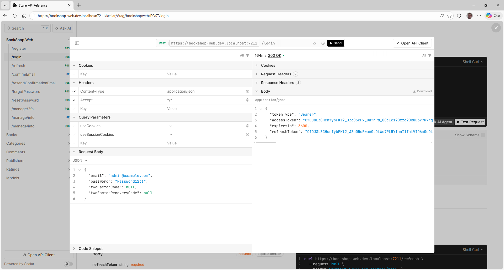
    /// caption
    Bearer token alapú bejelentkezés tesztelése
    ///

2. Sajnálatos módon, ha újrageneráljuk az `BookShop.API` projektben az `APIClient.cs`-t akkor az nem fog fordulni, mert a `MapIdentityApi<ApplicationUser>` olyan DTO-kat használ (pl: `LoginRequest`) ami a `Microsoft.AspNetCore.Identity.Data` névtérben van, amihez a *Microsoft.AspNetCore.Identity* NuGet csomagot hozzá kellene adni, amit *Class Library*-hez nem lehet hozzáadni. Azt a trükköt fogjuk kihasználni, hogy kliens oldalon készítünk egy `AccountService`-t, ami nem a generált API végpontokat hívja, hanem egy `HttpClient`-en keresztül, amit a DI-tól megkap egyszerű kéréseket küld a szerverre a `PostAsJsonAsync` vagy `GetFromJsonAsync` segítségével. A DTO helyett pedig egyszerű anonymous típust adunk át. Mivel JSON-ba sorosítva kerül fel a szerverre az adat így elegendő, hogy azonos névvel meglegyen az összes szükséges property és működni fog a kódunk.

3. Először állítsuk be, hogy a `MapIdentityApi<ApplicationUser>` által létrehozott végpontokhoz ne generáljon API-t az nswag. Ehhez a `blazorclient.json` fájlban az `excludedOperationIds`-hoz vegyük fel a végpontok OperationId-ját. az OperationId úgy épül fel minimal API esetén, hogy `{HttpVerb}{Url}` tehát egy post a `/login` URL-re a `PostLogin` operationID-t kapja.  
Úgy is megtudhatjuk ezeket a neveket, hogy legeneráljuk az API-t a scriptünkkel és onnan másoljuk ki a függvényneveket az Async nélkül. Fontos, hogy végül töröljük ki az `IClinet` interfészt és `Client` osztályt a generált kódból, hogy ismét forduljon.

    ``` json title="blazorclient.json"
    "excludedOperationIds": [
        "PostRegister",
        "PostLogin",
        "PostRefresh",
        "GetConfirmEmail",
        "PostResendConfirmationEmail",
        "PostForgotPassword",
        "PostResetPassword",
        "PostManage2fa",
        "GetManageInfo",
        "PostManageInfo"
    ],
    ```

## Bejelentkezés

1. Mivel szeretnénk validációt is tenni a belépési adatokra, ezért hozzunk létre a `BookShop.Transfer` projektben a `Dto` mappa alatt egy `Identity` mappát és abba egy `LoginData` osztályt

    ``` csharp title="LoginData.cs"
    namespace BookShop.Transfer.Dtos.Identity;

    public class LoginData
    {
        public required string Email { get; set; }

        public required string Password { get; set; }

        public string? TwoFactorCode { get; set; }

        public string? TwoFactorRecoveryCode { get; set; }
    }
    ```

2. Majd készítsük el a validátort is hozzá, amiben megadjuk, hogy

    - Az email cím nem lehet üres, email típusúnak kell lennie és maximum 256 karakter lehet
    - A jelszó nem lehet üres.

    ``` csharp title="LogirDataValidator.cs"
    using FluentValidation;

    namespace BookShop.Transfer.Dtos.Identity;

    internal class LogirDataValidator : AbstractValidator<LoginData>
    {
        public LogirDataValidator()
        {
            RuleFor(x => x.Email).NotEmpty().EmailAddress().MaximumLength(256);
            RuleFor(x => x.Password).NotEmpty();
        }
    }
    ```

3. A kliens projektbe hozzuk egy *Identity* mappát és abban az `IAccountService`-t, amiben definiáljunk egy

    - `Login` metódust, ami várja a `LoginData`-t illetve azt, hogy a süti session-höz tartozzon-e. A visszatérési értéke legyen bool, hogy sikerült-e a bejelentkezés.
    - `Logout` metódust, ami majd a kilépést valósítja meg.

    ``` csharp title="IAccountService.cs" hl_lines="7"
    using BookShop.Transfer.Dtos.Identity;

    namespace BookShop.Web.Client.Services;

    public interface IAccountService
    {
        public Task<bool> LoginAsync(LoginData loginData, bool? useCookies, bool? useSessionCookies = true);

        public Task LogoutAsync();
    }
    ```

4. Készítsük el az `AccountService`-t is, amiben várunk egy `IHttpClient`-et, ami a konstruktorban és a `PostAsJsonAsync`-al küldjük el a kérést. Kezeljük azt is, hogy süti vagy bearer token alapú belépést szeretnénk.

    ``` csharp title="AccountService.cs" hl_lines="5 7 13"
    using BookShop.Transfer.Dtos.Identity;
    using System.Net.Http.Json;
    using System.Text;

    namespace BookShop.Web.Client.Identity;

    public class AccountService(HttpClient httpClient) : IAccountService
    {
        public async Task<bool> LoginAsync(LoginData loginData, bool? useCookies, bool? useSessionCookies = false)
        {
            var result = await httpClient.PostAsJsonAsync($"/login?useCookies={useCookies}&useSessionCookies={useSessionCookies}", loginData);

            if (result.IsSuccessStatusCode)
            {
                // TODO: Refresh authentication state
                return true;
            }

            return false;
        }

        public async Task LogoutAsync()
        {
            await httpClient.PostAsync("logout", new StringContent("{}", Encoding.UTF8, "application/json"));
            // TODO: Refresh authentication state
        }
    }
    ```

5. A kliens oldali `Program.cs`-be regisztráljuk be az `AccountService`-t

    ``` csharp title="Program.cs" hl_lines="1"
    builder.Services.AddScoped<IAccountService, AccountService>();
    builder.Services.AddSingleton<ISessionStorageAccessor, SessionStorageAccessor>();
    builder.Services.AddSingleton<ICartService, CartService>();
    ```

6. Készítsük el a `Login` oldalt. Kezdjük a code behind-dal.
    - Injektáljuk be az `IAccountService`-t és a `NavigationManager`-t, hogy sikeres belépés után át tudjunk navigálni a kezdő oldalra.
    - Szükség van egy `LoginFailed` property-re, ami azt jelzi, hogy sikertelen a belépési kísérlet és meg kell jeleníteni a hibaüzenetet.
    - Hozzuk létre a `HandleLogin` eseménykezelőt, ami megkísérli a bejelentkezést.
    - Ha a `LoginAsync` false értéket ad vissza, akkor jelenítsük meg a hibát
    - Ha nincs hiba, akkor a navigation history-ból olvassuk ki a `ReturnUrl`-t, a `HistoryEntryState` típusa itt `InteractiveRequestOptions` lesz. Azért a history-ban keressük a return URL-t, mert a `NavigateToLogin` metódussal fogjuk ideirányítani a felhasználtól és az ott tárolja el nem az URL-ben.
    - A validáció automatikusan lefut szerver oldalon is.

    ``` csharp title="Login.razor.cs" hl_lines="7 15 25-26"
    using BookShop.Transfer.Dtos.Identity;
    using BookShop.Web.Client.Services;
    using Microsoft.AspNetCore.Components;

    namespace BookShop.Web.Client.Pages;

    public partial class Login(IAccountService accountService, NavigationManager navigationManager)
    {
        public bool LoginFailed { get; set; } = false;

        public LoginData LoginData { get; set; } = new() { Email = "", Password = "" };

        private async Task HandleLogin()
        {
            var result = await accountService.LoginAsync(LoginData, true);

            if( !result)
            {
                LoginFailed = true;
                return;
            }

            // We use NavigateToLogin so the return url is stored in the history state.
            var returnUrl = "/";
            if (!String.IsNullOrEmpty(navigationManager.HistoryEntryState))
                returnUrl = JsonSerializer.Deserialize<InteractiveRequestOptions>(navigationManager.HistoryEntryState)?.ReturnUrl ?? "/";

            navigationManager.NavigateTo(returnUrl ?? "/");
        }
    }
    ```

    ??? tip "Return URL a query stringből"
        Ha a sima `NavigateTo`-t használnál akkor a queryString-ben tudnánk megadni a returnUrl-t. Ebben az esetben az alábbi kóddal tudnánk kiolvasni ezt az értéket.

        ``` csharp title="Login.razor.cs"
        [Parameter]
        [SupplyParameterFromQuery]
        public string? ReturnUrl { get; set; }
        ```

7. Készítsük el a megjelenítést is hozzá.
    - Készítsünk egy `EditForm`-ot, amiben a `LoginData` adatait tudjuk megadni. A submit gombra kattintáskor a `HandleLogin`-t kell meghívni, ha nincs validációs hiba.
    - Ha a `LoginFailed` értéke true, akkor jelenítsük meg a hibaüzenetet. Ehhez egy Bootstrap-es panelt használunk.
    - Kérjük be az E-mail címet és a jelszót. A jelszónál a `password` típusú `InputText`-et használjuk.

    ``` aspx-cs title="Login.razor"
    @page "/Login"
    @using Blazilla

    <PageTitle>Bejelentkezés</PageTitle>

    <div class="d-flex justify-content-center w-100">

        <EditForm Model="LoginData" OnValidSubmit="@HandleLogin" class="d-flex justify-content-center flex-column w-50 gap-3">
            <FluentValidator />

            <h1>Bejelentkezés</h1>

            @if (LoginFailed)
            {
                <div class="alert alert-danger alert-dismissible fade show">
                    <h4 class="alert-heading"><i class="bi-exclamation-octagon-fill"></i> Hiba!</h4>
                    <p class="mb-0">A belépési adatok nem megfelelőek.</p>
                </div>
            }

            <div class="form-floating w-100">
                <InputText class="form-control h-100" @bind-Value="LoginData.Email" placeholder="" />
                <label>E-mail cím</label>
            </div>
            <div class="form-floating w-100">
                <InputText type="password" class="form-control h-100" @bind-Value="LoginData.Password" placeholder="" />
                <label>Jelszó</label>
            </div>

            <div class="d-flex justify-content-end my-2">
                <button type="submit" class="btn btn-outline-primary">Bejelentkezés</button>
            </div>
        </EditForm>
    </div>
    ```

8. Mivel a bejelentkezés süti alapú nem kell a token-t eltárolnunk, a böngésző automatikusan kezeli a sütit.

### RequestContext

1. Módosítjuk a `RequestContext` implementációt a `BookShop.Web` projektben, hogy tényleg a bejelentkezett felhasználó azonosítóját adja vissza, ne fixen az 1-et.
    - Ehhez injektálni kell az `IHttpContextAccessor`-t, amin keresztül elérjük a HTTP kérés adatait.
    - Állítsuk be ez alapján a `CurrentUser`-t és a `UserId`-t

    ``` csharp title="RequestContext.cs" hl_lines="6 10 13"
    using BookShop.Server.Abstraction.Context;
    using System.Security.Claims;

    namespace BookShop.Web.Services;

    public class RequestContext(IHttpContextAccessor httpContextAccessor) : IRequestContext
    {
        public string? RequestId { get; }

        public ClaimsIdentity? CurrentUser => httpContextAccessor.HttpContext?.User.Identity as ClaimsIdentity;

        // public int? UserId => 1;
        public int? UserId => CurrentUser?.Claims.FirstOrDefault(c => c.Type == ClaimTypes.NameIdentifier)?.Value is string userIdStr && int.TryParse(userIdStr, out int userId) ? userId : null;
    }
    ```

2. A `BookShop.Web` projektben a `Program.cs`-be regisztráljuk be a `HttpContextAccessor`-t is.

    ``` csharp title="Program.cs" hl_lines="3"
    // Register additional non-BLL services.
    builder.Services.AddHttpContextAccessor();
    builder.Services.AddScoped<IRequestContext, RequestContext>();
    ```

3. Tegyük vissza a komment készítésére, a `CommentsController`-ben az [Authorize] attribútumot, amit korábban kikommenteztünk és próbáljuk ki az alkalmazást.
    - Navigáljunk el a login oldalra és lépjünk be az *user@example.com* felhasználóval. (Ha korábban már beléptünk a böngésző DevToolbar Application fülén tudjuk a sütit kitörölni.)
    - Majd egy könyv részletes oldalán hozzuk létre a kommentet.
    - Nézzük meg az adatbázisban, hogy tényleg a kommentet létrehozó userId valóban 2.

### Login és logout gombok

Ha ismerjük a bejelentkezési URL-t akkor be tudunk lépni, viszont érdemes lenne a felső sorba jobb oldalra kitenni egy Login / Logout és Register gombokat.

1. Mielőtt elkezdenénk a kódolást, az `Imports.razor`-ba vegyünk fel az *Microsoft.AspNetCore.Components.Authorization* névteret, hogy ne kelljen mindig using-olni.

    ``` aspx-cs title="Imports.razor" hl_lines="3"
    @using System.Net.Http
    @using System.Net.Http.Json
    @using Microsoft.AspNetCore.Components.Authorization
    ```

2. Ehhez hozzunk létre egy `LoginPartial` komponenst. Ennek a feladata, a *Regisztráció* / *Bejelentkezés* gombokat mutatja, ha nincs belépve a felhasználó. Ha már belépett akkor kiírja a nevét és egy *Kijelentkezés* gombot.
   - Használjuk az `AuthorizeView` komponenst, aminek két gyerek eleme van az `Authorized` és `NotAuthorized`
   - A belépett felhasználó adatait a `@context`-en keresztül lehet elérni.
   - A ki / belépéshez használjuk a `NavigateToLogin` és `NavigateToLogout` függvényeket.

    ``` aspx-cs title="LoginPartial.razor"
    @using Microsoft.AspNetCore.Components.WebAssembly.Authentication

    @inject NavigationManager navigationManager

    <AuthorizeView>
        <Authorized>
            <p class="mb-0">Hello, @context.User.Identity?.Name!</p>
            <button class="btn btn-outline-primary ms-3" @onclick="@ToLogOut">
                <span class="bi bi-box-arrow-right" aria-hidden="true"></span> Kijelentkezés
            </button>
        </Authorized>
        <NotAuthorized>
            <button class="btn btn-outline-primary me-3" @onclick="@ToLogin">
                <span class="bi bi-box-arrow-in-right" aria-hidden="true"></span> Bejelentkezés
            </button>
            <button class="btn btn-outline-secondary" @onclick="@(() => navigationManager.NavigateTo("/register"))">
                <span class="bi bi-person-plus" aria-hidden="true"></span> Regisztráció
            </button>
        </NotAuthorized>
    </AuthorizeView>

    @code {
        protected void ToLogin()
        {
            InteractiveRequestOptions requestOptions = new()
            {
                Interaction = InteractionType.SignIn,
                ReturnUrl = navigationManager.Uri,
            };

            navigationManager.NavigateToLogin("/login", requestOptions);
        }

        protected void ToLogOut()
            => navigationManager.NavigateToLogout("/logout", "/");
    }
    ```

    Figyeljük meg, hogy a `NavigateToLogin`-nak átadtunk egy `InteractiveRequestOptions` és abban állítottuk be a return URL-t, amit a navigation history-ban tárol el, a login oldal ezért onnan olvassa ki, nem az URL-ből.

3. Tegyük rá a fent elkészített `LoginPartial` komponenst a `MainLayout` oldalra, az *About* link helyére. A kódnak csak a lényegi részét mutatja a lenti kódrészlet.

    ``` aspx-cs title="MainLayout.razor" hl_lines="3-4"
    <main>
        <div class="top-row px-4">
            <LoginPartial />
            @* <a href="https://learn.microsoft.com/aspnet/core/" target="_blank">About</a> *@
        </div>

        <article class="content px-4">
            @Body
        </article>
    </main>
    ```

4. A Kosaram oldalra állítsuk be kliens oldalon is, hogy csak akkor érjük el, ha be vagyunk jelentkezve. Ehhez az osztály fölé kell tenni egy `Authorize` attribútumot.

    ``` csharp title="Cart.razor.cs" hl_lines="1"
    [Authorize]
    public partial class Cart(ICartService cartService, IBooksClient booksClient)
    ```

5. Azonban azt is meg kell adni, hogyha a felhasználó egy olyan oldalt szeretne elérni, amihez be kell lépni, akkor az alkalmazás irányítsa át a *Login* oldalra. Ehhez készítsük el az alábbi `RedirectToLogin` komponenst.

    ``` aspx-cs title="RedirectToLogin.razor"
    @using Microsoft.AspNetCore.Components.WebAssembly.Authentication

    @inject NavigationManager navigationManager

    @code {
        protected override void OnInitialized()
        {
            InteractiveRequestOptions requestOptions = new()
            {
                Interaction = InteractionType.SignIn,
                ReturnUrl = navigationManager.Uri,
            };

            navigationManager.NavigateToLogin("login", requestOptions);
        }
    }
    ```

6. Majd módosítsuk a `Routes.razor`-t, hogy ne a `RouteView`-t használja, hanem az `AuthorizeRouteView` és itt meg tudjuk adni a `NotAuthorized` blokkban, hogy irányítson át a *Login* oldalra a `RedirectToLogin` komponens segítségével.

    ``` aspx-cs title="Routes.razor" hl_lines="4-8"
    <Router AppAssembly="typeof(Program).Assembly" NotFoundPage="typeof(Pages.NotFound)">
        <Found Context="routeData">
            @* <RouteView RouteData="routeData" DefaultLayout="typeof(Layout.MainLayout)" /> *@
            <AuthorizeRouteView RouteData="routeData" DefaultLayout="typeof(Layout.MainLayout)">
                <NotAuthorized>
                    <RedirectToLogin />
                </NotAuthorized>
            </AuthorizeRouteView>
            <FocusOnNavigate RouteData="routeData" Selector="h1" />
        </Found>
    </Router>
    ```

7. Ha kipróbáljuk az alkalmazást és rákattintunk a *Kosaram* oldalra, akkor az szépen átvisz a bejelentkezés oldalra. Ha ott belépünk az *admin@example.com* felhasználóval akkor meglepő módon nem irányít vissza, sőt a felső sorban sem vált át a Bejelentkezés gomb Kijelentkezésre.

    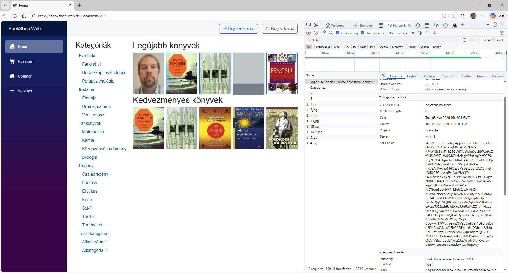
    /// caption
    A felső sorban sikeres belépés után is Bejelentkezés gomb marad.
    ///

    ??? tip "Süti törlése böngészőből - még másképp nem tudunk kilépni"
        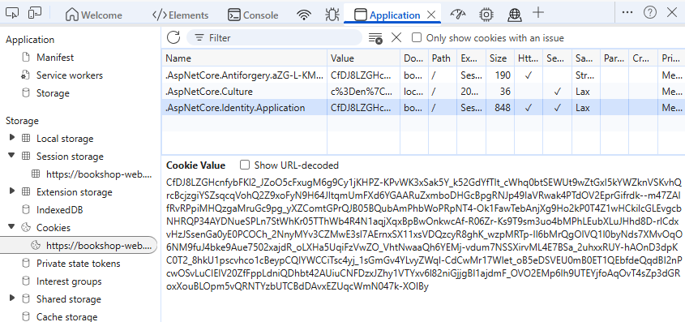
        /// caption
        Süti törlése böngészőből
        ///

8. Ha újratöltjük az oldalt akkor viszont már tényleg bejelentkezett felhasználók leszünk. Tehát a probléma az, hogy a bejelentkezés után nem frissül az állapot megfelelően az az `AuthorizeView` még rossz adatokkal dolgozik. Sajnos ennek a problémának a megoldása nem annyira triviális.

## Saját AuthenticationStateProvider

Az `AuthenticationStateProvider` absztrakt osztályból kell leszármazunk, ahhoz, hogy értesíteni tudjuk a Blazor-t, hogy az authentikáció állapota megváltozott.
    - GetAuthenticationStateAsync: Lekérdezi és beállítja az aktuális állapotot (egy `ClaimsPrincipal`-t)
    - NotifyAuthenticationStateChanged: Jelzi a feliratkozott komponenseknek, hogy változott az állapot, de mivel ez protected nem tudjuk kívülről hívni, ezért kell leszármazni.

1. Először hozzunk létre a kliens projekt *Identity* mappájában egy *Models* könyvtárat és abban egy `UserInfo` osztályt, amiben a felhasználó következő adatai kerülnek: e-mail cím, megerősítette-e az e-mail címét, felhasználó Claim-jei.

    ``` csharp title="UserInfo.cs"
    namespace BookShop.Web.Client.Identity.Models;

    /// <summary>
    /// User info from identity endpoint to establish claims.
    /// </summary>
    public class UserInfo
    {
        public string Email { get; set; } = string.Empty;

        public bool IsEmailConfirmed { get; set; }

        public Dictionary<string, string> Claims { get; set; } = [];
    }
    ```

2. Ezután az *Identity* mappában hozzuk létre a `CookieAuthenticationStateProvider` osztályt.
   - A konstruktor várjon egy `IHttpClientFactory`-t, amivel meg tudjuk példányosítani a http klienst, fontos, hogy a megfelelő névvel példányosítsuk (`Api.Wireup.ApiHttpClientName`).
   - A `GetAuthenticationStateAsync` a lényegi rész. Ez a metódus egy `AuthenticationState`-et ad vissza, aminek az aktuálisan belépett felhasználó `ClaimsPrincipal`-ját kell átadni (ha nincs belépve akkor egy üres objektumot kell kapnia).
   - Mivel csak szerver oldalon vannak meg az adatok ezért meg kell hívni a `manage/info` oldalt, ami egy `UserInfo`-t ad vissza, ebből kell felépíteni a `ClaimsPrincipal`. Mivel a `manage/info`-t csak belépett felhasználó érheti el, ezért ha kapunk választ, akkor a szerver szerint is be van léptetve a felhasználó.
   - Készítsünk egy `UserStateChanged` metódust is, ami meghívja a `NotifyAuthenticationStateChanged` így kívülről is tudjuk majd hívni.

    ``` csharp title="CookieAuthenticationStateProvider"
    using BookShop.Web.Client.Identity.Models;
    using Microsoft.AspNetCore.Components.Authorization;
    using System.Data;
    using System.Net;
    using System.Net.Http.Json;
    using System.Security.Claims;
    using System.Text.Json;

    namespace BookShop.Web.Client.Identity;

    /// <summary>
    /// Handles state for cookie-based authentication.
    /// </summary>
    public class CookieAuthenticationStateProvider(IHttpClientFactory httpClientFactory, ILogger<CookieAuthenticationStateProvider> logger)
        : AuthenticationStateProvider
    {
        /// <summary>
        /// Map the JavaScript-formatted properties to C#-formatted classes.
        /// </summary>
        private static readonly JsonSerializerOptions jsonSerializerOptions = new() 
        { 
            PropertyNamingPolicy = JsonNamingPolicy.CamelCase,
        };

        private readonly HttpClient httpClient = httpClientFactory.CreateClient(Api.Wireup.ApiHttpClientName);

        private readonly ClaimsPrincipal unAuthenticatedUser = new(new ClaimsIdentity());

        /// <summary>
        /// Get authentication state.
        /// </summary>
        /// <remarks>
        /// Called by Blazor anytime and authentication-based decision needs to be made, then cached
        /// until the changed state notification is raised.
        /// </remarks>
        /// <returns>The authentication state asynchronous request.</returns>
        public override async Task<AuthenticationState> GetAuthenticationStateAsync()
        {
            // Default to not authenticated
            var user = unAuthenticatedUser;

            try
            {
                // The user info endpoint is secured, so if the user isn't logged in this will fail
                using var userResponse = await httpClient.GetAsync("manage/info");
                userResponse.EnsureSuccessStatusCode();

                // User is authenticated, so let's build their authenticated identity
                var userInfo = await userResponse.Content.ReadFromJsonAsync<UserInfo>(jsonSerializerOptions);

                if (userInfo != null)
                {
                    var claims = new List<Claim>
                    {
                        new(ClaimTypes.Name, userInfo.Email),
                        new(ClaimTypes.Email, userInfo.Email),
                    };

                    // Add any additional claims
                    claims.AddRange(
                        userInfo.Claims.Where(c => c.Key != ClaimTypes.Name && c.Key != ClaimTypes.Email)
                            .Select(c => new Claim(c.Key, c.Value)));

                    // Set the principal
                    var identity = new ClaimsIdentity(claims, nameof(CookieAuthenticationStateProvider));
                    user = new ClaimsPrincipal(identity);
                }
            }
            catch (Exception ex) when (ex is HttpRequestException exception)
            {
                if (exception.StatusCode != HttpStatusCode.Unauthorized)
                {
                    logger.LogError(ex, "App error");
                }
            }
            catch (Exception ex)
            {
                logger.LogError(ex, "App error");
            }

            return new AuthenticationState(user);
        }

        public async Task UserStateChanged()
           => NotifyAuthenticationStateChanged(GetAuthenticationStateAsync());
    }
    ```

    Figyeljük meg, hogy a `manage/info` végpont meghívása után szerepel egy `EnsureSuccessStatusCode()` ez hibát fog dobni, ha a válasz státuszkódja nem 200-299 között van.  
    Itt már használunk loggolást is, ami a böngésző console-jára naplóz.

3. És eljutottunk egy nagy döntési pontig. Hogyan lesz átláthatóbb az alkalmazás.

    - Ha meghagyjuk az `AccountService`, ami megkapja a konstruktorban az `AuthenticationStateProvider`-t és ha az egy `CookieAuthenticationStateProvider` akkor meghívja a `UserStateChanged()`-et. Azért nem szép, mert fixen beletesszük a konkért implementációt, ettől jobb a következő.
    - Készítünk egy külön interfészt, ami csak a `UserStateChanged()` metódust írja elő és úgy is beregisztráljuk a `CookieAuthenticationStateProvider` a DI konténerbe és az `AccountService` azzal az interfésszel kéri el.
    - Vagy a `CookieAuthenticationStateProvider` implementálja a teljes logikát azaz az `IAccountService` interfészt is, és áthozzuk a logikát az `AccountService`-ből, illetve beregisztráljuk majd az `IAccountService` interfésszel is a `CookieAuthenticationStateProvider`-t. Talán ez a megoldás tűnik a legjobbnak, mert a login hívás is függ attól, hogy süti vgy token alapút szeretnénk használni.

4. Ugorjunk is neki, és mozgassuk át az `AccountService` kódját a `CookieAuthenticationStateProvider`

    - A `CookieAuthenticationStateProvider` implementálja az `IAccountService` interfészt.
    - Mozgassuk át az `AccountService` kódját.
    - A `UserStateChanged` metódusra nincs szükség, hiszen a benne lévő kódot közvetlenül meg tudjuk hívni a *// TODO: Refresh authentication state*-tel megjelölt helyeken.
   - Kommentezzük ki az `AccountService` teljes kódját.

    ``` csharp title="CookieAuthenticationStateProvider.cs"
    public class CookieAuthenticationStateProvider(IHttpClientFactory httpClientFactory, ILogger<CookieAuthenticationStateProvider> logger)
    : AuthenticationStateProvider, IAccountService
    {
        // ...
   
        public async Task<bool> LoginAsync(LoginData loginData, bool? useCookies, bool? useSessionCookies = false)
        {
            var result = await httpClient.PostAsJsonAsync($"/login?useCookies={useCookies}&useSessionCookies={useSessionCookies}", loginData);

            if (result.IsSuccessStatusCode)
            {
                // Refresh authentication state
                NotifyAuthenticationStateChanged(GetAuthenticationStateAsync());

                return true;
            }

            return false;
        }

        public async Task LogoutAsync()
        {
            await httpClient.PostAsync("logout", new StringContent("{}", Encoding.UTF8, "application/json"));

            // Refresh authentication state
            NotifyAuthenticationStateChanged(GetAuthenticationStateAsync());
        }

        // public async Task UserStateChanged()
        //       => NotifyAuthenticationStateChanged(GetAuthenticationStateAsync());
    }
    ```

5. Regisztráljuk be a `CookieAuthenticationStateProvider` implementációt kliens projekt `Program.cs`-be.

    - Először Singleton-ként, úgy mint egy `AuthenticationStateProvider` implementáció
    - Majd Scoped-ként az `IAccountService`-hez. Itt ne egy külön példányt regisztráljunk, hanem kérjük el a korábban regisztrált Singleton-t és azt használjuk.
    - Majd töröljük ki az `AccountService` regisztrációját.

    ``` csharp title="Program.cs"
    builder.Services.AddSingleton<AuthenticationStateProvider, CookieAuthenticationStateProvider>();
    builder.Services.AddScoped(sp => (IAccountService)sp.GetRequiredService<AuthenticationStateProvider>());

    // builder.Services.AddScoped<IAccountService, AccountService>();
    ```

6. Sajnos még a kijelentkezés nem működik. Azt csak szerver oldalon lehet megtenni, viszont nincs hozzá végpont. Ezért a szerver oldali `Program.cs`-ben hozzunk létre két Minimal API végpontot. Az egyik a kijelentkezés, a másik pedig a felhasználó szerepköreit tudja visszaadni. A kódot a *UseAuthorization* után tegyük.

    ``` csharp title="Program.cs"
    // Provide an endpoint to clear the cookie for logout
    // https://learn.microsoft.com/aspnet/core/blazor/security/webassembly/standalone-with-identity#antiforgery-support
    app.MapPost("/logout", async (SignInManager<ApplicationUser> signInManager, [FromBody] object empty) =>
    {
        if (empty is not null)
        {
            await signInManager.SignOutAsync();

            return Results.Ok();
        }

        return Results.Unauthorized();
    }).RequireAuthorization();

    // Provide an endpoint for user roles
    app.MapGet("/roles", (ClaimsPrincipal user) =>
    {
        if (user.Identity is not null && user.Identity.IsAuthenticated)
        {
            var identity = (ClaimsIdentity)user.Identity;
            // Note: Claim cannot be serialized by default, so we create an anonymous object with the relevant properties to return as JSON.
            var roles = identity.FindAll(identity.RoleClaimType)
                            .Select(c => new { c.Issuer, c.OriginalIssuer, c.Type, c.Value, c.ValueType });

            return TypedResults.Json(roles);
        }

        return Results.Unauthorized();
    }).RequireAuthorization();
    ```

    Figyeljük meg a fenti kódban, hogy amikor a szerepköröket tartalmazó `Claim`-eket lekérdezzük, akkor egy anonimous típusba sorosíjuk. Ennek az az oka, hogy a `Claim` osztály sorosításakor végtelen ciklust kapunk.

7. Mivel itt sem szeretnénk, hogy az nswag generáljon kliens hozzá vegyük fel a két végpont OperationId-ját a `blazorclient.json`-ba, ahogy korábban tettük a `MapIdentity` végpontokkal. A lenti kódban csak az új elemeket látjuk.

    ``` json title="blazorclient.json"
    "excludedOperationIds": [
        "PostLogout",
        "GetRoles",
    ```

8. Generáljuk újra az `ApiClient.cs`-t az `apigenerator.ps1` power shell script futtatásával.

    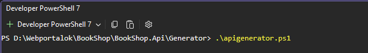
    /// caption
    Kliens oldali API újragenerálása
    ///

9. A kliens oldali projektben az *Identity/Models* mappa alatt hozzunk létre a `RoleClaim` osztályt, amibe deserializálni tudjuk a szerepköröket tartalmazó típust.

    ``` csharp title="RoleClaim.cs"
    namespace BookShop.Web.Client.Identity.Models;

    public class RoleClaim
    {
        public string? Issuer { get; set; }
        public string? OriginalIssuer { get; set; }
        public string? Type { get; set; }
        public string? Value { get; set; }
        public string? ValueType { get; set; }
    }
    ```

10. Egészítsük ki a `CookieAuthenticationStateProvider` osztály `GetAuthenticationStateAsync` metódusát úgy, hogy a szerepköröket is kérdezze le és tárolja el. A kiemelt sorok kerültek bele.

    ``` csharp title="CookieAuthenticationStateProvider.cs" hl_lines="28-40"
    public override async Task<AuthenticationState> GetAuthenticationStateAsync()
    {
        // Default to not authenticated
        var user = unAuthenticatedUser;

        try
        {
            // The user info endpoint is secured, so if the user isn't logged in this will fail
            using var userResponse = await httpClient.GetAsync("manage/info");
            userResponse.EnsureSuccessStatusCode();

            // User is authenticated, so let's build their authenticated identity
            var userInfo = await userResponse.Content.ReadFromJsonAsync<UserInfo>(jsonSerializerOptions);

            if (userInfo != null)
            {
                var claims = new List<Claim>
                {
                    new(ClaimTypes.Name, userInfo.Email),
                    new(ClaimTypes.Email, userInfo.Email),
                };

                // Add any additional claims
                claims.AddRange(
                    userInfo.Claims.Where(c => c.Key != ClaimTypes.Name && c.Key != ClaimTypes.Email)
                        .Select(c => new Claim(c.Key, c.Value)));

                // Request the roles endpoint for the user's roles
                using var rolesResponse = await httpClient.GetAsync("roles");
                rolesResponse.EnsureSuccessStatusCode();
                var roleClaims = await rolesResponse.Content.ReadFromJsonAsync<RoleClaim[]>(jsonSerializerOptions);

                // Add any roles to the claims collection
                if (roleClaims?.Length > 0)
                {
                    claims.AddRange(roleClaims
                        .Where(x => !string.IsNullOrEmpty(x.Type) && !string.IsNullOrEmpty(x.Value))
                        .Select(x => new Claim(x.Type!, x.Value!, x.ValueType, x.Issuer, x.OriginalIssuer))
                    );
                }

                // Set the principal
                var identity = new ClaimsIdentity(claims, nameof(CookieAuthenticationStateProvider));
                user = new ClaimsPrincipal(identity);
            }
        }
        catch (Exception ex) when (ex is HttpRequestException exception)
        {
            if (exception.StatusCode != HttpStatusCode.Unauthorized)
            {
                logger.LogError(ex, "App error");
            }
        }
        catch (Exception ex)
        {
            logger.LogError(ex, "App error");
        }

        return new AuthenticationState(user);
    }
    ```

11. Ki is próbálhajuk az teljes körűen működő be- és kijelentkezés funkciót.

## Regisztráció

Sajnos a regisztrációnál a [`RegisterRequest`](https://learn.microsoft.com/hu-hu/dotnet/api/microsoft.aspnetcore.identity.data.registerrequest?view=aspnetcore-10.0) csak két mezőt tartalmaz (Email, Password) amivel nem tudjuk beállítani az alkalmazásban kötelező `DisplayName`-et, mert nem tudjuk az API-nak átadni, sőt le sem tudunk származni belőle mert `sealed` az osztály.

Ha megnézzük a [IdentityApiEndpointRouteBuilderExtensions.cs](https://github.com/dotnet/aspnetcore/blob/9dbfe9d749bc48421aee7248240d9e11ad618e72/src/Identity/Core/src/IdentityApiEndpointRouteBuilderExtensions.cs#L76-L79) forráskódját, látható, hogy a user entitást létrehozza a default konstruktorral és nem állítja be az egyedileg megadott tulajdonságokat.

1. A gyors megoldás, hogy az `ApplicationUser`-nél vagy nullable-re állítjuk a `DisplayName`-et, ami adatbázis séma módosítással jár amit most el szeretnénk kerülni. Így a megoldás, hogy üres sztringre állítjuk az alapértelmezett értékét az alábbi kódsor módosításával.

    ``` csharp="ApplicationUser.cs" hl_lines="2"
    [PersonalData]
    public string DisplayName { get; set; } = string.Empty;
    ```

2. Mivel a validációs hibákat is kell kezelni, hozzunk létre a `BookShop.Transfer` projektben a *Common* mappában egy `ValidationProblemDetails` osztályt az alábbi kóddal. (A kódja megegyezik a .NET-es ValidationProblemDetails kódjával, csak az kliens oldalon nem érhető el ezért kell létrehozni.)

    ``` csharp title="ValidationProblemDetails.cs"
    using System.Text.Json.Serialization;

    namespace BookShop.Transfer.Common;

    public class ValidationProblemDetails
    {
        [JsonIgnore(Condition = JsonIgnoreCondition.WhenWritingNull)]
        [JsonPropertyOrder(-5)]
        public string? Type { get; set; }

        [JsonIgnore(Condition = JsonIgnoreCondition.WhenWritingNull)]
        [JsonPropertyOrder(-4)]
        public string? Title { get; set; }

        [JsonIgnore(Condition = JsonIgnoreCondition.WhenWritingNull)]
        [JsonPropertyOrder(-3)]
        public int? Status { get; set; }

        [JsonIgnore(Condition = JsonIgnoreCondition.WhenWritingNull)]
        [JsonPropertyOrder(-2)]
        public string? Detail { get; set; }

        [JsonIgnore(Condition = JsonIgnoreCondition.WhenWritingNull)]
        [JsonPropertyOrder(-1)]
        public string? Instance { get; set; }

        [JsonIgnore(Condition = JsonIgnoreCondition.WhenWritingNull)]
        public IDictionary<string, string[]> Errors { get; set; } = new Dictionary<string, string[]>(StringComparer.Ordinal);

        [JsonExtensionData]
        public IDictionary<string, object?> Extensions { get; set; } = new Dictionary<string, object?>(StringComparer.Ordinal);
    }
    ```

3. Hasonlóan egy `ProblemDetails` osztályt is hozzunk létre, ami annyiban tér el a `ValidationProblemDetails`-től, hogy nincs benne `Errors` property.

    ``` csharp title="ProblemDetails.cs"
    using System.Text.Json.Serialization;

    namespace BookShop.Transfer.Common;

    public class ProblemDetails
    {
        [JsonIgnore(Condition = JsonIgnoreCondition.WhenWritingNull)]
        [JsonPropertyOrder(-5)]
        [JsonPropertyName("type")]
        public string? Type { get; set; }

        [JsonIgnore(Condition = JsonIgnoreCondition.WhenWritingNull)]
        [JsonPropertyOrder(-4)]
        [JsonPropertyName("title")]
        public string? Title { get; set; }

        [JsonIgnore(Condition = JsonIgnoreCondition.WhenWritingNull)]
        [JsonPropertyOrder(-3)]
        [JsonPropertyName("status")]
        public int? Status { get; set; }

        [JsonIgnore(Condition = JsonIgnoreCondition.WhenWritingNull)]
        [JsonPropertyOrder(-2)]
        [JsonPropertyName("detail")]
        public string? Detail { get; set; }

        [JsonIgnore(Condition = JsonIgnoreCondition.WhenWritingNull)]
        [JsonPropertyOrder(-1)]
        [JsonPropertyName("instance")]
        public string? Instance { get; set; }

        [JsonExtensionData]
        public IDictionary<string, object?> Extensions { get; set; } = new Dictionary<string, object?>(StringComparer.Ordinal);
    }
    ```

4. Ezt követően készítsük el a `BookShop.Transfer` projektben a *Dto/Identity* mappában a `RegistrationData` osztályt, ami a *LoginData* adatin felül tartalmazza a DisplayName-et is, amit majd külön kell elmentenünk.

    ``` csharp title="RegistrationData" hl_lines="12"
    namespace BookShop.Transfer.Dtos.Identity;

    public class RegisterData
    {
        public string Email { get; set; } = null!;

        public string Password { get; set; } = null!;

        public string PasswordAgain { get; set; } = null!;

        // Must be empty string (not null in DB)
        public string DisplayName { get; set; } = string.Empty;
    }
    ```

5. Majd készítsük el a `RegistrationDataValidator`-t is hozzá, melynek kódja megegyezik a *LoginDataValidator* kódjával.

    ``` csharp title="RegistrationDataValidator" hl_lines="5 9-11 12"
    using FluentValidation;

    namespace BookShop.Transfer.Dtos.Identity;

    internal class RegisterDataValidator : AbstractValidator<RegisterData>
    {
        public RegisterDataValidator()
        {
            RuleFor(x => x.Email).NotEmpty().EmailAddress().MaximumLength(256);
            RuleFor(x => x.Password).NotEmpty();
            RuleFor(x => x.PasswordAgain).NotEmpty().Equal(x => x.Password);

            RuleFor(x => x.DisplayName).NotEmpty();
        }
    }
    ```

    Figyeljük meg, hogy azt is validáljuk, hogy a kétszer megadott jelszó megegyezik-e.

6. Egészítsük ki az `IAccountService`-t a `RegisterAsync` metódussal

    ``` csharp title="IAccountService.cs" hl_lines="11"
    using BookShop.Transfer.Dtos.Identity;

    namespace BookShop.Web.Client.Identity;

    public interface IAccountService
    {
        public Task<bool> LoginAsync(LoginData loginData, bool? useCookies, bool? useSessionCookies = true);

        public Task LogoutAsync();

        public Task<IDictionary<string, string[]>?> RegisterAsync(RegisterData registrationData);
    }
    ```

7. Készítsük el a `RegisterAsync` kódját is az `CookieAuthenticationStateProvider`-ben

    ``` csharp title="CookieAuthenticationStateProvider.cs"
    public async Task<IDictionary<string, string[]>?> RegisterAsync(RegisterData registrationData)
    {
        var result = await httpClient.PostAsJsonAsync("/register", registrationData);

        if (result.IsSuccessStatusCode)
            return null;

        // Body should contain details about why it failed.
        var validationProblemDetails = await result.Content.ReadFromJsonAsync<ValidationProblemDetails>();
        return validationProblemDetails?.Errors ?? new Dictionary<string, string[]> { { "Error", ["An unknown error occurred."] } };
    }
    ```

    Figyeljük meg a fenti kódban, hogy ha hibát kapunk vissza, akkor azt egy `ValidationProblemDetails` és ebből kiolvassuk a hibákat és azt adjuk vissz a hívó oldalnak, hogy meg tudja jeleníteni a hibákat.

8. Hozzuk létre a `Register` oldalt code behind-dal. Szükségünk lesz egy `IAccountService` implementációra és a `NavigationManager`-re.
    - A `RegisterAsync` siker esetén `null`-t ad vissza, hiba esetén pedig a hiba Dictionary-t.
    - A hibákat a felületen is meg kell jeleníteni, tehát egy `Errors` property-be mentsük le.
    - Ha sikeres a regisztráció, akkor pedig irányítsuk a kezdő oldalra a felhasználót.

    ``` csharp title=""
    using BookShop.Transfer.Dtos.Identity;
    using BookShop.Web.Client.Identity;
    using Microsoft.AspNetCore.Components;

    namespace BookShop.Web.Client.Pages;

    public partial class Register(IAccountService accountManager, NavigationManager navigationManager)
    {
        public string[] Errors { get; set; } = [];
        public RegisterData RegisterData { get; set; } = new();

        private async Task HandleRegister()
        {
            var errorResult = await accountManager.RegisterAsync(RegisterData);
            
            if(errorResult?.Any() == true)
            {
                Errors = errorResult.SelectMany(x => x.Value).ToArray();
                return;
            }
            
            navigationManager.NavigateTo("/");
        }
    }
    ```

9. Ezt követően már megcsinálhatjuk a megjelenítést is.
    - Az `EditForm` modellje az `RegisterData` legyen.
    - Használjuk az `InputText`-et és a `@bind-Value`-t és a Bootstrap-es floating label-t.
    - Szükséges a `FluentValidator` is
    - A szervertől visszakapott hibákat egy Bootstrap-es panelben jelenítsük meg (ha van),

    ``` aspx-cs title="Regiszer.razor"
    @page "/Register"
    @using Blazilla

    <PageTitle>Bejelentkezés</PageTitle>

    <div class="d-flex justify-content-center w-100">

        <EditForm Model="RegisterData" OnValidSubmit="@HandleRegister" class="d-flex justify-content-center flex-column w-50 gap-3">
            <FluentValidator />
            <ValidationSummary />

            <h1>Regisztráció</h1>

            @if (Errors?.Any() == true)
            {
                <div class="alert alert-danger alert-dismissible fade show">
                    <h4 class="alert-heading"><i class="bi-exclamation-octagon-fill"></i> Hiba!</h4>
                    @for( int i = 0; i < Errors.Length; i++)
                    {
                        <p class="mb-0">@Errors[i]</p>
                    }
                </div>
            }

            <div class="form-floating w-100">
                <InputText class="form-control h-100" @bind-Value="RegisterData.Email" placeholder="" />
                <label>E-mail cím</label>
            </div>

            <div class="form-floating w-100">
                <InputText type="password" class="form-control h-100" @bind-Value="RegisterData.Password" placeholder="" />
                <label>Jelszó</label>
            </div>

            <div class="form-floating w-100">
                <InputText type="password" class="form-control h-100" @bind-Value="RegisterData.PasswordAgain" placeholder="" />
                <label>Jelszó mégegyszer</label>
            </div>

            <div class="form-floating w-100">
                <InputText type="text" class="form-control h-100" @bind-Value="RegisterData.DisplayName" placeholder="" />
                <label>Teljes név</label>
            </div>

            <div class="d-flex justify-content-end my-2">
                <button type="submit" class="btn btn-outline-primary">Regisztráció</button>
            </div>
        </EditForm>
    </div>
    ```

10. Ha mindent jól csináltunk akkor működik is a regisztráció.

    ??? success "Regisztráció lépései"
        1.  Validációs hiba
        2.  Sikeres regisztráció, de nem léptünk be.
        3.  Megerősítő email megérkezett
        4.  Linkre kattintva megerősítettük
        5.  Ezután be is tudtunk lépni.

        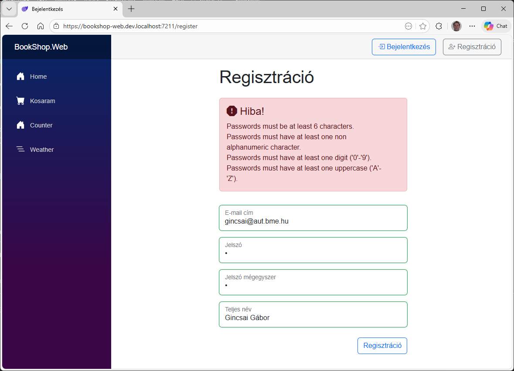
        /// caption
        Validációs hibák, amit az API ad vissza.
        ///

        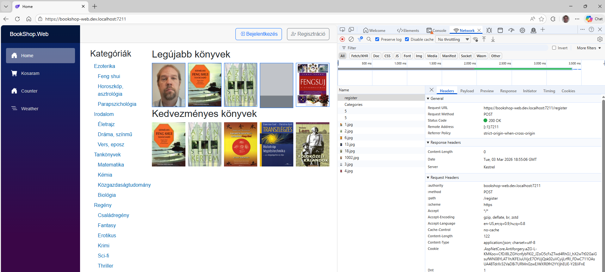
        /// caption
        Nem léptet be automatikusan a regisztráció után.
        ///

        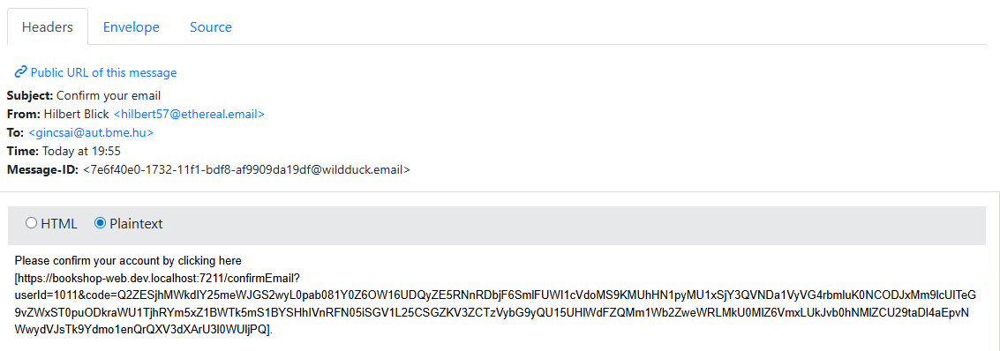
        /// caption
        Regisztráció utáni megerősítő email megérkezett a helyes URL-lel.
        ///

        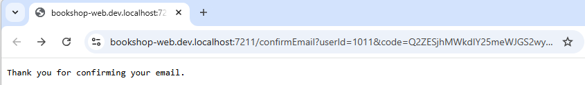
        /// caption
        Regisztráció megerősítve
        ///

        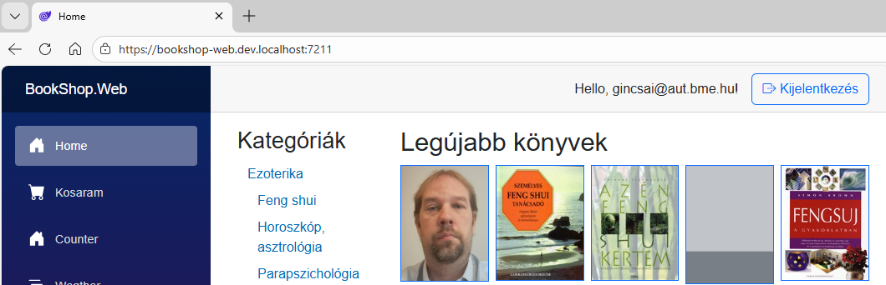
        /// caption
        Sikeres belépés az új felhasználóval.
        ///

## Jogosultság ellenőrzés

Azzal, hogy van felhasználó és jogosultság kezelésünk, már be tudjuk állítani, hogy egyes funkciók csak belépett felhasználóknak, vagy adott szerepkörnek legyenek csak elérhetők.

A szerver oldalon a Controller-ek létrehozásakor már beállítottuk az `[Authorize]` attribútumokat, így a lényegi résszel meg is vagyunk, már csak kliens oldalon kell szebbé tenni az alkalmazást, hogy azok a gombok / elemek ne is jelenjenem meg, amire nincs jogosultsága a felhasználónak.

Egy hasonlót már készítettünk mégpedig azt, hogy a *Kosaram* oldal ha nem vagyunk bejelentkezve átirányít a *Login* oldalra.

1. Először a `Book.razor` oldalon állítsuk be, egy-egy `AuthorizeView` használatával, hogy csak a belépett felhasználók lássák  az alábbiakat
    - Kosárba tétel gomb
    - Új ajánló készítése link

    ``` aspx-cs title="Book.razor - Kosár" hl_lines="1-2 4-5"
    <AuthorizeView>
        <Authorized>
            <button class="btn btn-outline-primary" @onclick="@AddToCart">Korárba</button>
        </Authorized>
    </AuthorizeView>
    ```

    ``` aspx-cs title="Book.razor - Ajánló"
    <AuthorizeView>
        <Authorized>
            <a href="@($"/CreateComment/{BookData.Id}")">Új ajánló írása &raquo;</a>
        </Authorized>
    </AuthorizeView>
    ```

2. A hozzászólás írása esetén ha nincs belépve a felhasználó jelenítsünk meg egy szöveget, hogy a komment írásához be kell jelentkeznie. Annak érdekében, hogy a bejelentkezés után erre az oldalra jusson vissza, használjuk itt is a `NavigateToLogin`-t.
    -  Ehhez a `NavigationManager`-t is injektálni kell a konstruktorba.
    - El kell készíteni a `ToLogin` függvéyt.

    ``` csharp title="Book.razor.cs"
    public partial class Book(IBooksClient booksClient, ICommentsClient commentsClient, ICartService cartService, NavigationManager navigationManager /*, ISessionStorageAccessor sessionStorage*/)
    {
        protected void ToLogin()
        {
            InteractiveRequestOptions requestOptions = new()
            {
                Interaction = InteractionType.SignIn,
                ReturnUrl = navigationManager.Uri,
            };

            navigationManager.NavigateToLogin("/login", requestOptions);
        }
    }
    ```

3. Ezt követően jöhet a megjelenítési része.

    ```  aspx-cs title="Book.razor" hl_lines="2 7-11"
    <AuthorizeView>
        <Authorized Context="authorizedContext">
            <EditForm Model="NewCommentData" OnValidSubmit="@CreateComment">
                ...
            </EditForm>
        </Authorized>
        <NotAuthorized>
            <div class="alert alert-info">
                Komment írásához kérjük <a class="btn-link" @onclick="ToLogin">jelentkezzen be</a>!
            </div>
        </NotAuthorized>
    </AuthorizeView>
    ```

    Figyeljük meg, hogy amikor az `EditForm`-ot tesszük be az `Authorized`-ba ott megadtunk egy `Context="authorizedContext"`-et, erre azért van szükség, hogy az *Authorized* és *EditForm* ne akadjon össze.

4. Ezt követően már a gombok sem látszódnak.

    ??? success "Elrejtett gombok"
    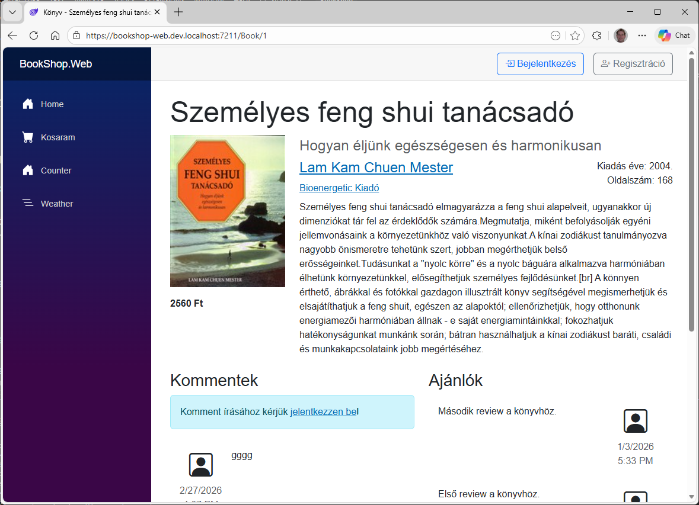
    /// caption
    Anonymous felhasználóknak nem látszónak a gombok.
    ///
